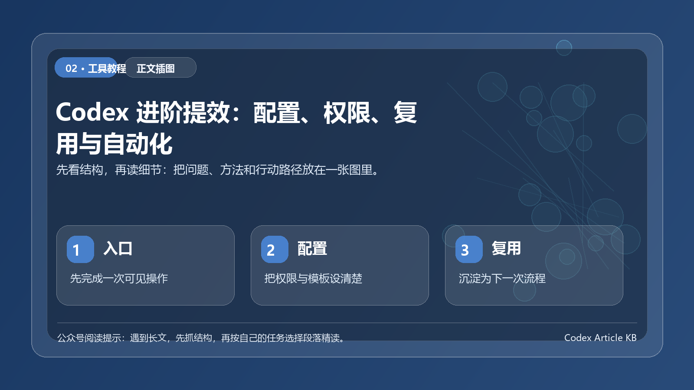

> 一句话结论：拉开差距的往往不是让 Codex 写代码，而是让它按你的项目规则持续稳定地工作。

*图：先用一张结构图把本文的重点、方法和行动路径串起来。*

## 开篇

如果你已经用 Codex 修过 bug、写过测试、解释过代码，下一步就不是继续堆 prompt，而是把那些反复出现的规则、流程和工具固化下来。
这篇主要讲 Codex 进阶使用的核心：

- 用权限和沙箱控制安全边界。
- 用 `AGENTS.md` 沉淀项目规则。
- 用 `config.toml` 统一模型、审批和工具配置。
- 用 Skill、插件、MCP 把重复工作变成可复用能力。
- 用 review、worktree、automation 和 subagents 提升团队效率。

## 一、先把安全边界讲清楚：Sandbox 和 Approval

Codex 能读文件、改代码、运行命令，所以第一件事不是放开权限，而是理解权限边界。
Codex 的安全控制主要有两层：

1. Sandbox mode：技术上允许 Codex 访问哪里、写哪里、是否能联网。
2. Approval policy：什么时候必须停下来请你批准。

常见沙箱模式：

| 模式 | 含义 | 适合场景 |
| --- | --- | --- |
| `read-only` | 只读调研，不自动改文件 | 项目调研、代码审查、风险判断 |
| `workspace-write` | 可在工作区内读写和运行常规命令 | 日常开发默认推荐 |
| `danger-full-access` | 无沙箱限制 | 只在外部环境已隔离且你完全信任任务时使用 |

常见审批策略：

| 策略 | 含义 | 适合场景 |
| --- | --- | --- |
| `untrusted` | 对不在可信集内的命令请求审批 | 更谨慎的环境 |
| `on-request` | 沙箱内自动执行，越界时询问 | 日常交互开发 |
| `never` | 不弹审批，Codex 尽力完成 | 自动化任务，但要配合安全边界 |

日常推荐组合：

> 命令示例：
>
> `codex --sandbox workspace-write --ask-for-approval on-request`

只读调研：

> 命令示例：
>
> `codex --sandbox read-only --ask-for-approval on-request`

不要一上来就使用 full access。Full access 很方便，但边界也最大。团队环境里，宁可先用默认权限，再按任务逐步放开。

## 二、`AGENTS.md`：把项目规则写给 Codex

很多团队一开始用 Codex 时，都会重复提醒：

- 用 pnpm，不要用 npm。
- 改 TS 文件要跑 typecheck。
- 不要改公开 API。
- 新增依赖前先说明原因。
- PR review 重点关注正确性和安全。

这些不该每次都手打。应该写进 `AGENTS.md`。
`AGENTS.md` 可以理解为给 agent 看的 README。Codex 启动时会读取它，并把其中的规则作为项目上下文。
一个实用版 `AGENTS.md` 可以这样写：

> 示例卡：
>
> AGENTS.md 示例
> \## Repository expectations
>
> - Use pnpm, not npm.
> - Run `pnpm typecheck` after TypeScript changes.
> - Run the smallest relevant test before final response.
> - Do not change public APIs unless explicitly requested.
> - Explain before adding production dependencies.
>
> \## Review guidelines
>
> - Prioritize correctness, security, regressions, and missing tests.
> - Do not raise style-only comments as high-priority findings.

当 Codex 连续两次犯同一个错误，不要只在聊天里纠正它。让它做一次复盘，然后把规则写进 `AGENTS.md`。
可以这样说：

> 示例卡：
>
> 请复盘这次为什么改错方向。
> 把以后能避免这个问题的项目规则整理成 AGENTS.md 条目。

## 三、`config.toml`：让 Codex 每次都按同一套方式启动

`AGENTS.md` 管项目规则，`config.toml` 管 Codex 自身配置。
常见位置：

> 示例卡：
>
> ~/.codex/config.toml
> .codex/config.toml

用户级配置适合个人默认偏好。项目级配置适合团队共享规则，但项目配置通常只有在项目被信任时才加载。
常用配置示例：

> 示例卡：
>
> model = "gpt-5.5"
> model_reasoning_effort = "high"
> approval_policy = "on-request"
> sandbox_mode = "workspace-write"
> web_search = "cached"
>
> [sandbox_workspace_write]
> network_access = false
>
> [features]
> multi_agent = true
> hooks = true
> fast_mode = true

如果只是临时改一次，可以用命令行覆盖：

> 命令示例：
>
> `codex --model gpt-5.5`
> `codex -c sandbox_workspace_write.network_access=true`

## 四、前端和产物任务：一定要让 Codex 看见结果

Codex 不只适合写业务代码，也适合处理页面和非代码产物。

对于前端页面，建议让 Codex 使用 in-app browser：

> 示例卡：
>
> 完成后请启动 dev server，打开页面并检查桌面端和移动端。
> 重点检查文字溢出、按钮遮挡、布局错位和交互状态。

对于文档、PDF、表格、演示稿，可以明确交付标准：

> 示例卡：
>
> 请生成一份 PDF 报告。
> 要求：
> 1. 标题页、摘要、主体和结论完整
> 2. 图表标题清晰
> 3. 导出后检查页面是否溢出
> 4. 最后告诉我文件保存位置和检查结果

不要只让 Codex 生成一个文件，要让它生成并检查。

## 五、MCP：让 Codex 连接外部工具

MCP，全称 Model Context Protocol，可以让 Codex 接入外部工具和私有上下文。
常见用途：

- 查最新开发文档。
- 读取 Figma 设计。
- 操作浏览器或 Chrome DevTools。
- 读取 Sentry 错误。
- 访问 GitHub issues 和 PR。
- 连接 Linear、Notion、内部系统。

示例配置：

> 示例卡：
>
> [mcp_servers.context7]
> command = "npx"
> args = ["-y", "@upstash/context7-mcp"]

HTTP MCP server 示例：

> 示例卡：
>
> [mcp_servers.figma]
> url = "https://mcp.figma.com/mcp"
> bearer_token_env_var = "FIGMA_OAUTH_TOKEN"

使用原则：

- 私有数据优先用授权 connector 或 MCP，不要让模型凭记忆猜。
- 有副作用的工具要保留审批。
- 只开放需要的工具，能 allowlist 就不要全开。
- token 和 API key 不要写进仓库。

## 六、Skill：把重复流程变成技能

如果你发现自己反复对 Codex 说同一套流程，比如：

- 按公司格式生成周报。
- 按安全规则扫描代码。
- 按设计系统实现页面。
- 按发布流程检查 changelog。

那就该做成 Skill。
Skill 是一组任务说明、资源和可选脚本。它适合把重复工作流固化下来。
创建方式：

> 示例卡：
>
> $skill-creator

一个 Skill 的核心是 `SKILL.md`：

> 示例卡：
>
> name: release-check
> description: Run the release checklist before publishing a package.
> Follow the release checklist:
> 1. Check changelog
> 2. Run tests
> 3. Verify version number
> 4. Summarize risks

Skill 的关键不是写得长，而是触发范围清楚、步骤明确、输出标准稳定。

## 七、Plugins：把技能和工具分发给团队

Skill 是工作流本身，Plugin 是可安装的分发单元。
当你想把一组能力发给团队使用时，就可以做 Plugin。插件可以包含：

- 一个或多个 Skill。
- MCP 配置。
- Hooks。
- 工具和资源。
- 展示元数据。

快速创建：

> 示例卡：
>
> $plugin-creator

适合做成 Plugin 的场景：

- 团队统一代码审查流程。
- 公司内部发布检查。
- 特定技术栈迁移流程。
- 设计系统转代码工作流。
- 安全扫描和修复流程。

## 八、Review：让 Codex 做第二双眼睛

写完代码后，不要立刻提交。先让 Codex review。
CLI 可以用：

> 示例卡：
>
> /review

也可以直接提示：

> 示例卡：
>
> 请审查当前 diff。
> 重点关注：
> 1. 正确性 bug
> 2. 安全问题
> 3. 回归风险
> 4. 缺失测试
> 5. 可维护性
>
> 请按严重程度排序，给出文件和行号。
> 如果没有发现问题，请明确说明，并列出剩余风险。

好的 review 不是帮我看看，而是告诉 Codex 按什么优先级看。

## 九、Worktree 和 Cloud：把并行任务隔离开

Codex App 里可以选择 Local、Worktree、Cloud。

- Local：直接在当前项目目录工作。
- Worktree：创建独立 Git worktree，适合并行实验。
- Cloud：在远程环境执行，适合长任务和异步委派。

建议：

- 小修小改用 Local。
- 想试两个方案，用 Worktree。
- 长任务、并行任务、Slack/Linear/GitHub 委派，用 Cloud。

不要让两个线程同时改同一批文件。并行的前提是边界清楚。

## 十、Automations 和 Subagents：让 Codex 处理长期和并行问题

Automations 适合周期性任务：

- 每天检查错误日志。
- 每周生成代码变更摘要。
- 定期检查依赖更新。
- 长任务定时回来继续跟进。

Subagents 适合并行分析：

> 示例卡：
>
> 请用并行子代理审查当前分支。
> 生成 3 个子代理：
> 1. 安全风险
> 2. 正确性和回归
> 3. 测试缺口和可维护性
>
> 等待全部完成后，按严重程度汇总，并附文件引用。

注意：子代理会消耗更多 tokens。最适合读多写少的任务，比如探索、审查、日志分析、文档总结。多个代理同时写代码，要格外谨慎。

## 十一、进阶用户的日常工作流

你可以把 Codex 的日常工作流固定成这样：

1. 任务开始前：确认 `AGENTS.md` 和相关文件上下文。
2. 复杂任务：先 `/plan`，只确认方案，不改代码。
3. 实现阶段：限制范围，要求最小改动。
4. 验证阶段：运行最小相关测试。
5. 前端阶段：打开浏览器预览。
6. 审查阶段：运行 `/review`。
7. 沉淀阶段：把重复规则写进 `AGENTS.md` 或 Skill。
8. 自动化阶段：稳定流程再做 automation。

这套流程的核心是：不要让 Codex 每次都从零理解你的工作方式。

## 四段式进阶路线：不要一次全开

进阶提效可以按四段走，不需要一天内把所有能力都打开。

第一段，只读分析。让 Codex 解释代码、梳理目录、找风险，不允许修改文件。适合刚接手项目或不确定问题范围的时候。

第二段，局部修改。只允许它改一个组件、一个接口或一组测试。任务里写清楚“只动这些文件或目录”，能显著减少跑偏。

第三段，流程复用。把重复出现的任务写成固定任务卡，例如“新增接口后补测试”“改文档后检查链接”“发版前整理变更”。出现三次以上，再考虑沉淀成 Skill 或项目规则。

第四段，自动化。只有当输入稳定、权限清楚、失败能回滚时，再让 Codex 连续执行。自动化不是越早越好，而是越可验收越好。

## 结尾

初级用法是让 Codex 写代码。
进阶用法是让 Codex 按你的工程规则写代码。
高手用法是把这些规则、工具和流程固化下来，让 Codex 每次都在正确边界内工作。
如果你只记住简单说，
把临时提示词沉淀成 `AGENTS.md`，把重复流程沉淀成 Skill，把外部上下文接入 MCP，把长期任务交给 Automations。
这样 Codex 才会真正从单次问答工具，变成团队开发流程的一部分。

## 进阶提效的核心是把权限分层

配置、权限、复用和自动化看起来是四件事，实际上都指向同一个目标：让 Codex 在安全边界内更少等待、更少返工。最实用的分层方式是把任务分成只读分析、局部修改、批量改动和外部操作四档。只读分析可以更开放，局部修改要限制范围，批量改动要先给计划，外部操作必须明确回滚方式。只要权限分层清楚，效率提升就不会以失控为代价。

复用也不应该从复杂自动化开始。先把高频任务写成固定任务卡，例如“检查这次修改是否影响文档”“为这个功能补充测试”“把这篇文章按公众号格式整理”。当同类任务出现三次以上，再考虑把规则沉淀到 AGENTS.md、Skill 或脚本里。这样形成的自动化更贴近真实工作，而不是为了自动化而自动化。

## 一张进阶配置路线图

进阶使用 Codex，不建议一上来就追求全自动。更稳的顺序是：先把规则写清楚，再开放工具权限，最后才做自动化。

第一层是项目规则。把安装命令、测试命令、禁止事项、代码风格和提交要求写进 `AGENTS.md`，让 Codex 每次进入项目都先知道边界。

第二层是权限策略。把“能读什么、能改什么、哪些命令必须先确认”分清楚。越接近生产环境、账号权限、客户数据和资金操作，越不能默认放开。

第三层是复用流程。把反复出现的调研、修复、测试、发布、写稿任务沉淀成 Skill 或固定任务卡。不要把所有流程塞进一句超长提示词里。

第四层才是自动化。只有当任务输入稳定、验收标准明确、失败可回滚时，才适合让 Codex 连续执行。

## 进阶用户最该避免的 3 个坑

第一个坑，是把权限开放当成效率提升。权限越大，越需要更清楚的边界和验收，不然只是把错误执行得更快。

第二个坑，是把配置文件写成愿望清单。规则必须具体到能执行，例如“改完 TypeScript 跑 typecheck”，比“保持代码质量”更有用。

第三个坑，是没有区分一次性任务和长期流程。一次性任务写在对话里就够了，长期流程才值得沉淀到 Skill、插件或项目规则中。
