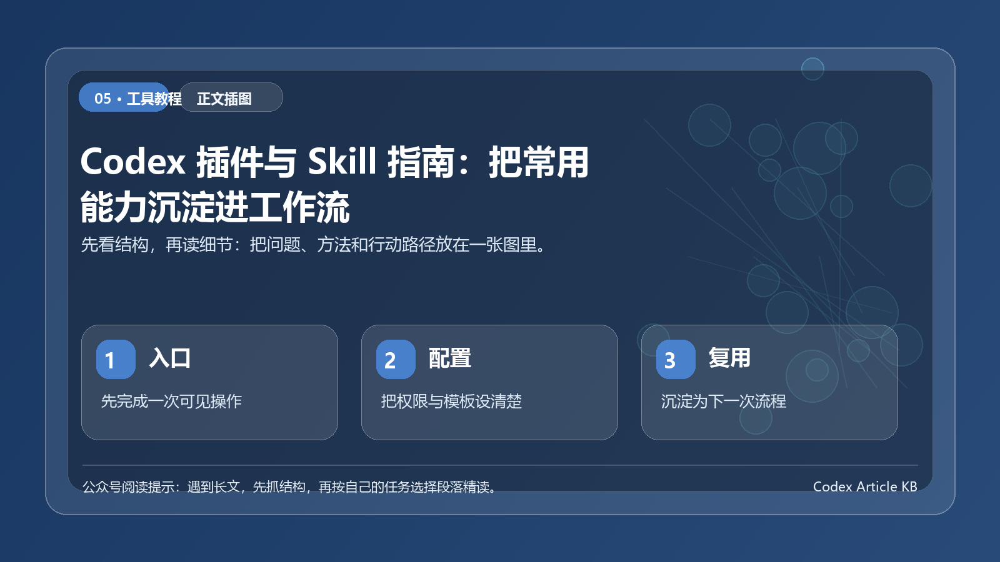

> 一句话结论：插件扩展工具，Skill 沉淀流程。



*图：先用一张结构图把本文的重点、方法和行动路径串起来。*


## 开篇

插件和 Skill 都是在给 Codex 加能力，但用途不同。
插件负责接入浏览器、GitHub、Figma、文档、表格、视频等工具。Skill 负责把写稿、研究、做 PPT、改图、剪视频这类重复工作固定下来。
这篇只讲核心用法：插件能做什么，Skill 适合沉淀什么，什么时候该用 MCP。

## 一、插件、Skill、MCP 的区别

| 类型 | 作用 | 适合场景 |
| --- | --- | --- |
| 插件 | 安装一组可用能力 | 浏览器、GitHub、Figma、文档、表格、视频 |
| Skill | 固化一套重复流程 | 写稿、PPT、研究、配图、剪视频、营销素材 |
| MCP | 连接外部工具和数据 | Jira、Linear、GitHub、文档库、设计工具、内部系统 |

选择顺序很简单：已有成熟插件，先装插件；流程经常重复，写成 Skill；需要访问外部系统，再接 MCP。

## 二、插件负责扩展工具

插件不是单个按钮，而是一组可安装能力包。它可以包含 Skill、App 连接和 MCP 服务器，把 Codex 的能力扩展到浏览器、设计稿、文档、表格、视频和外部系统里。
新手先记住一句话：本地页面用 Browser，登录网页用 Chrome，桌面软件用 Computer Use，设计稿用 Figma，文档表格用对应办公插件。

### 常用插件怎么选

| 场景 | 首选插件 | 典型任务 |
| --- | --- | --- |
| 本地网页调试 | Browser | 打开 `localhost`、点击页面、截图验证、检查布局和控制台。 |
| 登录态网页 | Chrome | 操作已登录后台、Gmail、CRM、内部系统。 |
| 仓库协作 | GitHub | 处理 Issue、PR、发布说明、代码审查。 |
| 设计转代码 | Figma | 读取设计稿、拆组件、对齐设计 token。 |
| 桌面操作 | Computer Use | 复现桌面端问题，操作无法通过 API 完成的软件。 |
| 文档交付 | Documents | 写方案、说明书、合同模板，检查版式。 |
| 演示汇报 | Presentations | 按主题、受众和页数生成 PPT。 |
| 数据处理 | Spreadsheets | 清洗表格、写公式、做统计和图表。 |
| 视频内容 | HyperFrames / Remotion | 生成讲解视频、产品演示、字幕动画。 |
| 快速原型 | Build Web Apps / Sites | 生成网页、工具页、小游戏或可部署站点。 |

### 安装流程

1. 打开 Codex 的 Plugins。
2. 搜索需要的插件，点击安装或 Add to Codex。
3. 按提示完成登录、授权或本地权限配置。
4. 新建线程再开始任务，让 Codex 重新加载插件能力。

### 调用方式

简单任务直接说目标，让 Codex 自己选工具：

```text
打开本地页面 http://localhost:3000/settings，检查移动端按钮是否溢出，并修复最小相关代码。
```

需要指定工具时，直接点名插件：

```text
请使用 @Browser 打开本地页面，截图检查首屏布局，并指出需要修改的组件。
```

```text
请使用 @Chrome 打开我已登录的后台页面，只检查订单筛选流程，不要提交任何表单。
```

```text
请使用 @Figma 读取这个设计稿，总结页面结构、组件层级和需要复用的设计 token。
```

### 权限和排障

Browser 适合本地页面和不需要登录的公开页面。Chrome 会接触登录态和浏览器内容，只有任务必须用真实账号状态时再用。Computer Use 会看到并操作桌面应用，任务要限定窗口、流程和停止条件。
插件没反应时，先查四件事：插件是否启用，外部账号是否登录，是否新建线程，目标网站或 App 是否被允许。浏览器类任务还要区分登录态：不需要登录用 Browser，需要登录态用 Chrome。

## 三、Skill 负责沉淀流程

Skill 适合处理步骤固定、素材多、每次都要重复做的任务。一个 Skill 通常包含 `SKILL.md`，也可以带脚本、模板和素材。
内容创作类 Skill 最典型。它不是把一句提示词写长，而是把选题、内容、配图、排版和真实性核验这些步骤固定下来。

| 主流 Skill | 作用 | 展示效果图 |
| --- | --- | --- |
| guizang-ppt-skill | 生成 HTML 演示稿，适合做汇报、课程、分享型 PPT。 |  |
| guizang-social-card-skill | 把文字整理成小红书、公众号封面和社媒卡片。 |  |
| awesome-gpt-image-2 | 管理生图提示词，统一封面、海报、产品图和人物图风格。 |  |
| Humanizer-zh | 把生硬表达改成自然中文，减少套话、翻译腔和 AI 腔。 |  |
| Deep-Research-skills | 按研究大纲、分头调研、汇总报告、改写方向推进长文。 |  |
| anything-to-notebooklm | 把网页、视频、PDF、公众号文章转成播客、PPT、思维导图或测验。 |  |
| wewrite | 覆盖抓热点、定选题、写正文、做 SEO、配图、排版和发布草稿。 |  |
| Youtube-clipper-skill | 把长视频拆成短视频片段，处理高光、字幕和剪辑时间线。 |  |
| oh-story-claudecode | 处理小说、网文选题、爆款结构、人物切入点和拆解框架。 |  |
| marketingskills | 适合营销团队做文章写作、SEO、品牌定位、用户研究、广告投放和邮件营销。 |  |

Skill 的价值不是多写一段提示词，而是让 Codex 每次都按同一套流程执行。

## 四、怎么选择

- 要操作浏览器、Figma、GitHub、文档、表格，优先装插件。
- 已经有成熟能力包，优先装插件。
- 团队有固定写作、测试、发布流程，写成 Skill。
- 流程需要模板、示例、脚本、检查清单，写成 Skill。
- 需要访问 Jira、Linear、私有文档、内部系统，接 MCP，通常配合 Skill 使用。

前端页面检查，优先用浏览器插件。固定结构写公众号文章，适合写文章创作 Skill。文章还要读取内部资料库，就需要 MCP 或连接器。

## 五、使用提示词

安装插件后，可以这样说：

```text
请使用浏览器能力打开本地页面，检查移动端布局和文字溢出问题。
```

```text
请使用 Figma 能力读取这个设计稿，并按当前项目组件风格实现页面。
```

使用 Skill 时，可以直接点名：

```text
请使用文章创作 Skill，把下面资料整理成一篇公众号文章，并生成配图建议。
```

如果 Codex 没有自动选择对应 Skill，可以补一句：

```text
请按 [Skill 名称] 的流程完成这个任务。
```

## 六、不要一次装太多

插件和 Skill 不是越多越好。建议按真实工作流分批安装。

- 开发者优先：GitHub、浏览器、Figma、文档/表格。
- 前端团队优先：浏览器、Figma、截图验证、网页生成。
- 内容团队优先：写稿、配图、PPT、短视频、社媒卡片。
- 管理者优先：文档、PPT、表格、研究报告和任务同步。

安装前先判断三点：是否每周会用，是否能减少重复步骤，是否涉及外部账号、授权或敏感数据。

## 结尾

`AGENTS.md` 记录项目规则，插件接入工具，Skill 复用流程。
每天重复做的工作，才值得沉淀成插件或 Skill。

## 本次整合说明

下面内容合并了同主题原稿中的关键观点，删除了重复解释，并把分散的操作步骤统一到一条更完整的阅读路径里。整合后的重点不是让文章更长，而是让读者能从“知道一个概念”继续走到“可以自己执行一次”。
> 一句话结论：Prompt 解决一次表达，Skill 沉淀一类工作；真正值得积累的不是神奇句子，而是可复用的交付方法。

很多人收藏了几百条提示词，却发现下次用起来还是不稳定。不是提示词没有价值，而是它只记录了当时怎么说，没有记录任务背景、输入要求、输出格式、检查标准和失败处理。

如果一类任务反复出现，就不要继续靠临场发挥。把有效提示词升级成 Skill，本质上是把经验变成可复用的工作流程。

## Prompt 和 Skill 的区别

Prompt 更像一句指令，Skill 更像一套操作手册。前者解决这一次怎么问，后者解决以后同类任务怎么稳定完成。

| 维度 | Prompt | Skill |
| --- | --- | --- |
| 使用范围 | 单次任务 | 重复任务 |
| 主要内容 | 指令和口吻 | 流程、模板、边界、检查 |
| 失败原因 | 上下文缺失 | 规则需要更新 |
| 复用方式 | 复制粘贴 | 按触发条件调用 |

当你发现自己每次都在补同样的背景、强调同样的禁区、检查同样的错误，就说明它已经不只是一个 Prompt，而是一个应该沉淀的 Skill。

## 一个好 Skill 至少包含 7 个零件

### 触发条件

写清楚什么时候应该使用它，什么时候不该使用。边界越清楚，误用越少。

### 输入规范

列出用户必须提供什么，缺少什么时不能继续。例如选题、读者、素材、目标、禁区、输出平台。

### 执行步骤

把流程拆成稳定顺序。比如内容生产可以是选题卡、资料卡、结构、初稿、事实核验、格式检查。

### 输出格式

明确最终交付长什么样。Markdown、表格、清单、报告、代码、图片说明，都需要提前规定。

### 验收清单

告诉 AI 和使用者什么叫完成。事实是否可核、图片是否合规、标题是否匹配、格式是否适合移动端。

### 失败处理

写清楚资料不足、权限不足、信息冲突、需求模糊时怎么办。好的 Skill 不会在条件不足时硬产出确定答案。

### 更新记录

每次出现重复错误，就补一条规则；每次发现更好的模板，就替换旧版本。Skill 不是一次写完，而是持续打磨。

## 从一条有效提示词升级成 Skill

你可以按下面 4 步做。

### 第一步：保留成功样本

不要只保存提示词，把输入、输出、修改意见和最终版本一起留存。否则你很难知道成功来自哪一部分。

### 第二步：抽出稳定结构

把内容中每次都要出现的部分抽出来，例如目标、受众、限制、资料、交付格式。能模板化的部分，尽量不要靠记忆。

### 第三步：补上检查清单

真正让结果稳定的不是指令，而是检查。比如公众号文章要检查标题、开头、结构、事实边界、图片说明、移动端阅读体验。

### 第四步：写入失败规则

如果资料不足，不要编；如果涉及法律、医疗、投资，不要给确定建议；如果需要联网事实，必须标记核验状态。失败规则越明确，Skill 越可靠。

## 一个可直接复用的 Skill 骨架

```text
名称：可复用任务 Skill
适用场景：什么任务可以调用
不适用场景：哪些任务必须人工判断或另走流程
输入要求：用户必须提供的材料和限制
执行流程：按顺序完成的步骤
输出格式：最终交付物的结构和命名方式
验收标准：完成前必须检查的项目
异常处理：资料不足、权限不足、风险过高时如何处理
更新机制：发现重复问题后如何补充规则
```

这个骨架可以用于写作、调研、代码审查、周报生成、客户回复、数据分析等重复任务。

## 团队使用时要避免三个误区

第一，把 Skill 写得过大。一个 Skill 最好只服务一类交付物，不要同时承担选题、写作、发布、客服和数据分析。

第二，只写流程不写验收。没有验收标准的 Skill，只是把返工自动化。

第三，不记录失败。每一次失败都在提醒你规则缺口在哪里。如果失败不沉淀，团队会在同一个坑里反复掉下去。

## Skill 文件应该怎么组织

最小可用的 Skill 不需要复杂目录，但要让未来的你一眼看懂。可以采用这种结构：

```text
Skill 名称
一句话用途
适用场景
不适用场景
输入要求
执行流程
输出规范
验收清单
常见失败与修正
更新记录
```

如果任务需要素材，还可以放示例、模板、术语表、格式样张。注意不要把所有知识都塞进正文说明里，常用模板单独存放，主说明只保留调用规则。

## 三个适合沉淀成 Skill 的场景

### 内容生产

每次都要经历选题、资料、初稿、核验、改写、排版。只要你已经有固定风格，就值得沉淀。Skill 里重点写清标题规则、图片规则、禁用表达、移动端格式和事实边界。

### 客户回复

高频客服和售前回复很适合沉淀。Skill 里要写清知识库来源、可承诺范围、必须转人工的场景，以及如何保留用户情绪而不是机械回答。

### 代码或自动化检查

代码类 Skill 不只写让 AI 修 bug，还要写运行测试、查看报错、只改相关文件、不要扩大范围、完成后说明验证结果。这样才能减少越修越乱。

## Skill 的更新节奏

不要追求一次写完。更好的方式是按错误更新：

1. 第一次出现问题，先人工记录；
2. 第二次出现同类问题，补进检查清单；
3. 第三次仍然出现，就调整输入规范或执行顺序；
4. 如果某条规则长期不用，删除或降级到备注。

Skill 是经验系统，不是备忘录。只有能改变下一次执行结果的内容，才值得写进去。

## 哪些内容不应该写进 Skill

不是所有经验都值得沉淀。临时偏好、一次性的项目背景、还没有验证过的技巧、只适合某个人口吻的表达，都不建议直接写进 Skill。

Skill 要记录稳定规则，不要记录情绪化偏好。否则它会越来越厚，却越来越难用。判断标准很简单：这条规则能不能帮助下一个人少犯一次错。如果不能，就先放在备注或复盘里。

## 结语

Prompt 是一次表达，Skill 是工作方式的存档。AI 工具变化会很快，但你沉淀下来的任务拆解、输入规范、检查清单和交付标准，会越来越值钱。
