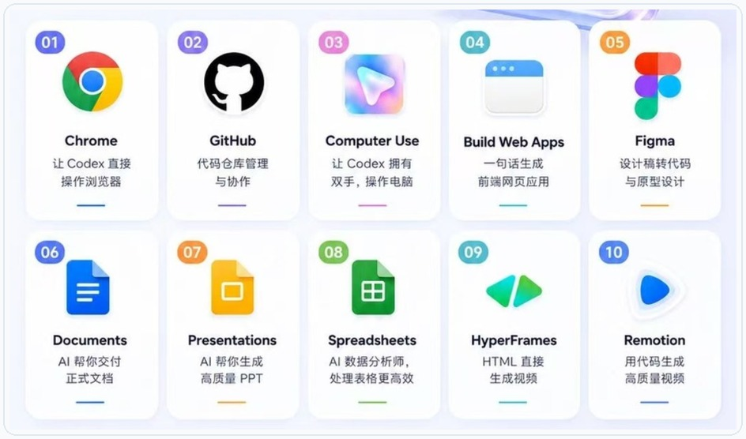

# Codex 插件与 Skill 指南：把常用能力装进工作流
副标题：插件扩展工具，Skill 沉淀流程。


## 开篇
插件和 Skill 都是在给 Codex 加能力，但用途不同。
插件负责接入浏览器、GitHub、Figma、文档、表格、视频等工具。Skill 负责把写稿、研究、做 PPT、改图、剪视频这类重复工作固定下来。
这篇只讲核心用法：插件能做什么，Skill 适合沉淀什么，什么时候该用 MCP。

## 一、插件、Skill、MCP 的区别
| 类型 | 作用 | 适合场景 |
| --- | --- | --- |
| 插件 | 安装一组可用能力 | 浏览器、GitHub、Figma、文档、表格、视频 |
| Skill | 固化一套重复流程 | 写稿、PPT、研究、配图、剪视频、营销素材 |
| MCP | 连接外部工具和数据 | Jira、Linear、GitHub、文档库、设计工具、内部系统 |

选择顺序很简单：已有成熟插件，先装插件；流程经常重复，写成 Skill；需要访问外部系统，再接 MCP。

## 二、插件负责扩展工具
插件不是单个按钮，而是一组可安装能力包。它可以包含 Skill、App 连接和 MCP 服务器，把 Codex 的能力扩展到浏览器、设计稿、文档、表格、视频和外部系统里。
新手先记住一句话：本地页面用 Browser，登录网页用 Chrome，桌面软件用 Computer Use，设计稿用 Figma，文档表格用对应办公插件。



### 常用插件怎么选

| 场景 | 首选插件 | 典型任务 |
| --- | --- | --- |
| 本地网页调试 | Browser | 打开 `localhost`、点击页面、截图验证、检查布局和控制台。 |
| 登录态网页 | Chrome | 操作已登录后台、Gmail、CRM、内部系统。 |
| 仓库协作 | GitHub | 处理 Issue、PR、发布说明、代码审查。 |
| 设计转代码 | Figma | 读取设计稿、拆组件、对齐设计 token。 |
| 桌面操作 | Computer Use | 复现桌面端问题，操作无法通过 API 完成的软件。 |
| 文档交付 | Documents | 写方案、说明书、合同模板，检查版式。 |
| 演示汇报 | Presentations | 按主题、受众和页数生成 PPT。 |
| 数据处理 | Spreadsheets | 清洗表格、写公式、做统计和图表。 |
| 视频内容 | HyperFrames / Remotion | 生成讲解视频、产品演示、字幕动画。 |
| 快速原型 | Build Web Apps / Sites | 生成网页、工具页、小游戏或可部署站点。 |

### 安装流程

1. 打开 Codex 的 Plugins。
2. 搜索需要的插件，点击安装或 Add to Codex。
3. 按提示完成登录、授权或本地权限配置。
4. 新建线程再开始任务，让 Codex 重新加载插件能力。

### 调用方式

简单任务直接说目标，让 Codex 自己选工具：

```text
打开本地页面 http://localhost:3000/settings，检查移动端按钮是否溢出，并修复最小相关代码。
```

需要指定工具时，直接点名插件：

```text
请使用 @Browser 打开本地页面，截图检查首屏布局，并指出需要修改的组件。
```

```text
请使用 @Chrome 打开我已登录的后台页面，只检查订单筛选流程，不要提交任何表单。
```

```text
请使用 @Figma 读取这个设计稿，总结页面结构、组件层级和需要复用的设计 token。
```

### 权限和排障

Browser 适合本地页面和不需要登录的公开页面。Chrome 会接触登录态和浏览器内容，只有任务必须用真实账号状态时再用。Computer Use 会看到并操作桌面应用，任务要限定窗口、流程和停止条件。
插件没反应时，先查四件事：插件是否启用，外部账号是否登录，是否新建线程，目标网站或 App 是否被允许。浏览器类任务还要区分登录态：不需要登录用 Browser，需要登录态用 Chrome。

## 三、Skill 负责沉淀流程
Skill 适合处理步骤固定、素材多、每次都要重复做的任务。一个 Skill 通常包含 `SKILL.md`，也可以带脚本、模板、参考资料和素材。
内容创作类 Skill 最典型。它不是把一句提示词写长，而是把选题、资料、文案、配图、排版、发布前检查这些步骤固定下来。

| 主流 Skill | 作用 | 展示效果图 |
| --- | --- | --- |
| guizang-ppt-skill | 生成 HTML 演示稿，适合做汇报、课程、分享型 PPT。 |  |
| guizang-social-card-skill | 把文字整理成小红书、公众号封面和社媒卡片。 |  |
| awesome-gpt-image-2 | 管理生图提示词，统一封面、海报、产品图和人物图风格。 |  |
| Humanizer-zh | 把生硬表达改成自然中文，减少套话、翻译腔和 AI 腔。 |  |
| Deep-Research-skills | 按研究大纲、分头调研、汇总报告、改写方向推进长文。 |  |
| anything-to-notebooklm | 把网页、视频、PDF、公众号文章转成播客、PPT、思维导图或测验。 |  |
| wewrite | 覆盖抓热点、定选题、写正文、做 SEO、配图、排版和发布草稿。 |  |
| Youtube-clipper-skill | 把长视频拆成短视频片段，处理高光、字幕和剪辑时间线。 |  |
| oh-story-claudecode | 处理小说、网文选题、爆款结构、人物切入点和拆解框架。 |  |
| marketingskills | 适合营销团队做文章写作、SEO、品牌定位、用户研究、广告投放和邮件营销。 |  |

Skill 的价值不是多写一段提示词，而是让 Codex 每次都按同一套流程执行。

## 四、怎么选择

- 要操作浏览器、Figma、GitHub、文档、表格，优先装插件。
- 已经有成熟能力包，优先装插件。
- 团队有固定写作、测试、发布流程，写成 Skill。
- 流程需要模板、示例、脚本、检查清单，写成 Skill。
- 需要访问 Jira、Linear、私有文档、内部系统，接 MCP，通常配合 Skill 使用。

前端页面检查，优先用浏览器插件。固定结构写公众号文章，适合写文章创作 Skill。文章还要读取内部资料库，就需要 MCP 或连接器。

## 五、使用提示词
安装插件后，可以这样说：

```text
请使用浏览器能力打开本地页面，检查移动端布局和文字溢出问题。
```

```text
请使用 Figma 能力读取这个设计稿，并按当前项目组件风格实现页面。
```

使用 Skill 时，可以直接点名：

```text
请使用文章创作 Skill，把下面资料整理成一篇公众号文章，并生成配图建议。
```

如果 Codex 没有自动选择对应 Skill，可以补一句：

```text
请按 [Skill 名称] 的流程完成这个任务。
```

## 六、不要一次装太多
插件和 Skill 不是越多越好。建议按真实工作流分批安装。

- 开发者优先：GitHub、浏览器、Figma、文档/表格。
- 前端团队优先：浏览器、Figma、截图验证、网页生成。
- 内容团队优先：写稿、配图、PPT、短视频、社媒卡片。
- 管理者优先：文档、PPT、表格、研究报告和任务同步。

安装前先判断三点：是否每周会用，是否能减少重复步骤，是否涉及外部账号、授权或敏感数据。

## 结尾
`AGENTS.md` 记录项目规则，插件接入工具，Skill 复用流程。
每天重复做的工作，才值得沉淀成插件或 Skill。
