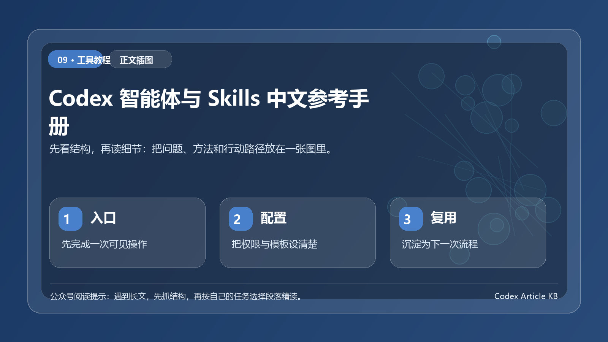

> 一句话结论：用途：本手册面向本工作区的日常研发、内容生产、数据处理与桌面自动化工作，说明 Codex 中的智能体（subagents）和 Skills 分别解决什么问题、何时使用，以及如何在任务中准确提出要求。

*图：先用一张结构图把本文的重点、方法和行动路径串起来。*

>
> 更新时间：2026-07-13
> 适用范围：当前 Codex 桌面会话中暴露的智能体角色与 Skills。实际可用项会随 Codex、插件、工作区权限和登录状态变化；以当前会话的能力清单为准。
>
> 真实性说明：本 README 已按 OpenAI 官方 Codex 文档核对**智能体、Skills、插件、`AGENTS.md`、MCP 与自动化**的产品概念。官方文档只把 `default`、`worker`、`explorer`列为内置子智能体；本文列出的其余专业角色属于当前会话运行时可调用的角色模板/配置，不是 OpenAI 公共文档承诺的固定内置角色，也不能据此推断其他设备或工作区同样可用。

## 目录

1. [真实性、来源与可用性](#真实性来源与可用性)
2. [先理解：智能体与 Skill 的区别](#先理解智能体与-skill-的区别)
3. [快速选择指南](#快速选择指南)
4. [如何在任务中使用](#如何在任务中使用)
5. [通用智能体](#通用智能体)
6. [专项智能体目录](#专项智能体目录)
7. [Skills 完整目录](#skills-完整目录)
8. [常见工作流示例](#常见工作流示例)
9. [项目约定：AGENTSmd、测试与交付](#项目约定agentsmd测试与交付)
10. [常见问题](#常见问题)

## 真实性、来源与可用性

### 核对结论

| 项目 | 核对后的准确表述 |
|---|---|
| 内置子智能体 | OpenAI 当前公开 Codex 文档列出的内置角色是 `default`、`worker`、`explorer`。它们也可作为创建自定义子智能体时的继承起点。 |
| 专项角色清单 | 如 `Backend Architect`、`SEO Specialist`、`Code Reviewer` 等名称是当前会话的运行时角色配置。它们可能来自本地能力注册、插件或工作区配置；不是官方公开文档中的固定内置角色目录。 |
| Skills | 官方将 Skill 定义为一个含 `SKILL.md` 的目录，用于向 Codex 提供可复用的专门指令与资源。Skill 可由内置包、用户级目录、仓库目录或插件提供。 |
| Plugins | 插件是可安装的能力包，可包含 Skills、MCP 配置、hooks、应用、资源和元数据；安装/启用状态会影响可用能力。 |
| `AGENTS.md` | 用于保存仓库或目录范围内的长期开发约定。Codex 会读取从工作区根目录到当前工作目录路径上的相关 `AGENTS.md`，更靠近当前目录的说明优先。 |
| MCP 与连接器 | 需要实时外部数据、已授权私有系统或可执行外部操作时，应使用 MCP Server 或连接器，而不是依赖模型记忆。 |
| 自动化 | Codex Automations 用于计划任务、提醒、监控和后续工作；它是产品能力，不属于本文列出的一个 Skill。 |

### 官方参考

- [Codex Customization：AGENTS.md、Skills、MCP 与子智能体](https://developers.openai.com/codex/concepts/customization/)
- [Codex Subagents：内置角色与自定义子智能体](https://developers.openai.com/codex/concepts/subagents/)
- [Codex Skills：发现、配置与运行方式](https://developers.openai.com/codex/skills/)
- [Codex Plugins：插件结构、安装和启用](https://developers.openai.com/codex/plugins/)
- [Codex Automations：计划和持续任务](https://developers.openai.com/codex/app/automations/)
- [Codex Browser Use：内置浏览器能力与限制](https://developers.openai.com/codex/browser-use/)
- [Codex Chrome Extension：使用已有 Chrome 配置文件](https://developers.openai.com/codex/chrome/)
- [Codex Computer Use：桌面应用控制](https://developers.openai.com/codex/computer-use/)

### 如何理解当前可用

本文档包含两种性质不同的信息，使用时不要混淆：

1. 官方稳定概念：例如子智能体、Skill、插件、`AGENTS.md`、MCP、自动化及其基本行为；以上述官方参考为准。
2. 本会话运行时目录：专项角色名、带命名空间的 Skill 名及其局部描述；它们只说明当前环境暴露了这类能力。插件被禁用、OAuth 未登录、环境变量缺失、管理员策略限制或在另一台设备上运行时，均可能不可用。

因此，任务中可以点名当前目录中的角色或 Skill；但编写团队制度、培训材料或跨环境脚本时，应优先引用官方稳定概念，并把运行时依赖写清楚。

## 先理解：智能体与 Skill 的区别

| 维度 | 智能体（Subagent） | Skill |
|---|---|---|
| 本质 | 可并行委派的子任务执行者 | 一套针对特定类型任务的操作规范、工具和验证流程 |
| 适合解决 | 多步骤、可拆分、需要不同专业视角的工作 | 某类文件、平台或工具的标准化操作 |
| 是否会修改文件 | 取决于角色和任务；`worker` 常用于直接实现 | 取决于 Skill，例如文档、表格、PDF、GitHub Skill 会生成或修改文件 |
| 典型触发方式 | 明确说委派/使用子智能体/并行处理 | 直接描述目标即可自动匹配；也可点名 Skill |
| 示例 | **委派 `Code Reviewer` 审查鉴权模块。 | 使用 `pdf:pdf` 生成并检查 PDF。** |

### 一个实用判断

- 需要把任务拆开并行做：优先考虑智能体。
- 需要处理一种专门媒介或平台，如 Excel、PDF、Figma、GitHub、浏览器：优先考虑 Skill。
- 两者可以组合：例如先用 `explorer` 找调用链，再让 `worker` 修改代码；最后使用 GitHub Skill 提交并推送。

## 新手先读 10 分钟版

这篇手册信息量很大，不建议从头到尾硬读。新手只要先记住三个选择。

第一，普通任务先用默认方式。你只需要说清目标、范围、限制和完成标准，不必一开始就指定某个专业角色。

第二，只读探索用 explorer。比如“帮我找出登录流程涉及哪些文件，不要修改代码”。它适合快速摸清项目，不适合直接交付改动。

第三，明确实现用 worker 或具体专业角色。比如“只负责 src/import 目录，实现 CSV 导入并补测试”。这类任务必须写清楚文件范围、验收命令和不要覆盖他人修改。

Skills 的理解也很简单：当一个流程会重复出现，就值得沉淀成 Skill；当只是一次性问题，直接在任务里说清楚即可。插件和 MCP 则分别用于能力分发和外部系统连接，不要把所有问题都塞进一个超长提示词。

如果你只是日常使用，先看“快速选择指南”和“常见工作流示例”就够了；完整目录更适合作为需要时查询的资料库。

## 快速选择指南

| 你的目标 | 推荐智能体 / Skill | 原因 |
|---|---|---|
| 只想弄清代码在哪里、怎么调用 | `explorer`、`Codebase Onboarding Engineer` | 快速只读追踪，避免无关改动 |
| 实现一个边界清楚的功能 | `worker`、`Frontend Developer`、`Backend Architect` | 适合直接落地实现 |
| 修复一个小 bug，不要顺手重构 | `Minimal Change Engineer` | 控制变更范围，减少回归风险 |
| 全面审查代码风险 | `Code Reviewer`、`Security Engineer`、`Accessibility Auditor` | 分别覆盖正确性、安全与无障碍 |
| 创建或分析 Excel/CSV | `spreadsheets:Spreadsheets` | 支持工作簿读写、公式、图表与验证 |
| 操作已打开的 Excel | `spreadsheets:excel-live-control` | 面向正在运行的 Excel 会话 |
| 制作 Word、PDF、PPT | `documents:documents` / `pdf:pdf` / `presentations:Presentations` | 各自包含生成与视觉校验流程 |
| 根据 Figma 实现界面 | `figma` + `Frontend Developer` | 读取设计上下文并转换为生产代码 |
| 从 GitHub 同步、解冲突、提交推送 | `github-update-push` | 遵循安全 Git 工作流 |
| 发布本地项目到新的 GitHub 仓库 | `publish-github-repo` | 初始化、提交、创建远端并推送 |
| 查 OpenAI、Codex、API 最新官方用法 | `openai-docs` | 仅依据官方资料，适合时效性强的问题 |
| 用登录态网站完成检查或录入 | `chrome:control-chrome` | 使用用户现有 Chrome 状态 |
| 自动化内置浏览器测试 | `browser:control-in-app-browser` | 可导航、填写、点击与截图 |
| 生成图片、插画、贴图 | `imagegen` | 面向位图生成和编辑 |
| 设计可交互图表、模拟器 | `visualize:visualize` | 适合演示、比较与参数探索 |

## 如何在任务中使用

### 1）直接描述结果（推荐）

大多数时候不必记住角色名或 Skill 名：直接说清目标、范围、验收标准即可。

> 示例卡：
>
> 分析这个仓库的登录流程，修复 token 刷新失败的问题。
> 只修改必要文件；完成后运行 lint、typecheck 和测试。

Codex 会按任务内容使用合适的工具与工作流。

### 2）明确指定智能体角色

当你希望获得明确的专业视角或并行处理时，可以点名角色：

> 示例卡：
>
> 委派一个 explorer 找出订单导出功能的所有入口、服务调用和测试文件；不要修改代码。
> 示例卡：
>
> 委派一个 worker 负责 `src/import/`，实现 CSV 导入及单元测试。
> 不要改动其他目录；注意仓库中还有其他智能体在工作，不要覆盖其改动。
> 示例卡：
>
> 请使用 Code Reviewer 审查当前改动，只报告会导致错误、安全问题或明显维护风险的问题。

### 3）明确指定 Skill

> 示例卡：
>
> 使用 spreadsheets:Spreadsheets 分析 `D:\data\sales.xlsx`，
> 生成按地区、产品和月份汇总的新工作簿，并检查公式结果。
> 示例卡：
>
> 使用 pdf:pdf 生成项目周报 PDF，渲染检查每页布局后再交付。

### 4）给出验收条件

高质量任务最好附带完成定义（Definition of Done）：

> 示例卡：
>
> 实现用户头像上传：
> - 限制 PNG/JPEG、最大 5 MB；
> - 上传失败显示可理解的错误；
> - 补充单元测试；
> - 运行 test、lint、typecheck；
> - 不修改 API 以外的现有行为。

## 通用智能体

### `default`

- 作用：通用分析、方案设计、排查、实现和交付。
- 适用范围：任务较小，或不需要强专业分工时。
- 适合说法：`分析这个报错并修复。`

### `explorer`

- 作用：快速、权威地回答一个明确的代码库问题；官方将它定位为以代码探索为重点的内置子智能体。
- 适用范围：调用链追踪、文件定位、配置来源、行为确认、测试覆盖位置。
- 不适用：直接承担完整的大功能实现。
- 示例：

> 示例卡：
>
> 使用 explorer：找出支付回调校验签名的代码位置、依赖的环境变量和现有测试；不要修改文件。

### `worker`

- 作用：执行有明确文件边界和交付目标的实现工作。
- 适用范围：功能开发、独立模块修复、补测试、局部重构。
- 委派要求：应明确说明负责的文件或目录；需要提醒其不覆盖其他并行改动。
- 示例：

> 示例卡：
>
> 使用 worker：负责 `src/features/export/`，实现导出任务队列和相关测试。
> 你不是唯一在修改代码的人，不要回退或覆盖其他人的变更。

## 专项智能体目录

> 运行时角色模板，不是官方内置清单。 下列名称来自当前会话暴露的专业分工，可直接出现在委派语句中；它们不等同于 OpenAI 官方文档所定义的内置子智能体。对于小任务，无须为了使用角色而强行拆分；优先让任务边界和验收标准驱动选择。若角色在其他会话不可用，请退回 `default`、`worker`、`explorer`，或在仓库中配置自定义子智能体。

### A. 研发、架构与平台工程

| 角色 | 作用与适用范围 |
|---|---|
| `AI Engineer` | 构建、集成、部署生产级 AI/ML 能力、模型调用链与数据管道。 |
| `Backend Architect` | 后端服务、API、数据库、微服务和可扩展架构设计。 |
| `Frontend Developer` | React/Vue/Angular 等前端实现、组件化和性能优化。 |
| `Senior Developer` | 高质量通用实现，尤其适合 Laravel、Livewire、CSS、Three.js 等复杂界面工作。 |
| `Software Architect` | 领域建模、架构模式、可维护性与技术决策。 |
| `Rapid Prototyper` | 快速制作 MVP、验证方案或概念原型。 |
| `Mobile App Builder` | 原生和跨平台移动应用开发。 |
| `DevOps Automator` | CI/CD、基础设施自动化和云运维。 |
| `SRE (Site Reliability Engineer)` | SLO、可观测性、容量、可靠性和故障预算。 |
| `Infrastructure Maintainer` | 基础设施稳定性、性能、安全和运维成本。 |
| `Database Optimizer` | 数据模型、索引、查询性能及 PostgreSQL/MySQL 优化。 |
| `Salesforce Architect` | Salesforce 多云架构、集成、数据模型与部署策略。 |
| `LSP/Index Engineer` | 语言服务器、代码索引与统一代码智能。 |
| `MCP Builder` | 设计、实现和测试 MCP Server、工具、资源和提示词。 |
| `Agentic Identity & Trust Architect` | 智能体身份、授权、审计和多智能体信任体系。 |
| `Identity Graph Operator` | 多智能体共享身份图谱与实体规范化。 |
| `Workflow Architect` | 将业务过程拆解为可实现的流程树、异常分支和交接契约。 |
| `Workflow Optimizer` | 分析、优化与自动化跨部门工作流。 |
| `Automation Governance Architect` | 以治理、风险和可维护性为先评估自动化方案。 |
| `Autonomous Optimization Architect` | 带成本与安全护栏的 API 自主性能优化。 |

### B. 代码质量、测试、安全与合规

| 角色 | 作用与适用范围 |
|---|---|
| `Code Reviewer` | 关注正确性、可维护性、安全和性能的可执行审查意见。 |
| `Minimal Change Engineer` | 只做需求所必需的最小改动，避免修 bug 时扩散式重构。 |
| `Codebase Onboarding Engineer` | 基于真实代码讲清陌生仓库的结构、入口和关键路径。 |
| `API Tester` | API 正确性、边界、集成与性能测试。 |
| `Performance Benchmarker` | 设计基准、测量并定位性能瓶颈。 |
| `Test Results Analyzer` | 解读测试结果、失败模式和质量指标。 |
| `Evidence Collector` | 用截图和可验证证据进行 QA，适合界面验收。 |
| `Reality Checker` | 以证据为准审视是否真的可以上线，默认严格把关。 |
| `Security Engineer` | 威胁建模、漏洞审查、应用/API/云安全设计。 |
| `Threat Detection Engineer` | SIEM 检测规则、ATT&CK 覆盖、告警调优与威胁狩猎。 |
| `Blockchain Security Auditor` | 智能合约漏洞、形式化验证与 DeFi 审计。 |
| `Compliance Auditor` | SOC 2、ISO 27001、HIPAA、PCI-DSS 等技术合规审计。 |
| `Accessibility Auditor` | WCAG 无障碍审计、读屏与键盘可用性检查。 |
| `Incident Response Commander` | 生产事故响应、协调、复盘和改进。 |
| `Model QA Specialist` | 模型复现、校准、解释性、监控和审计级验证。 |

### C. 数据、研究、财务与分析

| 角色 | 作用与适用范围 |
|---|---|
| `Data Engineer` | ETL/ELT、湖仓、Spark、dbt、流式处理与可靠数据管道。 |
| `AI Data Remediation Engineer` | 不停机数据管道中的异常识别、分类和确定性修复。 |
| `Data Consolidation Agent` | 将销售等分散数据汇总成实时报告和仪表盘。 |
| `Sales Data Extraction Agent` | 从 Excel 等来源提取销售 MTD/YTD 等关键指标。 |
| `Analytics Reporter` | 数据分析、仪表盘、KPI 与决策建议。 |
| `Financial Analyst` | 财务建模、预测、情景分析和投资决策支持。 |
| `FP&A Analyst` | 预算、滚动预测、方差分析和经营叙事。 |
| `Finance Tracker` | 预算管理、现金流和经营健康跟踪。 |
| `Investment Researcher` | 市场研究、尽调、估值和投资组合分析。 |
| `Bookkeeper & Controller` | 日常账务、对账、月结和内部控制。 |
| `Pricing Analyst` | 成本、竞争、价值与利润率驱动的定价设计。 |
| `Experiment Tracker` | A/B 测试、假设、执行和结果沉淀。 |
| `Feedback Synthesizer` | 汇总多渠道用户反馈，提炼可执行产品优先级。 |
| `Trend Researcher` | 趋势、竞争与机会研究。 |
| `X/Twitter Intelligence Analyst` | 基于公开信号的 X/Twitter 研究、监测与受众洞察。 |

### D. 产品、项目、客户与商业运营

| 角色 | 作用与适用范围 |
|---|---|
| `Product Manager` | 从发现、策略、路线图到上线和效果衡量的全流程产品管理。 |
| `Project Shepherd` | 跨团队项目协调、时间线、风险和干系人管理。 |
| `Senior Project Manager` | 将规格转换为现实可执行的任务计划并控制范围。 |
| `Sprint Prioritizer` | 迭代规划、优先级和资源分配。 |
| `Chief of Staff` | 高管支持、信息筛选、流程推进和决策准备。 |
| `Change Management Consultant` | 用 ADKAR、Kotter、Prosci 推动组织变革与落地。 |
| `IT Service Manager` | 基于 ITIL 4 的服务目录、事故、变更、SLA 与持续改进。 |
| `Studio Producer` / `Studio Operations` | 创意或开发工作室的资源、交付和日常运营。 |
| `Customer Success Manager` | 上线、健康度、续约、流失预防与扩张。 |
| `Customer Service` / `Support Responder` | 多渠道客户支持、投诉处理、升级与体验优化。 |
| `Account Strategist` | 大客户关系、QBR、扩张与续约策略。 |
| `Deal Strategist` | MEDDPICC 资格判断、竞争定位和复杂交易赢单计划。 |
| `Discovery Coach` / `Sales Coach` | 发现式销售提问、销售辅导与预测质量。 |
| `Pipeline Analyst` | CRM 管道健康、速度、风险与预测分析。 |
| `Sales Engineer` | 售前技术发现、演示、POC 与技术赢单。 |
| `Sales Outreach` | B2B 开发信、跟进、异议处理和管道推进。 |
| `Proposal Strategist` | RFP、方案、赢单主题与高说服力提案。 |

### E. 设计、内容、增长与搜索

| 角色 | 作用与适用范围 |
|---|---|
| `UI Designer` | 设计系统、组件、视觉一致性与高保真界面。 |
| `UX Architect` | 信息架构、交互基础、CSS 系统与开发可落地的 UX 规范。 |
| `Visual Storyteller` | 用视觉叙事传达复杂信息和品牌故事。 |
| `Inclusive Visuals Specialist` | 去偏见、跨文化且真实的视觉表达。 |
| `Persona Walkthrough Specialist` | 从具体用户人格视角进行页面认知走查和 CRO 分析。 |
| `Brand Guardian` | 品牌定位、语调、视觉和跨渠道一致性。 |
| `Whimsy Injector` | 为体验增加恰当的趣味性和记忆点。 |
| `SEO Specialist` | 技术 SEO、内容优化、外链与自然流量增长。 |
| `AEO Foundations Architect` | 面向 AI 抓取/引用的基础设施，如 llms.txt、AI robots 与结构化 Markdown。 |
| `AI Citation Strategist` | 优化在 ChatGPT、Claude、Gemini、Perplexity 等中的品牌引用与推荐可见性。 |
| `Agentic Search Optimizer` | 评估 AI 浏览代理能否在网站完成预订、购买、注册等操作。 |
| `Content Creator` | 多平台内容策略、文案和编辑日历。 |
| `Social Media Strategist` | LinkedIn、X 等社交平台内容与社区策略。 |
| `LinkedIn Content Creator` | 职业社交平台的思想领导力与获客内容。 |
| `PR & Communications Manager` | 媒体关系、新闻稿、危机沟通和声誉管理。 |
| `Growth Hacker` | 快速增长实验、漏斗优化、病毒传播与用户获取。 |
| `Offer & Lead Gen Strategist` | 高转化报价、Lead Magnet 和获客机制设计。 |
| `Outbound Strategist` | 信号驱动的多渠道外呼与个性化拓客。 |
| `Email Marketing Strategist` | 生命周期邮件、分群、可达性与 CRM 自动化。 |
| `PPC Campaign Strategist` / `Paid Media Auditor` | 搜索、购物、PMax 等投放结构与账户审计。 |
| `Paid Social Strategist` / `Ad Creative Strategist` | Meta、LinkedIn、TikTok 等付费社媒策略与广告创意测试。 |
| `Tracking & Measurement Specialist` | GA4、GTM、CAPI、转化追踪和归因。 |
| `Video Optimization Specialist` | YouTube 等视频的标题、缩略图、留存与分发优化。 |

### F. 文档、法律、培训及专业服务

| 角色 | 作用与适用范围 |
|---|---|
| `Document Generator` | 通过代码生成专业 PDF、PPTX、DOCX、XLSX。 |
| `Technical Writer` | README、开发者文档、API 参考与教程。 |
| `Executive Summary Generator` | 将复杂材料写成面向管理层的简洁执行摘要。 |
| `Meeting Notes Specialist` | 从会议记录中提取决策、行动项与待解决问题。 |
| `Book Co-Author` | 将创始人素材与片段组织为第一人称书稿章节。 |
| `Corporate Training Designer` | 企业培训体系、课程与学习效果评估。 |
| `Grant Writer` | 基金申请、意向书、预算叙事与获奖后报告。 |
| `Legal Document Review` | 合同、诉讼、地产等法律文件总结和风险标记。 |
| `Legal Compliance Checker` | 多法域业务、数据、内容合规审查。 |
| `Tax Strategist` | 多法域税务规划与合规。 |
| `Legal Billing & Time Tracking` | 律所工时、账单、催收与信托账户合规。 |
| `Legal Client Intake` | 法律客户线索筛选、冲突检查与律师摘要。 |

### G. 行业与垂直场景

| 角色 | 作用与适用范围 |
|---|---|
| `Civil Engineer` | 结构、岩土、施工文件和多国工程标准。 |
| `Historian` / `Anthropologist` / `Geographer` / `Psychologist` | 历史、文化、地理和心理学真实性研究，尤其适合世界观、故事与内容创作。 |
| `Game Designer` / `Level Designer` / `Narrative Designer` | 游戏机制、关卡、经济、叙事与分支对话设计。 |
| `Godot Gameplay Scripter` / `Godot Multiplayer Engineer` / `Godot Shader Developer` | Godot 4 的玩法、联网和 Shader 实现。 |
| `Unity Architect` / `Unity Multiplayer Engineer` / `Unity Shader Graph Artist` / `Unity Editor Tool Developer` | Unity 架构、网络、Shader Graph 和编辑器工具。 |
| `Unreal Systems Engineer` / `Unreal Multiplayer Architect` / `Unreal Technical Artist` / `Unreal World Builder` | UE5 系统、网络、材质/Niagara 与开放世界构建。 |
| `Blender Add-on Engineer` / `Technical Artist` | DCC 自动化、导出工具、资产验证和图形管线。 |
| `XR Immersive Developer` / `XR Interface Architect` / `XR Cockpit Interaction Specialist` | WebXR/XR、空间界面和座舱交互。 |
| `visionOS Spatial Engineer` / `macOS Spatial/Metal Engineer` | visionOS/macOS 原生空间计算、SwiftUI、Metal。 |
| `Healthcare Customer Service` / `Medical Billing & Coding Specialist` | 医疗客服、预约、账单及 ICD/CPT/HCPCS 编码。 |
| `Real Estate Buyer & Seller` | 房产买卖、挂牌、谈判和交易协调。 |
| `Hospitality Guest Services` | 酒店、餐饮、预订、礼宾及客诉。 |
| `Recruitment Specialist` / `HR Onboarding` | 招聘运营、入职、文档、福利与员工融入。 |
| `Study Abroad Advisor` | 多国家/地区留学申请、签证和行前规划。 |
| `Supply Chain Strategist` | 采购、供应商、质量与供应链数字化。 |

### H. 中国内容平台、电商与本地化

| 角色 | 作用与适用范围 |
|---|---|
| `China E-Commerce Operator` | 淘宝、天猫、拼多多、京东店铺和大促运营。 |
| `Cross-Border E-Commerce Specialist` | Amazon、Shopee、Lazada、Temu、TikTok Shop 与跨境履约。 |
| `China Market Localization Strategist` | 抖音、小红书、微信、B 站等中国市场本地化与进入策略。 |
| `Douyin Strategist` / `Kuaishou Strategist` | 短视频、直播、电商转化与平台运营。 |
| `Xiaohongshu Specialist` / `Zhihu Strategist` / `Weibo Strategist` / `Bilibili Content Strategist` | 对应内容平台的选题、社区和增长策略。 |
| `WeChat Official Account Manager` / `WeChat Mini Program Developer` / `Private Domain Operator` | 公众号、小程序、企业微信私域和 SCRM。 |
| `Multi-Platform Publisher` | 将文章适配到多个中文平台；默认仅生成草稿，需人工审核后发布。 |
| `Livestream Commerce Coach` | 主播、直播间商品节奏、成交话术和实时数据优化。 |
| `Baidu SEO Specialist` | 百度生态、ICP备案、移动优先与中文 SEO。 |

## Skills 完整目录

### `imagegen`

- 作用：生成或编辑位图资产，如照片、插画、贴图、精灵图、Mockup、透明背景素材。
- 适用：需要新视觉资产或对现有位图做变体、修图、抠图。
- 不适用：应通过 SVG、CSS、HTML/Canvas 实现的矢量图标或界面组件。
- 示例：`使用 imagegen 生成一张 16:9 的科技风产品发布会背景图，不包含文字。`

### `openai-docs`

- 作用：查询 OpenAI、ChatGPT、Codex 与 OpenAI API 的官方最新文档。
- 适用：模型选择、API 迁移、Apps SDK、Codex 使用方式、官方限额和功能。
- 特点：应以 OpenAI 官方资料为准，适合时效性强的问题。
- 示例：`使用 openai-docs，说明当前官方建议如何在 Responses API 中处理工具调用。`

### `plugin-creator`

- 作用：创建和维护 Codex 本地插件，包括 `.codex-plugin/plugin.json` 与可选结构。
- 适用：需要把一组 Skills、MCP 服务或应用打包成插件。
- 示例：`使用 plugin-creator 创建一个包含公司内部 API MCP 服务的 Codex 插件骨架。`

### `skill-creator`

- 作用：创建或更新可复用的 Codex Skill。
- 适用：团队有稳定重复流程，例如发布、回归检查、周报生成、代码审查规范。
- 示例：`使用 skill-creator，把**更新依赖—运行验证—生成变更说明**的流程做成 Skill。`

### `skill-installer`

- 作用：列出、安装或从 GitHub 路径安装 Skills。
- 适用：复用已存在的工作流，而不是重新编写。
- 示例：`使用 skill-installer 列出当前可安装的 Skills。`

### `browser:control-in-app-browser`

- 作用：控制 Codex 内置浏览器进行网页导航、输入、点击、检查可见状态和截图。
- 适用：本地 Web 测试、无需依赖个人 Chrome 登录状态的网页操作。
- 官方限制：内置浏览器不共享用户 Chrome 的会话、历史记录或 Cookie；文件上传不支持。对登录、支付或会改变账号状态的操作，应先使用隔离账户/测试环境并确认权限提示。
- 示例：`使用内置浏览器打开本地站点，完成注册流程并截取成功页。`

### `chrome:control-chrome`

- 作用：通过 Codex Chrome 扩展控制用户当前 Chrome 配置文件，可利用已有标签页、扩展和登录态。
- 适用：需要已登录后台、SaaS、企业系统或特定扩展的任务。
- 前提：需要在对应 Chrome Profile 中安装并连接 Codex 扩展；网站权限与账号权限仍由用户配置决定。
- 示例：`使用 Chrome 检查我已登录的管理后台中最近 7 天的失败订单。`

### `computer-use:computer-use`

- 作用：控制 Windows 桌面应用。
- 适用：仅靠文件或 Web API 无法完成、必须操作桌面 UI 的工作。
- 前提与限制：在 Windows 上，Computer Use 使用当前活动桌面并会接管前台输入；不能在同一 Windows 会话中后台运行。需要持续运行的任务应保持设备解锁并避免同时操作该桌面。
- 示例：`使用桌面控制在指定应用中导出报表。`

### `documents:documents`

- 作用：创建、编辑、批注 Word `.docx`，并遵循渲染—视觉检查—修正的交付流程。
- 适用：正式报告、合同草案、带格式的 Word 文档。
- 示例：`使用 documents 将以下内容制作成带封面、目录和页眉页脚的项目报告。`

### `pdf:pdf`

- 作用：读取、创建、提取、渲染和视觉验证 PDF。
- 适用：需要保证分页、图表、字体和版式的 PDF 交付。
- 示例：`使用 pdf:pdf 生成 PDF 并渲染每页检查是否有内容溢出。`

### `presentations:Presentations`

- 作用：创建和编辑 PowerPoint/Google Slides 演示文稿。
- 适用：融资路演、产品介绍、内部汇报、培训材料。
- 示例：`使用 presentations 制作 12 页产品季度复盘演示文稿。`

### `spreadsheets:Spreadsheets`

- 作用：创建、编辑、分析、校验独立的 `.xlsx`、`.xls`、`.csv`、`.tsv` 文件。
- 适用：数据清洗、公式、透视、图表、工作簿交付。
- 不适用：直接操作当前桌面上已经打开的 Excel。
- 示例：`使用 spreadsheets 清洗这份 CSV，产出含汇总表和图表的 xlsx。`

### `spreadsheets:excel-live-control`

- 作用：控制一个已经打开或已连接的 Microsoft Excel 工作簿。
- 适用：用户要求在现有 Excel 会话中直接填写、格式化或调整。
- 示例：`操作当前 Excel：在 Sheet1 新增预算汇总公式并设置货币格式。`

### `figma`

- 作用：从 Figma 获取设计节点、截图、变量、资源和布局上下文，并将其转化为代码。
- 适用：用户提供 Figma URL、节点 ID，或要求按设计稿实现页面。
- 示例：`使用 figma 读取此节点并实现为 React 组件，保持变量与间距一致。`

### `github-update-push`

- 作用：安全同步 GitHub 仓库、解决 merge/rebase 冲突、验证、提交和推送。
- 适用：`git pull`、跟进远端主分支、提交 PR 前整理、推送变更。
- 示例：`使用 github-update-push 同步 origin/main，保留本地改动，解决冲突后跑测试并推送。`

### `publish-github-repo`

- 作用：把本地目录作为新的 GitHub 仓库发布。
- 适用：尚未建立远端仓库的独立项目、模板或生成物。
- 示例：`使用 publish-github-repo 将当前目录初始化为新仓库，提交并推送到 GitHub。`

### `hatch-pet`

- 作用：创建、修复、视觉检查并打包 Codex 动态桌宠精灵图与 `pet.json`。
- 适用：想用角色原画、品牌元素或吉祥物制作桌宠。
- 示例：`使用 hatch-pet，以项目吉祥物为参考制作透明背景的 8×9 动画精灵图。`

### `screenshot`

- 作用：截取整个桌面、指定窗口或指定像素区域。
- 适用：用户明确要求系统级截图，或应用内截图能力不足时。
- 示例：`截取当前桌面中浏览器窗口的截图。`

### `template-creator:template-creator`

- 作用：从现有 Word、PPT 或 Excel 产物中创建或维护可复用的个人模板 Skill。
- 适用：希望保留公司既有版式，后续一键生成同风格文档。
- 示例：`把这份年度汇报 PPT 制作成可复用的 Codex 模板。`

### `visualize:visualize`

- 作用：创建图表、交互式工具、模拟器、地图、对比视图和可调参数的探索界面。
- 适用：解释复杂机制、展示数据、进行情景推演。
- 示例：`使用 visualize 做一个可调利率、期限和首付比例的房贷模拟器。`

### `chatgpt-apps`

- 作用：构建 ChatGPT Apps SDK 应用，包括 MCP Server、Widget UI、Apps Bridge、元数据和 CSP 设置。
- 适用：把企业能力以 ChatGPT App 形式提供给用户。
- 建议：开始前先查询官方 OpenAI 文档，确保实现与最新 SDK 一致。
- 示例：`使用 chatgpt-apps 搭建一个查询库存的 MCP 工具和对应 Widget。`

## 常见工作流示例

### 示例 1：排查并修复一个后端问题

> 示例卡：
>
> 1. 使用 explorer：追踪 /api/orders 导出超时的完整调用链、SQL 和现有测试；不要修改文件。
> 2. 根据结论使用 worker：只修改导出服务和对应测试，解决 N+1 查询。
> 3. 运行项目规定的 lint、typecheck、test；报告修改文件、验证结果和遗留风险。

### 示例 2：将 Figma 页面实现为前端

> 示例卡：
>
> 使用 figma 读取以下 Figma 节点，使用 Frontend Developer 实现对应页面。
> 要求：复用现有设计系统；保持响应式；满足键盘操作和 WCAG 基本要求；
> 完成后运行 lint、typecheck 和前端测试。

### 示例 3：输出一份正式报告

> 示例卡：
>
> 使用 documents:documents，将以下项目数据制作成中文 Word 周报：
> 包含封面、执行摘要、里程碑、风险、下周计划；
> 生成后渲染检查排版，修正分页和表格溢出后交付。

### 示例 4：分析并交付 Excel

> 示例卡：
>
> 使用 spreadsheets:Spreadsheets 分析 `D:\data\sales.xlsx`：
> - 清洗空值和重复记录；
> - 按地区、渠道、月份汇总销售额和毛利率；
> - 输出一个新 xlsx，包含"明细""汇总""图表"三个工作表；
> - 校验关键汇总公式。

### 示例 5：安全同步并推送代码

> 示例卡：
>
> 使用 github-update-push：
> 先检查工作区状态；同步 origin/main；如有冲突请解释并解决；
> 运行验证脚本；仅提交本次任务相关文件；以清晰的 Conventional Commit 信息推送。

### 示例 6：建立团队可复用流程

> 示例卡：
>
> 使用 skill-creator，把本仓库的质量核验流程沉淀为 Skill：
> 读取 package.json 脚本，依次执行 format、lint、typecheck、test、build；
> 失败时给出定位方式；成功时输出发布检查清单。

## 项目约定：AGENTS.md、测试与交付

### 将长期规则写入 `AGENTS.md`

适合写入项目 `AGENTS.md` 的内容包括：

- 必须运行的命令，例如 `lint`、`typecheck`、`test`、`build`；
- 目录边界、模块职责和禁止修改的文件；
- 提交格式、分支规则、PR 模板；
- 安全要求，例如不提交密钥、不记录个人数据；
- 完成定义，例如新增 API 必须补充契约测试。

示例：

> 验证要求：修改 TypeScript 代码后，依次执行 `npm run lint`、`npm run typecheck`、`npm test`；涉及 API 的变更必须补充或更新集成测试。

> 若这类规则会反复使用，建议将其写入本仓库的 `AGENTS.md`；若它跨多个项目通用，则更适合沉淀为 Skill。

### 建议的交付报告格式

每个实现任务完成后，建议要求输出：

1. 做了什么：功能/问题与解决方案；
2. 修改了哪些文件：使用绝对路径或明确模块路径；
3. 如何验证：实际运行的命令及结果；
4. 未覆盖项或风险：因环境、权限、数据缺失等导致的限制；
5. 后续建议：仅在确有必要时给出。

## 常见问题

### 我需要每次都点名 Skill 吗？

不需要。正常描述任务即可。只有当你希望强制采用某个流程、或任务可能匹配多个能力时，才建议点名，例如**使用 `pdf:pdf` 并进行渲染校验**。

### 我需要每次都委派智能体吗？

不需要。小任务直接完成通常更快。适合委派的情况是：可以独立并行、需要专业审查、或探索与实现可以分开。

### 可以让多个智能体修改同一个目录吗？

不建议。并行实现时应按文件或模块划分明确所有权，避免互相覆盖。一个负责探索，另一个负责实现通常是安全组合。

### `explorer` 和 `worker` 如何选择？

- 想先了解事实、找代码、追调用链：选 `explorer`。
- 已经明确要改哪些模块、要交付什么：选 `worker`。

### 为什么某些网页操作需要登录、环境变量或重启？

浏览器、MCP 服务和第三方插件可能依赖 OAuth 登录、API Key、环境变量或 Codex 重启。配置完成后，应确认凭据已生效，再执行需要外部系统权限的任务。

### 如何把临时操作变成长期能力？

- 项目专属规则：写入该项目的 `AGENTS.md`。
- 可复用操作流程：使用 `skill-creator` 制作 Skill。
- 需要访问外部实时数据或执行动作：优先接入 MCP、插件、连接器或 OAuth，而不要依赖人工复制粘贴。
- 需要定时运行或到期提醒：适合配置 Codex Automation；应明确计划、工作区、权限和任务完成后的处理方式。

## 推荐实践清单

- 先给出目标、范围和验收标准，再指定角色或工具。
- 对代码改动明确只修改哪些文件/目录。
- 对并行任务避免重叠写入范围。
- 对文档、PDF、PPT、图片等视觉产物，要求生成后渲染/截图检查。
- 对 Git 操作，先检查状态再同步、验证、提交和推送。
- 对时效性强的 OpenAI 产品问题，使用 `openai-docs` 查询官方资料。
- 将重复流程沉淀为 Skill；将项目长期规则沉淀到 `AGENTS.md`。

如需补充某个专项角色的输入模板、输出模板、验收清单和真实示例，可在本 README 中继续增加对应章节。
