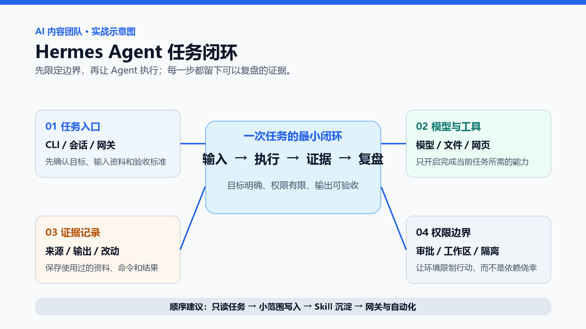
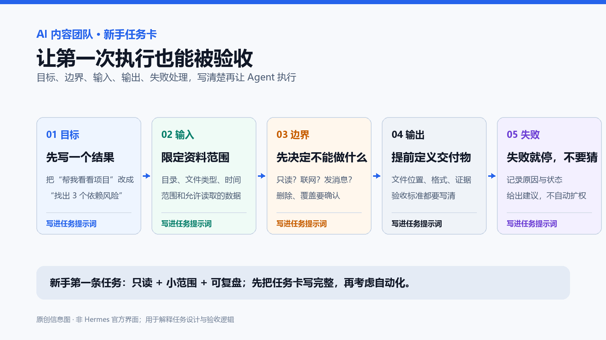
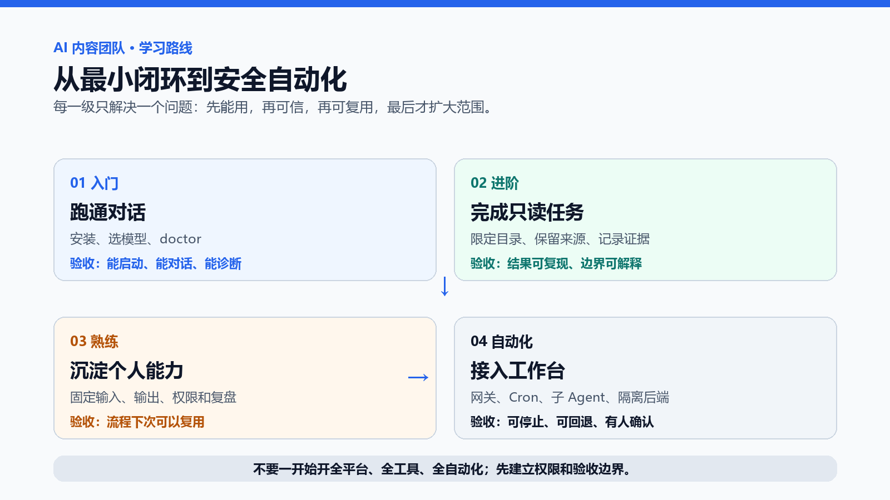

> 一句话结论：第一次使用 Hermes Agent，不要从“全自动”开始。先用最小配置完成一次**只读、范围明确、结果可核查**的任务，再按需要增加写入、Skill、定时任务和消息网关。

# Hermes Agent 实战入门：从安装到第一条可验收任务

你可能已经会在聊天框里问 AI 问题，但还没有让它真正进入文件、代码、资料整理和日常工作。Hermes Agent 的价值不在于“回答更长”，而在于把模型、工具、工作区和交付结果接成一条可复盘的工作流。

这篇文章不做功能名词大串讲，而是给你一条能跑通的路线：

> **15 分钟跑通一次对话 → 30 分钟完成一次只读资料审查 → 把任务写成任务卡 → 再决定是否启用 Skill、Cron、网关或子 Agent。**

读完后，你应该能交付一份真实的小报告，而不是只记住几个命令。

---

## 先判断：你需要的是聊天工具，还是 Agent？

如果只是解释概念、润色句子或生成标题，普通聊天工具通常更轻量。下面这些任务才值得引入 Agent：

| 你的任务 | 普通聊天的摩擦 | Agent 能增加什么 |
| --- | --- | --- |
| 整理项目资料 | 反复上传文件，结果难以复查 | 在限定目录读取资料，输出带路径和证据的报告 |
| 检查代码或配置 | 只能根据粘贴片段猜测状态 | 在允许范围内运行只读检查并记录结果 |
| 生成周期报告 | 每次都要重讲口径和格式 | 用任务卡、Skill 或定时任务复用流程 |
| 多入口协作 | 终端、文件和聊天软件彼此割裂 | 将入口、工具、执行记录和交付物串起来 |

**一个简单判断：**如果任务同时包含“读取真实资料、调用工具、生成文件、需要验收”中的两项以上，Agent 才可能带来明显收益；否则先用普通聊天工具。

## 先看你属于哪条路线

| 目标 | 先做什么 | 暂时不要做什么 |
| --- | --- | --- |
| 只想把 Hermes 跑起来 | `hermes setup`，完成一次普通对话 | 不要先接网关、Cron 和多模型路由 |
| 已经知道模型供应商 | `hermes model`，保存配置后聊天 | 不要同时排查工具权限和模型连通 |
| 想要最小权限 | 选择 Blank Slate，再按需开启工具集 | 不要默认开启所有工具 |
| 想做机器人或常驻服务 | 先把 CLI 对话跑通，再 `hermes gateway setup` | 不要把未验证的任务直接交给外部消息入口 |
| 想接本地或自托管模型 | `hermes model` → custom endpoint | 不要只看模型名称，要核对端点、模型名和上下文长度 |

这张表比“功能大全”更有用：它先告诉你**下一步做什么**，也告诉你**此刻不要做什么**。

---

## 事实边界：哪些是官方信息，哪些还要你本地验证？

本文根据 **2026 年 8 月 7 日**可查到的 Hermes Agent 官方文档和官方仓库整理。安装入口、支持的供应商、工具集、消息平台和命令参数都会随版本变化，动手前先运行：

~~~bash
hermes --version
hermes --help
hermes doctor
~~~

文中出现的命令是**官方文档中的路径或建议验收命令**；本文没有在当前仓库中实际启动 Hermes，也没有把“安装成功、模型连通、网关可用”写成已验证事实。你的终端输出才是最终证据。

热门教程常见的优点是上手快，但也容易留下四个缺口：只展示一行安装命令、不展示完整任务；罗列功能、不说明适用场景；展示漂亮截图、不展示预期输出；把社区体验写成产品事实。本文用“目标—边界—输出—验收”补上这四块。

---

## 一、15 分钟最小成功路径：先得到一次可复核的对话

### 第 1 步：准备专用工作区

先给 Agent 一个小而明确的范围：

~~~text
hermes-lab/
├─ input/       # 本次任务允许读取的资料
├─ output/      # 只允许写入本次结果
└─ notes/       # 任务说明、验收记录和待确认问题
~~~

不要一开始把整个用户目录、多个仓库或含有密钥的目录交给 Agent。工作区越小，问题越容易定位，权限越容易收回。

### 第 2 步：选择安装路径

Hermes 官方当前同时提供桌面安装器和命令行安装方式。Windows/macOS 新手优先使用官方 Desktop 安装器；希望只装 CLI，或使用 Linux、WSL2、Termux 时，再选择对应脚本：

~~~bash
# Linux / macOS / WSL2 / Android Termux
curl -fsSL https://hermes-agent.nousresearch.com/install.sh | bash
~~~

~~~powershell
# Windows 原生 PowerShell
iex (irm https://hermes-agent.nousresearch.com/install.ps1)
~~~

远程安装脚本不是“无风险命令”。执行前确认地址来自官方文档，知道脚本会写入哪些目录，并保留卸载或恢复路径。安装完成后重新打开终端；类 Unix 环境按提示重新加载 Shell。

### 第 3 步：只配置一个模型

官方 Quickstart 给出的最短路径是：

~~~bash
# 新安装：交互式选择供应商和基础能力
hermes setup

# 已经知道供应商，或需要重新选择模型
hermes model

# 想快速走 Nous Portal 路径时，按官方当前说明选择对应 setup 模式
hermes setup --portal
~~~

如果你更在意最小权限，可以选择 Blank Slate：先只保留运行 Agent 所需的基础工具，再逐项开启文件、终端、网页、浏览器、记忆、Skill、Cron、网关等能力。不要把“能开”误认为“应该开”。

### 第 4 步：完成一次普通对话

先不要给它项目文件，也不要让它自动修改。只验证三件事：

1. 能否启动交互式会话；
2. 模型是否能返回稳定文本；
3. 版本、配置和诊断信息是否能被你定位。

**验收结果：**`hermes --version` 有版本、`hermes --help` 能看到当前入口、`hermes doctor` 没有阻断性错误，并且你能完成一次普通对话。任一项失败，先保存终端错误，不要继续叠加能力。

### 模型怎么选？不要先看排行榜

| 场景 | 优先考虑 | 你要核对的事实 |
| --- | --- | --- |
| 第一次学习 | 官方文档中最短、最稳定的供应商路径 | 登录方式、费用、是否需要额外权限 |
| 已有 API 预算 | 已有供应商或 OpenRouter | API Key 存储位置、限额和计费 |
| 本地/自托管 | Custom endpoint | 端点地址、模型名、上下文长度、工具调用兼容性 |
| 团队/常驻 | 能稳定运行且可监控的供应商 | 失败重试、凭据轮换、日志和停用方式 |

没有“全场景最佳模型”。第一次的目标是**跑通一条可诊断路径**，不是一次选出永久方案。

---

## 二、30 分钟完整实战：审查一组资料，但不修改原文件

这是本文最重要的部分。它比“帮我整理项目”更具体，也比功能清单更接近真实使用。

### 1. 准备输入材料

在 `hermes-lab/input/` 放入 3～5 个允许读取的 Markdown 或文本文件，例如：

~~~text
input/
├─ project-brief.md       # 项目目标和范围
├─ meeting-notes.md       # 会议纪要
├─ source-list.md         # 来源与链接
└─ constraints.md         # 已知限制和待确认事项
~~~

不要放入 `.env`、Token、Cookie、私钥、客户个人信息或未经授权的原文。

### 2. 发送第一条真实任务

~~~text
请在当前 hermes-lab 工作区执行一次只读资料审查，不要修改 input/、notes/ 或任何工作区外文件。

目标：
1. 阅读 input/ 下的 Markdown 和文本文件；
2. 提取项目目标、关键结论、来源和待确认事项；
3. 找出不同文件之间的矛盾、缺失来源和无法确认的说法；
4. 把结果写入 output/project-review.md。

允许：
- 读取 input/ 和 notes/；
- 使用只读的目录、文本检索和版本状态命令；
- 仅在 output/ 生成一份 Markdown 报告。

禁止：
- 修改、删除或重命名 input/ 和 notes/；
- 访问 Token、Cookie、私钥、密码或 .env 内容；
- 联网、发送消息或访问工作区外文件；
- 把推测写成事实。

报告必须包含：
- 扫描过的文件清单；
- 每个结论对应的文件路径；
- 矛盾、缺失和待核验项；
- 使用过的命令和退出状态；
- 无法完成的步骤及真实原因；
- 不自动执行的下一步建议。
~~~

### 3. 你应该期待什么结果？

下面是**示例输出，不是本文实测结果**：

~~~markdown
# 项目资料审查报告

## 扫描范围
- input/project-brief.md
- input/meeting-notes.md
- input/source-list.md
- input/constraints.md

## 已确认信息
| 结论 | 证据 |
| --- | --- |
| 项目目标是…… | input/project-brief.md:12 |

## 矛盾与缺失
1. meeting-notes.md 与 project-brief.md 对截止日期的描述不同。
2. source-list.md 缺少结论“……”的来源。

## 待人工确认
- 以哪一份截止日期为准？
- 是否允许补充外部资料？

## 执行证据
- 读取文件：成功
- 写入 output/project-review.md：成功
- 原文件变更：0
~~~

验收时不要只看报告是否“像人话”，还要逐项检查：

- `input/` 文件的修改时间和内容是否没有变化；
- 报告中的路径是否真实存在；
- 结论能否回到原文定位；
- 不确定内容是否被标为待核验；
- `output/` 是否只多出约定的交付物；
- 失败步骤是否写出真实原因，而不是用“已完成”糊过去。

### 4. 这次实战为什么有价值？

它一次练习了 Agent 的完整闭环：**输入范围 → 工具执行 → 证据记录 → 人工验收**。如果你连这类只读任务都无法稳定复核，就不应该马上开启批量写入、自动删除、外部发送或常驻网关。

---

## 三、把一次成功写成可复用任务卡

提示词不是越长越好，而是要把容易争议的地方写清楚。建议每次至少写五块：

| 区块 | 要回答的问题 | 示例 |
| --- | --- | --- |
| 目标 | 最终要交付什么？ | 一份资料审查报告 |
| 输入 | 允许读取哪些文件？ | `input/*.md` |
| 边界 | 哪些事不能做？ | 不联网、不改原文件 |
| 输出 | 文件写在哪里？格式是什么？ | `output/project-review.md` |
| 失败 | 出错后如何处理？ | 停止、记录原因、等待确认 |

可以把它保存到 `notes/task-card.md`，下次只替换日期、路径和输出名称。

### 这张图的价值与使用场景

这张**任务卡示意图**把“提示词”变成了一个可检查的合同：

- **第一次分派任务**：避免只说“帮我处理一下”；
- **多人协作**：让别人知道输入、权限和验收标准；
- **沉淀 Skill**：重复执行两三次后，识别哪些字段稳定；
- **接入 Cron 前**：确认任务在无人工补充上下文时仍然可理解。

---

## 四、不要混淆四种能力：CLI、Slash Command、Skill、Memory

| 能力 | 解决的问题 | 适合什么时候用 | 不适合什么时候用 |
| --- | --- | --- | --- |
| CLI | 启动会话和直接执行 | 第一次对话、临时任务、排错 | 需要多人长期复用的流程 |
| Slash Command | 当前会话内的控制动作 | 查看、切换、清理或触发会话功能 | 把复杂业务逻辑硬塞进一条命令 |
| Skill | 可复用的工作方法和边界 | 同一类任务反复执行且已验证 | 一次偶然成功、仍经常改规则 |
| Memory | 跨会话保留上下文或偏好 | 经过验证、确实值得长期保留的信息 | 临时 Token、未经核实的猜测 |

一个实用规则：**先用普通任务跑通，再把稳定步骤写成 Skill；先复盘多次，再决定哪些信息值得进入长期记忆。**不要把一次成功直接升级成永久规则。

### 什么时候值得写 Skill？

同时满足下面三点再写：

1. 任务至少重复过两三次；
2. 输入、边界和验收标准基本稳定；
3. 把流程写出来后，别人也能按同样规则复现。

Skill 应该写“怎么做、何时停、输出什么”，而不是只写“尽量做好”。

---

## 五、从任务选择功能：别按热门程度开能力

| 你要解决的问题 | 推荐能力 | 先验证什么 |
| --- | --- | --- |
| 读取和整理本地资料 | 文件操作 + 终端 | 工作目录和写入范围 |
| 查公开网页 | Web/Search 工具 | 来源、时间和引用方式 |
| 运行代码 | 终端或隔离后端 | 依赖、网络、权限和回滚 |
| 重复生成内部报告 | Skill | 任务卡是否稳定 |
| 每天定时产出 | Cron | 是否可停止、失败如何记录 |
| 从 Telegram/Discord/Slack 接收任务 | Gateway | 用户 allowlist、外发限制和日志 |
| 拆分并行工作 | Subagent/后端 | 子任务边界、上下文和汇总验收 |

官方 Quickstart 的原则很明确：普通对话未跑通前，不要继续叠加 gateway、cron、skills、voice 或 routing。多一个功能，就多一组故障面。

---

## 六、自动化的正确顺序：先低风险，再扩大边界

### 1. Cron：把一次任务变成定时任务

Cron 适合低风险、可观察、可停止的工作，例如内部报告、目录变化检查或待办提醒。定时任务必须自带：

- 运行时间和时区；
- 读取范围和输出位置；
- 超时、失败和重试策略；
- 是否允许联网、写入或对外发送；
- 谁负责检查结果。

不要依赖“继续昨天的对话”。定时任务可能在独立上下文中运行，任务本身必须写清目标和边界。

### 2. Gateway：把入口放进聊天软件

消息网关的价值是方便，不是自动获得信任。接入 Telegram、Discord、Slack、WhatsApp、Signal 等入口前，至少配置用户 allowlist，并把删除、覆盖、外发和发布操作设为人工确认。

### 3. Subagent 和后端：扩大并行能力，也扩大边界

子 Agent 适合拆分相互独立的阅读、检索和整理工作；它的结果仍要回到主流程验收。不同终端后端可能涉及本地、容器、远程或云端执行环境，具体名称、可用性和配置方式以当前官方文档和 `hermes --help` 为准。

---

## 七、安全不是“最后提醒”，而是任务定义的一部分

在打开写入或自动化前，逐项检查：

- 工作根目录不是整个用户目录；
- 写入位置是显式指定的；
- 删除、覆盖、发消息和外部发布需要确认；
- `.env`、SSH 密钥、浏览器 Cookie、Token 和私钥不会进入提示词或报告；
- 网关账号采用 allowlist，不接受任意用户指令；
- Cron 有超时、失败处理和审计记录；
- 子 Agent 只获得完成任务所需的上下文；
- 不可信代码在隔离环境中执行；
- 升级后重新运行版本检查、诊断和只读任务；
- 异常时能停用网关、撤销凭据并回滚文件。

官方安全文档提到命令审批、容器隔离、上下文文件扫描、跨会话隔离和路径校验等机制。它们是防线，不是替你做权限设计的理由。尤其不要为了“省事”关闭审批或直接使用 YOLO 模式。

---

## 八、遇到问题时，先按症状排查

| 症状 | 先检查 | 下一步 |
| --- | --- | --- |
| 安装后找不到 `hermes` | 是否重开终端、PATH 是否刷新 | 重新打开终端，再看官方安装说明 |
| 能启动但没有模型回复 | `hermes model` 的供应商、凭据和模型名 | 先完成一次普通聊天，不要排查工具 |
| 工具没有出现 | 当前 setup 模式是否为 Blank Slate、工具集是否启用 | 用 `hermes tools` 或 `hermes setup agent` 查看并按需开启 |
| 自托管模型报错 | 端点、模型名、上下文长度、工具调用兼容性 | 先用最小对话测试端点 |
| 任务一运行就要求危险命令确认 | 任务是否超出只读范围、审批模式是什么 | 停下确认命令，不要盲目批准 |
| Cron 运行结果不稳定 | 是否依赖当前会话、时区和外部状态 | 把目标、输入、输出和失败策略写进任务本身 |
| Gateway 收到陌生人的指令 | allowlist 和 pairing 配置 | 默认拒绝，先停用外部入口再复核 |

排错记录至少保留：版本、系统、供应商、错误原文、已尝试步骤和最后一次成功状态。不要只截一行“失败了”。

---

## 九、7 天练习路线：每天只增加一种能力

### 这张图的价值与使用场景

这张**学习路线图**把“会用”拆成可验证的过关条件，适合新手学习、团队 onboarding 和每周复盘。上一层没有稳定通过，就不要进入下一层。

| 天数 | 练习 | 过关标准 | 不要急着做什么 |
| --- | --- | --- | --- |
| 第 1 天 | 安装、模型、版本和诊断 | 能完成一次普通对话 | 不接网关 |
| 第 2 天 | 只读目录和资料任务 | 报告有路径和证据 | 不批量写入 |
| 第 3 天 | 任务卡 | 别人能按卡复现 | 不把偶然经验写成规则 |
| 第 4 天 | 小范围写入 | 只写指定输出目录 | 不碰生产目录 |
| 第 5 天 | Skill | 流程重复验证且可复用 | 不为一次任务建 Skill |
| 第 6 天 | Cron | 任务可停止、可记录、可回滚 | 不自动对外发布 |
| 第 7 天 | Gateway 或 Subagent | 有 allowlist、审计和人工验收 | 不放开所有权限 |

---

## 十、最终验收：你不是“会启动”，而是“会控制”

完成下面 8 项，才算真正完成入门：

- [ ] 我知道当前版本、模型供应商和配置位置；
- [ ] 我能用最小工作区完成一次普通对话；
- [ ] 我能完成一次只读任务，并让结论回到文件证据；
- [ ] 我能明确写出允许读取、允许写入和禁止访问的范围；
- [ ] 我知道哪些操作会触发审批，哪些操作必须人工确认；
- [ ] 我知道任务失败时如何停止、保存错误和回滚；
- [ ] 我只在重复验证后才创建 Skill 或 Memory；
- [ ] 我接入 Cron、Gateway 或 Subagent 前，已经设计了 allowlist、日志和停用路径。

### 新手速查表

~~~text
先跑通：hermes setup / hermes model
再诊断：hermes --version / hermes --help / hermes doctor
先只读：限定工作区 + 明确输出 + 不改原文件
再复用：任务卡 → Skill
最后自动化：Cron / Gateway / Subagent
每次升级：版本检查 → 诊断 → 只读任务 → 人工验收
~~~

如果你只能回答“它能调用很多工具”，还不算掌握；如果你能说明“它在什么目录、用什么工具、产生什么结果、失败如何停止”，你已经拥有了第一条可复用的 Agent 工作流。

## 官方资料入口

以下链接作为当前版本核验入口，具体命令以运行时官方页面和 `hermes --help` 为准：

- [Hermes Agent 官方 Quickstart](https://hermes-agent.nousresearch.com/docs/getting-started/quickstart/)
- [Hermes Agent 官方 Installation](https://hermes-agent.nousresearch.com/docs/getting-started/installation/)
- [Tools & Toolsets](https://hermes-agent.nousresearch.com/docs/user-guide/features/tools/)
- [Skills System](https://hermes-agent.nousresearch.com/docs/user-guide/features/skills/)
- [Scheduled Tasks (Cron)](https://hermes-agent.nousresearch.com/docs/user-guide/features/cron/)
- [Messaging Platforms](https://hermes-agent.nousresearch.com/docs/user-guide/messaging-platforms/)
- [Security](https://hermes-agent.nousresearch.com/docs/user-guide/security/)
- [NousResearch/hermes-agent](https://github.com/NousResearch/hermes-agent)

本文是一条从最小闭环开始的实践路线，不替代你的本地安装验证、权限审查或生产发布审批。
