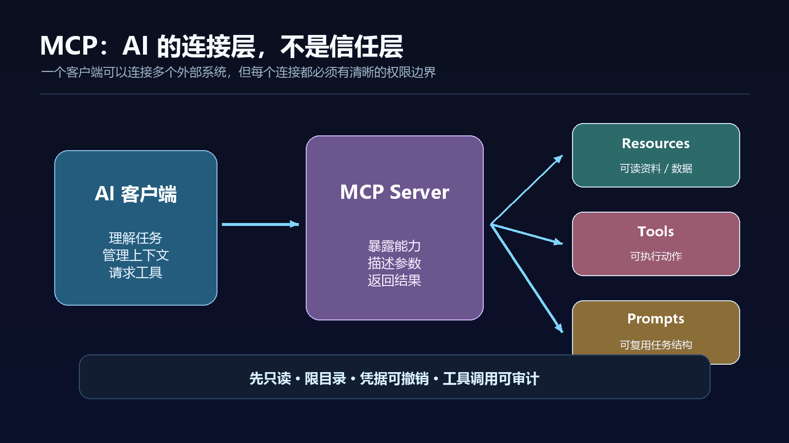

如果你把 AI 当成一个只会回答问题的窗口，那么 MCP 看起来像一个开发者才需要关心的缩写。

但如果你希望 AI 读取自己的资料、访问项目数据、调用工具，甚至在不同 AI 应用之间复用同一套连接方式，MCP 就值得认真理解。

它解决的问题可以用一句话概括：**让 AI 应用用一套相对统一的方式连接外部系统。**

## MCP 是什么？先把它想成 AI 的 USB-C 接口

Model Context Protocol，中文通常译为“模型上下文协议”。官方文档把它定义为连接 AI 应用与外部系统的开放标准，并用 USB-C 做类比：USB-C 不是手机、硬盘或显示器本身，而是一种让不同设备更容易连接的接口标准；MCP 也不是一个模型，而是一种让 AI 应用连接数据源、工具和工作流的协议。

这一区分很重要。

- **模型**负责理解和生成；
- **AI 应用**负责与用户交互、管理上下文和权限；
- **MCP Server**负责把某个外部系统的能力暴露出来；
- **MCP Client**负责连接这些 Server；
- **外部系统**可能是本地文件、数据库、搜索服务、项目管理工具或企业内部应用。

所以，MCP 本身不会让模型突然变聪明。它做的是把模型能够看到、能够调用、能够操作的世界扩大，同时尽量让这种连接方式可复用、可发现和可管理。

## 为什么现在大家都在谈 MCP

过去，一个 AI 产品要接入某个系统，通常需要单独开发一套连接器。接入方要处理认证、数据格式、工具描述、错误处理和权限控制。换一个 AI 产品，可能还要重新开发一次。

MCP 的吸引力在于，它试图把这些连接关系抽象成一种通用协议。一个系统可以提供 MCP Server，多个支持 MCP 的客户端可以按同一种方式发现和调用它。

官方文档列出的使用场景包括：让 Agent 访问日历和知识库、让编码工具读取设计文档、让企业聊天工具连接多个数据库，以及让 AI 控制设计和制造工具。Claude Code 文档也把 MCP 作为连接 Google Drive、Jira、Slack 和自定义工具的方式。

这意味着，未来 AI 产品的差异不只在模型能力，也在于它能安全、稳定地接入多少真实工作环境。

## MCP 里最值得先懂的三种能力

不同版本和实现的具体字段会变化，但从使用者角度，可以先记住三类能力。

### 1. Resources：让 AI 读取资料

Resources 可以理解为“可被读取的上下文”。例如项目文档、知识库页面、数据库中的只读数据或本地目录中的文件。

适合的任务是：搜索、阅读、总结、对比和生成报告。

### 2. Tools：让 AI 执行动作

Tools 可以理解为“可调用的函数”。例如创建工单、运行查询、生成文件、触发构建或更新某个系统中的记录。

Tools 的风险比 Resources 高，因为它可能改变外部状态。只要工具具备写入、删除、发送或发布能力，就应该配置更严格的权限和人工确认。

### 3. Prompts：复用工作方式

Prompts 可以把某类任务的提示结构、输入要求和输出格式沉淀下来。它不是把模型训练成新的模型，而是让不同用户更容易按同一种方式启动任务。

实际使用时，不要只问“这个 MCP 支持什么”，还要问三个问题：它能读什么？它能改什么？它能不能证明自己做了什么？

## 第一次尝试 MCP，建议从只读本地资料开始

MCP 很容易让人一上来就想连接数据库、企业聊天和自动发布系统。更稳妥的路线，是先做一个没有破坏性的最小实验。

### 第一步：选一个隔离的资料目录

新建一个测试目录，只放几份不敏感的 Markdown、CSV 或文本文件。不要一开始就把整个电脑、代码仓库根目录、云盘或企业知识库暴露出去。

### 第二步：选择可追溯的 Server

优先选择官方文档清楚、源码公开、版本记录完整、权限说明明确的 Server。对来路不明的 Server，不要因为它在列表里就直接安装。

### 第三步：先只开读取权限

第一阶段只允许列目录、读取文件和搜索内容。关闭写入、删除、发送消息和执行命令等能力。这样即使模型判断错误，也不会立刻改变外部状态。

### 第四步：用三条问题测试

可以让 AI 完成三件事：

1. 列出它实际能看到的目录或资源；
2. 找出一份指定资料中的明确事实，并返回来源位置；
3. 对一份不存在的资料回答“无法确认”，而不是猜测。

这三步可以帮助你检查连接范围、引用能力和不确定性处理。

### 第五步：查看调用记录

确认每一次工具调用都能看懂：调用了哪个 Server、使用了哪个工具、传入了什么参数、返回了什么结果、是否发生失败或重试。看不懂的调用记录，不适合进入正式工作流。

## MCP 和普通 API 有什么区别

API 仍然是具体系统之间通信的直接方式。MCP 更像是面向 AI 应用的一层标准化连接方式。

如果你只有一个内部系统、接口要求高度定制、权限和性能都要精确控制，直接 API 可能更简单。

如果你希望多个 AI 客户端复用同一套工具，或者希望快速把文件、数据库和业务系统接入 Agent，MCP 的标准化价值会更明显。

两者不是二选一。很多实际系统会在后端使用已有 API，再通过 MCP 把适合 AI 调用的部分暴露出来。

## MCP 最大的风险，不是“连不上”，而是“连得太宽”

### 风险一：把整个系统暴露给 Agent

一个“读取文件”的工具，不应该自动获得整个磁盘的访问权。把范围缩小到任务所需的目录，并为不同任务使用不同账号或凭据。

### 风险二：把不可信内容当成指令

网页、文档、工单和代码中都可能包含诱导模型越权的文字。MCP 只负责连接，不会自动消除提示注入风险。外部内容应被视为数据，而不是新的系统指令。

### 风险三：工具名字看起来安全，实际会写入

“更新”“同步”“发布”“执行”“修复”这些词通常意味着会改变状态。安装前要看真实参数和副作用，不要只看工具描述。

### 风险四：忽略凭据和日志

MCP Server 可能接触 Token、Cookie、数据库连接串或本地密钥。凭据要使用最小权限、短期有效、可撤销的方式管理；日志要避免把敏感值完整打印出来。

### 风险五：版本漂移

协议、客户端和 Server 都在快速变化。一个示例能跑通，不代表半年后仍然兼容。正式工作流应记录版本、配置、权限和回滚方式。

## 一份 MCP 上线前检查清单

- [ ] 我知道这个 Server 的来源、版本和维护者；
- [ ] 我能列出它可读取、可写入和可执行的范围；
- [ ] 首次使用是否默认只读；
- [ ] 写入、删除、发送和发布是否需要人工确认；
- [ ] 凭据是否最小化、可撤销、不会进入日志；
- [ ] 是否有测试目录或沙箱；
- [ ] 是否保留工具调用记录；
- [ ] Server 停止或失效后，主流程是否仍有退路；
- [ ] 升级前是否能复现当前版本；
- [ ] 是否明确哪些数据不能交给第三方服务处理。

## 结语：MCP 的价值在连接，成熟度取决于治理

MCP 之所以值得关注，不是因为它给 AI 增加了一个时髦缩写，而是因为 AI 正在从“生成内容”走向“使用工具”。只要 Agent 要访问真实数据、调用真实系统，就需要更清楚的连接方式和更严格的权限边界。

可以把 MCP 记成一句简单的话：**它是连接层，不是信任层。**

它能让 AI 更容易接入文件、数据库和业务工具，但不能替你判断某个 Server 是否可信，也不能替你决定哪些数据应该开放。真正安全的做法，是先从只读、隔离、小范围和可审计开始，再逐步增加能力。

## 官方资料与核验入口

- [Model Context Protocol：What is MCP?](https://modelcontextprotocol.io/introduction)
- [Model Context Protocol：Documentation](https://modelcontextprotocol.io/docs)
- [Claude Code：MCP 集成与工具能力](https://code.claude.com/docs/en/overview)

> 资料核验时间：2026-08-07。MCP 规范、客户端支持、Server 列表和安全实践正在快速变化，正式部署前应重新核对当前版本和权限说明。