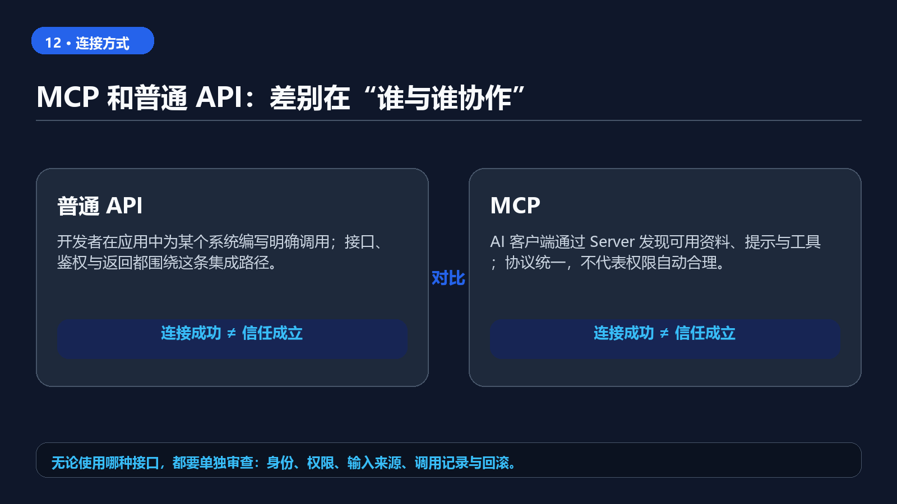

12. MCP 是什么：AI 为什么需要一个 USB-C 接口

> 你刚把一个“能读文件、能建任务、能发消息”的 MCP Server 接进 AI，下一秒才想到：它看到的是不是整个硬盘？它创建的任务会不会直接通知同事？很多人第一次接触 MCP，兴奋只持续到这里，后背才开始发凉。

MCP 的价值不神秘：它让支持它的 AI 应用能用相对统一的方式连接资料和工具。可它不是“接上就安全”的万能插座。对新手最重要的一句是：**MCP 负责把能力接进来，权限和验收仍然要由你守住。**


> **可以转发的一句话：MCP 是连接层，不是信任层；接得越多，越要先缩小权限。**

## 一、先用生活语言说清：MCP 到底解决了什么

没有 MCP 时，一个 AI 应用若想读取你的知识库、访问项目管理工具或调用某个内部服务，往往需要各做一套连接方式。换一个 AI 客户端，可能又要重新接一遍。

MCP（Model Context Protocol）是一套开放协议。官方用 USB-C 做类比：它不是手机、硬盘或显示器本身，而是一种让设备更容易连接的接口标准。对应到 AI：

- **AI 应用（Host）**：你实际打开的桌面客户端、IDE 或聊天工具；
- **Client**：应用里负责建立 MCP 连接的组件；
- **MCP Server**：把某个系统的能力按 MCP 方式提供出来的服务；
- **外部系统**：本地资料、数据库、工单系统、搜索服务等真正存放数据或执行动作的地方。

所以 MCP 不会让模型突然更聪明。它改变的是：AI 能在被允许的范围内**读什么、调用什么、把结果交回哪里**。

## 二、先分清三种能力：读资料、做动作、复用提示

官方协议里常见的三类能力，对新手可以这样理解：

1. **Resources（资源）**：给 AI 读取的资料，例如文档、目录、只读数据。
2. **Tools（工具）**：让 AI 执行动作，例如创建一条草稿工单、运行查询、生成文件。
3. **Prompts（提示模板）**：把常用工作方式做成可复用入口，例如“按项目规范审查代码”。

它们的风险并不一样。读一个公开文档，和删除一批文件、向外部系统写数据，绝不是同一级别。第一次体验时，优先选择 **Resources + 只读**；看到 Tool 也不要急着点同意。

## 三、15 分钟第一次体验：只让 AI 读一个测试资料夹

你不需要先接 GitHub、企业微信或生产数据库。新建一个 `mcp-demo` 文件夹，放三份无敏感信息的文本：

```text
mcp-demo/
├─ 产品说明.md
├─ 常见问题.md
└─ 更新记录.md
```

然后在你正在使用、且明确支持 MCP 的 AI 应用中，按它的官方“添加 Server / 连接 MCP”的步骤，选择一个**能限定为此目录、只提供读取能力**的本地文件 Server。不同客户端的配置文件、安装入口和授权弹窗不一样，别照搬其他产品的截图或命令。

连接后，先复制这三句测试：

```text
1. 只根据已连接的资料夹，列出三份文件分别讲什么。
2. “常见问题.md”里没有写的退款期限是什么？没有就直接说没有找到。
3. 不要修改、创建、删除文件；告诉我你这次是否调用过写入类工具。
```

**通过**：回答能说出文件名；资料里没有的内容不会编；明确没有调用写入类工具。
**不通过**：它混入了常识答案；读不到文件却假装读过；你无法判断它有没有写入。
这时先断开 Server，检查目录权限、Server 提供的能力清单和客户端日志，不要用“再试一次”掩盖问题。

## 四、能力清单不等于你该给的权限

一个 Server 可能同时列出读取、搜索、创建、更新、删除、发送等工具。看见它们，不等于全都要启用。

| 你的目标 | 第一次应给的能力 | 先不要给 |
| --- | --- | --- |
| 让 AI 总结资料 | 指定目录的只读读取 | 整盘访问、上传同步 |
| 让 AI 写一份任务草稿 | 创建草稿到测试空间 | 直接通知负责人、变更真实工单 |
| 让 AI 帮忙查数据 | 脱敏、只读查询 | 修改记录、导出整库 |

把权限想成家门钥匙：能进客厅，不代表能进保险柜；能看资料，不代表能把资料发出去。MCP 连接越方便，越要事先写清“可以到哪里、可以做什么、什么时候停”。



**图 2｜MCP 解决连接与发现问题；具体的授权、审计与操作确认仍由客户端、Server 与外部系统共同承担。**

## 五、把第一次连接写成一张任务卡

下次接任何 Server，都先填完这张卡，再点授权：

```text
Server 名称：
它连接的系统：
只允许读取的范围：
允许执行的动作：
明确禁止的动作：
哪些动作必须人工确认：
日志或记录在哪里看：
断开与撤销的方法：
```

尤其是最后两项。一个能断开、能回看记录的连接，才适合继续扩展。要是你找不到撤销入口，也无法判断它到底调用了什么，先不要接真实资料。

## 六、常见误解：别把“协议”误当成“产品安全承诺”

**“支持 MCP，所以一定安全。”** 不对。协议定义连接方式，具体安全仍取决于 Host、Client、Server、外部系统、凭据保存和你的授权方式。

**“装一个热门 Server 就行。”** 不对。热门不等于适合你的数据边界。优先看维护来源、代码或文档、权限说明、日志能力和撤销方式。

**“先把权限开满，后面再收。”** 风险最大。权限一旦被使用，后果未必能完全撤回。先从测试目录和只读能力开始，跑通后再一次只扩大一项能力。

## 七、今天做到这里就够了

如果你已经能让 AI 只读 `mcp-demo` 中的三份文件，并完成“读到、承认不知道、没有写入”三项测试，就完成了第一次 MCP 上手。

下一步再考虑接项目管理、代码仓库或业务系统。每次只新增一个 Server、一个低风险任务和一条验收记录。MCP 的意义，不是让 AI 一夜之间接管你的工具；而是让你能把连接关系做得**更清楚、更可控、更容易复用**。

### 资料与核验

- [Model Context Protocol：入门说明](https://modelcontextprotocol.io/docs/getting-started/intro)
- [Model Context Protocol：架构说明](https://modelcontextprotocol.io/docs/learn/architecture)
- [Model Context Protocol：规范](https://modelcontextprotocol.io/specification/2025-06-18)

本文按 2026-08-14 可访问的 MCP 官方资料复核。不同 Host 和 Server 对能力、配置、授权弹窗、日志与确认机制的实现不同；真实系统接入前，请回到所用客户端和 Server 的当前官方文档核对。
