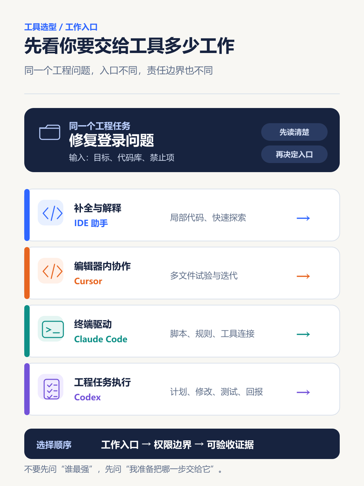
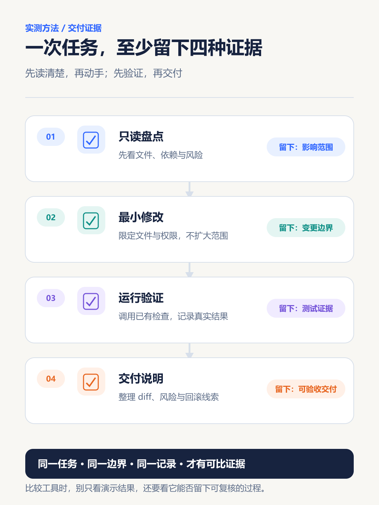

13. AI 编程工具对比：Codex、Claude Code、Copilot、Cursor、CodeBuddy、Trae 怎么选

> 周五傍晚，Bug 还挂在测试里。你已经开了三个 AI 编程工具的官网：一个让你装 CLI，一个让你在 IDE 里点对话，一个说能直接把需求做成页面。你不是不会写代码，你只是突然不知道：这件事到底该交给谁，交出去以后又该从哪里把它接回来。

别急着问“哪款最强”。对第一次接触 AI 编程的人，最有用的不是一张参数大表，而是先分清：**你平时从哪里开始工作、想让 AI 帮到哪一步、能不能看懂并验收它的修改。**

本文不做排行榜。Codex、Claude Code、GitHub Copilot、Cursor、CodeBuddy、Trae 都能参与编码，但产品形态和主要入口不同；QCode 更接近第三方模型接入/订阅服务，不适合和 IDE 直接打分。版本、地区、套餐、模型和数据策略变化很快，长期使用或付费前以各产品当天的官方页面为准。



> **可以转发的一句话：选 AI 编程工具，不是选“最会写”的，而是选“出错后你最能接手”的。**

**先看结论｜按你今天的起点选第一款，不必把六款都装上。**

| 如果你现在最常做的是 | 第一优先试用 | 20 分钟后应该得到什么 |
| --- | --- | --- |
| 围着 Issue、分支和 Pull Request 协作 | GitHub Copilot | 一份能进入现有审查流程的小改动 |
| 在终端里跑命令、看测试和处理 Git | Claude Code | 一张“将执行哪些命令、改哪些文件”的清单 |
| 能把任务范围和验收条件说清楚 | Codex | 一份含计划、diff、检查结果和未解决项的小交付 |
| 改页面、原型或局部组件，想边看边调 | Cursor | 一个限定目录内、可启动或可验证的改动 |
| 想在熟悉的 IDE、插件或 CLI 里低迁移成本试用 | CodeBuddy | 一次不丢上下文、能说明改动与测试的尝试 |
| 想从 AI IDE 入口推进小原型或功能 | Trae | 一条“需求—修改—查看结果—继续调整”的闭环 |

QCode 这类模型接入或订阅服务，先单独比较模型选择、数据边界、费用和退出方式；不要把它与 IDE/CLI 的改码体验硬放在同一张排行榜里。

## 第一部分｜先别追“最强”：先看工具在你工作流里负责什么

这一部分只解决一个问题：**你从哪里开始工作，工具应该接住哪一段。**先按工作入口缩小候选范围，再看每个工具具体能把什么任务带进小闭环；不要同时安装六款工具。

### 1. 先按你的工作入口缩小选择

| 你最常见的起点 | 先试哪个 | 它给你的主要价值 | 第一次别做什么 |
| --- | --- | --- | --- |
| VS Code / GitHub Issue / Pull Request | GitHub Copilot | 少在代码、Issue 和审查之间切窗口 | 直接让它合并或发布 |
| 终端、测试脚本、Git 命令 | Claude Code | 用自然语言串起项目规则、命令与改动 | 给生产环境命令权限 |
| 一张边界清楚的工程任务卡 | Codex | 把“读项目—改代码—跑检查—报告”交成一个小闭环 | 把模糊的大需求整个丢过去 |
| 做页面、原型、局部重构，想边改边看 | Cursor | 在编辑器中快速查看上下文、diff 和运行结果 | 还没限定目录就让它大改 |
| 想在 IDE、插件、CLI 中选国内开发入口 | CodeBuddy | 根据既有工作流选择 IDE、插件或命令行形态 | 默认三种入口体验完全一样 |
| 想以 AI IDE / AI 开发入口推进原型或功能 | Trae | 更强调由 AI 理解任务、修改项目并继续迭代 | 只盯最后页面、不看中间改动 |

如果你是纯新手，先选与你现在最接近的一项。**不要同时安装六款工具。** 真正的比较来自同一份小任务，而不是产品宣传页。

### 2. 六个工具各自值在哪里：先知道“为什么用”，再谈功能

#### 1. Codex：适合把一件小工程任务交代完整

Codex 的价值是把任务从一句“帮我修 Bug”，变成可跟踪的小交付：先读仓库、给计划、在允许范围内修改、运行检查、说明结果。它适合你已经能说清问题、允许改哪些文件、怎么验收的场景。

**新手第一次用**：选一个可恢复的练习仓库，只让它改一个组件或一处测试。不要让它碰 `.env`、部署配置、数据库迁移或真实凭据。

#### 2. Claude Code：适合终端就是主工作台的人

Claude Code 的官方文档将它定位为可在终端中理解代码库、编辑文件、执行命令和使用开发工具的编码代理。它的好处不是“多一个聊天框”，而是你本来就在终端做的查看状态、跑测试、改脚本可以放在同一条链路里。

**新手第一次用**：让它先读 `README` 和测试脚本，列出“准备执行哪些命令”；你确认后，只处理一个 lint 或测试失败。终端里跑得快，不代表可以跳过确认。

#### 3. GitHub Copilot：适合 GitHub 协作已经成习惯的人

GitHub Copilot 的核心价值是嵌进常用的 GitHub 和编辑器工作流，帮助写代码、解释、建议修改并协助审查。团队已有 Issue、分支、Pull Request、测试和代码审查习惯时，它更容易减少来回沟通。

**新手第一次用**：从一个已有 Issue 开始，让它先总结问题和建议改动，再让它在分支上完成小修改。重点看生成的改动能否自然进入你的审查流程，而不是补全速度。

#### 4. Cursor：适合边改边看的可视化迭代

Cursor 的价值在于把上下文、文件修改、diff、终端与连续对话放到编辑器内。做前端页面、原型和局部重构时，你能一边看实际效果，一边让它继续调整。

**新手第一次用**：只选一个独立页面或组件，明确“只允许修改这个目录”。每完成一步就看 diff、启动页面或跑对应测试；别为了追求一次成型，让它改散整个项目。

#### 5. CodeBuddy：适合先按习惯选择 IDE、插件或 CLI

腾讯云官方把 CodeBuddy 提供为 IDE、编辑器插件与 CodeBuddy Code（CLI）等入口，并提供代码补全、对话、工程理解、测试与评审等能力。它的现实价值是：如果你已经在 VS Code、JetBrains 或命令行中工作，可以先用最少迁移成本的入口试一遍。

**新手第一次用**：拿同一个无敏感 Bug，分别在编辑器入口和 CLI 入口走一遍。记录两件事：上下文有没有丢、它有没有把改动和测试说清楚。选择让你少切换、少返工的那一个。

#### 6. Trae：适合想让 AI 成为主要开发入口的人

Trae 的官方产品资料强调 AI 驱动的开发体验，适合将需求、原型、实现和迭代放在一个 AI 开发入口里推进。它对页面原型、小功能和小型项目会比较直观：先描述要做什么，再让它读项目、提出方案、改代码和继续修正。

**新手第一次用**：做一个独立的“联系表单”或“待办页”，规定允许修改的目录、必须运行的检查和完成标准。页面出现不等于任务完成；还要看改了哪些文件、能否运行、是否有遗留问题。

> **名称边界**：如果你说的 “Qcode” 指的是 QCode 订阅/接入服务，它不是独立 AI IDE；如果实际想问的是 Qoder 等其他同名或近似产品，需单独按其官方资料核对，不要混写。

## 第二部分｜新手 20 分钟做一次同题试用

把比较从宣传页拉回你自己的项目：同一份小任务、同一组边界、同一套验收记录，才会让差异真正显现。

这 20 分钟不是为了评出“冠军”，而是为了留下一个可比较的结果：**它有没有先理解、有没有越界、有没有验证、你能不能接手。** 四项里前三项过关，才值得把同一任务交给下一款工具。

新手不必立刻订阅。创建一个练习项目：一个登录表单或待办页、一个明确报错、已有测试或至少能启动的页面。先提交一次 Git，确保随时能撤回。

把下面任务卡交给你要试的工具；对 QCode 这类服务，只验证登录、模型接入、数据边界和退出方式，不把它与 IDE 的改码效果混算。

```text
任务：修复“提交空邮箱时仍显示成功”的问题。

范围：只允许修改 src/components/LoginForm.* 和对应测试文件。
禁止：不改 .env、部署配置、数据库、依赖版本；不访问生产环境；不上传真实密钥。
过程：先说明你读了哪些文件、准备怎么改；得到确认后再写入。
验收：空邮箱提交时显示错误提示；正常邮箱仍能提交；运行项目已有的测试或启动检查。
交付：列出变更文件、实际执行的命令及结果、仍未解决的问题、回滚线索。
```



**图 2｜同一任务、同一边界、同一验收，工具比较才不会变成凭印象投票。**

完成后不要急着看“生成了多少代码”，只记四项：

1. 有没有先读懂相关文件，而不是直接猜；
2. 改动有没有超出你允许的范围；
3. 有没有真的跑检查，并如实报告失败；
4. 明天同样的问题再来一次，你愿不愿意继续用它。

把观察填进这张同题结果卡。它记录的是你的真实过程，不是本文替你宣称的实测排名：

| 观察项 | 你要留下的证据 | 可接受信号 | 暂停信号 |
| --- | --- | --- | --- |
| 理解任务 | 它读过的文件、问题与计划 | 能复述范围，并先提出不确定点 | 还没读文件就直接改 |
| 修改边界 | 变更文件和 diff | 只动了允许目录与测试 | 改到配置、依赖或无关模块 |
| 验证动作 | 实际执行的命令和输出 | 如实说明通过、失败或未执行 | 只说“已完成”，不给记录 |
| 交接成本 | 变更说明、风险和回滚线索 | 明天的你能看懂并继续 | 只能依赖它重新解释一遍 |

四项中有两项让你不放心，就先别付费、别开放更多权限。

### 2. 第一次使用最常见的三种翻车

**把大需求丢给它。** “做一个完整后台”没有边界，工具只能猜。先拆成一个页面、一个接口、一个错误提示或一条测试。

**只看最终界面。** 界面能跑不代表代码可靠。必须看 diff、查看它动过的文件、运行测试或至少手动走一次关键路径。

**把真实项目当试验田。** 第一次别提交客户代码、Token、生产日志或线上配置。用副本、练习仓库或分支试；能恢复，比“快速见效”更重要。

## 第三部分｜决定长期使用前，先把验收和复盘留下来

工具能不能长期留在工作流里，不只取决于它生成得快不快，更取决于你能否看懂、验证并接手它留下的改动。

### 1. 付费前的判断：不是“功能多不多”，是“工作流顺不顺”

问自己五个问题：

1. 我大部分时间是在 IDE、终端、GitHub 还是网页里工作？
2. 我需要的是代码补全、对话修改，还是一项可验收的工程任务？
3. 它在哪里运行，代码、日志和凭据会经过哪里？
4. 改动能否进入现有的分支、测试、Pull Request 和审查流程？
5. 一旦结果不对，我能否看 diff、撤回修改、自己接手？

选型的终点不是让工具显得更聪明，而是让你完成真实工作时**少一次返工、少一次切换、少一次不敢提交**。

### 2. 今天只完成这一件事

挑一个工具，跑完上面的登录表单任务卡，保留一份“变更文件 + 测试结果 + 未解决项”的记录。第二天再用同一任务试第二个工具。

你最终留下的那款，未必是功能列表最长的，却应该是：你看得懂它做了什么，出问题能自己接手，而且愿意让它继续帮你做下一件小事的工具。

### 3. 先别上手 Agent 的三种情况

- 你还无法在本地跑起一个最小项目，或没有任何可恢复的练习仓库；先补一个小项目和一次 Git 提交。
- 你暂时看不懂 diff，也没有同事能帮你复核；先把工具限制在解释代码、生成测试思路和只读盘点。
- 任务必须接触客户代码、生产凭据、线上配置或不可回滚的数据；先完成组织的权限与数据评估，不要拿真实环境做第一次试用。

**能安全停下来，也是一种选择能力。**把本文的同题任务卡和结果卡发给需要选工具的同事，比转发一张“谁最强”的榜单更有用。

### 资料与核验

- [OpenAI Codex 官方页面](https://openai.com/codex/)
- [Claude Code 官方文档](https://docs.anthropic.com/en/docs/claude-code/overview)
- [GitHub Copilot 官方文档](https://docs.github.com/en/copilot)
- [Cursor 官方文档](https://docs.cursor.com/)
- [腾讯云 CodeBuddy 官方页面](https://www.codebuddy.ai/)
- [Trae 官方页面](https://www.trae.ai/)

本文按 2026-08-14 可访问的官方资料核对产品定位与主要入口。产品功能、地区可用性、套餐、模型、数据策略和界面可能变化；购买、团队接入或上传代码前，请以对应产品当前官方文档、服务条款和组织安全要求为准。
