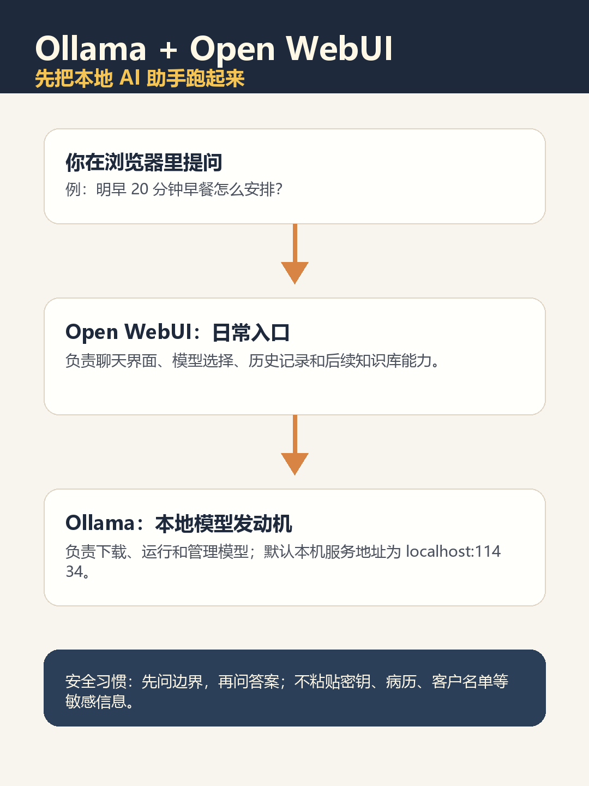
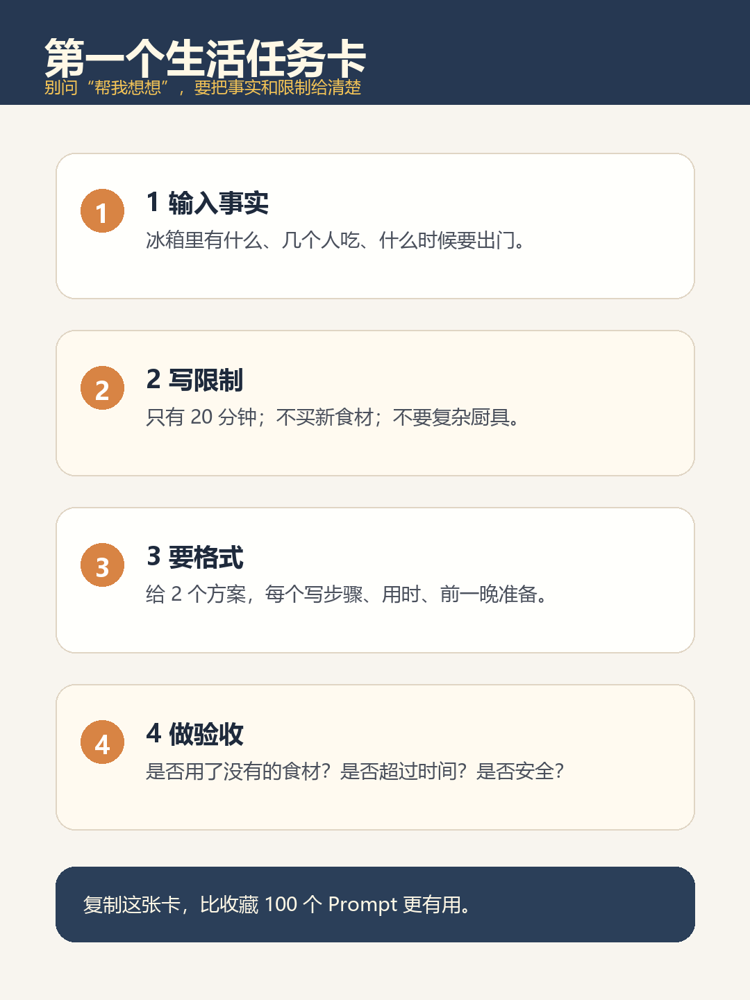

14. Ollama + Open WebUI 新手教程：先把“本地 AI 助手”跑起来

> 晚上十一点，你只是想问一句：冰箱里有鸡蛋、青菜和挂面，明早七点半要出门，怎么做一顿不手忙脚乱的早餐？可你又不太想把家里的行程、照片和聊天记录全交给一个陌生的云端窗口。

本地 AI 的吸引力，就在这种小事上：在自己的电脑上打开一个入口，问它、改它、留下一份可复用的清单。本文不承诺“完全离线”或“绝对隐私”，只带你跑通第一个低风险闭环：**Ollama 负责在本机运行模型，Open WebUI 负责提供浏览器里的聊天入口。**



> **可以转发的一句话：本地 AI 的第一价值，不是替你做大事，而是让一件小事不用把全部生活资料交出去。**

## 一、先判断你需不需要它：它能帮什么，不能替什么

Ollama 是本地模型运行工具：它帮助你下载、运行和管理模型，也提供本机 API。Open WebUI 是可自托管的网页界面：它让你在浏览器中选择模型、对话、保存记录，并可在后续扩展知识库等能力。

它适合先做：菜单和出门清单、邮件初稿、会议笔记整理、对公开资料的总结。它不适合替代医生、律师、投资顾问，也不该在第一天就装插件、开公网、导入证件、病历、客户资料、密钥或未脱敏日志。

**注意“本地”有边界**：模型可以在本机运行，但你接入外部 API、联网搜索、第三方插件、同步盘，或把 Open WebUI 暴露到局域网/公网后，数据路径都会改变。先把它当成一个小助手，不要当作绝对隐私保险箱。

## 二、安装前准备：先过三道门

1. **电脑资源**：8GB 内存可以试小模型但可能较慢；16GB 内存通常更从容。显卡不是必需，但会影响速度。先从小模型开始，不要上来下载几十 GB。
2. **软件环境**：按本文主路线，你需要 Ollama 和 Docker Desktop；Windows 上 Docker Desktop 可能要求 WSL。Docker 没准备好时，先完成 Ollama 单独聊天也完全可以。
3. **测试资料**：第一次只用生活类或公开内容，不用真实敏感资料。

可从 Ollama Library 中按当前可用模型挑一个较小型号。本文用 `qwen3:4b` 举例；若你电脑资源紧张，也可在官方模型库中选择当日可用的更小模型。模型大小、显存/内存需求和表现会随版本不同而变化。

## 三、第一步：安装 Ollama，并确认本机模型能说话

到 Ollama 官方下载页选择系统安装包。Windows 用户如愿意执行官方联网安装脚本，可在 PowerShell 使用：

```powershell
irm https://ollama.com/install.ps1 | iex
```

不习惯运行联网脚本，就直接用官网安装包。安装完成后打开 PowerShell：

```powershell
ollama --version
ollama run qwen3:4b
```

第一次运行会下载模型。看到对话提示后，复制这段做第一次测试：

```text
请只根据下面的食材，给我两个 20 分钟内完成的早餐方案：
鸡蛋 4 个、青菜一把、挂面、牛奶、苹果。
每个方案要有步骤、用时和前一晚可准备的事项。
不要推荐我没有的食材；不确定的地方请标出来。
```

**成功信号**：终端能返回方案，且没有虚构你没提供的食材。
**失败时先看**：`ollama --version` 是否有输出、模型名是否仍可在官方模型库找到、下载是否完成、电脑内存是否被其他程序占满。

想确认本地服务是否启动，可执行：

```powershell
curl http://localhost:11434/api/tags
```

能返回已安装模型列表，说明 Ollama 的本地 API 可访问。

## 四、第二步：用 Docker 启动 Open WebUI

启动 Docker Desktop 后，在 PowerShell 运行官方 Quick Start 所示思路的 Docker 命令（不同平台与版本以官方页面为准）：

```powershell
docker run -d `
  -p 3000:8080 `
  --add-host=host.docker.internal:host-gateway `
  -v open-webui:/app/backend/data `
  --name open-webui `
  --restart always `
  ghcr.io/open-webui/open-webui:main
```

这几项新手只要理解三件事：

- `-p 3000:8080`：浏览器访问 `http://localhost:3000`；
- `-v open-webui:/app/backend/data`：保存聊天与配置，避免重建容器后直接丢失；
- `--add-host=host.docker.internal:host-gateway`：让容器可以找到本机的 Ollama 服务。

打开 `http://localhost:3000`，按界面创建本地账号，并在模型选择处寻找刚刚安装的模型。**看到界面但没有模型**，不代表失败：先回到终端执行 `ollama list`，再核对 Open WebUI 的 Ollama 连接地址是否指向本机服务。

> `:main`、`:latest` 等镜像标签可能跟随项目更新，不等同于固定稳定版。家庭长期使用前，请回到 Open WebUI 当前官方文档确认推荐标签、升级方式与备份方案；不要把旧博客中的版本号当成永久答案。

## 五、第三步：在网页里完成一件你今晚真会用的小事

进入 Open WebUI 后，先选中本地模型，再把刚才的早餐任务复制进去。接着追加一句：

```text
请把答案分成三块：确定来自我提供信息的内容、你的推断、需要我补充的信息。
```

这一步很关键。你不是在测试它会不会“说得漂亮”，而是在练习分辨：哪些是事实，哪些是它的建议。

再做一个工作生活里常见、风险较低的练习：

```text
请帮我把下面的话改成一封自然、礼貌、不卑微的请假邮件。
背景：孩子在 2026-08-14 上午需要复查，我想请半天假。
要求：不透露具体病情；说明我会提前交接待办；不要使用生硬套话。
原文：明天上午有点事，请假半天。
```



**图 2｜问得更清楚，不是“会提示词”，而是把已有事实、限制和想要的交付说完整。**

## 六、常见卡点：按顺序排，不要盲目重装

| 现象 | 先做什么 | 不要急着做什么 |
| --- | --- | --- |
| `localhost:3000` 打不开 | 执行 `docker ps`、`docker logs open-webui` | 一上来删除数据卷重装 |
| Open WebUI 看不到模型 | 执行 `ollama list`，核对本机服务与连接地址 | 反复下载多个大模型 |
| 回答很慢 | 换小模型、关闭占内存程序、缩短一次任务 | 认定安装一定出错 |
| 回答像真的却不可靠 | 要求区分事实、推断、待确认项，并自己核对 | 把它当专业结论 |
| 想给家人或同事用 | 先评估账号、聊天记录、端口和访问范围 | 直接暴露到公网 |

如果端口 `3000` 被占用，可将 `-p 3000:8080` 改为另一个本机端口，例如 `-p 3001:8080`，再访问 `http://localhost:3001`。更改前确认该端口没有被你需要的服务占用。

## 七、今天的终点不是“搭系统”，是留下一个可复用模板

做到下面四项，就可以先停：

- `ollama list` 能看到一个模型；
- 浏览器能打开 Open WebUI；
- 能在网页里选中本地模型并完成一次早餐/邮件任务；
- 你保留了一条“事实 / 推断 / 待确认”分开的回答。

下一次再考虑知识库、联网搜索或多人协作。第一天只要让它帮你把一件小事理顺，你就已经拥有一个真正能继续练习的本地 AI 入口。

### 资料与核验

- [Ollama Quickstart](https://docs.ollama.com/quickstart)
- [Ollama API 文档](https://docs.ollama.com/api)
- [Ollama 模型库](https://ollama.com/library)
- [Open WebUI 官方 Quick Start](https://docs.openwebui.com/getting-started/quick-start/)
- [Open WebUI GitHub README](https://github.com/open-webui/open-webui)

本文按 2026-08-14 可访问的官方文档复核主路线。安装包、镜像标签、模型名称、端口与界面会变化；正式操作前请以 Ollama 和 Open WebUI 的当前官方说明为准。文中配图为原创信息图，不冒充官方界面；若发布实操截图，应使用作者自建环境并遮挡用户名、本机路径和敏感信息。
