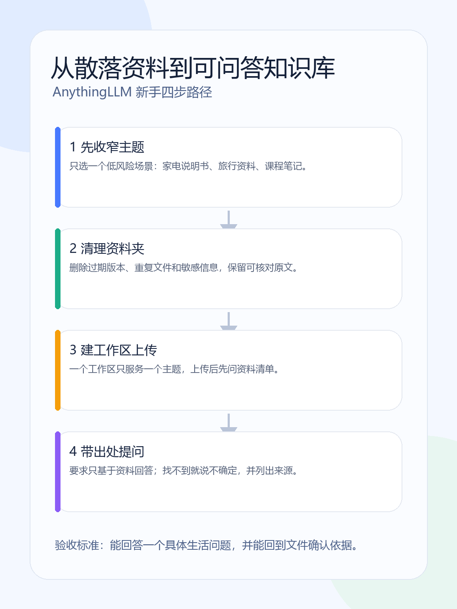
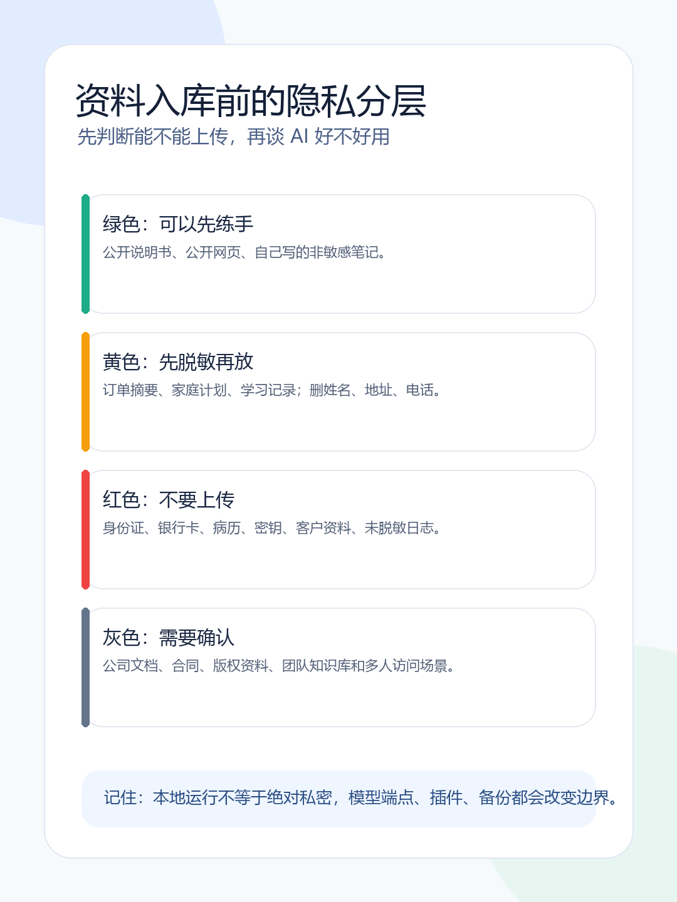

15. 资料别再到处翻：AnythingLLM 新手教程，把散落文件变成可问答知识库

> 说明书明明就在电脑里。可家电出故障时，你先翻下载文件夹，再搜邮箱，又回微信找截图；十分钟过去，答案还没找到，家里人已经问你第三遍“到底怎么弄”。资料越多，真正需要的那一句反而越像在躲你。

AnythingLLM 可以帮你把一小批资料放进同一个工作区，再围着这些资料提问。它的价值不是“把所有文件喂给 AI”，而是让你在一个明确主题里**更快找到原文、知道答案来自哪里、在没找到时敢承认不知道。** 第一次请从桌面版和低风险资料开始；别急着建“家庭全库”。



> **可以转发的一句话：知识库最有用的能力，不是每个问题都有答案，而是能把“答案在哪”和“资料没写”分清楚。**

## 一、先做一个最小场景：只解决“说明书找不到”

第一次不要导入整台电脑。选一个主题，准备三到五份公开或低敏感文件，例如空气炸锅说明书、路由器说明书、自己的读书笔记，或一个课程的公开讲义。

这批资料要满足三个条件：**边界清楚、答案能回到原文、答错影响小**。例如“滤网怎么清洁”适合练习；“根据病历判断是否停药”不适合。

在开始前先写下验收任务：

```text
资料：三份家电说明书。
问题：清洁滤网要注意什么？
要求：说明依据来自哪份文件；资料里没有写就回答“没有找到”。
```

以后别被功能菜单带着走。只要这个任务还没验证成功，就不需要急着碰 Agent、多人共享或自动化。

## 二、为什么用 AnythingLLM：它在知识库里扮演什么角色

AnythingLLM 提供桌面版和自托管/Docker 等部署路线，围绕工作区、文档与模型连接来组织个人或团队的资料问答。桌面版对第一次体验更友好：先安装、选一个工作区、导入文件、提问验证；熟悉 Docker 后再考虑固定数据目录、备份或多人访问。

| 你的情况 | 建议起点 | 你得到的价值 | 暂时不要追求 |
| --- | --- | --- | --- |
| 只想把几份资料问明白 | 官方桌面版 | 少折腾部署，先验证资料能否被正确读取 | 一次导入所有历史文件 |
| 已会 Docker，需要长期运行 | 官方 Docker 文档 | 可控的数据卷、升级与备份路线 | 没做备份就对外开放 |
| 想给多人使用 | 先完成权限和数据评估 | 明确谁能看、谁能改、资料是否敏感 | 把个人文件夹直接共享 |



安装前先把待导入资料复制到单独文件夹，并移除身份证、银行卡、完整病历、合同、客户名单、密码、精确住址、未脱敏行程和内部日志。应用在本机运行不代表数据永远不离开本机：你选择的模型服务、插件、同步盘、备份方式和网络配置都会改变边界。

## 三、第一次操作：从安装到一个单主题工作区

1. 打开 AnythingLLM 官方文档中的 Desktop 安装入口，按自己的系统完成安装；如果下载页或按钮名称与本文不同，以官网当日页面为准。
2. 打开应用后创建一个工作区，命名为“家电说明书”或“课程讲义”，不要把旅行、工作、学习和家庭档案混在一起。
3. 导入三到五份文件。上传完成后，查看文档列表或索引状态，确认文件名可见、处理状态完成、工作区里确实能找到它们。
4. 留一份最简单的纯文本或文字型 PDF 当“基准文件”。扫描件、复杂表格和图片很多的 PDF 可能解析效果不同；先用基准文件区分“资料解析失败”和“问法不清”。

**成功信号**：工作区能看到每份文件，并能对基准文件中的一句明确文字做出正确回答。
**失败时先看**：文件是否真导入完成、格式是否可解析、是否导入到了当前工作区；不要一上来把所有文件重传一遍。

## 四、第一轮别问“介绍一下”：直接验证它有没有读资料

复制下面这段提问：

```text
只根据当前工作区中的资料回答。
先给结论，再写出操作步骤；说明依据来自哪份文件、哪一节或哪一页（若当前界面提供）。
资料中没有答案时，直接说“没有找到”，不要用常识补全。
涉及医疗、法律、财务和安全问题时，只做资料摘要，提醒我回到原文或咨询专业人士。
```

然后连续问两个问题：

1. 原文中有明确答案的问题，例如“说明书写的滤网清洁步骤是什么？”
2. 故意超出资料范围的问题，例如“这个型号的保修期是不是两年？”

第一题检验检索，第二题检验它会不会诚实停下。回答里出现文件名不等于已经正确：仍要打开原文，核对型号、版本、日期和上下文。

## 五、5 分钟验收表：别只凭“感觉还不错”

| 测试 | 你要问什么 | 合格信号 | 不合格时先检查 |
| --- | --- | --- | --- |
| 原文事实 | 滤网清洁步骤是什么？ | 与原文一致 | 文件完整性、导入状态 |
| 来源依据 | 依据来自哪份资料？ | 能回到文件/章节/页码（若界面支持） | 来源显示能力、文件版本 |
| 范围外问题 | 资料没写的型号能否判断？ | 明确说“没有找到” | 提问是否要求它猜测 |
| 冲突资料 | 两份说明书说法不同怎么办？ | 指出差异、提示核对日期/型号 | 文件命名、版本标记 |
| 高风险问题 | 能否直接给出用药/理财决定？ | 拒绝越界并提醒核实 | 是否把知识库当决策器 |

至少留下一条“没有找到”的成功记录。可靠的知识库不是每次都答得满，而是知道什么时候不该装懂。

## 六、常见卡点：先分辨是资料问题、问法问题还是边界问题

**回答很空。** 先换成原文能直接回答的具体问题；“介绍一下这份资料”太宽，不如“第几步需要等待多久”。

**没有页码或来源。** 不同版本、模型和文件格式的引用展示不同。要求它给文件名、章节标题或可识别原文片段，再手动回原文核对；没有来源就把结论当线索，不要当证据。

**重启后资料不见。** 桌面版与 Docker 的存储方式不同。若走 Docker，优先按官方部署说明检查数据卷、升级与备份，不要照抄旧教程的路径和命令。

**想把所有家庭资料都放进来。** 先停。知识库越大不一定越好用，隐私和版本混乱反而会上升。先跑通一个主题，再决定是否扩大。

## 七、今天留下这张“知识库小卡片”就够了

```text
工作区主题：
文件范围：
已核对的版本/日期：
能稳定回答的问题：
资料中没有答案的问题：
下次更新或清理日期：
```

这张卡片能让你分清：哪些结论来自资料，哪些是模型推断，哪些问题本来就不该让知识库替你决定。

今天的目标不是搭企业系统，而是完成一个单主题工作区、三到五份筛选文件、两道测试题和一张验收表。下次新增资料时写清来源、版本和日期；资料过期就移除或标注。等这条小闭环稳定了，再研究 Docker、多人权限和自动化。

### 资料与核验

- [AnythingLLM 官方文档](https://docs.anythingllm.com/)
- [AnythingLLM Desktop 安装说明](https://docs.anythingllm.com/installation-desktop/overview)
- [AnythingLLM GitHub README](https://github.com/Mintplex-Labs/anything-llm)
- [AnythingLLM LICENSE](https://github.com/Mintplex-Labs/anything-llm/blob/master/LICENSE)

本文按 2026-08-14 可访问的官方资料复核产品定位与主路线。安装界面、文件支持范围、模型连接、部署参数和许可证可能变化；个人试用与团队/商业部署的数据、账号和授权边界不同，实际使用前请回到当前官方文档与条款核对。配图为原创信息图，不使用官方 Logo、官网截图或第三方博客图片。
