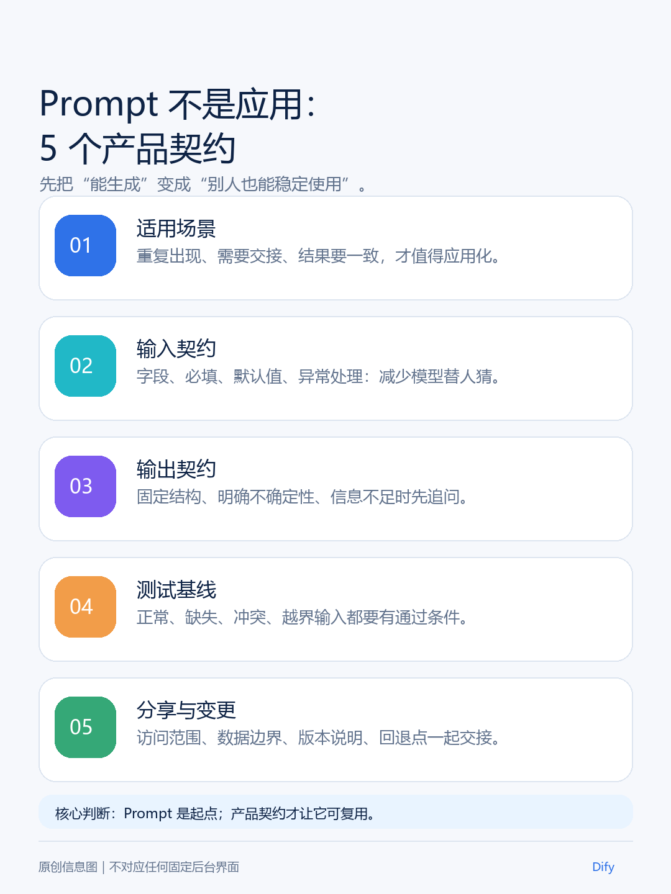
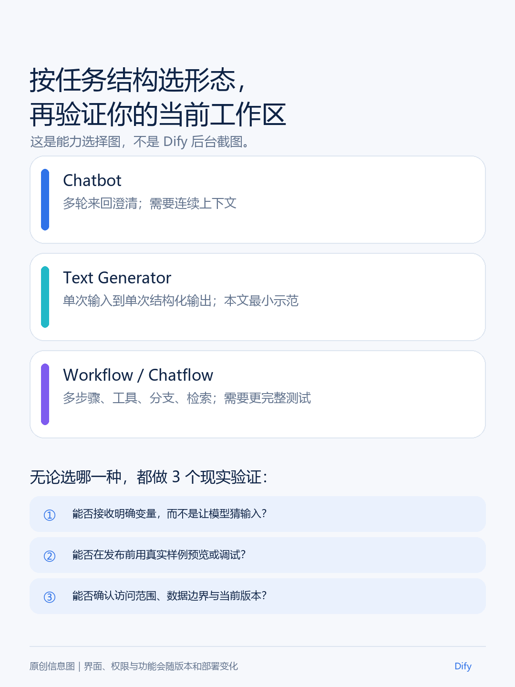
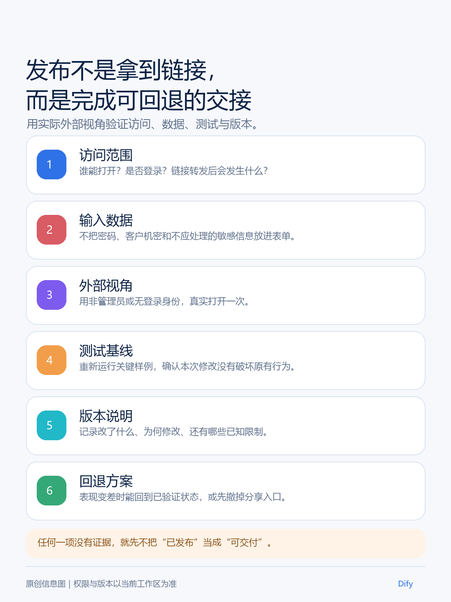

16. 别再复制粘贴 Prompt：Dify 新手教程，把 AI 点子做成可分享应用

你可能已经遇到过这个小麻烦：自己写的一段 Prompt，跑出来的结果很惊艳；发给同事之后，对方却连续追问——“第一格填什么？”“预算写总价还是人均？”“这个答案是实时的吗？”

你原本想省时间，最后却变成了人工客服。

问题通常不在 Prompt 不够长，而在于它还只是“你会用的一段话”，不是“别人拿来就能用的一项服务”。Dify 的价值，正是把一段藏在聊天框里的方法，变成有输入、有输出、能测试、能分享的 AI 应用。

这篇文章不带你把 Dify 的所有菜单逛一遍。我们只做一个小而完整的练习：做一个“周末旅行计划助手”。读完后，你应该能完成四件事：

- 知道什么样的 Prompt 值得做成应用；
- 在自己的 Dify 工作区里创建一个最小应用；
- 用正常、缺失和越界输入测试它；
- 发布前确认别人能不能看懂、能不能用、出了问题能不能撤回。



先记住一个判断：**Prompt 负责让模型生成，应用负责让别人稳定使用。**

## 一、先别急着创建：什么 Prompt 值得做成应用？

如果你只是偶尔问一次问题，每次背景都完全不同，继续把 Prompt 放在笔记里，可能更省心。Dify 真正有价值的场景，通常同时满足下面两点：

1. 这类任务会重复出现；
2. 你希望别人不用先读懂 Prompt，也能得到相近格式的结果。

再问自己三个问题：

- 用户是不是总要填写一组固定信息？
- 输出是不是需要保持相对稳定的结构？
- 你是不是准备把它交给同事、客户或社群成员使用？

如果至少有两个答案是“是”，就值得做一个最小应用。

旅行计划就是一个好练习。用户需要提供出发地、目的地、日期、预算和偏好，应用则交付行程概览、每日安排和需要确认的事项。至于票价、天气、营业时间和预订结果，不能因为模型说得像真的，就当成实时事实。

这也是新手最容易忽略的一层：你不是在做“一个会回答问题的机器人”，而是在定义一份小型工作约定——用户应该提供什么，应用应该交付什么，哪些事情必须停下来让人确认。

## 二、开始前准备：先把模型和入口准备好

你可以使用 Dify Cloud，也可以使用已经部署好的自托管 Dify。两者页面、套餐和可用能力可能不同，但第一次练习至少要准备好三件事：

- 一个可以进入的 Dify 工作区；
- 一个已经配置好的模型提供商或模型；
- 一组不包含身份证号、客户资料、密钥和内部文件的练习内容。

如果创建应用后无法生成结果，先不要怀疑 Prompt。先到当前页面的模型或模型提供商设置中确认：模型是否可用、凭据是否保存、当前账号是否有调用权限。外部模型调用还可能产生费用，具体以你的服务商和账号页面为准。

进入工作区后，找到“新建应用”或“从空白创建”入口。第一次不要从复杂工作流开始：我们只需要一条“填写信息—生成结果”的路径。

## 三、从 0 到 1：创建第一个旅行计划助手

### 1. 选择最简单的应用形态

如果任务是一次输入、一次生成，优先选择 **Text Generator** 或当前界面中对应的单轮文本生成应用。需要连续追问时，再考虑 Chatbot；需要多步骤、条件分支、知识检索或工具调用时，再考虑 Workflow / Chatflow。



页面名称可能因云端、自托管版本或套餐不同而变化。你不必执着于寻找旧教程里完全相同的按钮，只要确认当前应用能够接收变量、预览运行并在发布前测试即可。

### 2. 把“请详细描述”拆成五个输入框

创建应用后，添加下面五个变量。变量名可以按当前页面要求填写，建议使用简单、容易理解的中文或英文：

- **出发地**：从哪里出发；
- **目的地**：想去哪里；
- **日期**：哪几天出行，暂时不确定也可以说明；
- **预算**：人均还是总预算；
- **偏好**：亲子、拍照、少走路、想吃本地菜等。

输入框的提示语不要写成“请详细描述”。好的提示语会提前替用户减少一次猜测，例如：“预算请填写人均或总额；不确定请写‘待定’。”

### 3. 粘贴一份有边界的 Prompt

添加变量后，优先使用页面提供的“插入变量”功能，把变量放进 Prompt。下面用方括号表示变量位置：

```text
你是一名旅行计划助手。

请根据用户提供的以下信息，生成一份适合新手阅读的周末旅行计划：
- 出发地：[出发地]
- 目的地：[目的地]
- 日期：[日期]
- 预算：[预算]
- 偏好：[偏好]

请按以下结构输出：
1. 行程概览
2. 每日安排
3. 预算提醒
4. 需要用户进一步确认的事项

如果缺少日期、预算或其他关键条件，请先指出缺口，不要擅自补全。
不要把实时价格、天气、营业时间、库存或预订结果写成已确认事实。
对于无法确认的信息，请明确写出“需要人工确认”。
```

这段 Prompt 的重点不是把自己包装成“万能专家”，而是告诉应用两件事：**什么时候可以继续，什么时候必须停下来说明不确定。**

## 四、别只测一次：用三个输入看它到底会不会用

先用一组不完整但真实的输入测试：

```text
出发地：上海
目的地：杭州
日期：下个月周末，具体日期未定
预算：人均 800 元
偏好：少走路，想吃本地菜
```

你期待看到的，不是一份看起来什么都有、却把事实说满的“完美攻略”，而是类似这样的结果结构：

```text
行程概览：根据上海出发、杭州目的地和少走路偏好，先安排两天的轻量路线。

每日安排：按上午、下午、晚上分段，并说明每段安排的目的。

预算提醒：当前预算为人均 800 元，但交通、住宿和餐饮价格仍需按具体日期查询。

需要确认：具体出行日期、交通票价、住宿价格、景区开放时间和餐厅营业情况。
```

上面的输出只是格式示例，不代表实时旅行信息。它至少应该做到：结构清楚、知道日期不完整、没有假装掌握当前价格。

然后故意再测两次：

- **缺少输入**：不填预算，看它会不会提醒，而不是自己猜一个数字；
- **越界请求**：要求它给出“今天最便宜的车票和保证有位的餐厅”，看它会不会说明需要实时数据和人工确认。

如果结果不对，按下面的顺序排查：

1. 输入框提示是否让用户知道该填什么；
2. Prompt 是否明确了缺失信息和事实边界；
3. 当前模型是否真的接入了实时工具；
4. 这件事是否根本不适合用单轮文本生成解决。

不要一看到错误就继续增加角色设定。很多问题不是 Prompt 太短，而是任务本身需要数据源、工具或人工判断。

## 五、发布前，先让一个“不懂 Prompt”的人试用

预览中出现结果，只能证明应用“有反应”，还不能证明它适合交给别人。发布前找一个没有看过内部配置的人，让他完成三件事：填一次、读一次、指出一次不明白的地方。

你重点观察：

- 他是否知道每个输入框该填什么；
- 他能否分清“建议内容”和“需要确认的事实”；
- 他有没有误以为应用掌握实时信息；
- 访问范围是否符合预期；
- 应用改坏后，是否知道回到哪个版本或暂时关闭入口。



发布时不要只做“复制链接”这一个动作。更稳妥的顺序是：

1. 确认当前改动已经保存并发布为一个可识别的版本；
2. 确认访问范围，是仅自己、工作区成员，还是允许外部访问；
3. 用另一个账号或无痕窗口打开链接；
4. 重新跑一遍正常输入和缺失输入；
5. 确认结果和权限都符合预期，再把链接发给别人。

**复制链接成功，不等于发布完成。**真正的发布完成，是别人能打开、知道怎么填、拿到的结果没有越过事实边界，而且你知道出问题时怎么撤回或回到上一版。

## 六、什么时候该升级到知识库、工作流或工具？

当你发现问题不再是“怎么生成一段文字”，而是下面这些情况，就不要继续把 Prompt 写成长文：

- 需要引用一批固定资料：考虑知识库或检索增强；
- 需要先分类、再生成、再审核：考虑 Workflow / Chatflow；
- 需要查询天气、价格、库存或内部系统：接入可核验的数据源和工具；
- 需要连续追问并保留上下文：考虑 Chatbot；
- 需要做支付、预约、医疗、法律、投资或安全判断：保留人工确认，不让单轮生成替代决策。

你今天真正做成的，不是一个“看起来很聪明”的旅行机器人，而是一条别人可以理解、可以测试、可以退出的最小服务。以后想扩展功能，先问一句：这会改变输入、输出、数据来源、访问权限还是回退方式？如果说不清楚，就先不要加。

> **资料与版本说明：**本文依据 Dify 官方 README 与官方文档中关于应用形态、变量、Web App 访问和版本管理的说明整理，最后核对日期为 **2026 年 8 月 18 日**。实际功能、入口、权限和套餐能力会因云端/自托管部署与产品更新而变化，正式发布前请在自己的工作区重新确认。
