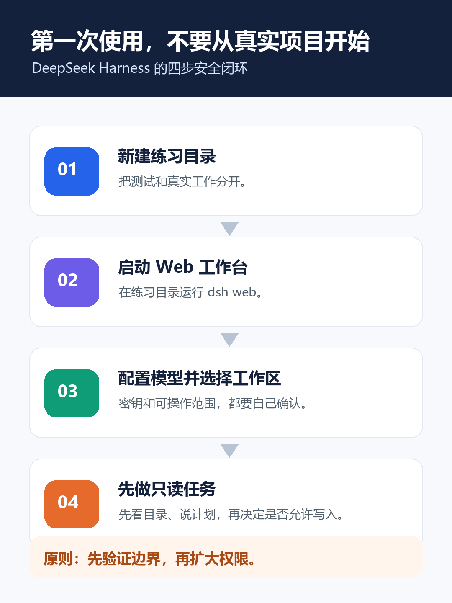
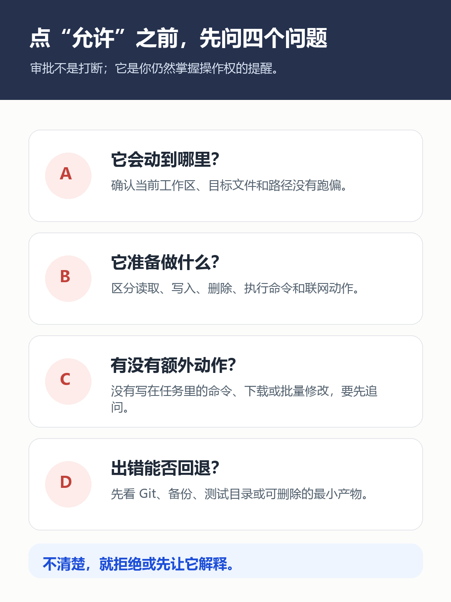

不是所有 AI 编程工具，都适合一上来就对着真实项目“放开干”。

第一次接触 Agent 工作台时，最容易发生的并不是它把代码写坏，而是你还没弄清楚：**它能看哪里、会做什么、什么时候该停下来让你确认。**一旦把练习、权限和验收混在一起，工具越能干，新手越容易慌。

DeepSeek Harness（命令行名 `dsh`）是 DeepSeek AI 开源的 Agent harness。它把模型、工作区、会话、工具调用和审批放在同一套工作台里：你可以先让 Agent 读目录、解释项目、提出计划，再决定是否允许它创建文件、执行命令或继续完成任务。

这篇教程不教你立刻“自动写完整项目”。目标更小，也更重要：**在一个独立练习目录中启动 DeepSeek Harness，完成一次可验收的只读任务，然后再尝试一次范围明确、容易回退的写入任务。**

> **先给结论：**第一次使用时，先把“模型能不能回答”与“Agent 能做哪些动作”分开验证。模型配置成功，只表示它能生成回答；工作区、命令和审批都确认过，才代表你真正掌握了这套工具的边界。



## 一、先看懂：它解决的不是“聊天”，而是“把任务放进可控制的工作区”

普通聊天窗口里，你把上下文复制进去，模型给出一段答案；DeepSeek Harness 的重点是把回答放进一个可以指向目录、调用工具、保留会话和进行审批的执行环境。对新手来说，下面四个对象最值得先分清：

| 你看到的对象 | 它负责什么 | 第一次使用时怎么对待 |
| --- | --- | --- |
| 模型 | 负责理解任务、生成计划与回复 | 先确认 API Key、模型名称或自定义兼容接口是否正确 |
| 工作区 | Agent 当前围绕哪个目录理解与操作 | 只选练习目录，不要一开始选真实仓库或个人资料目录 |
| 会话 | 保存当前任务的上下文与执行过程 | 一个会话只处理一件小事，方便你回看和复盘 |
| 审批 | 在当前权限策略下，对需要确认的动作提示你决定 | 不确定就先拒绝，要求它解释后再继续 |

官方文档把 DeepSeek Harness 定义为处于开发者预览阶段的开源 Agent harness，并采用“everything is a plugin”的架构。这个阶段意味着命令、界面字段和可用能力都可能变化；因此，本文只固定“如何验证边界”的方法，不把某个按钮位置写成永久规则。

## 二、准备一个可随时丢弃的练习目录

先确认电脑已安装 Node.js，并在终端执行：

```powershell
node -v
npm -v
```

两条命令都能输出版本号，再建立一个不放真实资料的目录：

```powershell
mkdir D:\dsh-playground
cd D:\dsh-playground
```

接着启动 Web 工作台：

```powershell
npx @deepseek-ai/dsh web
```

官方快速开始说明，这个命令会启动本地 Web UI，默认访问地址为 `http://127.0.0.1:3080`。如果浏览器没有自动打开，复制这个本地地址到浏览器即可。首次启动如出现下载或初始化等待，先等终端给出明确的服务状态；不要因为页面暂时没打开，就重复启动多个进程。

如果你更想从源码运行，官方 README 提供了克隆仓库、`pnpm install`、`pnpm run build` 和 `pnpm dsh web` 的路径。但对第一次体验的人来说，先用 `npx` 跑通最小任务更合适：少一个环境变量，少一层排错。

## 三、配置模型时，先把“能回答”验证出来

进入 Web UI 后，在 **Settings → Models** 中填写你准备使用的模型配置，例如 DeepSeek 的 API Key；保存后，官方文档说明模型不需要重启工作台就可生效。你也可以按 Providers 文档配置其他受支持的提供商，或配置兼容 OpenAI 接口的自定义端点。

这里有两个底线：

1. API Key 只填在本机受控的设置中，不要贴到聊天消息、Markdown、截图或 Git 仓库。
2. 官方文档说明凭据会保存在 `DSH_HOME/.credentials.yaml`，而设置页返回的是脱敏描述符；这不等于你可以忽略本机账号、磁盘加密或备份权限。谁能读取你的用户目录，谁就可能接触到相应的本地配置。

配置后，先发一句不涉及文件操作的话，例如：“用一句话说明你会先做计划、再请求必要审批。”如果它能稳定回答，说明模型链路基本可用；**这一步仍然没有证明它已经拥有或应该拥有项目操作权限。**

## 四、选择工作区，再完成第一个“只读”任务

官方指南说明：在 Web UI 添加并选择工作区后，才可以使用会话输入区。把刚才的 `D:\dsh-playground` 加为工作区并选中它。此时它的意义不是“自动安全”，而是让你清楚地知道 Agent 当前面对的是哪个目录。

不要一上来就说“帮我把项目做完”。先把下面这段任务卡完整复制到会话里：

```text
你现在只需要处理当前工作区。
请先说明你准备如何检查目录；随后只读取文件与目录结构，输出：
1. 当前工作区包含哪些文件或文件夹；
2. 它们各自可能承担什么作用；
3. 如果要把这里做成一个小型项目，下一步建议是什么。
限制：不要创建、修改或删除文件；不要执行命令；不要访问网络。
```

这张任务卡的价值不在于“看目录”，而在于训练你同时写清四件事：范围、目标、输出格式和禁止动作。执行后，用下面的标准判断是否成功：

| 检查项 | 成功表现 | 不符合时怎么处理 |
| --- | --- | --- |
| 任务范围 | 它只讨论当前工作区 | 要求它重新说明自己理解的目录与边界 |
| 动作边界 | 没有创建、修改、删除、执行命令或访问网络 | 立即拒绝后续动作，缩小任务再试 |
| 输出质量 | 能区分“看到的事实”和“下一步建议” | 让它列出依据，避免把猜测写成结论 |
| 可验收性 | 你能逐项对照任务卡判断完成与否 | 改写提示词，补足缺失的输出字段 |

## 五、第二次才允许写入：只创建一个可以删除的说明文件

只读任务顺利完成后，再尝试一个很小、很好回退的写入任务：

```text
只在当前工作区执行。
先展示你准备创建的相对路径、文件内容摘要和执行计划，等待我确认。
获得确认后，只创建 notes/first-task.md。
文件内容包含：本次练习目标、你做过的只读检查、我应如何验证结果。
不要修改其他文件；不要删除文件；不要执行联网命令。
```

当 DeepSeek Harness 弹出审批或准备执行动作时，别把它当成麻烦。暂停几秒，逐项对照下面四个问题：



- 它会动到哪个路径？是不是 `notes/first-task.md`？
- 它要做的是创建文件，还是还包含命令、下载、删除或批量修改？
- 有没有任务卡里没写过的额外动作？
- 如果结果不对，我是否能直接删除这个练习文件，或用版本控制回退？

只有答案都清楚，再点击允许。完成后，手动打开 `notes/first-task.md`，确认文件路径、内容和任务卡一致。**“文件确实存在”不等于成功；“文件只在约定位置、内容符合约定、没有额外修改”才是成功。**

## 六、遇到卡住，先按原因排查，不要靠反复重试

| 现象 | 常见原因 | 先做什么 |
| --- | --- | --- |
| Web 页面打不开 | 终端服务未成功启动、端口被占用或本地地址未打开 | 回到启动终端看报错；确认 `127.0.0.1:3080` 是否可访问 |
| 模型没有回复 | Key、模型配置、网络或提供商设置有误 | 回到 Models / Providers，先用一条不涉及工具的短问题验证 |
| 输入区不可用 | 还没有选定工作区 | 添加并选择练习目录，再新建会话 |
| 操作超出预期 | 任务范围太宽、权限策略或工具调用未看清 | 拒绝动作；让 Agent 复述计划；把任务拆成只读与小写入两步 |
| 文档与界面不一致 | 开发者预览版升级快 | 以当前官方 README、Guide 和 CLI 文档为准，记录你实际看到的版本与差异 |

除了 Web UI，官方 CLI 文档还列出了 `dsh --profile <name>`、一次性 headless 任务，以及插件相关命令。它们很适合后续把重复任务接进脚本或 CI；但在你还没建立审批习惯前，不建议把首次体验从可见的 Web 过程直接跳到无界面执行。

## 七、真正的入门完成，不是“它替你写了代码”

当你能独立完成下面四件事，才算把 DeepSeek Harness 的第一层能力用稳了：

1. 用独立练习目录启动 `dsh web`，并知道默认本地地址；
2. 配置模型后，先用不涉及工具的一句话验证模型链路；
3. 让 Agent 完成一次只读任务，并能检查它是否越界；
4. 对一次最小写入任务，先看计划、再确认路径和动作、最后手动验收文件。

下一步再把练习目录替换成真实项目之前，先做一次备份或确认版本控制状态；把任务继续拆小；任何涉及删除、批量替换、密钥、线上环境或网络下载的请求，都改成“先解释、再审批、后执行”。

这才是 Agent 工具真正值得新手学习的地方：不是把决定权交出去，而是让 AI 在你看得懂、停得住、验得了的范围内帮你完成工作。

> **资料与版本说明：**本文于 2026 年 8 月 14 日依据 DeepSeek Harness 官方 GitHub README、官方 Quick Start、Providers 与 CLI 文档核验。对应仓库快照为 `47f943859bef60e4160492346772ded9b24f765a`（2026 年 8 月 13 日）。DeepSeek Harness 处于开发者预览阶段，正式对外发布前应再次核对当前命令、界面与权限行为。
