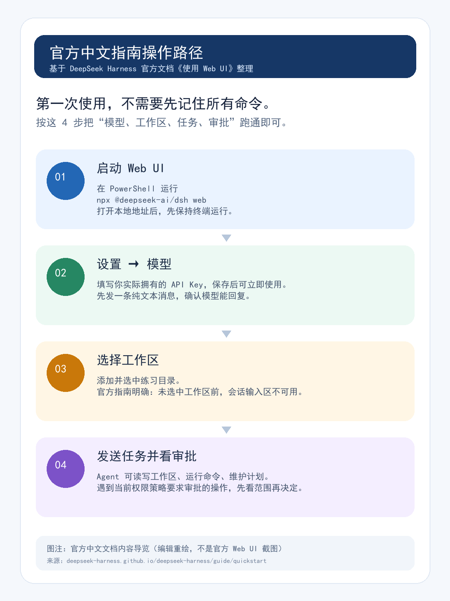

第一次打开 DeepSeek Harness，很容易犯一个错误：把真实项目拖进去，然后对 AI 说“帮我把这个需求做完”。

先别急。第一次接触 Agent，最重要的不是让它立刻写出多少代码，而是你能不能看清三件事：它正在看哪个目录、准备做什么、什么时候应该停下来等你确认。

这篇只带你完成一条安全的第一次体验：启动工作台、让模型回复一句话、读取练习目录里的文件，再批准一次“只创建一个小文件”的动作。全程不碰真实仓库，不贴真实 Key，也不做不可逆操作。你跑通这条链路后，再决定要不要把它带进日常开发。

## 第一部分｜它到底在帮你做什么？

DeepSeek Harness 是 DeepSeek 开源的开发者预览项目。它不是新的大模型，也不是一句话就能替你改完整个项目的魔法按钮。更准确地说，它把模型、工作区和可执行动作放到同一张桌面上，同时给你留下查看计划和审批动作的机会。

对新手来说，先认识这三样东西就够了：

| 你看到的东西 | 它解决的问题 | 第一次怎么用 |
| --- | --- | --- |
| 模型设置 | 告诉工作台用哪个模型、哪组凭据 | 只在本机设置页填写 Key，先测试一句纯文本 |
| 工作区 | 限定 Agent 能查看和操作的目录 | 用一个随时可以删掉的空练习目录 |
| 计划与审批 | 在读、写、运行命令前给你一次判断机会 | 先看路径、动作和影响范围，再决定是否允许 |



这张图可以当成第一次上手的路线卡：先启动，再设模型；模型能回复后，选一个工作区；最后才发送任务并处理审批。页面入口可能随预览版本变化，但这个顺序很值得保留。

Harness 适合先做读目录、解释文件、列计划、在练习目录创建一个可删除的小文件；暂时不要拿它直接处理客户资料、批量替换、安装未知依赖、删除文件、读取密钥或碰线上环境。

## 第二部分｜十分钟跑通第一个小任务


这不是让你背一套命令，而是把每一步都停下来确认一次。你可以边做边看，任何一步不对，都先停在原地。

### 1. 先建一个“弄坏也没关系”的练习目录

打开 **PowerShell**，先看 Node.js 和 npm 是否可用：

```powershell
node -v
npm -v
```

如果两行都能返回版本号，再创建一个只属于这次练习的目录。下面用用户目录变量，不依赖某台电脑的盘符：

```powershell
$playground = Join-Path $HOME 'dsh-playground'
New-Item -ItemType Directory -Force -Path $playground, (Join-Path $playground 'docs'), (Join-Path $playground 'notes')
Set-Location $playground
Set-Content -LiteralPath .\README.md -Encoding utf8 -Value '# DeepSeek Harness 练习项目', '', '目标：只在这个目录练习 Agent 的读取、计划与最小写入。'
Set-Content -LiteralPath .\docs	odo.md -Encoding utf8 -Value '待办：整理 README，先不要修改任何文件。'
Get-ChildItem -Recurse -File
```

你应该能看到 `README.md`、`docs/todo.md` 和空的 `notes` 文件夹。看不到时先执行 `Get-Location`，确认当前路径仍然是刚才的练习目录；不要急着重跑一遍创建命令。

### 2. 先让模型说句话，不要一上来就改文件

仍在这个 PowerShell 窗口执行：

```powershell
npx @deepseek-ai/dsh web
```

首次运行可能会下载并初始化。保持终端打开，在浏览器访问：

```text
http://127.0.0.1:3080
```

进入 **设置 → 模型**，按当前页面填写提供商或接口类型、模型名称、API Key，并确认保存成功。字段名称可能变化，但有一条原则不变：Key 只留在本机设置里，不发进会话，不写进 Markdown，也不要提交 Git。

保存后先发送一句最简单的消息，例如：

```text
请只回复：模型连接正常。
```

能得到明确回复，就说明第一关过了。没有回复时，先回设置页看模型名、服务商和 Key，不要把 Key 粘到聊天窗口里“测试”。

### 3. 第一次任务只读，不写

先让 Agent 读练习目录，但把边界写在任务里：

```text
只在当前工作区执行。
请读取 README.md、docs/todo.md 和 notes 目录，告诉我：
1. 当前有哪些文件；
2. README.md 与 docs/todo.md 分别写了什么；
3. 下一步可以做什么，但不要实际执行。
限制：不要创建、修改、删除文件；不要联网、安装依赖或执行其他命令。
```

这一步不要只看回答像不像。检查它有没有只谈当前工作区，是否分清“文件里已有的内容”和“下一步建议”，有没有偷偷申请写入、下载或修改。只读任务一旦越界，就拒绝这次动作，把任务改得更小。

### 4. 第二次才创建一个可删除文件

只读任务没问题后，再发送：

```text
只在当前工作区执行。
请先展示准备创建的相对路径、文件中的三条要点，以及不会执行的其他动作。
等待我确认后，只创建 notes/first-task.md。
文件写入：本次练习目标、刚才完成的只读检查、我如何验证结果。
禁止修改其他文件；禁止删除、联网、安装依赖和执行批量命令。
```

出现计划或审批卡片时，先别被“看起来很完整”说服。核对这四点：路径是不是 `notes/first-task.md`，动作是不是只有创建这一个文件，是否没有下载/安装/删除/联网，写错后能不能只删掉这一个练习文件。


四项都符合，再允许继续。完成后回到 PowerShell 亲手验收：

```powershell
Get-ChildItem -Recurse -File
Get-Content -LiteralPath .
otesirst-task.md
```

新增的应该只有 `notes/first-task.md`，原来的两个测试文件仍然在，内容也能对应任务要求。看见的不是“AI 很聪明”，而是一次可观察、可回退的协作。

## 第三部分｜日常最常用的设置，先记住边界再追求效率

跑通练习后，你日常最常碰到的是这些问题：

| 高频项 | 先看什么 | 新手做法 |
| --- | --- | --- |
| 模型与提供商 | 模型名、Key、服务商或兼容端点 | 先验证一句稳定回复，失败就回设置页 |
| 工作区 | 当前选中的路径 | 一个任务只用一个目录，真实仓库先只读 |
| 会话任务 | 要做什么、不做什么、要输出什么 | 先让它给计划，再决定是否操作 |
| 审批 | 路径、命令、写入和联网是否超范围 | 删除、批量修改、安装依赖先停下来复核 |
| 本地凭据 | Key 是否只留在本机 | 不放进提示词、截图、文章或仓库 |

从能力上看，它可以帮助你读取和编辑工作区文件、运行命令、维护计划，甚至委派任务；但“能做”不等于“现在就该授权”。建议按这个顺序升级：**读目录 → 读文件 → 要计划 → 创建一个练习文件 → 真实项目只读 → 小范围可回滚修改。**

准备进入真实仓库前，先在仓库目录看一眼现状：

```powershell
git status --short
git branch --show-current
```

第一次给真实项目的任务，仍然可以只是“说明目录结构、找出入口文件、列出可能相关的三个文件，但不要修改”。这一步看似慢，实际上是在给后面的协作留回旋余地。

遇到问题，也别急着多开几个进程：

| 现象 | 先做什么 |
| --- | --- |
| 页面打不开 | 回启动终端看第一条报错，确认地址是否为 `127.0.0.1:3080` |
| 模型没有回复 | 回设置页检查 Key、模型名、服务商或兼容端点 |
| 输入区不可用 | 确认已经添加并选中了练习目录 |
| 计划超出预期 | 拒绝动作，让 Agent 缩小范围并重新展示计划 |

真正完成入门的标志，不是让 AI 帮你写了多少代码，而是你知道它在哪个目录工作、它想做什么、哪一步需要你批准，以及怎样亲手确认结果没有越界。

> **资料与版本说明：**本文于 2026 年 8 月 14 日依据 DeepSeek Harness 官方 GitHub README、官方中文《使用 Web UI》、Providers 与 CLI 文档核验；对应仓库快照为 `47f943859bef60e4160492346772ded9b24f765a`（2026 年 8 月 13 日）。DeepSeek Harness 处于开发者预览阶段，命令、界面和权限表现可能变化；正式发布前请再次核对当前官方文档。
