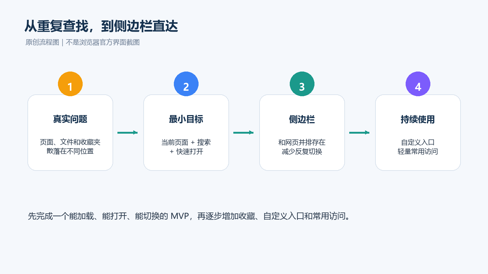
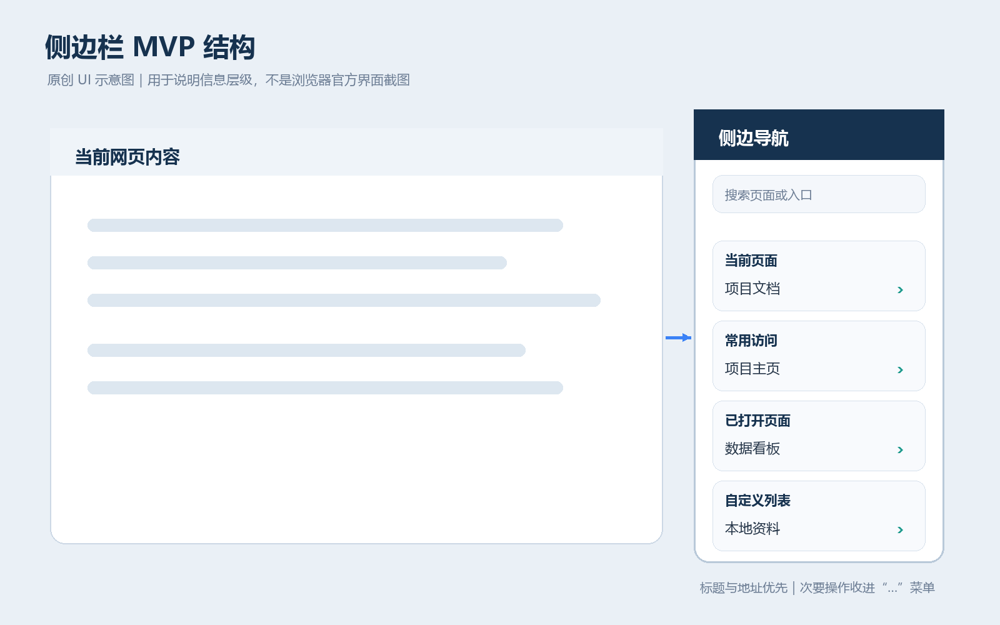
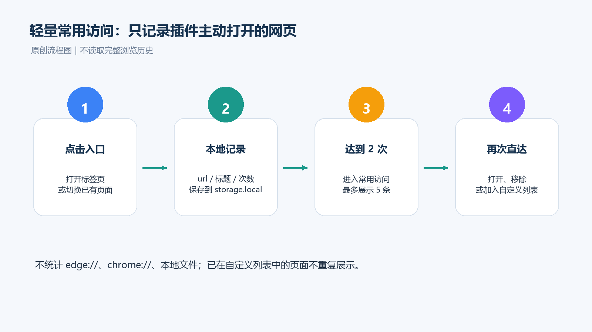
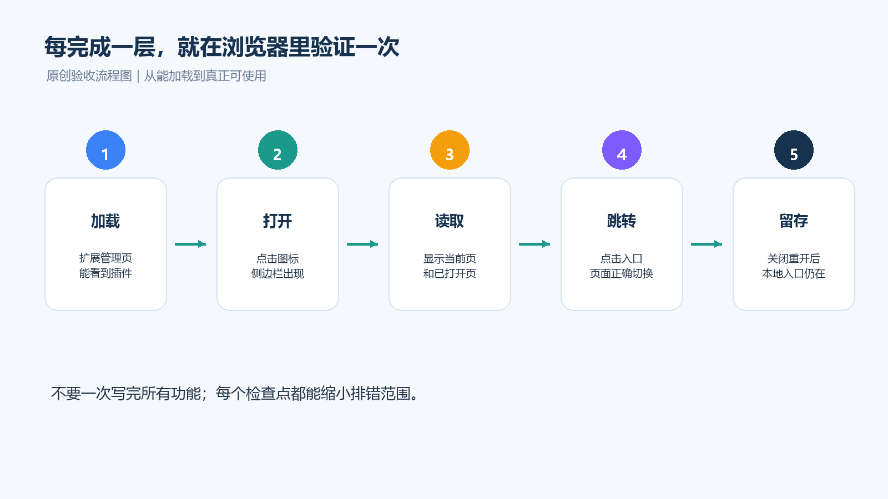

18. 从 0 到 1 开发一个可用的浏览器插件：用侧边栏解决页面反复切换

> 面向 AI 新手：让 Codex 帮你把重复查找流程做成可使用的侧边导航。

每天打开浏览器，最浪费时间的往往不是做事，而是找入口：项目主页在一个收藏夹，文档在另一个窗口，本地资料又藏在文件夹里。浏览器重启后，还要重新确认“刚才那个页面到底在哪里”。

如果你是 AI 新手，不必先学会一整套浏览器扩展 API。更适合的做法是：把自己的重复操作说清楚，让 Codex 先拆方案，再逐步创建、修改和检查文件；你负责描述目标、观察效果和确认每一步是否真的有用。

这篇文章就沿着这个过程，做一个轻量侧边栏插件：在网页旁边快速查看当前页面、切换已打开页面、搜索入口，并打开自己的收藏或常用访问。它不是复杂的在线工作台，第一版也不做账号、云同步和完整浏览历史。



## 一、先描述你的问题，不要先描述代码

打开 Codex，先不要说“帮我写一个 Chrome 插件”。先把自己的使用场景写成一段话：

> 我每天要在项目主页、在线文档、数据看板和本地资料之间切换。浏览器重启后，我经常找不到刚才使用的页面。请把这个问题拆成一个浏览器侧边栏插件的最小版本，目标是快速查看当前页面、切换已打开页面、搜索入口和打开自定义链接。第一版不做在线同步、完整历史记录和系统默认程序打开本地文件。

这段话比一开始贴几十行代码更有用，因为 Codex 需要先知道三件事：

- **要解决什么问题**：减少查找和页面切换；
- **第一版必须有什么**：当前页面、已打开页面、搜索、自定义入口；
- **明确不做什么**：账号、在线同步、完整历史、复杂权限。

让 Codex 先输出“功能清单、文件计划、实现顺序和验收标准”，不要马上改文件。你看到方案后，先删掉自己暂时用不到的功能。

### 这一步的效果

你得到的不是一堆代码，而是一张可以讨论的施工图：先能加载，再能显示当前页面，再能切换，最后才加入搜索和自定义入口。

## 二、让 Codex 创建一个能加载的最小骨架

确认方案后，再给 Codex 第二个指令：

```text
请在当前目录创建一个 Manifest V3 浏览器侧边栏插件。
先创建最小可运行骨架，再告诉我每个文件的作用。
要求：
1. 支持 Chrome/Edge 的侧边栏入口；
2. 点击扩展图标后可以打开侧边栏；
3. 先只显示“插件已加载”，暂不实现搜索、收藏夹和常用访问；
4. 完成后列出修改文件、加载步骤和验收结果。
```

Codex 负责把方案落到 `manifest.json`、后台脚本、侧边栏页面、样式和交互脚本中。你不需要先手写这些文件，但要让它解释：哪个文件声明权限，哪个文件负责打开侧边栏，哪个文件负责页面显示。

然后在 `edge://extensions/` 或 Chrome 的扩展管理页开启开发者模式，选择“加载已解压的扩展”。

### 看到什么算成功？

点击扩展图标后，浏览器右侧出现侧边栏，并看到“插件已加载”。如果没有出现，不要让 Codex 重新生成整套项目，直接把现象告诉它：

```text
点击扩展图标后侧边栏没有出现。
请先检查 manifest、后台脚本和侧边栏注册是否一致，说明可能原因后只修改必要文件，并告诉我重新加载扩展的步骤。
```

这就是 AI 开发的第一个闭环：**描述现象 → 让 Codex 定位 → 只改必要部分 → 重新加载验证**。

## 三、一次只增加一个能力

骨架能加载后，不要一次要求 Codex “把所有功能都做完”。每轮只加一个用户动作，并附上验收标准。

### 1. 当前页面：先确认数据链路

给 Codex：

```text
只实现“当前页面”区域：显示当前标签页标题、地址和页面图标。
不要加入收藏夹、搜索或持久化。
完成后说明读取了哪个浏览器 API，并给出 3 步验收方法。
```

你要观察的是：打开不同页面后，侧边栏能否显示对应标题和地址；没有图标时是否回退到默认图标。先验证信息正确，再考虑样式。

### 2. 已打开页面：解决反复切换

继续给 Codex：

```text
在现有版本上增加“已打开页面”列表。
点击列表项时切换到原来的标签页，不要重复创建新标签页。
列表默认收起，当前页面区域保持可见。
请先复述改动范围，再修改文件，最后告诉我如何验证切换行为。
```

此时的验收只看一件事：打开项目主页、项目文档和数据看板，点击侧边栏列表后，是否能快速切回原标签页。



### 3. 搜索和自定义入口：把个人习惯交给 AI 实现

当你确认页面切换有效，再让 Codex 增加搜索：

```text
增加一个搜索框，统一搜索当前页面、已打开页面和自定义入口的标题与地址。
输入关键词时实时过滤；没有结果时显示明确提示。
不要改动浏览器收藏夹数据，也不要加入在线搜索。
完成后列出新增逻辑和测试场景。
```

接着，把你真正会用的入口告诉 Codex，例如：项目主页、设计稿、接口文档、下载目录。让它建立“自定义列表”，并保存到浏览器本地存储。你只需要确认三点：

- 浏览器重启后入口还在；
- 网页入口点击后能打开或切换；
- 本地文件或目录的打开方式不会被插件擅自承诺为系统默认程序。

如果需要系统程序打开本地文件，先把它列为后续需求。浏览器插件的权限、Native Messaging 或本地助手会带来新的安装和安全边界，不适合塞进 MVP。

## 四、用一轮“产品化提示词”减少返工

当基本功能跑通后，再让 Codex 统一整理界面，而不是一边开发一边不断改颜色：

```text
请做一次轻量 UI 整理，只处理以下问题：
1. 当前页面、已打开页面、自定义列表使用统一标题样式；
2. 列表默认收起，点击标题可展开和收起；
3. 搜索结果与普通列表使用同一行高和点击反馈；
4. 侧边栏内容较多时不能遮挡网页主要信息。
不要新增功能，不要修改数据结构。
完成后说明改了哪些样式，并给出桌面端和窄侧边栏两组验收步骤。
```

把“新增功能”和“界面整理”分开，Codex 更容易控制改动范围，你也更容易判断问题到底来自数据、交互还是样式。

## 五、方案 A：让插件自动整理轻量常用访问

如果你经常重复打开同几个页面，可以让 Codex 增加一个克制的常用访问列表。先定义规则，再让它实现：

```text
增加“常用访问”区域，只记录用户通过插件主动打开或切换的网页。
同一地址累计访问 2 次后进入候选列表，最多显示 5 条。
不记录 chrome://、edge://、file:// 页面，不读取完整浏览历史。
支持打开、加入自定义列表、复制地址和移除。
请先说明数据字段、去重规则和清理规则，再实施。
```

可以让 Codex 使用这样的数据思路，但不必自己手写统计代码：地址、标题、图标、访问次数、最近访问时间。你的重点是确认结果是否符合习惯，而不是检查每一行 JavaScript。



### 为什么只记录插件主动访问？

这样既能实现“越用越顺手”，又不会把插件扩展成完整历史记录工具。数据范围小、解释简单，也更容易在设置中提供“清空常用访问”。

## 六、出现问题时，别让 AI 盲目重写

AI 开发最重要的不是一次生成成功，而是会描述问题。遇到故障时，给 Codex 四类信息：**你做了什么、看到了什么、预期是什么、最近改了什么**。

例如搜索无效，可以这样问：

```text
我在侧边栏输入“文档”，列表没有变化；预期是显示标题或地址包含“文档”的入口。
问题出现在刚加入搜索功能之后。
请先检查数据是否成功加载、输入事件是否触发、过滤结果是否重新渲染。
不要重写整个项目；先说明根因，再做最小修复，并告诉我如何复测。
```

如果图标不显示、列表无法展开或刷新按钮无效，也沿用同一格式。每次让 Codex 输出：

1. 根因判断；
2. 修改文件；
3. 修改内容摘要；
4. 手动复测步骤；
5. 仍未解决时需要补充的信息。

这样你是在和 AI 一起排查产品行为，而不是把项目交给一个无法解释的“代码生成器”。

## 七、用真实场景验收，而不是只看代码

插件完成后，用自己的资料做一次完整演练：

```text
加载插件
  ↓
打开侧边栏
  ↓
查看当前页面
  ↓
切换已打开页面
  ↓
搜索项目文档
  ↓
打开自定义网页或本地入口
  ↓
重复访问后查看常用访问
  ↓
关闭并重新打开浏览器，确认本地入口仍在
```



让 Codex 根据这条路径生成检查清单，但最终验收要由你完成。尤其确认：

- 侧边栏是否真的减少了查找步骤；
- 列表是否默认收紧，不遮挡网页；
- 搜索、切换、打开和收藏是否使用一致的交互；
- 浏览器重启后，本地保存的自定义入口是否仍然存在；
- 权限是否只覆盖当前功能，没有为了“以后可能用到”而无限增加。

## 八、把这套方法迁移到你的下一个插件

以后想做下载整理、接口快捷入口或网页批注工具，可以重复这套节奏：

1. 用一段话描述重复操作；
2. 让 Codex 先拆 MVP 和不做清单；
3. 让它创建能运行的最小骨架；
4. 每轮只增加一个动作；
5. 每轮都在真实浏览器里验收；
6. 用现象描述 bug，让它做最小修复；
7. 最后再做样式和自动化整理。

最值得保留的不是某一段代码，而是这份可复用的提示词：

```text
我是 AI 开发新手，想把【重复操作】做成一个【浏览器插件/侧边栏工具】。
请先不要写代码，先帮我明确：
- 第一版只保留哪些功能；
- 哪些功能明确不做；
- 需要创建或修改哪些文件；
- 每一步如何在浏览器中验收。
之后请一次只实现一个功能：先说明改动范围，再修改文件，最后给出复测步骤。
```

## 结语

用 Codex 做插件，关键不是把需求写成一大段代码，而是把问题拆成一连串可验证的小动作：先让插件出现，再让它看见当前页面，再让它帮你切换和搜索，最后才加入常用访问。

当你能说清楚“我想减少哪一次查找”，AI 就有了明确的工作边界；当你能说清楚“怎样算完成”，你就不再只是等待代码，而是在带着 AI 一起完成产品。

### 资料与边界

本文示例基于 Chrome/Edge Manifest V3 的侧边栏、标签页、收藏夹和本地存储能力编写。具体 API、浏览器版本和权限行为可能变化，正式使用前应再次核对官方文档。文中四张配图均为原创示意图，不是浏览器官方界面截图，也不包含官方 Logo。

- OpenAI Academy：Codex for Builders：<https://academy.openai.com/public/clubs/builders-etkn1/resources/codex-for-builders>
- OpenAI Help Center：Using Codex with your ChatGPT plan：<https://help.openai.com/en/articles/11369540/>
- Chrome Extensions：<https://developer.chrome.com/docs/extensions/>
- Chrome Side Panel API：<https://developer.chrome.com/docs/extensions/reference/api/sidePanel>
- Chrome Tabs API：<https://developer.chrome.com/docs/extensions/reference/api/tabs>
- Chrome Bookmarks API：<https://developer.chrome.com/docs/extensions/reference/api/bookmarks>
- Chrome Storage API：<https://developer.chrome.com/docs/extensions/reference/api/storage>
- Microsoft Edge Extensions：<https://learn.microsoft.com/en-us/microsoft-edge/extensions-chromium/>
