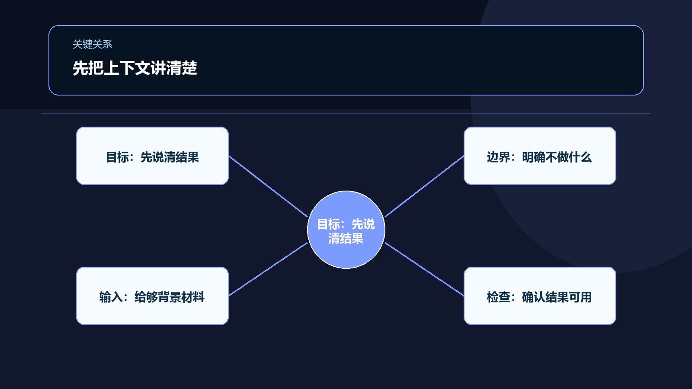
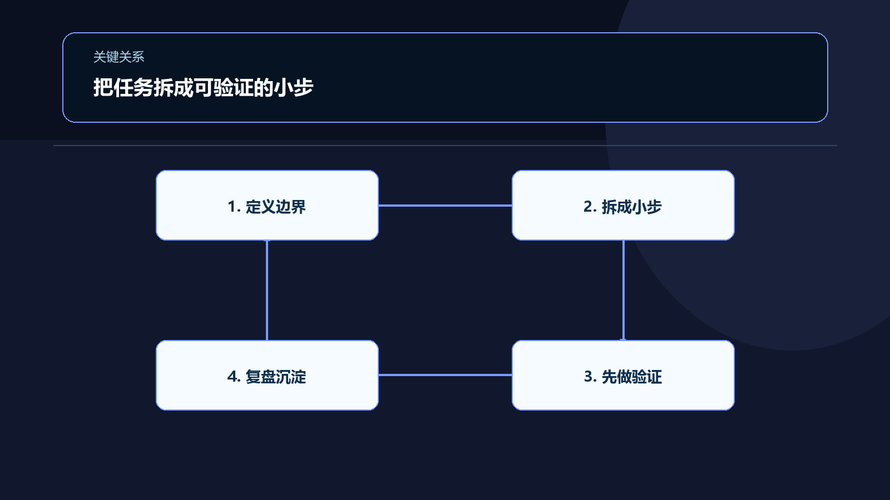

19. AI 写代码之后，初学者真正该学什么：我用 AI Agent 做项目时留下的 5 个能力

刚开始用 AI Agent 做项目时，我很容易产生一种错觉：只要把需求说清楚，剩下的事情交给模型就好。

你描述功能，它生成代码；你贴出报错，它修改代码；你再补一句“把界面做得好看一点”，它继续调整。几个回合之后，一个看起来能运行的项目就出现了。

真正的问题往往在下一步才发生。

功能之间开始互相影响：改了一个页面，另一个页面出现异常；模型给出的方案能够运行，却和原来的项目结构不一致；某个问题被修好之后，另一个问题悄悄出现。到了这时，继续让 AI 多写一点代码，通常只会增加判断成本。

我逐渐意识到，AI Agent 降低的主要是代码生产门槛，却没有自动替我们完成项目判断。它让写代码变快，也可能让错误更快扩散。初学者真正需要建立的，不是更多提示词，而是驾驭这条生产链路的能力。

对我来说，最重要的是下面五种能力。

## 1. 把模糊想法变成可验证的任务

很多人给 AI 的第一句话是：“帮我做一个记账应用”“做一个像某某产品一样的网站”“写一个自动化工具”。这些话可以作为方向，却不能直接作为工程任务。

问题不在于 AI 听不懂，而在于这类需求缺少判断标准：什么算完成？用户先做什么，再做什么？哪些情况必须处理？哪些功能暂时不做？如果这些问题没有答案，模型只能自行补全，而它补全出来的内容未必符合你的真实意图。

我现在会先把一个想法压缩成一条最小用户路径：用户是谁？他在什么场景下进入产品？完成任务至少需要经过哪几步？每一步输入什么、输出什么？出现空状态、错误状态或重复操作时，应该发生什么？

比如，不先说“做一个课程管理系统”，而是先描述：

> 教师创建一门课程，填写名称和简介，提交后能在课程列表中看到它；如果名称为空，提交不能成功，并显示明确提示。

这段描述没有那么宏大，却足以让 AI 生成第一版，也足以让你检查第一版是否符合要求。它还提前暴露了一个取舍：课程管理系统可能包含编辑、删除、权限和搜索，但当前任务只验证“创建课程”这条路径。

初学者要学的第一件事，是把“我想要什么”改写成“我如何知道它做对了”。这就是需求拆解和验收标准，只是过去常常由产品经理、设计师和工程师共同完成。现在，使用 AI 的人也必须承担其中一部分。

## 2. 看懂代码的职责，而不是背诵每一行语法

AI 生成代码之后，初学者常见的两个极端是：完全不看，或者试图立刻看懂所有细节。

前者会让你失去控制，后者很容易陷入局部语法，迟迟无法推进。更实用的方式，是先建立代码地图。

这个文件负责什么？数据从哪里来，经过哪些处理，最后在哪里展示？哪个函数改变了状态？哪个接口负责读写数据？如果我改动这里，哪些地方可能受到影响？

你不需要第一天就精通框架，也不需要把模型生成的每个工具函数都背下来。但这不等于可以永远跳过基础。只要某段代码涉及数据写入、权限、支付、隐私或不可逆操作，就需要提高理解和审阅深度。

在实际协作中，我会要求 AI 先解释改动范围，再开始修改。完成后，再让它列出：改了哪些文件、每个文件的作用是什么、依赖了哪些前置条件、还存在什么未验证的风险。

这不是把 AI 当老师提问，而是在建立一种审阅习惯。

代码阅读的目标不是让你看起来像资深开发者，而是让你能回答一个朴素的问题：这次改动到底改变了系统的哪一部分？如果答不上来，就不应该急着继续叠加修改。

## 3. 学会给 AI 提供足够的上下文

同一个问题，为什么有时 AI 能给出很好的修改，有时却像在猜？通常不是模型突然失灵，而是上下文不完整。

AI Agent 需要知道当前项目使用什么技术、目录如何组织、数据结构是什么、哪些行为不能改变，以及你已经尝试过什么。只说“这个按钮没反应，帮我修一下”，信息远远不够。

有效的上下文至少包括四类内容：

第一是现象。具体是点击后没有反应、页面报错，还是数据没有保存。

第二是复现步骤。用户做了哪些操作，在哪一步出现问题。

第三是预期结果。你认为正确行为应该是什么。

第四是环境和边界。相关文件、错误信息、运行命令，以及这次不要动哪些部分。

一次任务可以写成这样：

> 在课程列表页点击删除按钮后，弹窗关闭，但记录仍然存在。复现步骤是先创建课程，再点击删除并确认。预期是记录从列表消失，刷新页面后也不再出现。请先检查删除请求是否发出、服务端是否成功处理，以及前端列表是否更新。只修改删除流程，不调整列表样式。

这样的描述把排查路径交给了 AI，却没有把判断权交出去。你仍然可以决定哪些信息可信、哪些修改超出了范围。

我把这项能力理解为“上下文工程”：不是不停增加提示词长度，而是提供与当前决策直接相关的信息。上下文太少，模型会猜；上下文太多，真正重要的约束会被淹没。好的上下文应该让问题变得更窄，而不是让对话变得更长。

## 4. 用证据验收，而不是凭感觉相信结果

AI 说“已经修复”并不等于问题已经修复。代码能够生成，也不等于功能符合需求。

使用 AI Agent 时，生成和验证是两件不同的工作。更准确地说，验证不能只由生成代码的同一个判断链路完成。让 AI 自检有价值，但它仍然需要和运行结果、测试、日志或人工操作互相印证。

我会把验收分成三个层次。

第一层是能不能运行：项目是否成功启动，构建是否通过，接口是否返回预期格式。

第二层是行为是否正确：正常路径能否完成，输入为空、重复提交、权限不足、数据不存在时会发生什么。

第三层是改动有没有造成副作用：原有功能是否仍然可用，页面是否出现新的错误，数据是否被错误覆盖。

不同项目的检查方式不一样。可以是手动走一遍流程，也可以是单元测试、接口测试、类型检查、日志和版本对比。关键不在于工具有多复杂，而在于每个结论都尽量有对应证据。

“看起来没问题”不是证据。“我让 AI 自己检查过了”也不能算完整的独立验证，因为生成者和检查者仍然可能共享同一个错误假设。

对初学者来说，最小可行的做法，是为每个功能写三到五条验收项，并在修改后逐条执行。例如：正常输入能保存；空输入会提示；刷新后数据仍在；重复点击不会产生重复记录；原有编辑功能不受影响。

这份清单比一段漂亮的提示词更有长期价值。它会逐渐变成你的项目记忆，也会让下一次与 AI 的协作更稳定。但它不是质量保证的替代品：涉及真实用户、敏感数据或线上系统时，仍然需要根据风险增加测试和人工审查。

## 5. 在不确定时控制变化范围

AI Agent 很擅长提出“顺便优化”的建议：重构目录、升级依赖、替换组件、统一接口、补充抽象。它们有时确实合理，但不应该和当前问题混在一起。

初学者最容易犯的错误，是把一次小修复变成一次大改造。原本只是修一个表单，最后连路由、状态管理和样式系统一起被改动。改动越多，越难判断究竟是哪一处导致了新问题。

我现在更重视变化范围，而不是一次生成多少代码。一个任务尽量只解决一个主要问题；先保留可运行状态，再逐步扩大改动；每完成一个小阶段，就进行一次验证和记录。

这背后其实是风险管理，也是一种学习方法。变化范围越小，结果和原因之间的关系越清楚，你越容易形成自己的判断。它的代价是速度可能变慢，尤其是在你已经确认架构问题、并且有充分测试和回滚条件时，过度保守也可能拖延必要的重构。

所以我会先问四个问题：这项改动为什么必要？它影响哪些地方？完成标准是什么？出了问题如何回滚？如果一个重构没有明确的验收标准，就不要把它和功能需求绑定；如果无法解释某项改动为什么必要，就先不要做。

“少改一点”并不代表缺乏技术追求。对于还没有形成系统判断能力的人，控制变化范围是一种保护，也是建立因果关系的方式。

## AI 之后，学习顺序发生了变化

过去学习编程，常见路径是先学语法，再学框架，再做项目。现在仍然需要这些基础，但使用 AI 之后，学习重点不再只是“如何写出代码”，还包括“如何让代码进入一个可控的系统”。

你可以让 AI 帮你解释语法、生成样板代码、定位错误，却不能跳过对问题、结构、边界和证据的理解。因为这些内容决定了你是否知道该让 AI 做什么，以及如何判断它有没有做对。

如果重新开始，我不会把“掌握更多工具”作为第一目标，而会先练习一条完整的小链路：

自己写一个很小的需求；

让 AI 解释方案并生成有限范围的代码；

查看文件职责和数据流；

运行功能，记录实际结果；

用验收清单检查正常和异常路径；

最后总结这次改动留下了什么可复用的规则。

这条链路不依赖某个具体模型，也不依赖某个特定框架。工具会变化，但把需求变成任务、把代码放回结构、把结果交给证据、把风险限制在范围内，这些能力不会因为 AI 会写更多代码而失效。

相反，至少在需要对结果负责的项目里，AI 越能生成代码，这些判断能力就越重要。因为当代码不再是最稀缺的部分，真正稀缺的就变成了判断：什么值得做，应该先做什么，哪里不能相信，以及什么时候必须停下来亲自确认。

对初学者来说，下一次打开 AI Agent 时，可以先不急着输入“帮我写代码”。先写下四句话：我要解决谁的什么问题；完成的标准是什么；这次只允许改哪里；我准备怎样验证结果。

这四句话未必能保证项目一次成功，却能让你更早发现问题，也更容易知道下一步该学什么。最终需要培养的，不是对某个工具的依赖，而是从想法、代码到结果之间，始终保留自己的判断。
