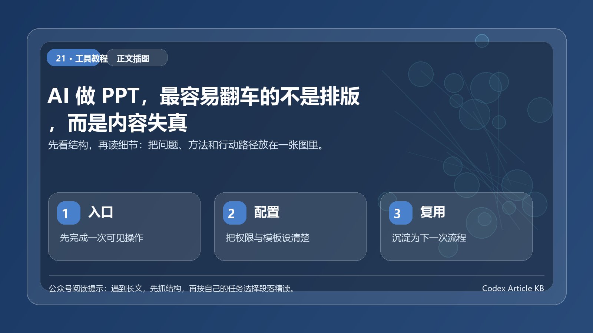

> AI 能帮你快速摆脱空白页，却不能替你确认：这份内容能不能在会上讲、经不经得起追问、会不会误导决策。



*图：先用一张结构图把本文的重点、方法和行动路径串起来。*


AI 做 PPT 最容易制造一种错觉：页面很完整，配色也顺眼，标题还很像咨询公司，于是你以为差不多能交了。

真正上会后，问题往往不在字体，而在一句追问：这个数字从哪来？为什么结论是这个？这页要让谁做什么决定？

生成演示初稿已经是许多办公产品提供的能力。 但能生成与可以直接用于决策之间，隔着一套必须由人完成的验收。下面这 4 个内容失真点，比排版更值得花时间。

## 失真点一：事实来源被顺手补全

AI 最擅长把零散资料组织成顺畅表达，也因此可能把没有明确来源的内容写得像既定事实。

最常见的风险包括：

- 把旧版本数据当成最新数据；
- 将推测性的市场判断写成确定结论；
- 为了让页面完整而补出不存在的案例、比例或竞品信息；
- 忽略数据的统计口径、时间范围和适用条件。

### 怎么验收？

每一页只问两个问题：

1. 这页最关键的一句话，能否回到原始材料？
2. 如果不能，它是待验证判断，还是应该删掉？

把每个关键数字旁边补上来源、日期、口径。如果演示给管理层或客户看，宁可少一页，也不要用一张没有出处但看起来完整的图。

## 失真点二：结构很像方案，实际上没有结论链

一份好 PPT 不是把十个标题排成十页，而是让听众理解：现状是什么 → 问题为什么发生 → 有哪些选择 → 推荐什么 → 需要什么决定。


AI 生成时常出现每页都对，但连起来不推进的情况。例如，前面说增长放缓，中间列很多行业信息，最后突然要求追加预算。中间缺了关键推理：增长放缓来自哪里？追加预算会改善哪个指标？有没有替代方案？

在让 AI 做版式前，先写出一段 100 字以内的汇报主线：

```text
给谁汇报：
希望对方做什么决定：
目前最重要的事实：
我们判断的原因：
可选方案与取舍：
推荐方案及下一步：
```

这段话说不清，PPT 做得再漂亮也只是信息拼贴。

## 失真点三：图表看上去很专业，数据表达却不诚实

AI 很会画图，但不天然理解业务口径。常见问题是：

- 纵轴从非零值开始，视觉上夸大波动；
- 把不同时间区间、不同单位的数据放在一起比较；
- 给没有数据支撑的趋势线加上因果解释；
- 图表标题说增长显著，实际只是轻微变化。

### 图表验收的四句话

每张图都用下面四句话过一遍：

- 这张图想回答哪个问题？
- 数据来源和时间范围是什么？
- 单位、口径、样本是否可比？
- 图形是否可能让观众得出超过数据本身的结论？

如果 AI 只拿到一张表，而你没说明字段含义，它很可能做出格式正确、业务错误的分析。输入说明要先于图表指令。

## 失真点四：忽略真正的听众和使用场景

同一份材料，给内部周会、给客户提案、给新员工培训，结构应该不同。AI 默认生成的内容常常面面俱到，却不适合任何一个具体听众。

在提示词里补上这些信息：

```text
听众是谁：
他们已经知道什么：
他们最关心什么：
这次希望他们做出的动作：
必须避免的术语或敏感表述：
演讲时长：
```

这不只是为了让语言更贴切，更是为了决定哪些信息该放主页面、哪些该进附录、哪些根本不该出现。

## 更稳的 AI PPT 流程：先写、再生、后审

### 第一步：先做事实包

把原始资料按来源整理：数据表、已确认结论、需要保留的原话、不可公开的内容、旧版本提醒。没有来源的内容先标待确认。

### 第二步：让 AI 只生成叙事骨架

要求它先输出页码、每页一句话结论、支撑材料和需要补证据的地方。不要直接生成 20 页完整演示稿。

### 第三步：再做版式与视觉

当逻辑确认后，才让 AI 协助挑版式、压缩段落、设计图表和统一风格。这样它是在放大正确内容，而不是把错误内容做得更有说服力。

### 第四步：上会前进行反向质询

让 AI 扮演挑剔听众，但只基于你的材料提问：

```text
请以业务负责人视角审阅这份演示大纲。
不要新增事实；只指出：
1. 哪些结论缺少证据；
2. 哪些图表口径不清；
3. 哪些页面无法支持下一步决策；
4. 现场最可能被追问的 5 个问题。
```

这比让它再专业一点有效得多。

## 结语：AI 负责加速表达，你负责保证表达值得相信

AI PPT 最有价值的环节，是把资料整理、结构草拟、文字压缩和视觉统一变快。可你仍然必须对事实、逻辑、数据和听众负责。

下次生成 PPT 后，先别急着换模板。先用事实—逻辑—图表—现场四项验收表，删掉一页不可靠的内容，往往比增加三页漂亮页面更有价值。

## PPT 的验收重点不在页面，而在论证链

AI 做 PPT 最容易让人产生错觉：标题整齐、配图漂亮、页面够多，就像已经完成。但真正决定能不能上会的，是每一页是否承担了清晰任务。开场页要说明为什么现在讨论，问题页要证明问题真实存在，方案页要解释选择依据，行动页要交代责任和下一步。如果页面只是重复口号，排版再好也会拖慢表达。

使用 AI 生成 PPT 时，可以先让它输出“页码—要证明的观点—需要的证据—听众可能质疑点”，再进入文案和版式。这样能提前暴露内容缺口，也能避免把未经验证的判断直接做成图表。最后验收时，逐页删掉不能推动主线的内容，保留能支持决策的证据和动作。

## 一个失真前后对照

失真版页面通常这样写：市场需求快速增长，公司应立即加大投入。问题是，这句话同时包含事实、判断和行动，却没有说明依据。

更稳的写法是：过去 6 个月，来自销售记录和客户访谈的 3 类需求出现更高频提及；这些需求与现有产品能力存在缺口；因此建议先投入一个小范围验证项目，而不是直接扩大预算。

两种写法的差别，不在文风，而在责任。前者把结论做成口号，后者把证据、判断和动作拆开。AI 很容易生成前者，因为它顺畅、像方案、适合做标题。但真正能上会的，必须接近后者。

## 给 AI 的 PPT 任务卡

```text
请先不要直接生成完整 PPT。
先输出演示大纲，每页包含：
1. 这一页要证明的观点；
2. 需要使用的证据或数据；
3. 听众可能追问的问题；
4. 如果证据不足，建议删除还是放入附录。
```

这条指令能把 AI 从“设计页面”拉回到“建立论证链”。只要论证链成立，再做版式才有意义。如果论证链不成立，越漂亮的页面越容易误导。

## 真正适合上会的 PPT 长什么样

一份适合上会的 PPT，不一定页数多，也不一定视觉复杂，但每一页都要推动一个判断。它要能回答：为什么现在讨论，问题是否真实，选择有哪些，推荐什么，风险在哪里，下一步谁来做。

AI 可以加速资料整理、标题压缩和视觉统一，但不能替你承担结论责任。用 AI 做 PPT，最好的结果不是更快堆出 30 页，而是更早发现哪些页面根本不该出现。
