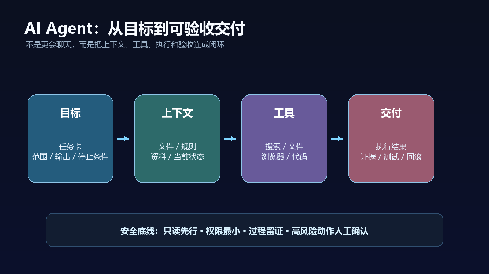

很多人第一次接触 AI Agent，会先问一句：“它和普通聊天机器人到底有什么区别？”

最直观的区别不是它会不会说得更像人，而是你交代完目标以后，它能不能继续往下做：读取资料、调用工具、修改文件、执行步骤、检查结果，并在关键节点停下来让你确认。

这意味着，AI 的入口正在从“提一个问题”变成“交代一项任务”。



## 一句话结论：Agent 不是更会聊天，而是更接近一个可控的执行系统

普通聊天机器人主要负责生成回复。你问它“帮我分析这份资料”，它通常会给出分析文字；如果下一步要查另一份文件、更新表格、运行脚本或整理交付物，往往还要你继续发指令。

AI Agent 的目标则是把一项工作拆成多个动作，连续完成这些动作，并把中间过程和最终结果交回来。

可以把它理解成四层：

1. **模型**：负责理解目标、推理和生成内容。
2. **上下文**：包括项目文件、历史记录、规则、参考资料和当前状态。
3. **工具**：包括搜索、文件读写、数据库、浏览器、代码执行和企业系统连接。
4. **执行与验收**：负责真正做动作、记录过程、处理失败，并检查结果是否符合要求。

缺少后面三层时，模型再强，也更像一个问答助手。真正的 Agent 系统，价值在于把“知道怎么做”变成“在边界内完成一段工作”。

OpenAI 在 2026 年 7 月介绍 ChatGPT Work 时，把它描述为能够跨应用和文件工作、把目标拆成更小步骤，并持续数小时推进项目的 Agent。这个产品案例说明，行业竞争的重点已经不只是模型回答质量，也包括任务持续性、工具连接和人工控制。具体功能、套餐和可用范围仍应以当前产品页面为准。

## 先分清三种东西：聊天、自动化和 Agent

这三类产品经常被混在一起，但使用方式完全不同。

### 第一类：聊天助手

它适合解释概念、改写文字、头脑风暴和生成初稿。任务通常由人一步一步推进，工具调用范围也比较有限。

### 第二类：固定自动化

它适合稳定、重复、规则明确的流程。例如每天把一封邮件中的附件保存到指定目录，或者当表格新增一行时发送通知。它的优点是可预测，缺点是遇到异常情况时通常不会自己判断。

### 第三类：Agent

它更适合目标明确、过程较长、需要在多个工具之间切换的任务。比如：先读取项目资料，再查公开信息，形成分析表，生成报告，运行检查，最后把问题清单交给负责人。

Agent 的灵活性更高，但风险也更高。因为它不只是在生成文字，而是在代表你访问资料、执行动作和改变状态。

## 一个可复用的 Agent 任务卡

不要把任务交代成“帮我把这个做好”。对 Agent 来说，越像工作单的请求，越容易得到可验收结果。

可以直接使用下面这套结构：

```text
目标：我要完成什么结果？
输入：你可以使用哪些文件、链接、数据或上下文？
范围：允许读取和修改哪些内容？明确禁止哪些目录或系统？
步骤：希望先做什么、后做什么？哪些步骤可以自主判断？
输出：最终要交付什么文件、表格、代码或清单？
验收：怎样判断结果合格？至少列出 3 条检查标准。
停止条件：遇到什么情况必须暂停并询问我？
```

比如，不要说：

> 帮我整理一下这个项目。

可以改成：

> 只读取 `docs/` 和 `src/`，不要修改文件。先画出项目入口和主要模块，再列出最近一次变更可能影响的 5 个位置。每个结论都附文件路径和行号；如果无法确认，就标记为待核验。最后输出一份 Markdown 报告。遇到需要联网、删除文件或修改代码时暂停。

后一种写法不一定更“聪明”，但它把目标、边界、证据和停止条件都写出来了，Agent 才有可能稳定执行。

## 让 Agent 真正完成任务，需要六个步骤

### 1. 先定义交付物，而不是先讨论模型

“我要一个能看的报告”“我要一份可以合并的修复”“我要一张可复用的表格”，这些都是交付物。交付物越具体，后面的选择越容易。

### 2. 把输入资料分成可信和待核验两类

项目规则、官方文档、原始数据和当前文件是输入；社交媒体帖子、模型猜测和没有出处的经验只能作为线索。不要让 Agent 把线索直接写成事实。

### 3. 先只读，再小范围写入

第一次运行时，优先让 Agent 浏览文件、生成计划和列出风险。确认它理解了项目以后，再允许它修改一个明确的输出目录或分支。

### 4. 要求它留下过程证据

过程证据可以是文件路径、命令输出、引用来源、变更摘要、测试结果和失败原因。没有证据的“完成了”，不适合进入正式交付。

### 5. 把高风险动作设为人工确认

发送消息、提交代码、删除文件、修改权限、支付费用、对外发布和处理敏感数据，都不应默认交给 Agent 自动完成。

### 6. 用验收标准结束，而不是用一句“看起来不错”结束

至少检查：结果是否完整、是否超出范围、是否保留来源、是否能复现、是否通过相关测试，以及失败时能否回滚。

## Agent 最适合做什么，不适合做什么

低风险、重复、可检查的工作，最适合先交给 Agent：

- 整理公开资料并生成带来源的初稿；
- 扫描代码库，建立模块地图；
- 生成测试、运行检查并汇总失败项；
- 把会议记录整理成待办、负责人和截止时间；
- 按固定格式转换文件、更新索引或生成报告。

高风险或责任归属不清的工作，要保守处理：

- 直接修改生产系统；
- 代替人做法律、医疗、金融或安全判断；
- 代表团队向客户作出承诺；
- 自动删除数据、变更权限或发送不可撤回的信息；
- 把未经审核的生成内容直接公开发布。

一个简单的分层原则是：**只读可以放宽，草稿可以委托，修改要限范围，发布和删除必须确认。**

## 三个最常见的误区

### 误区一：以为 Agent 越自主越好

自主性越高，越需要边界、日志和回滚。没有这些设施，所谓“自动化”只是把错误传播得更快。

### 误区二：只写目标，不写验收

“写得专业一点”“做得完整一点”无法帮助 Agent 判断是否完成。验收条件要尽量可观察，例如“每个结论都有来源”“不得修改指定目录之外的文件”“测试命令返回成功”。

### 误区三：把一次成功当成稳定能力

Agent 可能在一次任务中表现很好，但换一个目录、数据集、权限或版本就失败。真正可复用的流程，需要至少经历一次成功、一次异常和一次恢复验证。

## 结语：真正重要的是任务设计能力

AI Agent 让人兴奋的地方，不是它可以替你点击多少次，而是它正在改变人与软件的协作方式。

过去，我们学习的是“怎样使用一个工具”；现在，更值得学习的是“怎样把一项工作写成一个可执行、可检查、可暂停的任务”。

模型会继续升级，产品名称也会继续变化。但一个可靠的 Agent 工作流，始终离不开四件事：清晰目标、限定权限、过程证据和人工验收。

如果你准备第一次使用 Agent，不要从“帮我全自动完成一切”开始。先选一项低风险任务，给它一个明确输出目录，要求它先计划、再执行、最后报告检查结果。能把这条最小闭环跑通，才是从聊天助手走向工作型 AI 的第一步。

## 官方资料与核验入口

- [OpenAI：ChatGPT Work](https://openai.com/index/chatgpt-for-your-most-ambitious-work/)
- [OpenAI：New tools for building agents](https://openai.com/index/new-tools-for-building-agents/)
- [Model Context Protocol：What is MCP?](https://modelcontextprotocol.io/introduction)

> 资料核验时间：2026-08-07。产品入口、功能、套餐和权限可能变化；本文讨论的是工作方式和判断框架，不承诺某个产品长期保持同样能力。