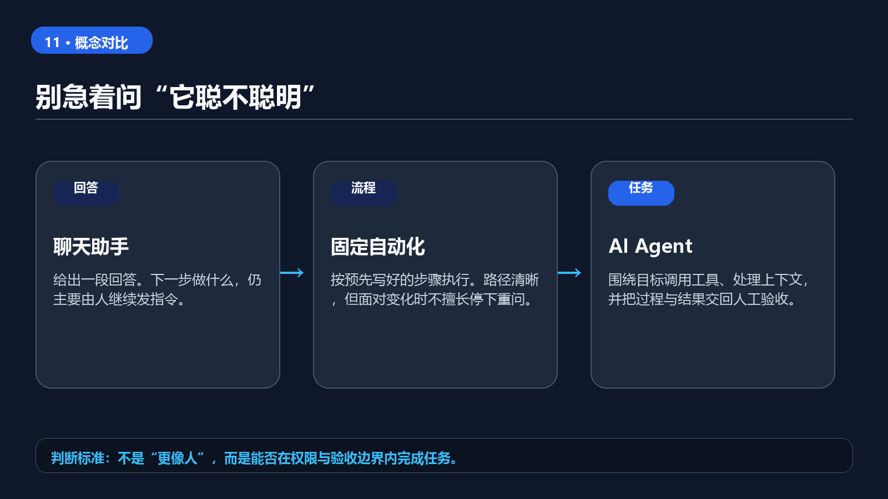
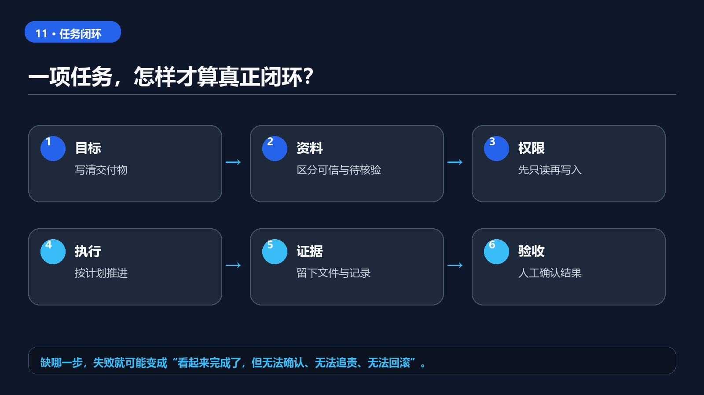

**11. AI Agent 到底是什么：从聊天机器人到自动完成工作的系统**

> 你真正担心的，往往不是 AI 能不能做，而是它做完以后，你还能不能解释、检查和撤回。

很多人第一次接触 AI Agent，会先问一句：“它和普通聊天机器人到底有什么区别？”

最直观的区别不是它会不会说得更像人，而是你交代完目标以后，它能不能继续往下做：读取资料、调用工具、修改文件、执行步骤、检查结果，并在关键节点停下来让你确认。

这意味着，AI 的入口正在从“提一个问题”变成“交代一项任务”。


> **可以转发的一句话：Agent 的分水岭，不是会不会调用工具，而是能否在边界内交付可验收结果。**
## 一句话结论：Agent 不是更会聊天，而是更接近一个可控的执行系统

普通聊天机器人主要负责生成回复。你问它“帮我分析这份资料”，它通常会给出分析文字；如果下一步要查另一份文件、更新表格、运行脚本或整理交付物，往往还要你继续发指令。

AI Agent 的目标则是把一项工作拆成多个动作，连续完成这些动作，并把中间过程和最终结果交回来。

可以把它理解成四层：

1. **模型**：负责理解目标、推理和生成内容。
2. **上下文**：包括项目文件、历史记录、规则、参考资料和当前状态。
3. **工具**：包括搜索、文件读写、数据库、浏览器、代码执行和企业系统连接。
4. **执行与验收**：负责真正做动作、记录过程、处理失败，并检查结果是否符合要求。

缺少后面三层时，模型再强，也更像一个问答助手。真正的 Agent 系统，价值在于把“知道怎么做”变成“在边界内完成一段工作”。

从官方开发文档看，主流 Agent 能力正在围绕“指令、上下文、工具、交接、护栏和追踪”组织起来。换句话说，行业竞争的重点已经不只是模型回答质量，也包括任务持续性、工具连接、过程记录和人工控制。具体产品名称、功能入口、套餐和可用范围仍会变化，写作或采购前都应以当前官方页面为准。

## 先分清三种东西：聊天、自动化和 Agent

这三类产品经常被混在一起，但使用方式完全不同。

### 第一类：聊天助手

它适合解释概念、改写文字、头脑风暴和生成初稿。任务通常由人一步一步推进，工具调用范围也比较有限。

### 第二类：固定自动化

它适合稳定、重复、规则明确的流程。例如每天把一封邮件中的附件保存到指定目录，或者当表格新增一行时发送通知。它的优点是可预测，缺点是遇到异常情况时通常不会自己判断。

### 第三类：Agent

它更适合目标明确、过程较长、需要在多个工具之间切换的任务。比如：先读取项目资料，再查公开信息，形成分析表，生成报告，运行检查，最后把问题清单交给负责人。

Agent 的灵活性更高，但风险也更高。因为它不只是在生成文字，而是在代表你访问资料、执行动作和改变状态。



这不是能力排行榜，而是责任边界的差异：输出一段文字、执行固定步骤、还是在约束内推进一项任务，所需的检查方式完全不同。

## 从一句话到交付物，中间多了五个环节

把 Agent 想清楚，最好不要从“它像不像人”开始，而要从一项工作如何被推进开始。一个相对完整的 Agent 任务，通常会经历五个环节：

1. **理解目标**：把用户的一句话拆成可执行目标、约束和交付物；
2. **读取上下文**：找到允许读取的文件、历史记录、规则或外部资料；
3. **制定计划**：决定先做哪些只读检查，哪些动作需要等待确认；
4. **调用工具**：读取、搜索、写入、运行检查或生成文件；
5. **验收与报告**：说明做了什么、改了哪里、证据是什么、还剩什么风险。

这五个环节里，模型只负责其中一部分。真正决定 Agent 是否可靠的，是上下文是否干净、工具权限是否收窄、过程是否可追踪、失败时能否停止。

因此，第一次评价一个 Agent，不要只看它“回答得聪不聪明”。更应该看三件事：它是否知道自己不能访问什么，它是否能在证据不足时停下来，它是否能把结果交成一个可检查的文件或清单。

## 一个可复用的 Agent 任务卡

不要把任务交代成“帮我把这个做好”。对 Agent 来说，越像工作单的请求，越容易得到可验收结果。

可以直接使用下面这套结构：

```text
目标：我要完成什么结果？
输入：你可以使用哪些文件、链接、数据或上下文？
范围：允许读取和修改哪些内容？明确禁止哪些目录或系统？
步骤：希望先做什么、后做什么？哪些步骤可以自主判断？
输出：最终要交付什么文件、表格、代码或清单？
验收：怎样判断结果合格？至少列出 3 条检查标准。
停止条件：遇到什么情况必须暂停并询问我？
```

比如，不要说：

> 帮我整理一下这个项目。

可以改成：

> 只读取 `docs/` 和 `src/`，不要修改文件。先画出项目入口和主要模块，再列出最近一次变更可能影响的 5 个位置。每个结论都附文件路径和行号；如果无法确认，就标记为待核验。最后输出一份 Markdown 报告。遇到需要联网、删除文件或修改代码时暂停。

后一种写法不一定更“聪明”，但它把目标、边界、证据和停止条件都写出来了，Agent 才有可能稳定执行。

## 让 Agent 真正完成任务，需要六个步骤

### 1. 先定义交付物，而不是先讨论模型

“我要一个能看的报告”“我要一份可以合并的修复”“我要一张可复用的表格”，这些都是交付物。交付物越具体，后面的选择越容易。

### 2. 把输入资料分成可信和待核验两类

项目规则、官方文档、原始数据和当前文件是输入；社交媒体帖子、模型猜测和没有出处的经验只能作为线索。不要让 Agent 把线索直接写成事实。

### 3. 先只读，再小范围写入

第一次运行时，优先让 Agent 浏览文件、生成计划和列出风险。确认它理解了项目以后，再允许它修改一个明确的输出目录或分支。

### 4. 要求它留下过程证据

过程证据可以是文件路径、命令输出、引用来源、变更摘要、测试结果和失败原因。没有证据的“完成了”，不适合进入正式交付。

### 5. 把高风险动作设为人工确认

发送消息、提交代码、删除文件、修改权限、支付费用、对外发布和处理敏感数据，都不应默认交给 Agent 自动完成。

### 6. 用验收标准结束，而不是用一句“看起来不错”结束

至少检查：结果是否完整、是否超出范围、是否保留来源、是否能复现、是否通过相关测试，以及失败时能否回滚。



把六步写清楚，不是为了让任务变慢，而是为了让任何一次失败都能被定位：是目标不清、资料不足、权限过宽，还是验收缺失。

## 把权限分成四档，而不是一上来全开放

Agent 最大的误用，是把“能自动完成工作”理解成“可以自动获得所有权限”。更稳妥的做法，是把任务能力分成四档逐步开放：

| 档位 | 允许做什么 | 典型任务 | 进入下一档前要证明什么 |
| --- | --- | --- | --- |
| 只读 | 读取指定目录、公开网页或脱敏资料 | 摘要、对比、问题清单 | 引用准确，越界请求会拒绝 |
| 草稿 | 在指定输出目录生成文件 | 报告初稿、测试草案、索引草稿 | 输出可复查，不覆盖原文件 |
| 小范围修改 | 修改明确指定的文件或分支 | 修正文档、补测试、更新配置 | diff 可解释，检查能通过，能回滚 |
| 对外动作 | 发送、发布、删除、合并或变更权限 | 邮件、上线、提交、支付、权限变更 | 必须有人工确认和责任人 |

这张表的意义，是把“自主性”拆成可管理的权限。一个 Agent 即使能连续执行很多步骤，也不代表它应该获得发布、删除或外发能力。越接近不可撤回动作，越应该让人确认。

## 团队第一次引入 Agent，建议按三轮推进

**第一轮：个人只读试验。** 选一项低风险任务，例如扫描公开文档、整理会议纪要或读取测试目录。目标是证明它能遵守范围、留下来源和承认不确定。

**第二轮：团队共享任务卡。** 把成功任务写成固定任务卡，明确输入目录、输出目录、禁止动作、验收人和失败处理。此时可以让不同成员复用同一张任务卡，观察结果是否稳定。

**第三轮：小范围自动化。** 只把重复、低风险、可回滚的步骤交给 Agent，例如生成日报草稿、刷新内部索引或汇总测试失败项。涉及客户承诺、生产系统、权限、财务、法律、医疗或安全结论的任务，仍应保留人工判断。

这个顺序看起来慢，但它能避免一个常见事故：先把能力接得很宽，出了问题才发现没人知道它读过什么、改过什么、依据是什么。

## 一个可复现的最小试验

第一次不要让 Agent 接管整个项目。准备一个不含敏感数据的测试目录，放入 3 到 5 份公开或自有的示例资料，并给出一张任务卡：

- **目标**：整理出一页项目摘要；
- **允许读取**：仅这个测试目录；
- **禁止动作**：不联网、不修改原文件、不发送邮件；
- **交付物**：摘要文件、引用的文件清单、未能确认的事项；
- **验收**：人工随机抽查两处引用是否准确。

如果它在资料缺失、文件名歧义或权限不足时能够停下来提问，而不是编造结论或越权继续，这次试验才算真正有价值。**失败的位置，就是下一轮该补的边界。**

## Agent 最适合做什么，不适合做什么

低风险、重复、可检查的工作，最适合先交给 Agent：

- 整理公开资料并生成带来源的初稿；
- 扫描代码库，建立模块地图；
- 生成测试、运行检查并汇总失败项；
- 把会议记录整理成待办、负责人和截止时间；
- 按固定格式转换文件、更新索引或生成报告。

高风险或责任归属不清的工作，要保守处理：

- 直接修改生产系统；
- 代替人做法律、医疗、金融或安全判断；
- 代表团队向客户作出承诺；
- 自动删除数据、变更权限或发送不可撤回的信息；
- 把未经审核的生成内容直接公开发布。

一个简单的分层原则是：**只读可以放宽，草稿可以委托，修改要限范围，发布和删除必须确认。**

## 三个最常见的误区

### 误区一：以为 Agent 越自主越好

自主性越高，越需要边界、日志和回滚。没有这些设施，所谓“自动化”只是把错误传播得更快。

### 误区二：只写目标，不写验收

“写得专业一点”“做得完整一点”无法帮助 Agent 判断是否完成。验收条件要尽量可观察，例如“每个结论都有来源”“不得修改指定目录之外的文件”“测试命令返回成功”。

### 误区三：把一次成功当成稳定能力

Agent 可能在一次任务中表现很好，但换一个目录、数据集、权限或版本就失败。真正可复用的流程，需要至少经历一次成功、一次异常和一次恢复验证。

## 判断一个 Agent 是否值得长期使用的 8 个问题

在把某个 Agent 放进长期工作流前，可以用下面 8 个问题做一次复核：

- 它的输入范围是否能被明确列出来？
- 它能否区分事实、推测和待核验信息？
- 它调用工具前是否能解释原因和风险？
- 它的输出是否包含路径、来源、日志或检查结果？
- 它遇到权限不足、资料缺失或冲突信息时是否会暂停？
- 它是否默认保护密钥、隐私数据和未授权素材？
- 它修改内容后是否能展示差异并支持回滚？
- 它是否把发布、删除、发送和权限变更留给人工确认？

如果这些问题大多答不上来，就不要急着把它称为“自动完成工作的系统”。那可能只是一个会调用工具的聊天助手，还没有进入可治理、可复盘、可交接的 Agent 阶段。

## 结语：真正重要的是任务设计能力

AI Agent 让人兴奋的地方，不是它可以替你点击多少次，而是它正在改变人与软件的协作方式。

过去，我们学习的是“怎样使用一个工具”；现在，更值得学习的是“怎样把一项工作写成一个可执行、可检查、可暂停的任务”。

模型会继续升级，产品名称也会继续变化。但一个可靠的 Agent 工作流，始终离不开四件事：清晰目标、限定权限、过程证据和人工验收。

如果你准备第一次使用 Agent，不要从“帮我全自动完成一切”开始。先选一项低风险任务，给它一个明确输出目录，要求它先计划、再执行、最后报告检查结果。能把这条最小闭环跑通，才是从聊天助手走向工作型 AI 的第一步。

> 如果你身边有人正在把“会聊天”误当成“能交付”，可以把这篇文章转给他。下一步最值得做的，是把一项低风险工作写成可验收的任务卡。
