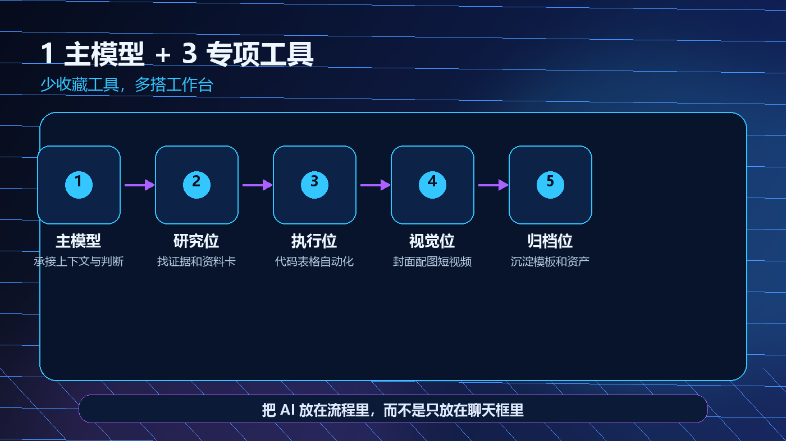

> 一句话结论：AI 工具不是越多越专业，真正高效的是把常用能力固定成一个稳定工作台。

过去两年，很多人对 AI 工具的使用方式像逛商场。今天收藏一个写作神器，明天试一个 PPT 神器，后天又看到一个自动剪视频神器。收藏夹越来越满，实际工作却没有明显变快。

问题不在工具不够好，而在工作台没有搭起来。每一次换工具，都要重新登录、重新上传资料、重新解释背景、重新调整格式。AI 帮你省下的时间，又被上下文迁移和结果验收吃掉了。

所以我现在不再追求收藏 100 个工具，而是更倾向于搭一套克制的组合：1 个主模型 + 3 个专项工具。它不是某个固定品牌清单，而是一套分工方法。你可以按自己的预算和习惯替换具体工具，但位置不要乱。



*图：一人 AI 工作台的能力分工，自制示意图。*

## 为什么收藏越多，越容易变慢

工具多会带来 4 种隐形成本。

第一是选择成本。你明明只是想写一段文章开头，却先开始纠结用哪个模型、哪个插件、哪个网站。

第二是上下文成本。同一个项目的资料散落在不同平台，每次都要重新解释一次背景。

第三是格式成本。不同工具输出风格不同，最后还要人工统一标题、图片、表格和语气。

第四是验收成本。工具越多，越难形成统一标准。你很难判断这次结果不好，是模型问题、提示词问题、资料问题，还是你选错了工具。

高效的人不是知道更多工具名字，而是知道每类任务该去哪个位置处理。

## 这套工作台的核心分工

### 1 个主模型：总控台

主模型负责承接长期上下文。它应该知道你的写作风格、常用输出格式、项目背景、禁用表达、质量标准和归档方式。

它不一定要承担所有任务，但要负责拆任务、定标准、看结果。

主模型最常做的事包括：

- 把想法拆成任务卡。
- 把复杂内容改成清晰结构。
- 维护你的个人表达风格。
- 帮你检查输出是否符合规范。
- 把一次成功经验沉淀成模板。

一个好主模型，像你的工作总控台。你不需要每次从零介绍自己是谁、要做什么、什么不能写。

### 专项工具一：深度研究位

研究位负责找资料、读资料、做证据卡。它的关键词不是写得快，而是可追溯。

研究位应该能做到：

- 给出来源链接或来源说明。
- 区分事实、观点和推断。
- 标注时间和口径差异。
- 把长资料拆成可复用资料卡。
- 主动列出不确定项。

如果一个工具只能给你一段流畅总结，却不能说明依据，它不适合放在研究位。

### 专项工具二：执行自动化位

执行位负责把重复劳动变成可运行步骤。它可以是编程 Agent、自动化工具、表格脚本，也可以是你本地的一套模板。

执行位适合处理：

- 批量重命名文件。
- 清洗表格数据。
- 生成固定格式文档。
- 把文章同步到知识库。
- 检查 Markdown 格式。
- 做一个轻量网页或小工具。

执行位最重要的标准是可回滚、可验证、过程透明。它不是替你决定业务方向，而是替你把确定动作做完。

### 专项工具三：视觉内容位

视觉位负责封面、配图、图表、短视频草图和视觉统一。

很多人把视觉工具当成灵感玩具，结果图越来越炫，内容越来越散。更好的做法是给视觉位固定规范：画面比例、标题区域、主色调、字体层级、是否允许出现真实人物、是否允许出现品牌标识、图片是否需要标注 AI 视觉。

视觉位服务内容，不抢内容。

## 一次任务怎样流经这 4 个位置

以写一篇 AI 工具方法文章为例。

```text
主模型：把选题拆成读者痛点、文章结构和验收标准。
研究位：补充事实、案例、产品资料和反例。
主模型：基于资料生成初稿和小标题。
视觉位：根据文章核心观点生成封面和正文图。
执行位：检查格式、重命名素材、更新索引。
主模型：做最后一轮语气和逻辑检查。
```

这条流程的重点，是每个位置只做擅长的事。研究工具不替你决定观点，视觉工具不替你编事实，执行工具不替你判断要不要发布。


*图：新工具进入工作台前的 4 个门槛，自制贴图。*

## 如何判断一个新工具是否值得加入

我会用 4 个问题筛掉大部分冲动收藏。

### 它解决的是高频问题吗

如果一个工具一个月只用一次，它不一定要进入工作台。可以临时使用，但不要为它重建流程。

高频问题才值得固化。比如每周都要写文章，每周都要整理资料，每周都要做封面，这些才适合进入固定工作台。

### 它是否真正互补

不要因为某个工具宣传更强，就立刻替换现有工具。先问它补的是哪块短板：更会检索、更会执行、更会画图、更会管理项目，还是只是界面更好看。

如果它和现有工具能力高度重复，只会增加切换成本。

### 它的结果能不能验收

任何进入工作台的工具，都要能被检查。

研究结果要能追溯来源；代码结果要能运行测试；图片结果要符合尺寸和版权边界；文章结果要符合格式规范。

不能验收的效率，最后都会变成返工。

### 它的产物能不能归档

很多工具用完很爽，但产物难以沉淀。对长期工作来说，这很危险。

一篇文章的资料卡、提示词、封面提示、配图、版本记录和发布状态，都应该能放回同一个项目空间。否则你下次还是从零开始。

## 给个人使用者的最小配置

如果你是内容创作者、自由职业者、运营或独立开发者，可以从下面这个最小配置开始。

- 主模型：负责日常对话、拆任务、写作和审稿。
- 研究位：负责联网资料、长文档阅读、证据卡整理。
- 执行位：负责文件处理、自动化脚本、表格和小工具。
- 视觉位：负责封面、正文图、图标和短视频视觉草图。
- 归档位：一个固定文件夹或知识库，用来存文章、素材、提示词和检查清单。

注意，归档位不一定是 AI 工具，但它非常重要。没有归档位，你的工作台会变成一次性消耗品。

## 工作台的文件夹也要固定

我建议至少保留 6 个目录。

```text
01-选题池：灵感、标题、读者痛点
02-资料卡：事实、案例、链接、待核验项
03-初稿区：不同版本正文
04-视觉区：封面、正文图、图标、提示词
05-发布区：最终版、平台适配版、发布状态
06-模板库：提示词、检查清单、复盘记录
```

这套目录不复杂，但它能让 AI 真正复用你的过去经验。很多人以为自己缺工具，其实缺的是固定入口和固定出口。

## 什么时候该换工具

换工具有 3 个合理理由。

第一，现有工具在你的高频任务上连续失败，而且你已经排除提示词和资料问题。

第二，新工具能减少一个关键环节，比如直接把资料卡同步到知识库，或者自动完成格式检查。

第三，新工具的成本和风险更低，比如权限更清晰、数据留存更可控、导出更方便。

不合理的换工具理由也很常见：别人都在用、界面好看、演示很震撼、价格限时优惠。这些都不能证明它适合你的工作台。

## 结尾

AI 工具使用的下半场，不是比谁收藏得多，而是比谁的工作流更稳定。

当你有一个主模型承接上下文，有三个专项位置分别处理研究、执行和视觉，再加一个固定归档位，AI 才会从零散工具变成持续生产力。

少一点工具焦虑，多一点工作台意识。你会发现真正让人变快的，不是多打开一个网站，而是少重复一次解释、少返工一次格式、少丢失一次上下文。
