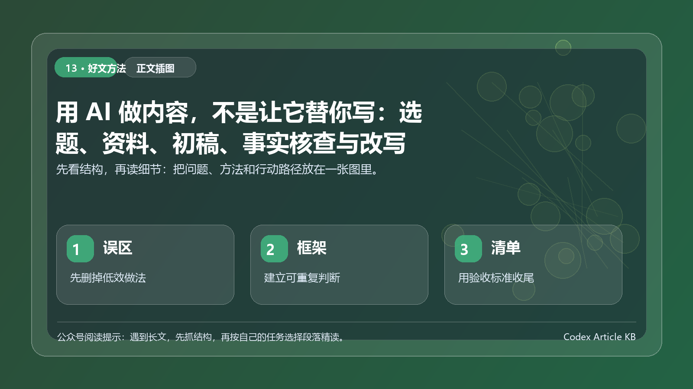

> 一句话结论：用 AI 做内容，不是把写作外包，而是把选题、资料、初稿、核查和改写拆成可控流程。



*图：先用一张结构图把本文的重点、方法和行动路径串起来。*


AI 写得越来越快之后，内容创作者最容易掉进一个坑：觉得产量上来了，质量也会自然上来。实际并不是。很多 AI 初稿读起来通顺，但没有个人判断，没有真实经验，也没有清晰证据。它像一篇什么都说了、但读完记不住的文章。

我更推荐把 AI 放进内容工作流，而不是让它直接替你写。人保留观点、经验、取舍和责任；AI 处理结构化劳动，比如拆结构、整理资料、找表达角度、检查逻辑、统一格式。

这篇文章给出一套可复用流程：选题、资料、初稿、事实核查、改写。它适合公众号、知乎、职场内容和知识型自媒体。

*图：从选题到改写的内容生产流程，自制示意图。*

## 第一步：选题不是想标题，而是找冲突

好选题通常不是一句漂亮标题，而是一个清晰冲突。

比如 AI 工具越来越多，这是事实，但不够好。更有冲突的选题是：为什么你收藏了 100 个 AI 工具，工作还是没有变快。

这个冲突里有读者痛点，也有观点空间。AI 可以帮你扩展选题，但你要先给它判断标准。

```text
请围绕 AI 工具使用，生成 10 个适合公众号的选题。
要求：
1. 每个选题都要有明确读者痛点。
2. 不要夸张承诺，不要全自动赚钱叙事。
3. 每个选题写出核心冲突、目标读者和可展开角度。
4. 标题不要使用问号。
5. 优先选择能提供方法论、清单或工作流的方向。
```

选题阶段不要急着写正文。先看 3 件事：读者是谁，冲突够不够具体，你有没有自己的判断。

如果这 3 件事缺任何一个，AI 写出来也只是顺滑的空话。

## 第二步：资料不是堆链接，而是做资料卡

资料收集的目标不是证明自己很认真，而是给文章提供可信支撑。

我通常把资料分成 4 类。

- 事实资料：产品功能、官方说明、公开数据、法规政策、时间线。
- 经验资料：自己的操作记录、项目复盘、用户反馈、失败案例。
- 观点资料：行业分析、专家访谈、长文评论。
- 反例资料：和自己观点相反的案例或风险。

AI 很适合把散乱资料整理成资料卡。

```text
请把下面资料整理成内容资料卡。
每张卡包含：
- 资料主题
- 可支持的观点
- 证据类型
- 是否需要人工复核
- 适合放在文章哪个部分
- 可能的误用风险
```

资料卡的关键，是让每条信息都有去处。没有去处的资料不要硬塞进正文。内容不是资料越多越专业，而是证据刚好支撑观点。

## 第三步：初稿只搭骨架，不抢观点

我不会让 AI 直接写最终稿，而是先让它搭一个骨架。

一个好骨架应该回答：

- 开头如何抓住读者痛点。
- 主体分几段，每段解决什么问题。
- 哪些地方需要案例或数据。
- 哪些地方需要提醒风险。
- 结尾给读者留下什么行动。

可以这样提示。

```text
基于选题和资料卡，帮我生成文章初稿框架。
要求：
1. 不要替我编造个人经历。
2. 每个小节都写清楚它要解决的读者问题。
3. 标出需要我补充经验的位置。
4. 标出需要事实核查的位置。
5. 语言保持克制，不用夸张营销口吻。
```

注意这里的重点是框架，不是成文。AI 可以先搭桥，但桥上走什么人、看什么风景，仍然由你决定。

## 第四步：事实核查要逐句拆

很多内容的问题不是观点错，而是细节太满。比如最强、唯一、必备、行业都在用、官方已经明确，这类表达如果没有证据，很容易变成风险。

事实核查不应该只在最后扫一眼，而要逐句拆。

我会让 AI 做一轮红队审稿。

```text
请以事实核查编辑的身份检查下面文章。
请标出：
1. 需要来源支撑的事实判断。
2. 可能过度泛化的表达。
3. 容易被读者误解为承诺的句子。
4. 需要补充边界条件的建议。
5. 可以改成更稳妥表达的位置。

不要重写全文，只输出问题清单和修改建议。
```

这一步要特别注意：AI 只能帮你发现疑点，不能替你确认事实。涉及产品功能、价格、政策、法律、医学、金融等内容，要回到可靠来源人工确认。

*图：内容编辑的 4 个关键关口，自制贴图。*

## 第五步：改写不是润色，而是统一读者体验

很多人把改写理解成让文章更华丽。其实公众号文章更需要的是顺畅、清楚、有节奏。

改写时可以让 AI 做 4 件事。

第一，压缩空话。删掉不产生信息量的句子。

第二，统一口吻。不要一会儿像报告，一会儿像广告，一会儿像说明书。

第三，强化段落推进。每个小标题都要往前走，不能只是换一种说法重复。

第四，检查手机阅读体验。长段落要拆，宽表格要改成列表，图片和文字不能挤在一起。

我的改写提示通常是这样。

```text
请作为公众号编辑，帮我做一轮改写建议。
要求：
1. 保留我的核心观点和表达风格。
2. 删除空泛、重复和过度营销的句子。
3. 优化小标题，让它们形成递进关系。
4. 检查是否适合手机阅读。
5. 不添加新的事实、案例或数据。
```

最后一句很重要。改写阶段不应该再凭空增加事实。如果需要新增信息，就回到资料阶段。

## AI 不能替你完成的部分

AI 可以把初稿写得很完整，但有 4 件事最好留给人。

第一，真实立场。你到底赞成什么、反对什么、保留什么，这决定文章有没有人格。

第二，经验颗粒度。你踩过的坑、做过的选择、改过的版本，是 AI 不能替你编的。

第三，责任边界。内容如果涉及工具推荐、安全建议、商业判断，你要对读者负责。

第四，取舍能力。不是所有资料都要写进文章。能删，才说明你真的理解。

## 配图也要服务观点

内容配图不是装饰。它应该承担三类任务。

第一类是流程图，帮助读者理解方法步骤。比如本文的选题到改写流程。

第二类是贴图或卡片，帮助读者记住关键检查项。

第三类是示例截图或示意图，帮助读者看懂具体操作。但如果是 AI 生成图或自制示意图，要在图注里说清楚，不要伪装成真实产品截图。

配图数量不一定多，但每张都要回答一个问题：读者看完这张图，是否更容易执行文章方法。

## 把一次流程沉淀成模板

真正的提效，是下一篇文章不用从零开始。

可以把这套内容流程沉淀成 5 个模板。

```text
选题模板：标题、读者、冲突、角度、反例
资料模板：事实、经验、观点、风险、待核验
初稿模板：开头、主体、小结、行动建议
核查模板：事实、泛化、承诺、版权、格式
改写模板：口吻、节奏、删减、手机阅读、归档
```

每写完一篇文章，都补充一次模板。下一次调用 AI 时，你给它的就不是临时提示词，而是一套稳定生产系统。

## 一个事实核查前后对比

AI 初稿里经常会出现“听起来很像真的”的句子。比如它写：某工具已经成为行业标准。这个说法太满，除非你有明确数据或官方材料，否则应该改成：在一些团队的公开分享中，这类工具常被用于某些场景。

再比如它写：所有企业都应该引入 Agent。更稳的写法是：如果任务重复、输入稳定、风险可控，企业可以先从低风险场景试点 Agent。

事实核查不是把文章写得保守，而是让每个判断都有边界。新手可以给 AI 一个固定要求：把正文中的事实、推断和建议分开标注，并列出需要我人工核验的句子。

## 结尾

用 AI 做内容，最好的状态不是让它替你写完，而是让它帮你把混乱的创作过程变得可管理。

你负责选题判断、真实经验、观点取舍和最后责任；AI 负责资料整理、结构搭建、风险提示和格式检查。这样写出来的内容，既不会像机器拼接，也不会把人拖回低效重复劳动。

## 一个错误示例和修正方式

错误用法通常是这样的：给 AI 一句话，让它直接写一篇完整文章。结果看起来流畅，但最大的问题是你不知道哪些信息可靠，哪些观点只是它顺手补出来的。

更稳的方式，是把内容生产拆成 5 个小任务：先让 AI 列选题角度，再让它整理资料卡，然后生成提纲，接着写初稿，最后做事实和表达检查。每一步都只解决一个问题，不让 AI 同时负责资料、判断和最终表达。

可以这样下指令：

```text
先不要写正文。
请基于我提供的材料，输出：
1. 这篇文章可以解决的读者问题；
2. 最适合的核心观点；
3. 哪些内容证据不足，不能写成确定结论；
4. 适合展开的 5 个小节标题。
```

这条指令的重点是“先不要写正文”。它把 AI 从写手拉回到编辑助理的位置，让你先控制方向，再决定是否进入初稿。

## 内容创作者真正要保留的判断权

AI 可以帮你把资料变顺，但不能替你决定哪些话应该说、哪些话不能说。尤其是涉及产品能力、行业趋势、个人经历和案例结果时，创作者必须保留最后判断。

一篇能发出去的文章，不是语气最像人的文章，而是观点、证据、边界和读者收益都站得住的文章。AI 负责加速，作者负责可信。
