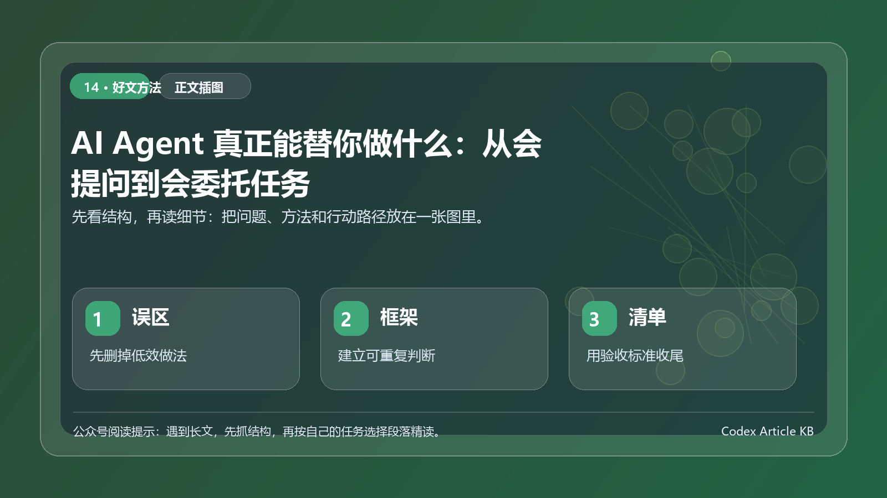

> 一句话结论：判断 AI Agent 是否有用，不能只看演示多炫，而要看目标是否清晰、过程是否透明、结果是否可验、风险是否可控。

*图：先用一张结构图把本文的重点、方法和行动路径串起来。*

AI Agent 的讨论越来越热。有人把它看成新同事，有人把它看成自动化工具，也有人期待它能替自己完成整套工作。问题是，如果只看宣传演示，很容易高估它；如果只看一次失败，又容易低估它。

更可靠的方法，是用具体任务测试它的边界。

标题里的我用，指的是一套可复现实验流程：把常见工作拆成 7 类任务，看 Agent 在每类任务里能做什么、必须人来验收什么、什么情况下不能放手。它不是某个模型或某个工具的绝对测评，而是一份普通人可参考的使用边界图。

*图：Agent 常见任务边界拆解，自制示意图。*

## 先定测试标准，再谈能不能替你做

很多人测试 Agent 的方式，是随手丢一个任务，然后凭感觉判断好不好。这种测法不稳定。任务太模糊，失败不一定是 Agent 不行，也可能是你没有给清楚目标；结果看起来不错，也不代表它能交付，因为你没有验收标准。

我建议用 4 个维度给每个任务打分。

### 目标清晰度

Agent 是否知道完成标准。比如整理资料不是一个清晰目标，整理 20 条资料，按时间、主题、证据强度分组，并列出 5 个待核验项，才是清晰目标。

### 过程透明度

Agent 是否能说明自己做了什么、改了什么、依据是什么。如果它只给你一个结果，不解释过程，你很难判断是否可靠。

### 结果可验性

你能不能独立检查结果。资料能不能回到来源，代码能不能运行，表格能不能复算，方案能不能对应需求。

### 风险可控性

任务是否涉及隐私、资金、权限、删除、公开发布等高风险动作。风险越高，人越不能退出。

*图：判断 Agent 是否可交付的 4 个评分维度，自制贴图。*

## 任务一：竞品资料收集

适合交给 Agent，但不能直接交给它下结论。

Agent 擅长做的是召回、分类和初步摘要。比如让它收集某类产品的官网信息、功能点、价格页面、更新日志、常见用户评价，再整理成资料卡。

更好的任务描述是：

> 示例卡：
>
> 请收集 5 个同类产品的公开资料。
> 每个产品输出：定位、核心功能、目标用户、价格口径、最近更新信号、可核验来源、待确认问题。
> 不要输出排名，不要替我判断谁最好。

人要验收的是：来源是否可靠，时间是否过旧，是否遗漏关键玩家，是否把营销话术当成事实。

边界结论：Agent 可以做资料助理，不适合直接做最终市场判断。

## 任务二：会议纪要和行动项

这是 Agent 比较适合的任务，前提是原始材料质量足够好。

它可以从录音转写或会议记录里提取决策、行动项、负责人、截止时间和未决问题。它比人更耐心，也更适合处理长文本。

但会议纪要最怕把讨论误写成决策。比如会上有人说可以考虑下周上线，不能直接写成决定下周上线。

建议让 Agent 按下面结构输出。

> 示例卡：
>
> 请整理会议纪要，分成四类：
> 1. 已确认决策。
> 2. 待确认问题。
> 3. 行动项，包含负责人和时间。
> 4. 风险和分歧。
>
> 如果原文没有明确负责人或时间，请标记为缺失，不要自行补充。

边界结论：Agent 适合做纪要初稿，人必须确认决策和责任人。

## 任务三：数据整理和初步分析

如果数据规则清楚，Agent 很有用。比如清洗重复项、统一格式、按维度汇总、生成图表说明。

但如果数据来源混乱、字段含义不清，Agent 很容易做出看似合理的错误分析。

适合的任务：

- 把表格字段统一成固定格式。
- 找出缺失值和异常值。
- 按月份、渠道、客户类型汇总。
- 生成分析提纲和可能原因。

不适合直接放手的任务：

- 基于不完整数据做战略结论。
- 没有口径说明的同比环比分析。
- 涉及财务、医疗、合规等高风险判断。

验收时要重点看：计算口径是否说明，原始数据是否保留，异常值是否被误删，结论是否超出数据能支持的范围。

边界结论：Agent 适合做数据整理员，不适合在口径不清时做最终分析师。

## 任务四：方案草稿

写方案是很多人最想交给 Agent 的工作。它确实能快速搭结构，尤其适合从空白页推进到第一版。

但方案最核心的是取舍。目标用户是谁，预算是多少，资源能不能支撑，优先级怎么排，这些不能完全交给 Agent。

我会让 Agent 先写框架，而不是直接写完整方案。

> 示例卡：
>
> 请基于下面背景生成方案骨架。
> 要求：
> 1. 先列出目标和约束。
> 2. 给出 3 个可选路径。
> 3. 每个路径写出适用场景、成本、风险和不做的内容。
> 4. 不要使用过度确定的承诺。
> 5. 最后列出需要我补充的信息。

这样输出的方案更像讨论稿，而不是伪装成熟的终稿。

边界结论：Agent 适合搭方案骨架，人必须决定取舍和承诺。

## 任务五：搭网页或小工具原型

Agent 在这个任务上很有价值。只要需求足够清楚，它可以快速给出页面、交互和可运行版本。

但原型不等于产品。它能帮你验证想法，不代表可以直接上线服务真实用户。

适合给 Agent 的目标是：

> 示例卡：
>
> 做一个本地可运行的客户线索看板。
> 只需要新增、查看、搜索和状态筛选。
> 不需要登录，不接真实数据库，不使用真实客户数据。
> 完成后说明启动方式、测试方式和已知限制。

验收时看 4 点：能不能启动，核心动作能不能完成，数据是否按预期保存，风险边界是否说明。

边界结论：Agent 适合做原型加速器，但上线前需要工程、安全和业务验收。

## 任务六：资料归档和知识库整理

这是 Agent 很容易被低估的场景。相比让它写惊艳文章，整理资料更能稳定提效。

你可以让它把一批文章、会议纪要、项目文档整理成统一格式：标题、摘要、标签、关键结论、行动项、相关链接、待核验问题。

长期看，这会降低上下文丢失。下一次写文章、做方案、开会时，AI 能从已有知识库里继续工作。

风险在于：归档规则不清时，Agent 会把资料放得很散。今天叫案例，明天叫实践，后天叫经验，最后还是找不到。

边界结论：Agent 适合做知识库助理，但分类体系要由人先定义。

## 任务七：自动化流程

自动化流程最吸引人，也最需要谨慎。比如定时抓取资料、自动整理表格、自动生成周报、自动发布内容、自动同步文件。

这些任务一旦跑起来，会重复执行。正确时很省事，错误时也会批量放大问题。

所以自动化流程要先从低风险动作开始。

适合先自动化的：

- 文件重命名。
- 素材归档。
- 格式检查。
- 生成草稿。
- 通知提醒。

不适合一开始就全自动的：

- 自动付款。
- 自动删除大量数据。
- 自动发布到公开平台。
- 自动发送商业邮件。
- 自动处理隐私和合同文件。

边界结论：Agent 可以执行自动化，但权限、日志、人工确认和回滚机制必须先设计好。

## 我会把 Agent 能力分成 3 层

第一层是放心委托。比如资料整理、格式检查、草稿结构、重复文件处理。这些任务出错成本较低，结果也容易检查。

第二层是协作完成。比如行业调研、方案草稿、数据分析、网页原型。Agent 可以做大量中间工作，但人要确认方向和结论。

第三层是严控执行。比如涉及钱、权限、隐私、删除、公开发布、法律合规的任务。Agent 可以提供建议或草稿，但不能绕过人工确认。

这个分层比一句 Agent 能不能替你做更有用。因为大多数真实工作都不是能或不能，而是做到哪一步必须停下来验收。

## 给每个 Agent 任务加一个停止点

如果你想稳定使用 Agent，建议每个任务都加停止点。

> 示例卡：
>
> 在以下情况停止并等待我确认：
> 1. 需要访问外部账号或敏感数据。
> 2. 需要删除、覆盖或批量修改文件。
> 3. 需要发布到公开平台。
> 4. 发现资料口径不一致。
> 5. 发现需求与现有实现冲突。
> 6. 无法验证结果是否正确。

停止点不是拖慢效率，而是防止效率变成事故。

## 同一个任务：聊天式提问和 Agent 委托的区别

聊天式提问是：帮我分析一下这个竞品。这个问题能得到一段回答，但很难直接交付。

Agent 式委托是：请整理 A、B、C 三个竞品的公开信息，只使用我提供的链接；输出产品定位、价格、核心功能、用户评价和待核验信息；不要编造数据；最后给出我今天应该继续查的 5 个问题。

两者差别不在语气，而在任务结构。Agent 需要知道材料从哪里来、结果交给谁、什么不能做、怎样算完成。你越早把这些说清楚，越不需要在后面反复纠错。

## 结尾

AI Agent 真正能替你做的，不是整个工作，而是工作里那些目标清楚、过程可记录、结果可验证、风险可控制的部分。

它可以是资料助理、纪要编辑、数据清洗员、方案骨架师、原型工程师、知识库管理员和自动化执行者。但它不应该替你承担判断、承诺和责任。

把 Agent 当成能干活的协作者，而不是自动许愿机。你会更少失望，也更容易真正用起来。

## 本次整合说明

下面内容合并了同主题原稿中的关键观点，删除了重复解释，并把分散的操作步骤统一到一条更完整的阅读路径里。整合后的重点不是让文章更长，而是让读者能从“知道一个概念”继续走到“可以自己执行一次”。

> 一句话结论：把 AI 从聊天框升级为可委托任务系统，需要先改变的不是工具，而是任务设计方式。

很多人学习 AI 的第一反应，是继续收集提示词。但 2026 年更值得练的能力，是把一个模糊需求改造成可委托、可检查、可复用的任务。

OpenAI 在 2026 年 6 月发布的经济研究文章里，把 Agentic AI 的变化说得很直接：知识工作的单位正在从一次次短交互，转向可以持续数分钟甚至数小时的长期委托任务。文章还披露，在 2026 年 5 月，被抽样的 Codex 个人用户中，超过七成发起过相当于人类 1 小时以上工作的任务请求。

这不是模型更会聊天的故事，而是人如何重新安排工作的故事。

## 为什么这个话题现在值得写

第一，工具能力正在从回答走向执行。当 AI 可以浏览网页、读文件、调用工具、运行命令或操作桌面，用户面对的就不再是一个聊天框，而是一个需要被安排、约束和验收的任务系统。

第二，企业和个人都开始遇到同一个问题：AI 输出越来越快，但可交付结果并不会自动变多。真正影响效率的，是任务定义、上下文质量、权限边界、验证方式和复盘机制。

第三，这个方向有连续写作价值。它既能写产品趋势，也能写工作方法；既能写企业落地，也能写普通人的使用教程。

## 读者最容易误解的地方

很多人会把这个话题理解成换一个更强模型。这会漏掉关键点：模型只是能力来源，工作流才决定能力能不能变成结果。

另一种误解是把 Agent 当成全自动员工。更稳的做法，是把它看作能承担部分执行动作的协作者。人仍然负责目标、边界、判断和最终责任。

## 可以直接采用的做法

- 把需求写成任务卡，而不是一句问题。
- 把任务拆成资料、执行、校验三个阶段。
- 给 Agent 明确权限：能读什么、能改什么、不能碰什么。
- 要求它输出证据、待确认项和下一步，而不只是最终答案。
- 把成功流程沉淀成 Skill、AGENTS.md 或团队模板。

## 一个低风险试点

选一个每周都会重复、但失败成本不高的任务，例如资料整理、会议纪要、竞品摘要、代码小修复、表格清洗或文章初稿。

把任务拆成四段：

1. 输入：给 AI 哪些资料，哪些资料不能用；
2. 执行：让 AI 只做一个明确阶段；
3. 校验：要求列出来源、假设和待确认项；
4. 沉淀：把好用提示词、文件结构和检查表保存下来。

跑通一次后，再决定是否扩大权限和范围。

## 写作延展方向

这篇可以继续拆成三个角度：

- 面向普通读者：如何把 AI 用成稳定工作流；
- 面向团队管理者：如何给 Agent 设置权限和验收机制；
- 面向开发者：如何把 Agent 接入工具、数据和自动化流程。

## 本次整合说明

下面内容合并了同主题原稿中的关键观点，删除了重复解释，并把分散的操作步骤统一到一条更完整的阅读路径里。整合后的重点不是让文章更长，而是让读者能从“知道一个概念”继续走到“可以自己执行一次”。

> 一句话结论：普通人真正需要升级的不是提示词数量，而是任务拆解、边界设置、验收和复盘。

会提问曾经是 AI 使用的核心技能。到了 Agent 开始能浏览、读文件、写代码、做表格、调用工具之后，只会提问已经不够了。你需要像安排一个协作者那样安排 AI。

这并不意味着每个人都要学编程。更现实的升级路径是：把任务说明白，把资料交完整，把权限设清楚，把结果验收掉，把好用流程留下来。

从 OpenAI、Anthropic、InfoQ 和多篇近期讨论看，AI 的能力正在从回答走向执行。人的角色也在变化：少做复制粘贴，多做目标定义、过程校验和最终判断。

## 为什么这个话题现在值得写

第一，工具能力正在从回答走向执行。当 AI 可以浏览网页、读文件、调用工具、运行命令或操作桌面，用户面对的就不再是一个聊天框，而是一个需要被安排、约束和验收的任务系统。

第二，企业和个人都开始遇到同一个问题：AI 输出越来越快，但可交付结果并不会自动变多。真正影响效率的，是任务定义、上下文质量、权限边界、验证方式和复盘机制。

第三，这个方向有连续写作价值。它既能写产品趋势，也能写工作方法；既能写企业落地，也能写普通人的使用教程。

## 读者最容易误解的地方

很多人会把这个话题理解成换一个更强模型。这会漏掉关键点：模型只是能力来源，工作流才决定能力能不能变成结果。

另一种误解是把 Agent 当成全自动员工。更稳的做法，是把它看作能承担部分执行动作的协作者。人仍然负责目标、边界、判断和最终责任。

## 可以直接采用的做法

- 用任务目标—交付物—资料—限制—验收五句话开始。
- 一次只交给 AI 一个清楚阶段，不要从开头自动跑到底。
- 让 AI 标记不确定项，而不是假装全知道。
- 重要输出至少做一次事实、格式和风险检查。
- 把每周重复三次以上的流程记录成模板、Skill 或自动化。

## 一个低风险试点

选一个每周都会重复、但失败成本不高的任务，例如资料整理、会议纪要、竞品摘要、代码小修复、表格清洗或文章初稿。

把任务拆成四段：

1. 输入：给 AI 哪些资料，哪些资料不能用；
2. 执行：让 AI 只做一个明确阶段；
3. 校验：要求列出来源、假设和待确认项；
4. 沉淀：把好用提示词、文件结构和检查表保存下来。

跑通一次后，再决定是否扩大权限和范围。

## 写作延展方向

这篇可以继续拆成三个角度：

- 面向普通读者：如何把 AI 用成稳定工作流；
- 面向团队管理者：如何给 Agent 设置权限和验收机制；
- 面向开发者：如何把 Agent 接入工具、数据和自动化流程。
