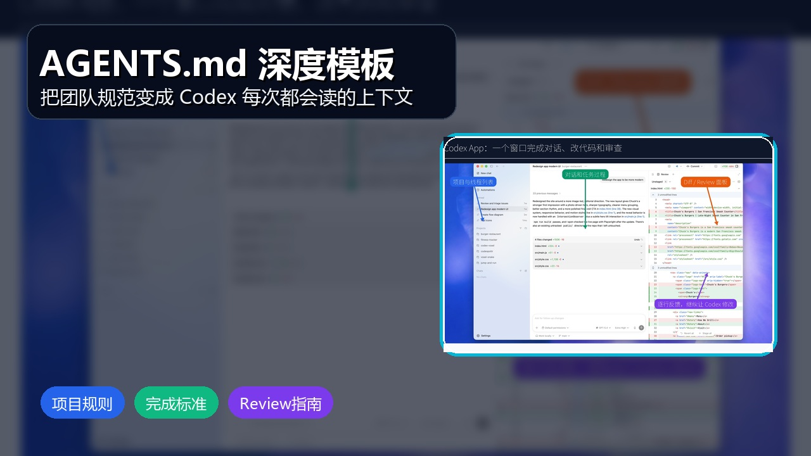
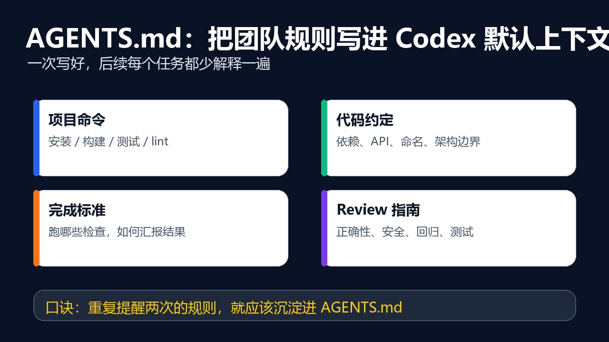

# AGENTS.md 深度模板：让 Codex 按团队规则工作

副标题：把你反复提醒 Codex 的话，写成项目默认上下文。



## 开篇

如果你每次使用 Codex 都要重复说：

- 这个项目用 pnpm，不要用 npm。
- 改 TypeScript 后要跑 typecheck。
- 不要随便新增依赖。
- 不要改公开 API。
- 最后要汇报测试命令。

那就说明这些规则不该继续靠手打，而应该沉淀到 `AGENTS.md`。

`AGENTS.md` 可以理解为“写给 Codex 的项目工作手册”。它越清晰，Codex 越容易按团队习惯工作。

## 一、AGENTS.md 应该写什么

一个实用的 `AGENTS.md` 不需要很长，但要覆盖四类信息：

1. 项目命令：安装、启动、构建、测试、格式化。
2. 代码约定：语言、框架、目录边界、依赖规则。
3. 完成标准：什么情况下可以说任务完成。
4. Review 重点：哪些风险必须优先检查。

不建议写成泛泛的口号，比如：

```md
- Write clean code.
- Follow best practices.
```

更好的写法是：

```md
- Use `pnpm`, not `npm`.
- After editing TypeScript files, run `pnpm typecheck`.
- Do not change public API contracts unless the user explicitly asks.
- Before adding a runtime dependency, explain why the existing stack is not enough.
```

## 二、推荐模板：适合大多数项目



可以从这份模板开始：

```md
# AGENTS.md

## Project commands

- Install dependencies with `pnpm install`.
- Start local development with `pnpm dev`.
- Build with `pnpm build`.
- Run lint with `pnpm lint`.
- Run type checks with `pnpm typecheck`.
- Run tests with `pnpm test`.

## Coding rules

- Prefer existing project patterns over new abstractions.
- Keep changes scoped to the requested task.
- Do not introduce production dependencies unless necessary.
- Do not change public APIs, database schemas, or config defaults unless explicitly requested.
- Add tests when behavior changes or a bug fix needs regression coverage.

## Verification

- Run the smallest relevant verification command before final response.
- If verification cannot run, explain the exact reason and the command the user should run.
- Final response should include changed files, verification result, and remaining risk.

## Review focus

- Prioritize correctness, security, regressions, data loss, and missing tests.
- For frontend changes, check responsive layout and text overflow.
- For backend changes, check validation, auth, error handling, and migration safety.
```

## 三、前端项目模板

如果你的项目是 Web、管理后台、小程序或移动端，可以补充：

```md
## Frontend expectations

- Reuse existing components and design tokens before creating new UI.
- Avoid adding card-in-card layouts unless the existing design system already uses them.
- Keep controls stable in size; hover and loading states should not shift layout.
- Check mobile and desktop layout when changing visible UI.
- Use existing icon libraries instead of hand-written SVG when possible.
- For visual changes, start the dev server and verify with a screenshot when feasible.
```

这类规则很适合团队使用，因为它能减少“功能完成了，但界面不像一个产品”的问题。

## 四、后端项目模板

后端项目更关注数据、权限、错误处理和可观测性：

```md
## Backend expectations

- Validate external inputs at the boundary.
- Preserve existing API response contracts unless explicitly requested.
- Do not log secrets, tokens, passwords, or personally sensitive fields.
- Keep database migrations backward compatible when possible.
- Add or update tests for service behavior and edge cases.
- For risky changes, call out rollback considerations in the final response.
```

如果项目涉及支付、登录、权限、删除数据，建议再加一句：

```md
- Treat auth, billing, deletion, and migration changes as high risk; explain the risk before editing.
```

## 五、Monorepo 模板

Monorepo 最大的问题是命令容易跑错、包边界容易改乱。可以这样写：

```md
## Monorepo rules

- Identify the affected package before editing.
- Prefer package-level commands before root-level commands.
- Do not change shared packages unless the task requires it.
- If a shared package changes, check at least one direct consumer.
- Keep generated files out of commits unless the repository convention requires them.
```

这能帮助 Codex 在大仓库里先判断“该改哪里”，而不是全局搜索后到处动。

## 六、把“完成标准”写得更具体

很多团队的 Codex 使用效果不稳定，是因为“完成”这件事没有定义清楚。

建议写进 `AGENTS.md`：

```md
## Done when

A task is not complete until:

- The implementation matches the user's stated scope.
- The smallest relevant test, lint, typecheck, or build command has been run.
- The final answer states what changed, what was verified, and what was not verified.
- Any risky assumption is called out plainly.
```

这个规则很有用。它会让 Codex 在最后自然汇报验证结果，而不是只说“已完成”。

## 七、哪些内容不适合写进 AGENTS.md

不要把这些内容写进去：

- API key、token、密码。
- 临时任务说明。
- 和项目无关的个人偏好。
- 太长的产品背景文档。
- 会频繁变化的线上数据。

如果是会变化的资料，更适合放在项目文档里，再让 Codex 在任务里读取指定文件。

如果是需要实时访问的系统，比如 Jira、Linear、GitHub Issue、内部文档库，更适合通过 MCP、插件或连接器接入。

## 八、一句话使用建议

`AGENTS.md` 不需要一次写完。你只要记住一个规则：

> 同一条要求，如果你已经提醒 Codex 两次，就应该考虑写进 AGENTS.md。

它不是文档洁癖，而是团队效率资产。

## 结尾

提示词解决一次任务，`AGENTS.md` 解决一类任务。

当项目规则、验证命令、Review 标准都写清楚后，Codex 就更像熟悉团队习惯的协作者，而不是每次都从零开始的新同事。

