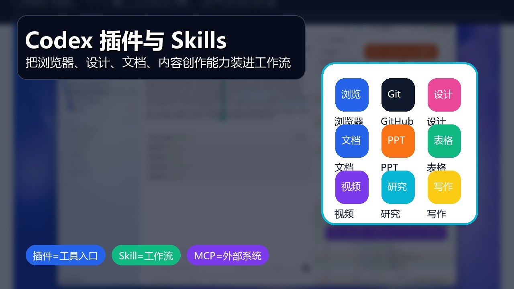
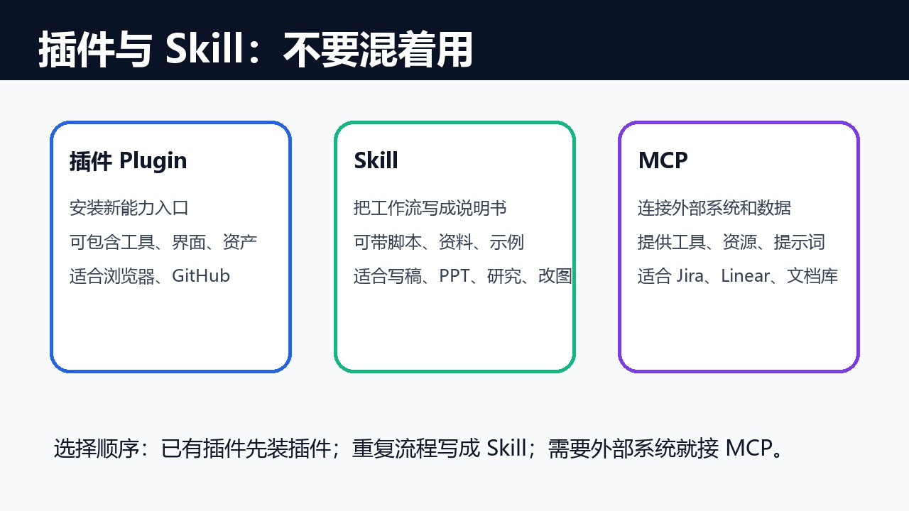
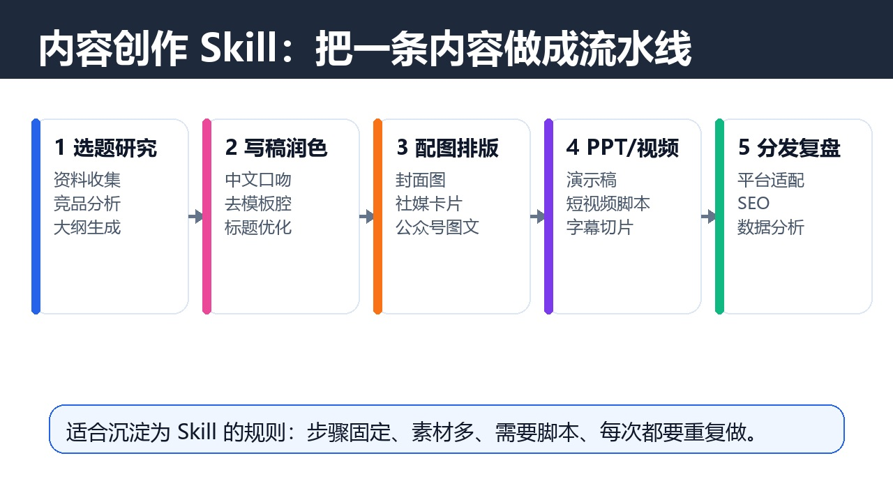

# Codex 插件与 Skills 指南：把常用能力装进工作流
副标题：插件负责扩展工具，Skill 负责沉淀流程。



## 开篇
很多人看到“Codex 插件”和“Skill”时，会把它们理解成同一件事：都是给 Codex 加能力。
这个理解不算错，但还不够准确。更实用的区分是：插件让 Codex 接入新的工具和场景，Skill 让 Codex 复用一套固定做事方法。
如果前几篇文章解决的是“怎么让 Codex 按项目规则工作”，这一篇解决的就是“怎么让 Codex 变成更完整的工作台”。

## 一、插件、Skill、MCP 分别解决什么



插件、Skill、MCP 经常一起出现，可以这样理解：

| 类型 | 主要作用 | 适合场景 |
| --- | --- | --- |
| 插件 | 安装一组可用能力 | 浏览器、GitHub、Figma、文档、表格、视频、代码安全扫描 |
| Skill | 固化一套可重复流程 | 写稿、做 PPT、深度研究、生成配图、剪视频、做营销素材 |
| MCP | 连接外部工具和数据 | Jira、Linear、GitHub、文档库、设计工具、内部系统 |

简单说，插件像“给 Codex 装应用”，Skill 像“给 Codex 一本操作手册”，MCP 像“给 Codex 接上外部系统”。
官方推荐的顺序也很清晰：如果已有成熟插件，优先安装插件；如果是团队自己的重复流程，可以写成 Skill；如果流程需要访问外部系统，再接 MCP。

## 二、插件：让 Codex 能操作更多工具
插件适合解决“Codex 原本做不到，或做起来很麻烦”的事情。参考图中的插件，可以归成几类：

- 浏览器类：让 Codex 打开网页、点击、输入、截图，适合前端调试和网页验证。
- GitHub 类：处理仓库、Issue、PR、代码审查和协作流程。
- 设计类：读取或生成 Figma 设计稿，把设计上下文转成代码。
- 办公类：生成或编辑文档、PPT、表格，让 Codex 不只停留在代码里。
- 视频类：生成 HTML 动画、字幕、讲解视频或产品演示。
- 桌面操作类：在授权场景下操作电脑界面，处理无法通过 API 完成的任务。

如果按图中的 10 类插件来理解，可以这样记：

| 插件方向 | 主要作用 |
| --- | --- |
| Chrome / 浏览器 | 让 Codex 打开网页、调试页面、截图验证 |
| GitHub | 管理仓库、Issue、PR 和代码协作 |
| Computer Use | 让 Codex 在授权场景下操作桌面软件 |
| Build Web Apps | 快速生成或搭建前端网页应用 |
| Figma | 读取设计稿，把设计上下文转成代码 |
| Documents | 生成、编辑和检查正式文档 |
| Presentations | 生成高质量演示稿和页面结构 |
| Spreadsheets | 处理表格、公式、数据分析和图表 |
| HyperFrames | 用 HTML 动画生成讲解或宣传视频 |
| Remotion | 用代码生成更工程化的视频内容 |

安装插件后，Codex 通常会在新线程里加载插件能力。也就是说，刚装完插件后，最好新开一个线程再开始任务，避免旧线程没有加载到新能力。

## 三、Skill：把固定流程交给 Codex 重复执行
Skill 更适合沉淀“每次都差不多，但手工做很烦”的流程。
一个 Skill 通常包含 `SKILL.md`，也可以带脚本、参考资料、模板和素材。Codex 会先看到 Skill 的名称和描述，在任务匹配时再读取完整说明。
内容创作类 Skill 最典型。参考图里的方向，可以拆成这些能力：

- PPT 类：输入主题和资料，输出演示稿结构、页面文案和视觉建议。
- 社媒卡片类：把一段文字变成小红书、公众号、朋友圈海报。
- 图片类：整理提示词、生成封面、统一视觉风格。
- 润色类：把 AI 腔改成人话，去掉空话、套话和翻译腔。
- 深度研究类：先列研究大纲，再分头查资料，最后汇总成报告。
- 文稿改写类：抓热点、定选题、写正文、做 SEO、配图和排版。
- 视频类：长视频切片、字幕整理、短视频脚本和分发素材。
- 营销类：文章、SEO、品牌定位、用户研究、广告文案和数据分析。



Skill 的价值不是“替你写一句提示词”，而是把一整套工作流稳定下来。比如一篇公众号文章，可以拆成：选题研究、文章大纲、正文初稿、去 AI 味、配图提示词、排版检查、发布摘要。

## 四、什么时候用插件，什么时候写 Skill
可以按这张表判断：

| 你的需求 | 更适合 |
| --- | --- |
| 需要操作浏览器、Figma、GitHub、文档、表格 | 插件 |
| 已经有别人做好的成熟能力包 | 插件 |
| 团队内部有固定写作、测试、发布流程 | Skill |
| 需要带模板、示例、脚本和检查清单 | Skill |
| 需要访问 Jira、Linear、私有文档、内部系统 | MCP，通常配合 Skill |

举个例子：
如果你想让 Codex 帮你检查前端页面，应该装浏览器相关插件；如果你想让 Codex 每次都按固定结构写公众号文章，应该写一个文章创作 Skill；如果文章需要读取 Notion、飞书或内部知识库，就需要再接 MCP 或连接器。

## 五、安装和使用的基本步骤
插件的使用路径可以理解为三步：

1. 打开 Codex，并进入需要工作的项目。
2. 打开插件市场或插件入口，选择需要的插件。
3. 安装后新建线程，在任务里直接说明要使用对应能力。

常见提示词：

```text
请使用已安装的浏览器能力打开本地页面，检查移动端布局和文字溢出问题。
```

```text
请使用 Figma 相关能力读取这个设计稿，并按当前项目组件风格实现页面。
```

```text
请按内容创作 Skill 的流程，把下面资料整理成一篇公众号文章，并生成配图建议。
```

Skill 的使用方式更像“点名工作流”。如果 Codex 没有自动选择，你可以直接写：

```text
请使用 [Skill 名称] 的流程完成这个任务。
```

## 六、不要一次装太多
插件和 Skill 不是越多越好。建议按实际工作流分批安装：

- 开发者优先：GitHub、浏览器、Figma、文档/表格。
- 前端团队优先：浏览器、Figma、截图验证、网页生成。
- 内容团队优先：写稿、配图、PPT、短视频、社媒卡片。
- 管理者优先：文档、PPT、表格、研究报告和任务同步。

安装前先问自己三个问题：

1. 这个能力我每周会不会用到。
2. 它是否能减少重复步骤，而不只是看起来很酷。
3. 它是否需要外部账号、授权或敏感数据。

如果答案不明确，先不要装。等同类任务重复出现两三次，再考虑插件或 Skill。

## 结尾
`AGENTS.md` 让 Codex 懂项目规则，插件让 Codex 接入更多工具，Skill 让 Codex 复用成熟流程。
这三者组合起来，Codex 才不只是一个会写代码的对话框，而是一个能做开发、设计、办公、内容创作和数据处理的工作台。
真正值得沉淀的不是“某个神奇提示词”，而是你每天重复做的流程。把这些流程交给插件和 Skill，Codex 才会越用越顺。
