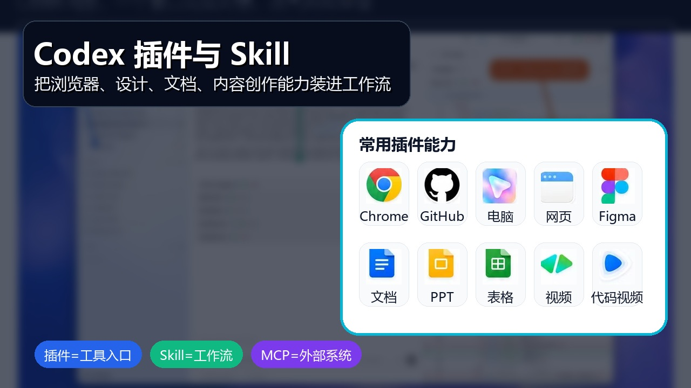

# Codex 插件与 Skill 指南：把常用能力装进工作流
副标题：插件扩展工具，Skill 沉淀流程。



## 开篇
插件和 Skill 都是在给 Codex 加能力，但用途不同。插件更像能力入口，负责接入浏览器、GitHub、Figma、文档、表格、视频等工具。Skill 更像流程说明书，负责把写稿、研究、做 PPT、改图、剪视频这类重复工作固定下来。
这篇只讲核心用法：插件能做什么，Skill 适合沉淀什么，什么时候该用 MCP。

## 一、插件、Skill、MCP 的区别


| 类型 | 作用 | 适合场景 |
| --- | --- | --- |
| 插件 | 安装一组可用能力 | 浏览器、GitHub、Figma、文档、表格、视频 |
| Skill | 固化一套重复流程 | 写稿、PPT、研究、配图、剪视频、营销素材 |
| MCP | 连接外部工具和数据 | Jira、Linear、GitHub、文档库、设计工具、内部系统 |

选择顺序很简单：已有成熟插件，先装插件；流程经常重复，写成 Skill；需要访问外部系统，再接 MCP。

## 二、插件负责扩展工具
插件适合解决 Codex 原本做不到，或做起来很麻烦的事情。

| 插件方向 | 主要作用 |
| --- | --- |
| Chrome / 浏览器 | 打开网页、调试页面、截图验证 |
| GitHub | 管理仓库、Issue、PR 和代码协作 |
| Computer Use | 在授权场景下操作桌面软件 |
| Build Web Apps | 快速生成或搭建前端网页应用 |
| Figma | 读取设计稿，把设计上下文转成代码 |
| Documents | 生成、编辑和检查正式文档 |
| Presentations | 生成演示稿和页面结构 |
| Spreadsheets | 处理表格、公式、数据分析和图表 |
| HyperFrames | 用 HTML 动画生成讲解或宣传视频 |
| Remotion | 用代码生成工程化视频内容 |

安装插件后，建议新建线程再开始任务。Codex 通常会在线程启动时加载插件能力，旧线程可能不会立刻识别新装插件。

## 三、Skill 负责沉淀流程
Skill 适合处理步骤固定、素材多、每次都要重复做的任务。一个 Skill 通常包含 `SKILL.md`，也可以带脚本、模板、参考资料和素材。


内容创作类 Skill 最典型，可以覆盖这些流程：

- PPT：主题分析、页面结构、文案、视觉风格。
- 社媒卡片：小红书、公众号、朋友圈海报。
- 图片：提示词整理、封面设计、统一视觉风格。
- 润色：去掉套话、空话、翻译腔和 AI 腔。
- 深度研究：研究大纲、资料收集、报告汇总。
- 视频：长视频切片、字幕整理、短视频脚本。
- 营销：SEO、品牌定位、用户研究、广告文案。

Skill 的价值不是多写一段提示词，而是让 Codex 每次都按同一套流程执行。

## 四、怎么选择

| 需求 | 更适合 |
| --- | --- |
| 操作浏览器、Figma、GitHub、文档、表格 | 插件 |
| 已经有成熟能力包 | 插件 |
| 团队固定写作、测试、发布流程 | Skill |
| 需要模板、示例、脚本、检查清单 | Skill |
| 需要访问 Jira、Linear、私有文档、内部系统 | MCP，通常配合 Skill |

前端页面检查，优先用浏览器插件。固定结构写公众号文章，适合写文章创作 Skill。文章还要读取内部资料库，就需要 MCP 或连接器。

## 五、使用提示词
安装插件后，可以这样说：

```text
请使用浏览器能力打开本地页面，检查移动端布局和文字溢出问题。
```

```text
请使用 Figma 能力读取这个设计稿，并按当前项目组件风格实现页面。
```

使用 Skill 时，可以直接点名：

```text
请使用文章创作 Skill，把下面资料整理成一篇公众号文章，并生成配图建议。
```

如果 Codex 没有自动选择对应 Skill，可以补一句：

```text
请按 [Skill 名称] 的流程完成这个任务。
```

## 六、不要一次装太多
插件和 Skill 不是越多越好。建议按真实工作流分批安装。

- 开发者优先：GitHub、浏览器、Figma、文档/表格。
- 前端团队优先：浏览器、Figma、截图验证、网页生成。
- 内容团队优先：写稿、配图、PPT、短视频、社媒卡片。
- 管理者优先：文档、PPT、表格、研究报告和任务同步。

安装前先判断三点：是否每周会用，是否能减少重复步骤，是否涉及外部账号、授权或敏感数据。

## 结尾
`AGENTS.md` 让 Codex 懂项目规则，插件让 Codex 接入工具，Skill 让 Codex 复用流程。
真正值得沉淀的不是某个神奇提示词，而是每天重复做的工作流。把这些流程交给插件和 Skill，Codex 才会越用越顺。
