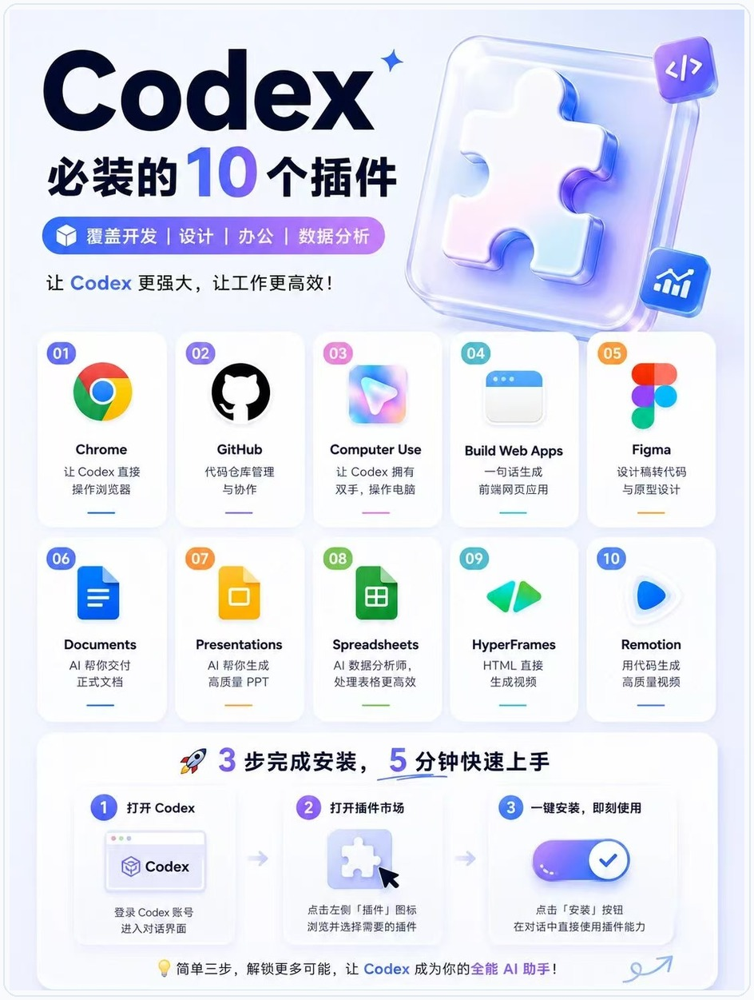
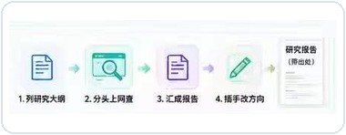
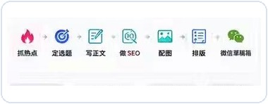

# Codex 插件与 Skill 指南：把常用能力装进工作流
副标题：插件扩展工具，Skill 沉淀流程。


## 开篇
插件和 Skill 都是在给 Codex 加能力，但用途不同。
插件负责接入浏览器、GitHub、Figma、文档、表格、视频等工具。Skill 负责把写稿、研究、做 PPT、改图、剪视频这类重复工作固定下来。
这篇只讲核心用法：插件能做什么，Skill 适合沉淀什么，什么时候该用 MCP。

## 一、插件、Skill、MCP 的区别
| 类型 | 作用 | 适合场景 |
| --- | --- | --- |
| 插件 | 安装一组可用能力 | 浏览器、GitHub、Figma、文档、表格、视频 |
| Skill | 固化一套重复流程 | 写稿、PPT、研究、配图、剪视频、营销素材 |
| MCP | 连接外部工具和数据 | Jira、Linear、GitHub、文档库、设计工具、内部系统 |

选择顺序很简单：已有成熟插件，先装插件；流程经常重复，写成 Skill；需要访问外部系统，再接 MCP。

## 二、插件负责扩展工具
插件不是单个按钮，而是一组可安装能力包。一个插件可以包含 Skill、App 连接和 MCP 服务器。新手可以先把它理解成：把 Codex 原本只能在代码仓库里做的事，扩展到浏览器、设计稿、文档、表格、视频和外部系统里。
下面这张图可以按工作方向来理解，不需要一次全装。



| 插件方向 | 适合做什么 | 新手怎么用 |
| --- | --- | --- |
| Browser / 浏览器 | 打开本地页面、点击交互、截图验证、检查移动端布局、查看控制台和网络问题。 | 本地前端项目优先用它，尤其适合验证 `localhost` 页面。 |
| Chrome | 使用你已经登录的 Chrome 页面，例如后台系统、Gmail、CRM、内部工具。 | 只有任务必须用登录态时再用，操作前看清网站权限提示。 |
| GitHub | 管理仓库、Issue、PR、代码协作和发布前检查。 | 让 Codex 帮你看 PR、整理 Issue、补充变更说明。 |
| Figma | 读取设计稿、理解组件、把设计稿转成实现建议或页面代码。 | 给出 Figma 链接后，说明要复刻页面、抽组件还是检查设计差异。 |
| Computer Use | 在授权后操作桌面软件，处理无法通过 API 或文件完成的流程。 | 适合复现桌面端问题，Windows 上会占用当前桌面，任务要写清楚。 |
| Documents | 生成、编辑和检查正式文档。 | 写方案、合同模板、说明书时，让 Codex 同时关注结构和格式。 |
| Presentations | 生成或修改演示文稿。 | 先给主题、受众、页数和风格，再让 Codex 输出 PPT。 |
| Spreadsheets | 处理表格、公式、统计、图表和数据清洗。 | 给出 Excel 或 CSV，让 Codex 先说明字段含义，再做分析。 |
| HyperFrames / Remotion | 生成 HTML 动画、讲解视频、产品演示和字幕类内容。 | 适合把文章、产品功能或教程转成短视频脚本和画面。 |
| Build Web Apps / Sites | 快速生成网页、小游戏、工具页或可部署站点。 | 适合先做原型，确认方向后再细化交互和视觉。 |

安装插件一般按四步走：打开 Codex 的 Plugins，搜索插件，点击安装或 Add to Codex，按提示完成登录或授权。安装完成后，新建一个线程再开始任务。Codex 通常会在线程启动时加载插件能力，旧线程可能不会立刻识别新装插件。
使用时有两种写法。简单任务可以直接描述结果，让 Codex 自己选择工具：

```text
打开本地页面 http://localhost:3000/settings，检查移动端按钮是否溢出，并修复最小相关代码。
```

如果你想指定插件，就在提示词里点名：

```text
请使用 @Browser 打开本地页面，截图检查首屏布局，并指出需要修改的组件。
```

```text
请使用 @Chrome 打开我已登录的后台页面，只检查订单筛选流程，不要提交任何表单。
```

```text
请使用 @Figma 读取这个设计稿，总结页面结构、组件层级和需要复用的设计 token。
```

插件使用时要看权限边界。Browser 适合本地页面和不需要登录的公开页面。Chrome 会接触你的登录态和浏览器内容，适合必须用真实账号状态的任务。Computer Use 会看到并操作桌面应用，适合无法通过代码、文件或 API 完成的流程。涉及账号、支付、权限、客户数据、生产后台时，不要给 Codex 一句“直接处理”，要把允许做什么、禁止做什么、什么时候停下来问你写清楚。
如果插件装好了但 Codex 没反应，先查四件事：插件是否启用，外部账号是否登录，是否新建了线程，目标网站或 App 是否被允许。浏览器类插件还要确认页面是否需要登录态：不需要登录用 Browser，需要登录态用 Chrome。桌面软件任务则要确保目标窗口可见，尤其是 Windows。

## 三、Skill 负责沉淀流程
Skill 适合处理步骤固定、素材多、每次都要重复做的任务。一个 Skill 通常包含 `SKILL.md`，也可以带脚本、模板、参考资料和素材。
内容创作类 Skill 最典型。它不是把一句提示词写长，而是把选题、资料、文案、配图、排版、发布前检查这些步骤固定下来。

| 主流 Skill | 作用 | 展示效果图 |
| --- | --- | --- |
| guizang-ppt-skill | 生成 HTML 演示稿，适合做汇报、课程、分享型 PPT。 |  |
| guizang-social-card-skill | 把文字整理成小红书、公众号封面和社媒卡片。 |  |
| awesome-gpt-image-2 | 管理生图提示词，统一封面、海报、产品图和人物图风格。 |  |
| Humanizer-zh | 把生硬表达改成自然中文，减少套话、翻译腔和 AI 腔。 |  |
| Deep-Research-skills | 按研究大纲、分头调研、汇总报告、改写方向推进长文。 |  |
| anything-to-notebooklm | 把网页、视频、PDF、公众号文章转成播客、PPT、思维导图或测验。 |  |
| wewrite | 覆盖抓热点、定选题、写正文、做 SEO、配图、排版和发布草稿。 |  |
| Youtube-clipper-skill | 把长视频拆成短视频片段，处理高光、字幕和剪辑时间线。 |  |
| oh-story-claudecode | 处理小说、网文选题、爆款结构、人物切入点和拆解框架。 |  |
| marketingskills | 适合营销团队做文章写作、SEO、品牌定位、用户研究、广告投放和邮件营销。 |  |

Skill 的价值不是多写一段提示词，而是让 Codex 每次都按同一套流程执行。

## 四、怎么选择

- 要操作浏览器、Figma、GitHub、文档、表格，优先装插件。
- 已经有成熟能力包，优先装插件。
- 团队有固定写作、测试、发布流程，写成 Skill。
- 流程需要模板、示例、脚本、检查清单，写成 Skill。
- 需要访问 Jira、Linear、私有文档、内部系统，接 MCP，通常配合 Skill 使用。

前端页面检查，优先用浏览器插件。固定结构写公众号文章，适合写文章创作 Skill。文章还要读取内部资料库，就需要 MCP 或连接器。

## 五、使用提示词
安装插件后，可以这样说：

```text
请使用浏览器能力打开本地页面，检查移动端布局和文字溢出问题。
```

```text
请使用 Figma 能力读取这个设计稿，并按当前项目组件风格实现页面。
```

使用 Skill 时，可以直接点名：

```text
请使用文章创作 Skill，把下面资料整理成一篇公众号文章，并生成配图建议。
```

如果 Codex 没有自动选择对应 Skill，可以补一句：

```text
请按 [Skill 名称] 的流程完成这个任务。
```

## 六、不要一次装太多
插件和 Skill 不是越多越好。建议按真实工作流分批安装。

- 开发者优先：GitHub、浏览器、Figma、文档/表格。
- 前端团队优先：浏览器、Figma、截图验证、网页生成。
- 内容团队优先：写稿、配图、PPT、短视频、社媒卡片。
- 管理者优先：文档、PPT、表格、研究报告和任务同步。

安装前先判断三点：是否每周会用，是否能减少重复步骤，是否涉及外部账号、授权或敏感数据。

## 结尾
`AGENTS.md` 记录项目规则，插件接入工具，Skill 复用流程。
每天重复做的工作，才值得沉淀成插件或 Skill。
