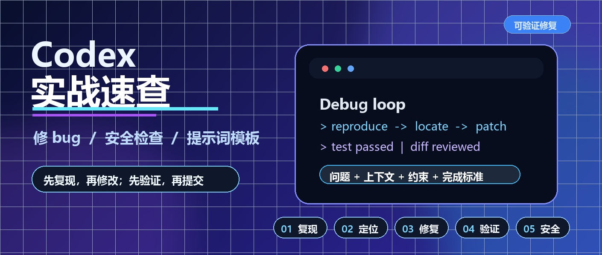
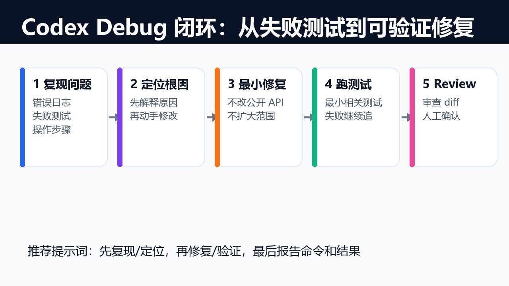
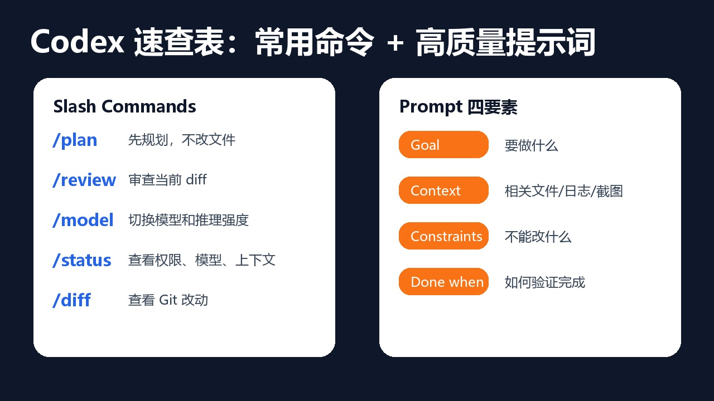

# Codex 实战速查：修 bug、安全检查与高质量提示词
副标题：把 Codex 用顺，靠的不是长提示词，而是复现、边界、验证三件事。



## 开篇
前两篇讲过入口、配置、权限和复用能力。这一篇只保留实战中最常用的部分：修 bug、提交前安全检查、常用提示词。
遇到问题时，直接套下面的结构发给 Codex。

## 一、修 bug：先复现，再修改
刚开始用 Codex 修 bug 时，很多人会这样写：

```text
这个测试挂了，帮我修一下。
```

这句话能用，但不够稳。它没有告诉 Codex 是否要先复现、能改哪些文件、修完要跑什么验证。更稳妥的写法是：

```text
请按 Debug 闭环修复这个问题。

问题：
[写清楚现象、报错或复现路径]

上下文：
- 相关文件可能是：[文件或目录]
- 相关命令：[测试、构建或启动命令]

约束：
- 先复现或写最小失败测试，再修改。
- 只做最小修复，不做无关重构。
- 不新增依赖，除非先说明原因。

完成标准：
- 说明根因。
- 列出修改文件和原因。
- 跑最小相关测试。
- 如果无法验证，请说明阻塞原因。
```

这段提示词的关键是边界清楚：问题是什么、从哪里查、不能做什么、怎样算完成。



## 二、排查时盯住三件事
让 Codex 排查问题时，不要只说看一下。直接要求它回答三个问题：

1. 错误在哪里出现。
2. 数据从哪里开始变错。
3. 为什么之前没有被测试覆盖。

前端问题可以这样问：

```text
请沿着数据流排查：UI 参数、请求构造、接口返回、状态更新、页面渲染。确认根因后再修改。
```

后端问题可以这样问：

```text
请沿着请求链路排查：路由、参数校验、服务层、数据库查询、返回结构。确认根因后再给出最小修复。
```

如果 Codex 只给出泛泛判断，继续追问：

```text
请指出具体文件、函数和条件分支。不要只说“逻辑有问题”。
```

## 三、提交前：让 Codex 做一次安全检查
安全检查不用写成很长的制度，提交前发这段就够用：

```text
请在提交前做一次安全检查：

1. diff 中是否包含密钥、token、Cookie、私钥或真实用户数据。
2. 是否新增依赖；如果新增，说明用途和替代方案。
3. 是否修改了登录、权限、支付、删除、迁移相关逻辑。
4. 是否可能造成数据丢失或接口不兼容。
5. 是否运行了最小相关测试、lint、typecheck 或 build。
6. 如果有未验证项，请列出原因和建议验证方式。
```


这里重点记住三条：

- 不要把 API key、数据库密码、私钥、生产 token 直接贴给 Codex。
- 让 Codex 写示例配置时，只写占位符，不写真实值。
- 涉及登录、支付、权限、删除、迁移时，先让 Codex 说明风险，再动手。

如果你怀疑密钥进了文件，先轮换密钥，再清理 Git 记录。不要只把文件里的密钥删掉就结束。

## 四、常用提示词速查


### 解释项目

```text
请先只读分析这个项目，不要修改文件。

请输出：
1. 项目技术栈。
2. 主要目录作用。
3. 启动、构建、测试命令。
4. 新人最该先读的 5 个文件。
5. 你发现的风险或不确定点。
```

### 新增功能

```text
请实现 [功能名称]。

上下文：
- 参考现有实现：[文件]
- UI 或接口要求：[说明]
- 不要改动：[约束]

完成标准：
- 功能可用。
- 补充必要测试。
- 跑 lint、typecheck 或相关测试。
- 最后说明如何验证。
```

### 审查 diff

```text
请以 code review 方式审查当前 diff。

优先看：
1. 正确性 bug。
2. 安全风险。
3. 行为回归。
4. 缺失测试。

请给出具体文件和位置，不要只给泛泛建议。
```

### 最终汇报

```text
请用这个格式结束：

修改内容：
- [文件]：[做了什么]

验证结果：
- [命令]：[通过、失败或未运行原因]

风险与后续：
- [剩余风险或建议]
```

## 结尾
Codex 修 bug 要管住过程：先复现，限制改动范围，最后用验证结果收尾。
日常修 bug、提 PR、做提交前检查时，直接复用上面的模板。
