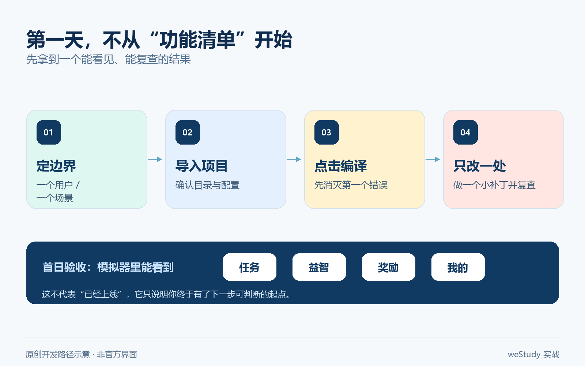
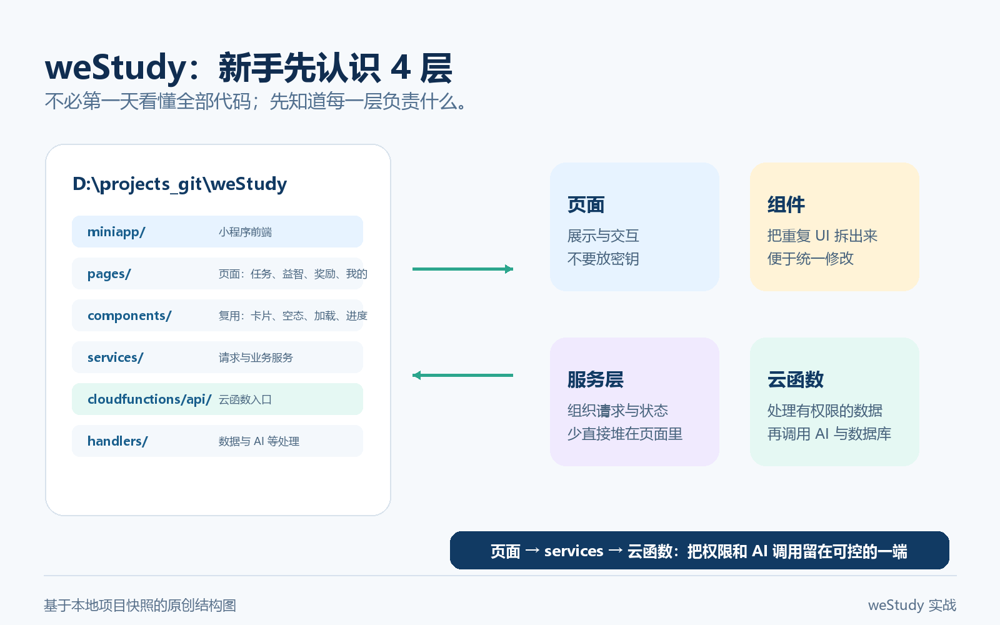
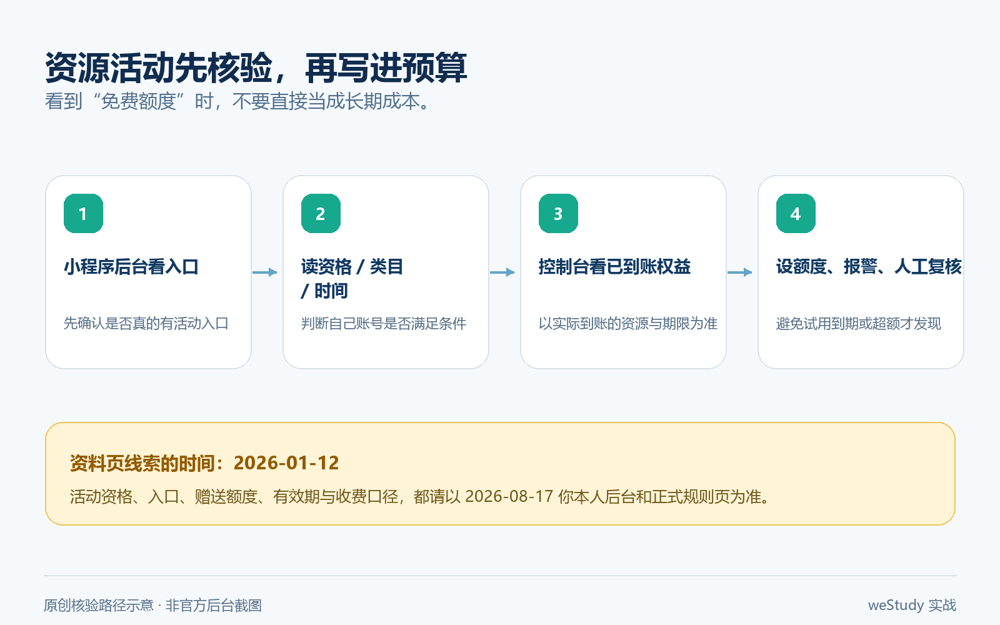
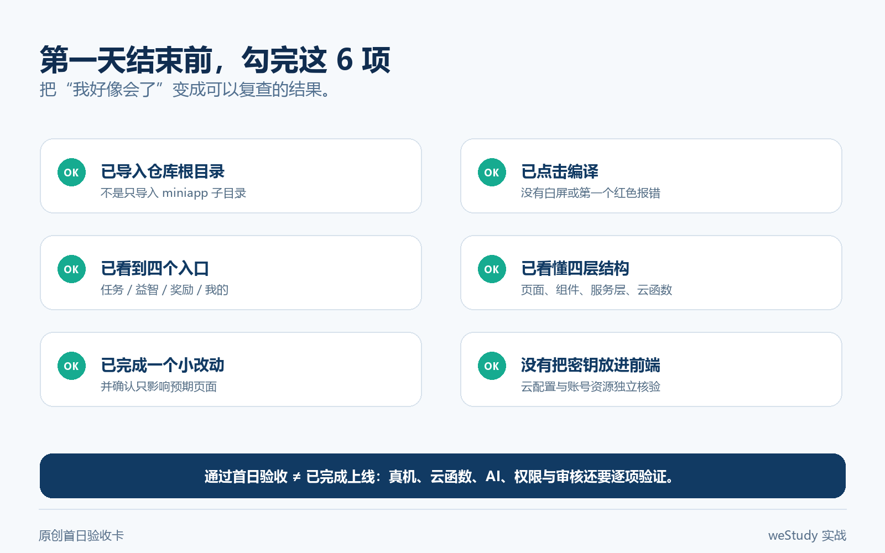

你可能也有过这种时刻：脑子里已经有一个小程序点子，甚至把功能写满了一页纸；真打开微信开发者工具，却只剩下一片空白。AppID、页面、云函数、组件、审核……每个词都认识，连起来就不知道先动哪一个。

先别急着写第一行代码。

从 0 到 1 做小程序，第一天真正要完成的，不是“把所有功能做完”，而是让一个项目**能被导入、能在模拟器里编译、能看见一个可操作页面**。这篇用本地项目 `D:\projects_git\weStudy` 做例子，带你跑通这条最小路径；再告诉你 Codex、WorkBuddy、微信开发者工具、组件和云开发各自该站在哪里。

> **今天的验收线只有三条：**
> 1. 微信开发者工具能导入项目并编译；
> 2. 模拟器能看到底部“任务 / 益智 / 奖励 / 我的”四个入口；
> 3. 你知道下一处该改哪里，而不是把需求、代码和云端配置混在一个聊天框里。



图里的步骤是本文的主线。它不是官方界面截图，而是一张原创操作路径图：先把“看得见的结果”跑出来，再逐步接入真正需要的能力。

## 一、先把“小程序点子”砍成一个 30 分钟能验收的结果

很多新手一开始就会列出题库、会员、排行榜、AI 对话、支付、社群。这个顺序很容易把人拖垮：你还没有确认小程序能跑，就已经在设计第十个页面了。

更稳的方式，是先用一句话写清第一版的闭环。以 weStudy 为例，不是“做一款 AI 学习产品”，而是：

> 家长创建学习档案 → 孩子看到今天的任务 → 完成一次练习或益智挑战 → 得到下一步反馈。

这个例子已经足够做出一个真实项目；但它仍然是**项目当前的产品路线**，不是“所有学习小程序都该这样做”的标准答案。

### 先把三类工具分开用

| 工具 | 适合交给它的事 | 不该交给它的事 |
| --- | --- | --- |
| **WorkBuddy** | 把模糊点子整理成用户场景、V1 范围、页面清单、测试清单 | 代替你决定儿童数据、审核口径或最终产品取舍 |
| **Codex** | 读本地仓库、定位文件、把一个小改动拆成可审查补丁、运行检查 | 没看项目就整库重写，或替你跳过真机验证 |
| **微信开发者工具** | 导入、编译、模拟器与真机预览、云函数部署、调试日志 | 代替需求决策或代码评审 |
| **小程序组件** | 把页面拆成可复用的卡片、加载态、空态和表单 | 为“看起来高级”而过早造一套组件库 |

如果你使用 WorkBuddy，第一轮不要问“帮我做一个小程序”。可以先把下面这段发过去：

```text
我要做一个给小学家庭使用的学习小程序。
请只输出：
1. 用户会在什么时刻打开；
2. V1 只解决一个什么问题；
3. 必须有的 3 个页面；
4. 现在明确不做的 5 件事；
5. 每个页面的一条验收标准。
不要生成代码，不要设计会员、支付、排行榜或社群。
```

WorkBuddy 的价值在于把“我想做很多事”压成一张能执行的产品卡。等这张卡稳定下来，再把目录和任务交给 Codex。两者不是谁替代谁：前者帮你把问题说清，后者帮你在真实代码里小步落地。

## 二、第一天先跑通 weStudy：导入、编译、看见页面

这里的项目路径是 `D:\projects_git\weStudy`。它不是一个空白模板，而是已经有页面、组件、云函数和 V1 文档的案例仓库。你不必在第一天理解全部代码；先确认开发工具能正确找到它。

### 1. 导入项目：先看配置，不要先改代码

安装并打开微信开发者工具，选择 **导入项目**，目录选到：

```text
D:\projects_git\weStudy
```

导入前后，重点核对根目录的 `project.config.json`：

```json
{
  "miniprogramRoot": "miniapp/",
  "cloudfunctionRoot": "cloudfunctions/",
  "compileType": "miniprogram"
}
```

这三项决定开发者工具去哪里找小程序前端和云函数。项目里还填写了 AppID；如果你是在自己的账号下新建项目，AppID、权限和云环境都必须按自己的小程序后台重新确认，**不要拿他人的 AppID、密钥或云环境配置直接上线**。

### 2. 点击编译后，你应该先看到什么

第一次点击“编译”，只看三个信号：

1. 模拟器没有白屏或红色编译错误；
2. 底部出现“任务、益智、奖励、我的”四个 Tab；
3. 首页没有学习档案时，能看到“先创建学习伙伴”的引导卡。

这三个信号来自当前项目的 `miniapp/app.json` 和 `miniapp/pages/index/`。它们说明前端入口、路由和首页渲染链路至少接上了；**不等于云函数、AI 生成、真机兼容和审核已经通过**。

如果第一步失败，别急着让 AI 改一堆文件，按这个顺序排查：

- 导入的是否真是仓库根目录，而不是 `miniapp/` 子目录；
- `project.config.json` 里的 `miniprogramRoot` 是否仍是 `miniapp/`；
- 开发者工具的基础库版本是否满足项目设置；
- 控制台报错属于 WXML、JS、依赖还是 AppID / 云环境；
- 先恢复到未修改的分支，再一次只处理一个错误。



这张图是按本地项目目录整理的原创结构图。新手先记住一条：**页面负责展示和交互，组件负责复用，服务层负责请求，云函数负责有权限的数据与 AI 调用。**

### 3. 让 Codex 先“读仓库”，不要一上来就“开发完它”

在 `D:\projects_git\weStudy` 目录里打开 Codex 后，先发一个只读任务：

```text
请阅读当前 weStudy 项目，先不要修改文件。
请输出：
1. 小程序入口、页面、组件、服务层、云函数分别在哪；
2. 首页从打开到显示任务经过哪些文件；
3. 当前可用的 3 个组件；
4. 第一处适合新手做的小改动；
5. 修改前需要运行的检查命令。
每一条都给出相对路径；不确定的地方标为“待验证”。
```

这条提示词比“帮我把首页做漂亮”更有用。它强制 Codex 先把目录和风险讲清楚。只有当你看懂它指向的文件后，再让它做一个很小的修改，例如把空态文案改成更友好的提示，或者给任务卡补一个明确的加载状态。

> **改动指令要带验收条件。** 例如：“只改 `miniapp/pages/index/` 和 `miniapp/components/ws-task-card/`；保留现有样式变量；修改后运行项目已有检查；告诉我模拟器里应该看到什么。”

## 三、从第一个页面到可用闭环：组件、云函数和 AI 怎么接

### 1. 别从“大组件库”开始，先把重复的那一块抽出来

微信小程序本身已经有 `view`、`text`、`button`、`input`、`scroll-view`、`navigator` 等基础组件。第一天先用它们把页面搭出来；当同一块 UI 在两处出现时，再抽成自定义组件。

weStudy 里已经有一些可直接观察的复用组件：

- `ws-task-card`：展示一条任务和对应动作；
- `question-card`：承载练习题；
- `empty-state`：没有数据时给用户下一步；
- `loading-overlay` 与 `skeleton`：请求没回来时避免页面像“卡死”；
- `progress-bar`、`ws-status-tag`、`ws-pet-status`：把学习进度和状态做成一致的显示单元。

新手最容易忽略的不是“组件能不能复用”，而是**状态有没有说清楚**。一张任务卡至少要考虑：待完成、进行中、已完成、请求失败、等待家长确认。只写正常状态，等真机弱网或接口超时时，用户就只会看到一个没有反应的按钮。

一个最小组件不需要复杂。下面的示意只表达“任务标题 + 状态 + 动作”这件事，不是 weStudy 的完整实现：

```xml
<!-- components/task-card/task-card.wxml -->
<view class="task-card">
  <text class="task-title">{{title}}</text>
  <text class="task-status">{{statusText}}</text>
  <button bindtap="handleAction" disabled="{{loading}}">
    {{loading ? '处理中…' : actionText}}
  </button>
</view>
```

当你能在模拟器里明确区分“正在提交”和“提交失败”，再往里面加奖励、动画或更多业务规则，体验会稳得多。

### 2. AI 不要直接写进小程序前端

如果你准备使用腾讯混元或其他模型，先把一句话记住：**小程序前端不保存模型 Key，也不直接承担可信身份和数据库权限。**

weStudy 的当前结构把云端入口放在 `cloudfunctions/api/index.js`，再按 `/home`、`/task`、`/ai-questions` 等路径转到各个 handler。这个设计的意义是：前端通过服务层调用云函数；云函数获取微信身份、做校验和错误处理，再访问数据或模型能力。

因此，接入一个 AI 出题功能的最小顺序应是：

1. 在页面上先固定输入：年级、知识点、题型、数量；
2. 服务层只发送必要字段，不把身份信息拼进 Prompt；
3. 云函数校验登录态、参数和调用频率；
4. 模型结果只接受约定好的 JSON 字段；
5. 解析失败、超时或内容不合格时，给用户可理解的降级提示。

这比“让模型自由聊天，然后把返回内容直接显示”慢一点，但能避免密钥泄露、题目结构混乱和儿童学习场景里不合适的输出。

### 3. 混元 AI 和免费云服务：把它当作一次资格核验，而不是长期预算

用户提供的腾讯云开发者社区文章发布于 **2026 年 1 月 12 日**。该文介绍“AI 小程序成长计划”，当时写到的资源包括：**6 个月 CloudBase 云开发环境、1 亿 Token 的腾讯混元 2.0 额度、1 万张混元文生图额度**，并展示了从小程序后台相关入口到云开发控制台查看资源的教程。

这对第一次验证 AI 小程序很有吸引力，但请把它当成**历史资料中的活动描述**，不要直接写进成本预算或对外承诺。今天是 **2026 年 8 月 17 日**，权益是否仍可领取、适用类目、账号资格、有效期、额度口径和菜单名称都有可能变化。正确动作是：

1. 登录自己的微信小程序后台，查看是否仍出现对应计划或活动入口；
2. 打开活动规则，确认“适用对象、领取时间、云环境、到期日、超额计费”五项；
3. 进入自己的 CloudBase / 模型控制台，记录实际到账资源和过期时间；
4. 先给模型调用设置数量上限、异常报警和人工复核，再考虑开放给真实用户。



图中只重画了核验动作，不复用原文的后台截图或图标。原文可作为操作线索阅读；最新资格与计费必须以你自己的后台和活动规则为准。

这里也要说明 weStudy 的边界：本地项目文档确认了 CloudBase 云函数、数据库和 AI 调用的架构，但**不能仅凭这篇教程断言它已接入某个具体混元版本、某项活动额度或可直接提审上线**。项目的上线清单仍把真机预览、真实 AI 云端联调、权限与弱网验证列为待完成的 P0 项。

## 四、把第一天收在“我知道下一步是什么”，而不是“我好像做完了”

当模拟器已经能跑，你可以做一次小而完整的练习：给首页任务区补一个明确的空态或加载态。它不会让产品一下变得惊艳，却能迫使你走完整条开发链路：定位文件 → 修改组件或页面 → 编译 → 看结果 → 记录影响范围。

建议让 Codex 按下面方式交付：

```text
目标：当 tasks 为空时，首页显示“今天还没有任务”和“刷新任务”按钮。
范围：只检查并按需修改 miniapp/pages/index/ 与已有 empty-state 组件。
约束：不改云函数、不新增依赖、不改变现有任务非空时的页面。
验收：
- 编译无新增错误；
- tasks 为空时能看到空态；
- 点击刷新后仍调用原有加载逻辑；
- 告诉我改了哪些文件、为什么改、我在模拟器里怎样复查。
```

这就是 AI 编程工具最适合新手的打开方式：不是替你“生成一个完整产品”，而是陪你完成一件你看得见、能回滚、会验收的工程小事。



### 你的第一天验收卡

- [ ] 开发者工具导入的是仓库根目录，且能编译；
- [ ] 能说清 `miniapp/`、`components/`、`services/`、`cloudfunctions/` 各自负责什么；
- [ ] 完成过一次只改 1–2 个目录的小修改，并看见模拟器变化；
- [ ] 没有把 AppID、密钥、真实用户数据或测试账号提交到仓库；
- [ ] 知道“模拟器能跑”不等于“真机、云端和审核都已通过”；
- [ ] 对 AI 资源活动只记录自己账号的实际权益，不拿历史宣传额度做承诺。

做到这里，你已经跨过“完全不会做小程序”的门槛了。接下来再去补云函数部署、真机预览、数据权限和提审材料，顺序就不会乱。

## 参考与边界

- [微信开发者工具下载与说明](https://developers.weixin.qq.com/miniprogram/dev/devtools/download.html)：安装与项目导入入口；具体界面会随版本调整。
- [微信小程序组件文档](https://developers.weixin.qq.com/miniprogram/dev/component/)：基础组件与自定义组件的官方入口。
- [CloudBase 文档](https://docs.cloudbase.net/)：云函数、数据库、环境与控制台能力以当前官方文档为准。
- [腾讯云开发者社区文章：微信小程序送补贴！手把手教你薅免费云开发资源+混元Token（附使用教程）](https://developer.cloud.tencent.cn/article/2615984?from_column=20421&from=20421)：仅作为 2026-01-12 的活动和操作线索；本文未转载其中界面截图，当前权益请以账号后台为准。

本文中的 weStudy 路径、目录与组件来自本地项目快照；“如何做”的步骤是可复现模板，不代表已经完成真机、云端或平台审核。涉及儿童数据、模型调用、计费和提审时，请重新核对当前官方要求并保留人工审核。
