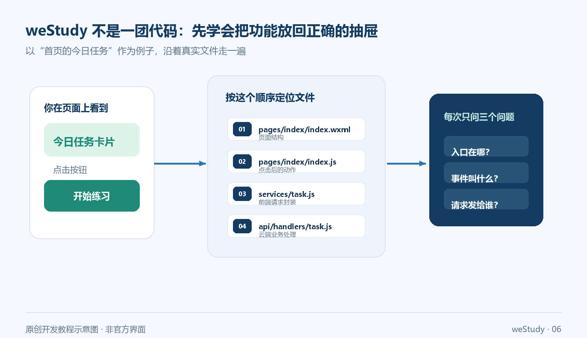
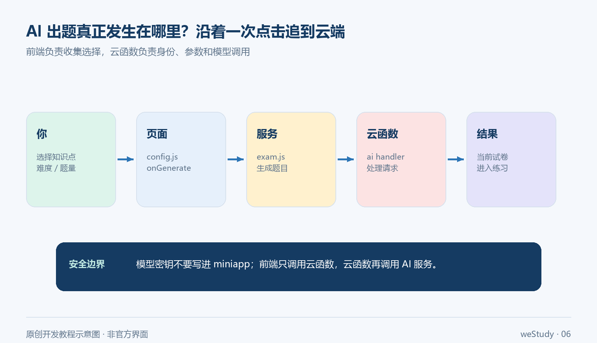
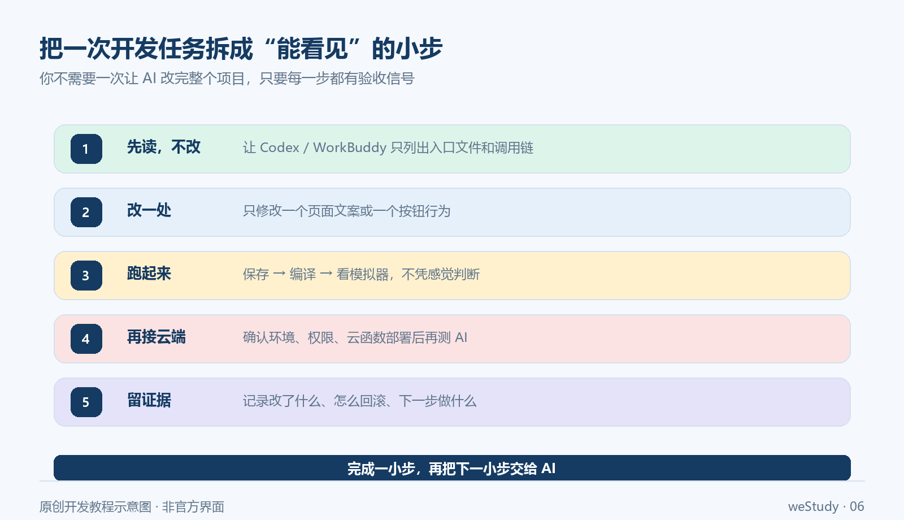

如果你第一次打开微信开发者工具，看到的是 AppID、页面、组件、云函数和一堆配置文件，很容易产生一种错觉：是不是先把这些概念全部学完，才有资格开始做小程序？

其实不用。

第一次做项目，最怕的不是不会写代码，而是一上来就让 AI 生成几百个文件。代码看起来很多，屏幕上却没有一个真正能点击、能变化、能解释清楚的结果。

我更建议你先跑通一条小闭环：**把项目打开，看到页面；改一句话，看到变化；点一个功能，追到它背后的请求。**这篇文章就用 `D:\projects_git\weStudy` 这个真实项目做练习，不把它写成产品说明书，而是带你完成一次可以复查的开发过程。

你不需要今天就读完全部源码。今天只要拿到四个结果：

1. 项目能导入、能编译；
2. 你能说清楚首页文件在哪里；
3. 你亲手改过一个页面文案；
4. 你能追完一次“AI 出题”从点击到云函数的调用链。


> 这是原创开发示意图，不是微信开发者工具截图。真实菜单名称和界面可能随工具版本变化。

## 01 先别急着改功能：把 weStudy 跑起来

### 第一步：打开正确的项目根目录

安装并打开微信开发者工具后，选择导入项目。这里最容易选错：不要选 `miniapp`，也不要选 `cloudfunctions`，而是选择整个项目目录：

```text
D:\projects_git\weStudy
```

导入后，先打开项目根目录下的 `project.config.json` 看两项配置：

```json
{
  "miniprogramRoot": "miniapp/",
  "cloudfunctionRoot": "cloudfunctions/"
}
```

它们分别告诉开发者工具：小程序前端在哪里，云函数在哪里。导入目录错了，后面不是页面消失，就是云函数找不到，很多“奇怪报错”其实从这里就开始了。

### 第二步：使用你自己的 AppID

项目配置中可能已经存在 AppID，但那不等于你可以直接拿来发布。练习时使用自己注册的小程序 AppID；没有 AppID，也可以先使用开发者工具提供的测试方式完成页面阅读和本地编译。

不要把别人的 AppID、云环境、密钥或真实用户数据复制到自己的项目里。能打开项目，和拥有发布权限，是两件事。

### 第三步：点击编译，只看一个结果

第一次编译时，不要急着解决所有警告。先看模拟器能不能出现 weStudy 的主界面，以及底部是否能看到这四个入口：

```text
任务｜益智｜奖励｜我的
```

看到它们，就说明前端入口基本接上了。此时你的目标不是“项目完美运行”，而是确认：开发者工具、项目目录、前端页面这三件事已经连起来。

如果页面空白，按这个顺序排查：

- 项目根目录是否选成了 `D:\projects_git\weStudy`；
- `project.config.json` 的前端目录是否仍为 `miniapp/`；
- 开发者工具是否使用了自己的 AppID 或测试模式；
- 页面是否在等待云端身份、数据库或隐私授权；
- 是否把模拟器问题误认为代码问题。

先排入口，再排功能。不要一上来就让 AI “修复整个项目”。

## 02 用 3 分钟改一句话：确认你真的在开发

项目能打开，还不代表你已经理解它。最简单的确认方式，是改一处用户马上能看见的文字。

打开：

```text
D:\projects_git\weStudy\miniapp\pages\index\index.wxml
```

搜索这句话：

```text
今天先完成一件小事
```

临时改成：

```text
今天先完成 1 道题
```

保存后重新编译。如果模拟器中的首页同步变化，你就完成了第一次有效修改：你知道了项目从哪里进入，也知道修改结果如何被验证。

首页里还有一个很重要的线索：按钮事件通常写在 WXML 上。例如页面会通过 `bindtap` 绑定点击行为，真正的处理函数则在同目录的 `index.js` 中。你不需要先读完整个 JavaScript 文件，只要沿着“页面文字 → 点击事件 → JS 函数”往下找。



> 这是一张原创目录示意图。图中路径为阅读路线的缩写，完整路径以项目实际文件为准。

## 03 开发 weStudy 的核心方法：从一个用户动作反推文件

把一个真实功能拆开，通常只需要回答三个问题：

1. **用户从哪里开始？**——哪个页面、哪个按钮或哪段文字；
2. **点击后发生什么？**——事件名是什么，页面做了什么判断；
3. **数据最后交给谁？**——前端 service、统一请求函数，还是云函数 handler。

以“首页今日任务”为例，你可以按下面的顺序找：

| 你看到的东西 | 先打开哪里 | 你要确认什么 |
|---|---|---|
| 首页文字、按钮 | `miniapp/pages/index/index.wxml` | 用户看到了什么，点击绑定了什么事件 |
| 页面行为 | `miniapp/pages/index/index.js` | 点击后调用哪个函数，是否跳转或刷新 |
| 前端请求 | `miniapp/services/task.js` | 请求的业务路径、参数和返回值 |
| 云端处理 | `cloudfunctions/api/handlers/task.js` | 数据如何读取、保存和返回 |

这比在编辑器里搜索“所有 task 文件”更有效。你是从用户动作出发，不是从文件名猜功能。

这也是使用 AI 编程工具时最值得保留的习惯：**先让 AI 帮你定位和解释，再让它改一小处。**如果连入口文件都没有确认，就让 AI 大范围重构，出了问题很难知道是原有逻辑、模型猜测，还是你的指令造成的。

## 04 跟着一次 AI 出题请求走一遍

weStudy 的 AI 出题不是“点击按钮，模型直接出现在页面上”。中间至少经过页面、service、统一请求函数、云函数入口和具体 handler。把这条链看懂，你才算真正理解了一个 AI 小程序是怎么工作的。

实际阅读时，可以按这条路线走：

1. 在 `miniapp/pages/ai-questions/config/config.wxml` 中找到知识点、题型、难度和题量等输入项；
2. 在同目录的 `config.js` 中找到 `onGenerate`，这是用户点击生成题目后的页面入口；
3. 继续进入 `miniapp/services/exam.js`，找到 `generateAiQuestions`；
4. 这个方法通过 `miniapp/utils/cloudRequest.js` 调用名为 `api` 的云函数，请求路径是 `/ai-questions/generate`；
5. `cloudfunctions/api/index.js` 根据路径把请求转给 `cloudfunctions/api/handlers/ai-questions.js`；
6. 返回结果后，页面把当前试卷保存为 `current_paper`，再进入练习页面。



> 图中使用“AI handler”“当前试卷”等短标签，完整文件路径和请求路径以正文为准。这不是官方界面截图。

你可以把下面这段话交给 Codex 或 WorkBuddy，让它先做“代码考古”，不要急着写代码：

```text
请先不要改代码。基于 D:\projects_git\weStudy，追踪“AI 出题”从页面点击到云函数返回的调用链。

请输出：
1. 入口文件；
2. 事件名；
3. service 方法；
4. 云函数请求路径；
5. handler 文件；
6. 结果保存位置。

限制：不新增依赖、不猜测不存在的文件；每一项附文件路径和代码行号。
```

拿到结果后，自己回到开发者工具点击一次，观察调用是否真的发生。AI 给出的调用链是线索，不是验收结论。

## 05 三个工具不要抢同一份工作

做 weStudy 这类项目时，工具越多，越要先分工。否则每个工具都在“帮你改代码”，最后没有人负责确认结果。

| 工具 | 适合做什么 | 不要让它替你做什么 |
|---|---|---|
| 微信开发者工具 | 导入、编译、模拟器调试、预览、云函数部署、真机验证 | 不要把警告全部交给 AI 自动消除 |
| Codex | 阅读目录、追调用链、做小范围修改、解释差异 | 不要在未确认范围时重写整个项目 |
| WorkBuddy | 拆解任务、按项目规则推进、整理检查清单、复盘改动 | 不要把“看起来合理”当成运行成功 |
| 现有组件 | 复用任务卡、空状态、题目卡、加载提示等已有界面 | 不要为了一个按钮重新造一套组件 |

真正高效的组合是：

> **开发者工具负责看结果，AI 工具负责缩短阅读和修改时间，你负责决定什么才算完成。**

例如，你想改首页空任务状态，不要说“帮我优化首页”。可以这样下任务：

```text
目标：只修改首页空任务状态的文案，让首次进入的学生知道下一步做什么。
范围：只检查 miniapp/pages/index/ 和已有 empty-state 组件。
约束：不改云函数、不新增依赖、不调整其他页面样式。
验收：编译后首页空任务状态可见，点击原有按钮仍能正常跳转。
```

任务越小，结果越容易验收，也越不容易把一个新手项目改成“只有 AI 自己看得懂”的项目。

## 06 云端和 AI：先把安全边界画清楚

weStudy 的前端通过统一的 `api` 云函数访问后端，前端不应该直接保存模型密钥。你可以把它理解成一扇门：小程序只提交必要参数，云函数负责身份、权限、业务处理和模型调用。

至少记住四条：

- 模型密钥不要写进 `miniapp/`，也不要提交到 Git；
- 部署 `cloudfunctions/api` 前，先确认自己的云开发环境和数据库配置；
- 模拟器能显示页面，不代表真实用户身份、云端权限和 AI 请求都已经打通；
- 儿童学习场景涉及账号、学习记录和模型输出，真机、隐私授权、异常提示和数据删除路径都要单独验证。

如果你参考网上的 CloudBase 或混元活动文章，只把它当作操作线索。免费额度、活动资格、模型入口和计费规则会变化，最终以你自己的腾讯云和微信开发者后台为准，不要把历史文章里的数字直接写成当前承诺。

## 07 给自己 30 分钟，完成第一轮开发

不妨按这个节奏来，别让“我要做一个完整小程序”把自己吓住：

### 0—5 分钟：导入并编译

确认项目根目录正确，看到首页和四个底部入口。

### 5—10 分钟：改一句首页文案

修改 `index.wxml` 中的欢迎语，保存并重新编译。你要看到模拟器变化。

### 10—20 分钟：追 AI 出题调用链

从 `config.wxml` 的按钮开始，依次找到 `config.js`、`services/exam.js`、`cloudRequest.js`、云函数入口和 handler。

### 20—30 分钟：做一次“小而完整”的修改

可以修改空状态提示、按钮文案或一个已有组件的展示条件。完成后重新编译，并记录三件事：改了哪个文件、用户看到了什么、原有点击是否仍然有效。



## 08 什么时候才算“今天没有白忙”

完成下面这张清单，就已经有了一个合格的第一轮结果：

- [ ] 我知道开发者工具导入的是哪个项目根目录；
- [ ] 我能解释 `miniapp/` 和 `cloudfunctions/` 分别负责什么；
- [ ] 我亲手改过一个页面文字，并在模拟器看到变化；
- [ ] 我能从 AI 出题入口追到 `ai-questions` handler；
- [ ] 我没有把 AppID、密钥、Cookie 或真实用户数据写进文章和代码；
- [ ] 我知道模拟器通过，不等于真机和云端通过。

最后送你一句比“让 AI 一次生成完整项目”更有用的话：

**下一次只做一个按钮，让它从页面出现、被点击、产生结果，再交给 AI 帮你解释和扩展。**

当你能讲清楚一个按钮背后的文件、请求和结果时，你就不再只是“让 AI 写代码的人”，而是在真正开发自己的小程序。

## 官方入口

- 微信开发者工具下载与说明：<https://developers.weixin.qq.com/miniprogram/dev/devtools/download.html>
- 微信小程序组件文档：<https://developers.weixin.qq.com/miniprogram/dev/component/>
- 微信云开发文档：<https://developers.weixin.qq.com/miniprogram/dev/wxcloud/basis/getting-started.html>
- 腾讯云开发者社区活动文章（仅作历史操作线索，当前资格与额度以个人后台为准）：<https://developer.cloud.tencent.cn/article/2615984?from_column=20421&from=20421>

> 本文中的 weStudy 路径、目录和调用链基于本地项目快照整理；发布前仍应在自己的开发者工具、云开发环境和真机上复核。文中配图均为原创开发示意图，不是微信官方界面截图。
