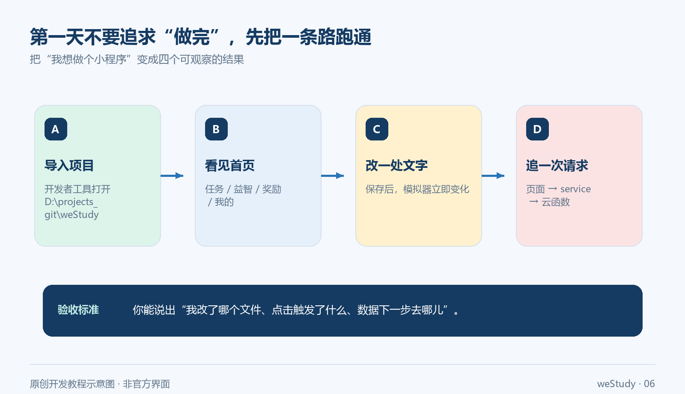

第一次打开微信开发者工具时，你可能会被一屏陌生词吓住：AppID、页面、组件、云函数、环境配置……看起来像是要先学完一整套技术，才有资格开始做小程序。

其实，新手最需要的不是一次生成几百个文件，而是先拿到一个**看得见、改得动、查得清**的结果。

这篇文章不承诺“看完就能上线一个完整产品”。我们换一个更可靠的目标：以 `weStudy` 这个微信小程序项目为例，带你走完一条 30 分钟开发闭环——

> 导入项目 → 编译看到页面 → 改一句话 → 找到功能入口 → 追完一次 AI 出题请求 → 做一次小范围修改。

如果你是第一次接触小程序，照着这条路线走完，你至少会得到四个结果：

1. 知道项目应该从哪个目录导入；
2. 知道首页文件和页面事件在哪里；
3. 亲手完成一次可见的页面修改；
4. 能从 AI 出题按钮追到云函数 handler，而不是只会让 AI “帮我改一下”。



> 这是原创开发示意图，不是微信开发者工具截图。真实菜单名称和界面可能随工具版本变化。

## 01 先准备好，再开始第一轮编译

### 你需要什么

开始前准备下面几样东西：

- 已安装微信开发者工具；
- 一份可以阅读的 `weStudy` 项目代码；
- 一个自己的小程序 AppID，或开发者工具允许的测试方式；
- 如果要验证云端 AI 功能，还需要自己的云开发环境、数据库和相应权限；
- 一个可以编辑代码的工具，例如 Codex、WorkBuddy 或你熟悉的编辑器。

这里要先划一条边界：**能把页面编译出来，不等于云端能力已经可用，更不等于项目已经具备发布条件。** AppID、云环境、数据库和模型密钥都要使用自己的配置，不能直接复制别人项目中的值。

### 导入项目根目录

在微信开发者工具中选择“导入项目”，目录选择项目根目录，也就是同时包含下面这些内容的那一层：

```text
<项目根目录>/
├─ miniapp/
├─ cloudfunctions/
├─ project.config.json
└─ README.md
```

不要把 `miniapp/` 或 `cloudfunctions/` 单独当成项目导入。打开 `project.config.json`，先确认两个关键配置：

```json
{
  "miniprogramRoot": "miniapp/",
  "cloudfunctionRoot": "cloudfunctions/"
}
```

它们分别告诉开发者工具：前端页面在哪里，云函数在哪里。目录选错时，常见表现是页面列表为空、云函数找不到，或者编译后只看到一个空壳页面。

### 第一次编译只看一个结果

点击“编译”后，不要先处理所有警告。先确认模拟器能不能出现首页，以及首页能不能看到主要入口，例如任务、益智、奖励和个人中心等功能区域。

**成功信号：**首页能显示，页面可以点击，至少有一个入口能触发跳转或刷新。

如果页面空白，按下面顺序排查：

1. 导入的是否是包含 `project.config.json` 的项目根目录；
2. `miniprogramRoot` 是否仍然指向 `miniapp/`；
3. 是否使用了自己的 AppID 或可用的测试模式；
4. 页面是否在等待登录、云端身份、数据库或隐私授权；
5. 控制台第一条报错是什么，不要一上来让 AI 重写整个项目。

## 02 用 3 分钟改一句话，确认你真的在开发

项目能打开，只能说明工具找到了入口。第一次有效开发，最好从一个用户马上能看到的文字开始。

### 修改首页文案

打开相对路径：

```text
miniapp/pages/index/index.wxml
```

搜索首页欢迎语，例如：

```text
今天先完成一件小事
```

临时改成：

```text
今天先完成 1 道题
```

保存后重新编译。如果模拟器中的首页同步变化，你就完成了第一次有效修改。

### 这一步要验证什么

不要只说“改成功了”，请确认三件事：

- 改动确实出现在你刚才打开的页面；
- 重新编译后变化仍然存在；
- 原来的按钮、跳转和页面布局没有被误伤。

如果文字没有变化，先检查文件是否保存、页面是否真的引用了这段文字，以及开发者工具是否重新编译了当前项目。这个排查过程比让 AI 直接“修复首页”更能帮你建立判断力。

首页里的按钮通常通过 WXML 的 `bindtap` 绑定事件，真正的处理函数在同目录的 `index.js` 中。你不需要一开始读完整个 JavaScript 文件，只要沿着“页面文字 → 点击事件 → JS 函数”往下找。


> 这是一张原创目录示意图。图中路径是阅读路线的缩写，具体文件以项目当前版本为准。

## 03 从一个用户动作反推文件，不要从文件名猜功能

面对一个真实功能，可以先回答三个问题：

1. **用户从哪里开始？**哪个页面、哪个按钮或哪段文字；
2. **点击后发生什么？**事件名是什么，页面做了什么判断；
3. **数据最后交给谁？**前端 service、统一请求函数，还是云函数 handler。

以“首页今日任务”或“AI 出题”为例，可以按这张路线表阅读：

| 你看到的内容 | 先找哪里 | 你要确认什么 |
|---|---|---|
| 首页文字、按钮 | `miniapp/pages/index/index.wxml` | 用户看到了什么，绑定了哪个事件 |
| 页面行为 | `miniapp/pages/index/index.js` | 点击后调用哪个函数，是否跳转或刷新 |
| 前端请求 | `miniapp/services/` | 请求方法、参数和返回值在哪里封装 |
| 统一云函数调用 | `miniapp/utils/cloudRequest.js` | 请求如何进入云函数，失败如何处理 |
| 云端路由 | `cloudfunctions/api/index.js` | URL 路径交给哪个模块 |
| 具体业务 | `cloudfunctions/api/handlers/` | 参数如何校验、调用和返回 |

这套方法的价值，不是让你背目录，而是让你始终从用户看到的动作出发。使用 AI 编程工具时，也应该先让 AI 帮你定位和解释，再让它改一小处。

## 04 跟着一次 AI 出题请求走一遍

`weStudy` 的 AI 出题不是“点击按钮，模型就直接出现在页面上”。它至少经过页面、service、统一请求函数、云函数入口和业务 handler。

按照项目快照中的文件关系，可以这样追：

1. 在 `miniapp/pages/ai-questions/config/config.wxml` 中找到生成按钮，按钮绑定的是 `onGenerate`；
2. 在同目录的 `config.js` 中找到 `onGenerate`，它会调用 `examService.generateAiQuestions`；
3. 在 `miniapp/services/exam.js` 中找到 `generateAiQuestions`，请求路径是 `/ai-questions/generate`；
4. 继续看 `miniapp/utils/cloudRequest.js`，确认前端如何调用名为 `api` 的云函数，以及超时、错误如何处理；
5. 在 `cloudfunctions/api/index.js` 中确认 `/ai-questions` 路由交给哪个 handler；
6. 在 `cloudfunctions/api/handlers/ai-questions.js` 中确认 `POST /ai-questions/generate` 如何处理参数并返回结果；
7. 回到 `config.js`，确认返回结果如何保存，以及页面下一步使用了什么数据。

当前项目快照中，可以重点核对这些位置：

```text
config.wxml: 生成按钮与 bindtap="onGenerate"
config.js:   onGenerate、generateAiQuestions、current_paper
exam.js:     generateAiQuestions、/ai-questions/generate
api/index.js: /ai-questions 路由
ai-questions.js: POST /ai-questions/generate
```


> 图中使用“AI handler”“当前试卷”等短标签，完整文件路径和请求路径以正文为准。这不是官方界面截图。

### 给 AI 的安全提问方式

不要直接说“帮我重构整个 AI 出题模块”。先让工具做代码考古：

```text
请先不要改代码。基于当前项目根目录，追踪“AI 出题”从页面点击到云函数返回的调用链。

请输出：
1. 入口文件；
2. 事件名；
3. service 方法；
4. 云函数请求路径；
5. handler 文件；
6. 结果保存位置。

限制：不新增依赖、不猜测不存在的文件；每一项附相对文件路径和代码行号。
完成后停下来，等待我确认修改范围。
```

拿到结果后，自己回到开发者工具点击一次，观察调用是否真的发生。**AI 给出的调用链是线索，不是验收结论。**

## 05 让不同工具各做擅长的事

工具越多，越要提前分工，否则每个工具都在“帮你改代码”，最后没有人负责确认结果。

| 工具 | 适合做什么 | 不要把什么交给它 |
|---|---|---|
| 微信开发者工具 | 导入、编译、模拟器调试、预览、云函数部署、真机验证 | 不要把所有警告自动消除 |
| Codex | 阅读目录、追调用链、做小范围修改、解释差异 | 不要在范围不清楚时重写整个项目 |
| WorkBuddy | 拆任务、按项目规则推进、整理检查清单、复盘改动 | 不要把“看起来合理”当成运行成功 |
| 现有组件 | 复用任务卡、空状态、题目卡、加载提示等界面 | 不要为了一个按钮重复造组件 |

真正高效的组合是：

> **开发者工具负责看结果，AI 工具负责缩短阅读和修改时间，你负责决定什么才算完成。**

例如，想改首页空任务状态，不要说“帮我优化首页”，而是这样描述：

```text
目标：只修改首页空任务状态的文案，让首次进入的学生知道下一步做什么。
范围：只检查 miniapp/pages/index/ 和已有空状态组件。
约束：不改云函数、不新增依赖、不调整其他页面样式。
验收：编译后首页空任务状态可见，原有按钮仍能正常跳转。
```

任务越小，结果越容易验收，也越不容易把一个新手项目改成只有 AI 自己看得懂的项目。

## 06 云端和 AI：先把安全边界画清楚

前端通过统一的 `api` 云函数访问后端时，小程序只提交必要参数，云函数负责身份、权限、业务处理和模型调用。前端不应该保存模型密钥。

至少记住五条：

- 模型密钥不要写进 `miniapp/`，也不要提交到 Git；
- 部署 `cloudfunctions/api` 前，先确认自己的云开发环境和数据库配置；
- 模拟器能显示页面，不代表真实用户身份、云端权限和 AI 请求都已经打通；
- 儿童学习场景涉及账号、学习记录和模型输出，真机、隐私授权、异常提示和数据删除路径要单独验证；
- 免费额度、活动资格、模型入口和计费规则会变化，不能把历史文章中的数字直接当成当前承诺。

如果你参考腾讯云活动文章或其他博文，只把它当作操作线索，最终以自己的腾讯云和微信开发者后台为准。

## 07 给自己 30 分钟，完成第一轮开发

### 0—5 分钟：导入并编译

确认项目根目录正确，看到首页和主要入口。页面能显示，就是第一个成功信号。

### 5—10 分钟：改一句首页文案

修改 `miniapp/pages/index/index.wxml` 中的欢迎语，保存并重新编译。模拟器中出现变化，就是第二个成功信号。

### 10—20 分钟：追 AI 出题调用链

从 `config.wxml` 的生成按钮开始，依次找到 `config.js`、`services/exam.js`、`utils/cloudRequest.js`、云函数入口和 handler。每找到一层，就在清单里记下文件和职责。

### 20—30 分钟：做一次小而完整的修改

可以修改空状态提示、按钮文案或已有组件的展示条件。完成后重新编译，并记录三件事：改了哪个文件、用户看到了什么、原有点击是否仍然有效。


## 08 发布前再问自己 8 个问题

- [ ] 我能说明项目根目录应该包含哪些文件；
- [ ] 我能解释 `miniapp/` 和 `cloudfunctions/` 分别负责什么；
- [ ] 我亲手改过一个页面文字，并在模拟器看到变化；
- [ ] 我能从 AI 出题入口追到 `ai-questions` handler；
- [ ] 我知道模拟器通过，不等于真机、云端和上线通过；
- [ ] 我没有把 AppID、密钥、Cookie 或真实用户数据写进文章和代码；
- [ ] 我能指出失败后的第一个排查点；
- [ ] 我知道文章中的项目路径和版本信息需要替换为读者自己的环境。

最后，比“让 AI 一次生成完整项目”更有用的练习是：**下一次只做一个按钮，让它从页面出现、被点击、产生结果，再交给 AI 帮你解释和扩展。**

当你能讲清楚一个按钮背后的文件、请求和结果时，你就不再只是“让 AI 写代码的人”，而是在真正开发自己的小程序。

## 官方入口

- 微信开发者工具下载与说明：<https://developers.weixin.qq.com/miniprogram/dev/devtools/download.html>
- 微信小程序组件文档：<https://developers.weixin.qq.com/miniprogram/dev/component/>
- 微信云开发文档：<https://developers.weixin.qq.com/miniprogram/dev/wxcloud/basis/getting-started.html>
- 腾讯云开发者社区活动文章（仅作历史操作线索，当前资格与额度以个人后台为准）：<https://developer.cloud.tencent.cn/article/2615984?from_column=20421&from=20421>

> 本文基于 weStudy 项目快照与官方入口整理。目录、代码行号、开发者工具菜单和云服务政策可能随版本或账号变化；发布前请在自己的项目、开发者工具、云开发环境和真机上复核。文中配图均为原创开发示意图，不是微信官方界面截图。