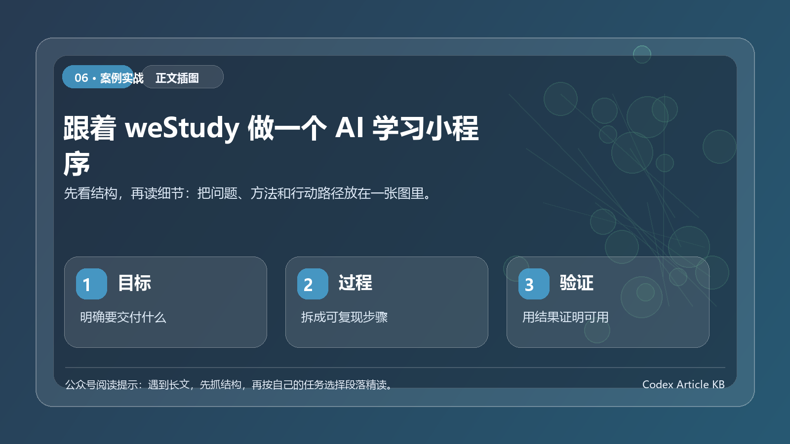

> 这篇不拆代码细节。重点讲我怎样把一个想做 AI 学习小程序的想法，借助 WorkBuddy、Codex 和微信开发者工具，一步步推到 `D:\projects_git\weStudy` 当前这个可联调、可真机预览、可准备提审的状态。



*图：先用一张结构图把本文的重点、方法和行动路径串起来。*


很多人第一次做 AI 应用，容易把问题想复杂：既想做题库，又想做课程，又想做家长报告，还想做游戏化。真正落地时，最重要的不是功能堆得多，而是先跑通一条每天都能使用的闭环。

weStudy 这次定下来的第一条闭环很简单：

> 今天做什么 → 进入练习 → 提交结果 → 错题沉淀 → 获得鼓励 → 明天再来。

下面这套过程，适合想用 AI 编码工具做小程序、Web App、SaaS 原型的同学参考。

## 先把工具摆上桌：每个工具只做自己擅长的事

<table>
  <tr>
    <td align="center" width="25%"><br><strong>WorkBuddy</strong><br>需求、PRD、流程、上线材料</td>
    <td align="center" width="25%"><br><strong>Codex</strong><br>读项目、拆任务、改代码、做检查</td>
    <td align="center" width="25%"><br><strong>微信开发者工具</strong><br>编译、预览、真机调试、提审</td>
    <td align="center" width="25%"><br><strong>CloudBase</strong><br>云函数、数据库、AI 模型调用</td>
  </tr>
</table>

我一开始踩过一个坑：把所有事都丢给同一个聊天窗口。后来发现这样很不稳，因为想清楚产品和改对项目文件不是同一类工作。

更顺的分工是：

这张图就是整篇文章的主线。不是先写代码，而是先把边界定住；不是一次让 AI 做完，而是一轮一轮把可验证结果推出来。

## 第一步：需求调研不要问做什么功能，先问谁在哪个时刻会打开

weStudy 的需求调研没有从功能表开始，而是从使用时刻开始。

我给 WorkBuddy 的第一轮输入大概是这样：

```text
我想做一个面向小学 1-6 年级的 AI 学习微信小程序。
请不要直接列功能，请先帮我梳理：
1. 学生会在什么时间打开？
2. 家长为什么愿意让孩子用？
3. 第一个版本只解决一个什么问题？
4. 哪些看起来很酷但 V1.0 不该做？
输出成：用户、场景、核心任务、不要做清单。
```

这一步带来的最大收益，是避免一上来就做大而全。

最后 V1.0 的核心判断变成了：

- 学生端先解决今天练什么、怎么练、做完有什么反馈；
- 家长端先做到基本查看，不急着做复杂陪伴报告；
- AI 先服务于出题、同类题和错题讲解，不做聊天式学习助手；
- 游戏化只做轻量激励，不做完整游戏系统。

这里的心得是：需求调研不是把愿望装进表格，而是把第一版必须成功的使用瞬间挑出来。

## 第二步：让 WorkBuddy 产出 PRD，但一定要带砍功能清单

需求清楚后，我没有马上打开编辑器，而是继续让 WorkBuddy 把材料整理成可执行文档。

我让它输出了几类内容：

- V1.0 PRD；
- 信息架构与页面路径；
- 首页任务流；
- AI 出题边界；
- 合规注意事项；
- 测试清单；
- 提审材料草稿。

关键不是文档多，而是每份文档都回答一个问题。

这一步我最看重的是不要做清单。例如：

| 先不做 | 原因 |
| --- | --- |
| 完整课程体系 | 内容生产和运营成本太高，拖慢首版闭环 |
| 家长深度数据报告 | 需要更长周期数据，首版容易做成空壳 |
| AI 聊天陪学 | 合规、成本和安全边界都更复杂 |
| 多学科同时上线 | 小程序体验和测试面会被拉大 |

很多项目做不完，不是因为开发慢，而是因为没有人负责说不。AI 工具很擅长加内容，开发者更要学会给它边界。

## 第三步：把文档交给 Codex，不是让它开始写，而是先让它读懂当前项目

有了 PRD 后，我才让 Codex 进入项目。

我没有直接说帮我开发 weStudy，而是先让它完成一次项目体检：

```text
请阅读 D:\projects_git\weStudy 当前项目，先不要改文件。
请输出：
1. 小程序端、云函数、文档分别在哪里；
2. 已经完成了哪些 V1.0 能力；
3. 距离 PRD 还缺什么；
4. 哪些改动风险最大；
5. 建议的前三个开发任务。
```

这一步非常重要。Codex 只有先理解目录、约定和现状，后面的修改才不会乱。

weStudy 当前大体形成了这几个部分：

- `miniapp/`：小程序页面与组件；
- `cloudfunctions/`：统一云函数、数据库访问、AI 调用；
- `docs/V1.0/`：PRD、页面路径、开发记录、测试记录、提审清单；
- `scripts/`：用于本地检查和辅助验证的脚本。

注意，这里只是让读者知道项目状态，不需要背代码路径。真正值得学的是工作方法：先让 AI 读、总结、提风险，再让它改。

## 第四步：Codex 每轮只做一个小目标，做完马上验证

我后面基本按小目标开发推进。每一轮只给 Codex 一个清晰目标。

比如第一轮不说把首页做好，而是说：

```text
目标：让首页能呈现今日学习任务，并能跳转到练习入口。
限制：不要引入新框架，不改无关页面。
完成标准：
1. 首次进入有默认状态；
2. 有任务时显示任务卡；
3. 点击任务能进入对应练习；
4. 空状态不报错；
5. 更新相关 V1.0 开发记录。
```

这样写以后，Codex 的输出会明显稳定。它知道该改什么、不该改什么，也知道做完要留下什么记录。

weStudy 的功能就是这样一块一块推出来的：

| 迭代 | 当轮目标 | 验证方式 |
| --- | --- | --- |
| 1 | 首页今日任务和学习入口 | 小程序能打开，任务卡能跳转 |
| 2 | AI 自由出题 | 输入年级、知识点后能生成练习 |
| 3 | 答题与提交 | 能完成一组题并得到结果 |
| 4 | 错题本与同类题 | 做错的题能沉淀，能继续强化 |
| 5 | 宠物和星星激励 | 学习行为能转成轻量反馈 |
| 6 | 我的、家长、协议与提审材料 | 上线前基本信息闭环补齐 |

我现在更喜欢把提示词写成四段式：

```text
背景：现在项目已经有什么。
目标：这一轮只完成什么。
限制：哪些地方不要动。
验收：怎样才算完成。
```

这个模板比帮我优化一下好用很多。

## 第五步：让 Codex 做审查，不要只让它写功能

AI 编码工具最容易被低估的能力，是审查。

每完成一个模块，我都会让 Codex 换一个角度检查。比如：

```text
请以微信小程序上线前检查的角度审查当前改动。
重点看：
1. 是否有密钥或环境配置泄露；
2. 是否有未处理的空状态；
3. 云函数参数是否校验；
4. AI 返回异常时页面是否有兜底；
5. 是否会影响已有页面路径。
只输出问题清单和建议，不要直接改文件。
```

这一步比继续开发新功能更值钱。weStudy 这种 AI 出题应用，真正容易出问题的地方不是按钮样式，而是：

- AI 返回不是合法 JSON；
- 模型超时；
- 同一个接口被传入异常参数；
- 用户没有学生档案时页面空白；
- 真机和模拟器表现不一致；
- 提审时协议、隐私、内容边界没有说明清楚。

我的习惯是：功能写完后，至少让 Codex 做一次上线前风险清单。它不一定能发现全部问题，但能逼你把风险显性化。

## 第六步：微信开发者工具要提前介入，不要最后一天才打开

很多 AI 编码教程只停在代码写好了。但小程序项目不一样，真正的坑经常出现在微信开发者工具里。

weStudy 开发过程中，微信开发者工具主要做四件事：

1. 导入项目，确认 `project.config.json` 与 AppID 配置；
2. 编译页面，检查路由、样式、资源路径；
3. 部署云函数，确认云端环境和数据库权限；
4. 预览和真机调试，检查登录、接口、AI 生成链路。

我自己的节奏是：每完成一个闭环，就进开发者工具跑一次，而不是等全部写完。

这里的心得很朴素：模拟器只能证明可能能跑，真机才能证明真的能用。尤其是登录、云函数、网络超时、授权弹窗这些问题，真机更早发现，就更省时间。

## 第七步：免费云服务和 AI 模型可以用，但要从第一天开始记录成本边界

weStudy 的开发期用到了微信小程序生态和 CloudBase 能力：

- 小程序端负责用户界面；
- 云函数承接接口和权限边界；
- 云数据库保存学生档案、练习记录、错题等数据；
- CloudBase AI 调用大模型生成题目、同类题和讲解。

项目当前 AI 服务封装里使用的是 CloudBase Node SDK 的 AI 能力，模型组配置为 `hunyuan-exp`，默认模型配置为 `hunyuan-2.0-instruct-20251111`，并绑定了开发期免费 Token Credits 资源包。实际可用额度、模型名称和计费规则一定要以腾讯云控制台当日显示为准。

我对免费资源的看法是：

- 开发期可以用免费额度快速验证，不要一开始就自建复杂服务；
- 只要接入 AI，就要记录一次生成平均消耗多少 token；
- 出题数量要有限制，不要让用户无限生成；
- 上线前要准备降级方案，比如 AI 失败时返回提示或使用本地兜底题；
- 不要把密钥、环境 ID、模型组等配置散落在页面里，统一放在云端或配置层。

免费额度不是不用管成本，而是给你一个低成本验证产品闭环的窗口。

## 第八步：测试不是点一点页面，而是验证孩子真的能完成一次学习

到了测试阶段，我没有把清单写成页面能打开这么简单，而是围绕真实使用流程测。

一条完整测试路径是：

1. 新用户进入小程序；
2. 选择或创建学生档案；
3. 回到首页看到今日任务；
4. 进入 AI 出题；
5. 完成答题并提交；
6. 查看结果；
7. 做错的题进入错题本；
8. 从错题继续生成同类题；
9. 学习行为获得星星或宠物反馈；
10. 退出后再次进入，数据仍然存在。

Codex 在这里主要帮我做两件事：

- 根据 PRD 生成测试清单；
- 根据实际测试记录反推遗漏场景。

我会这样问：

```text
请根据 docs/V1.0 中的 PRD 和当前实现，生成一份 V1.0 联调测试清单。
不要按文件列，按用户路径列。
每条包含：前置条件、操作、预期结果、失败时优先检查什么。
```

这个提示词比帮我写测试用例更贴近真实项目。因为上线前最需要的是知道：哪里失败了，先查什么。

## 第九步：上线前不要再扩功能，只做三件事

项目推到能跑通后，人很容易兴奋，开始想继续加新功能。这个阶段反而要克制。

weStudy 上线前只做三类事：

我把问题分成三档：

| 级别 | 处理方式 |
| --- | --- |
| P0 | 影响登录、练习、提交、数据保存、提审，必须修 |
| P1 | 影响体验但不阻断主流程，看时间处理 |
| P2 | 锦上添花，全部放到下一版 |

这一步的心得是：上线前最值钱的能力不是再多做一点，而是守住主流程不被新想法打断。

## 新手版成果验收样例

做 AI 学习小程序时，不要用“页面都能打开”作为唯一验收标准。更好的验收方式，是模拟一个孩子完成一次完整学习。

一次最小验收可以这样做：选择一节课，进入学习页，听或读完内容，完成一道练习，看到反馈，再回到学习记录页确认进度变化。这个路径能跑通，才说明产品真的形成了学习闭环。

如果只验收按钮能点、页面不报错，很容易漏掉关键问题：题目和课程没有关联，反馈太抽象，学习记录没有保存，家长看不到结果。

建议每次迭代只问三个问题：孩子能不能独立完成一次学习；家长能不能看懂学习结果；系统能不能留下下一次继续学习的线索。

## 我复盘出来的 8 条 AI 开发心得

### 1. 不要让 AI 从一句话开始开发

帮我做一个 AI 学习小程序太宽了。更好的方式是先让 WorkBuddy 帮你拆出用户、场景、范围、不要做清单。

### 2. 文档不是形式主义，是给 AI 的上下文

PRD、页面路径、测试清单、提审说明都不是摆设。它们能让 Codex 每次进入项目时知道边界，不至于越改越散。

### 3. Codex 最适合做小步快跑

一次让它改十个模块，风险很高。一次只让它完成一个闭环，配合验收标准，成功率会高很多。

### 4. 先让 AI 读项目，再让 AI 改项目

读项目这一步不能省。让 Codex 先总结结构、现状、风险，再开始修改，后续返工会少很多。

### 5. AI 生成内容必须有格式约束

出题、讲解、同类题都不能只要自然语言。要约束 JSON 结构、字段、题型、数量、难度，并准备解析失败和超时兜底。

### 6. 微信开发者工具是现实检查器

Codex 能帮你写很多东西，但小程序能不能跑，最终要看开发者工具、真机、云函数日志和提审要求。

### 7. 免费额度适合验证，不适合盲目上线

开发期用免费云服务和免费 Token Credits 很合适。但只要准备上线，就要看调用频次、生成次数、超时率和预算上限。

### 8. 最后一周只收口，不扩张

功能做完后，让 Codex 帮你列风险、补文档、查遗漏；不要让它继续加新模块。能上线的版本，比永远在变大的版本更重要。

## 如果你想照着做，可以按这条路线走

这条路线不只适合 weStudy。你要做 AI 记账、AI 简历、AI 客服、AI 工具箱，也可以复用：先定场景，再定边界，再小步开发，再真机验证，最后冻结上线。

真正提高效率的不是某个神奇提示词，而是把 AI 放进一套稳定的开发节奏里。

## 如果你想复刻，先别急着做完整小程序

学习类小程序最容易一开始做大：课程、打卡、题库、积分、社群、AI 助教全都想要。结果需求很完整，第一版却迟迟跑不起来。

更稳的复刻路径，是先做一个最小学习闭环：用户输入学习目标，系统生成学习计划，用户完成一次学习记录，AI 给出复盘建议。只要这四步能跑通，就已经具备产品雏形。

第一版可以只保留 3 个页面：目标页、学习页、复盘页。目标页负责收集用户要学什么、时间有多少、当前水平如何；学习页负责展示当日任务和材料；复盘页负责让 AI 根据完成情况给出下一步建议。

## 判断这个项目有没有做下去的价值

不要用功能数量判断小程序是否成功，要看用户是否愿意连续使用。

可以用 5 个信号观察：用户是否能在 1 分钟内创建目标；是否能看懂今天该做什么；是否愿意记录完成情况；AI 反馈是否足够具体；第二天是否还能接着昨天的进度走。

如果这 5 个信号成立，再增加题库、课程和社群才有意义。否则功能越多，越容易把真正的问题藏起来。
