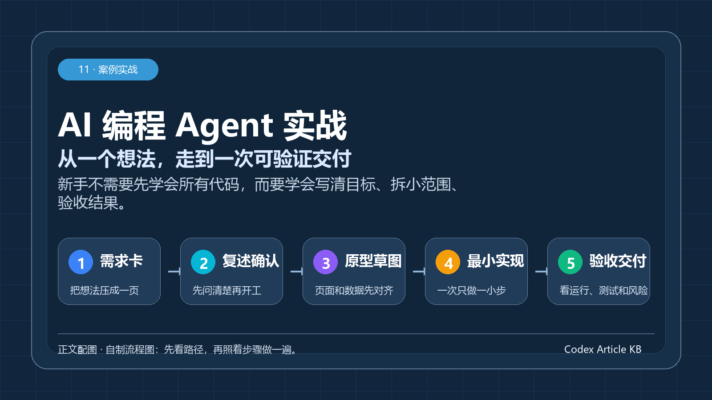
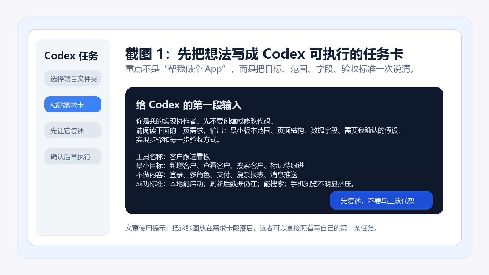
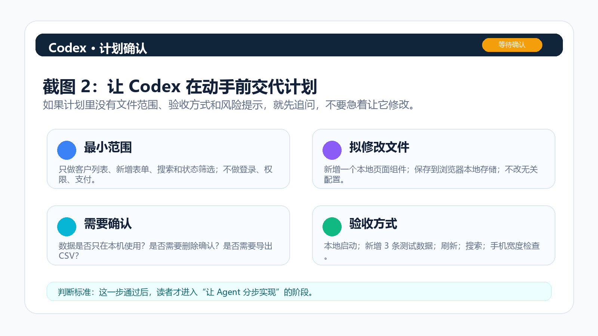
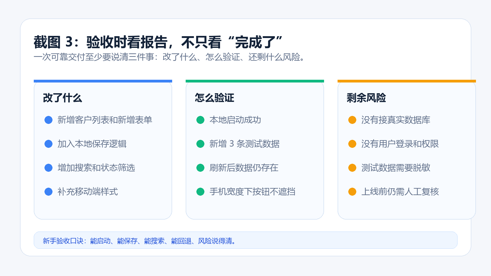

> 一句话结论：新手用 AI 编程 Agent，不是把一句“帮我做个 App”扔出去，而是把想法拆成需求卡、计划确认、分步实现和可验收报告。

很多人第一次看到 AI 编程 Agent，会有一种冲动：我是不是也能直接做一个 App。这个方向没错，但起手方式经常错。

你只说“帮我做个客户管理工具”，Agent 很可能马上生成页面、按钮、数据库和一堆文件。看起来很忙，真正打开时却不知道该看哪里、怎么验收、哪里有风险。

更稳的做法，是把自己当成产品负责人，把 Codex 这类编程 Agent 当成实现协作者：你负责说清楚目标、边界、成功标准和风险；它负责进入项目、理解文件、提出计划、修改内容、运行检查，再把结果汇报给你。



*图：自制流程图。新手先按“需求卡—复述确认—原型草图—最小实现—验收交付”走一遍，不要一开始就追求完整系统。*

下面用一个轻量“客户跟进看板”做例子。它不是复杂 CRM，也不假装非技术人员可以完全替代工程师，而是演示一条更现实的路径：先跑通一个小工具，再决定是否继续投入。

## 先记住一个原则：让 Agent 先想清楚，再动手

AI 编程最怕需求太空。做个 App、做个 CRM、做个自动化系统，这些词对人来说像方向，对 Agent 来说可能变成过度发挥。

新手最容易犯的错，是一上来就让 Agent 写代码。更好的第一步，是明确告诉它：先不要改文件，先复述你的理解，先列出计划和风险。

在 Codex 里可以把一次任务理解成四个阶段。

1. 读：让它读项目和需求，但暂时不要修改。
2. 说：让它复述范围、页面、数据、假设和风险。
3. 做：确认后，只让它完成一个小阶段。
4. 验：让它说明改了什么、怎么检查、哪里还不可靠。

这个节奏看起来慢，其实更快。因为它减少了最昂贵的返工：一堆代码都写完了，才发现方向错了。

## 第一步：把想法压成一页需求卡

先不要写“帮我做个 App”。把你的想法写成一页需求卡，越具体越好。

可以直接复制下面这段，再替换成自己的场景。

```text
工具名称：客户跟进看板
使用者：我自己，每周录入 20 条左右线索
最小目标：新增客户、查看客户、搜索客户、标记待跟进
不做内容：登录、多角色、支付、复杂报表、消息推送
数据字段：姓名、公司、需求、来源、跟进状态、下次跟进日期、备注
成功标准：
1. 本地能启动。
2. 新增一条测试数据后，刷新页面仍然存在。
3. 能按公司或姓名搜索。
4. 手机浏览不明显挤压。
5. 不使用真实客户隐私数据测试。
```

这张需求卡的作用，是把范围压到足够小。第一个版本越小，越容易看出 Agent 到底有没有做对。



*图：自制示意截图。真实界面可能会随版本变化，重点是任务写法：先让 Codex 读需求、复述范围，不要一上来改代码。*

如果你是完全新手，需求卡里至少要写清五件事。

第一，谁用。自己用、团队用、客户用，风险完全不同。

第二，最小目标。只写第一版必须有的功能，不写“以后可能需要”。

第三，不做什么。登录、支付、权限、报表、消息推送，这些都很容易让范围膨胀。

第四，数据字段。字段写清楚，页面和存储才不会乱。

第五，成功标准。不要写“看起来不错”，要写“刷新后数据仍在”“能搜索”“手机端不挤压”。

## 第二步：让 Codex 先复述，不要马上接受改动

把需求卡贴给 Codex 后，第一条指令可以这样写。

```text
你是我的实现协作者。先不要创建或修改代码。
请阅读下面的一页需求，输出：
1. 你理解的最小可行版本范围。
2. 页面结构和用户操作路径。
3. 需要保存的数据字段。
4. 你认为仍需我确认的假设。
5. 实现步骤和每一步验收方式。
6. 可能的数据、密钥和权限风险。

等我确认后，再分步骤实现。每完成一步，请说明改了哪些文件、如何启动、如何验证。
```

这一步能挡掉很多问题。优秀的 Agent 不应该只会往前冲，还应该能在动手前把假设摆出来。

比如它可能会问：数据存在浏览器、本地文件，还是数据库；是否需要导出 CSV；是否需要删除确认；是否移动端优先。你确认得越清楚，后面返工越少。



*图：自制示意截图。看到计划后，先检查“最小范围、拟修改文件、需要确认、验收方式”四项，再决定是否让 Agent 继续。*

这里有一个判断方法：如果 Agent 的计划里没有“怎么验证”，就不要让它继续写代码。

因为对新手来说，看不懂代码很正常；但你至少要知道结果如何打开、如何操作、如何判断它没做错。

## 第三步：把开发拆成 5 个验收关口

确认计划后，再让 Agent 分步实现。不要一次性要求“全部做完”。

这个客户跟进看板可以拆成五个关口。

### 关口一：需求复述

你要看 Agent 有没有理解错对象。比如你要的是自己用的小工具，它却准备做团队协作后台，这就是范围失控。

验收重点：功能是否只覆盖最小目标；不做内容是否被保留下来；数据字段是否和真实使用动作对应；仍需确认的问题是否具体。

### 关口二：原型草图

非技术人员不一定懂代码，但一定能看懂流程。先让 Agent 输出页面结构和用户操作路径。

一个简单原型可以是这样。

```text
首页：客户列表 + 搜索框 + 新增按钮
新增区：录入客户字段 + 保存按钮
详情区：查看客户信息 + 修改状态 + 添加备注
筛选：全部、待跟进、已联系、暂缓
```

如果这个流程你都不愿意每天用，代码写得再多也没有意义。

### 关口三：最小实现

确认原型后，再让 Agent 生成代码。这个阶段要强调分步交付。

建议顺序是：先创建基础页面和假数据；再加新增表单；再加本地保存；再加搜索和状态筛选；最后做移动端适配。

每一步都要能单独启动、单独验证。这样哪一步坏了，你知道问题在哪里。

### 关口四：测试清单

非技术人员也可以做功能测试。你不需要读懂每一行代码，但要用真实动作检查。

最低测试清单如下。

- 新增 3 条测试客户，刷新后仍然存在。
- 搜索一个存在的公司名，结果正确。
- 搜索一个不存在的关键词，页面有空状态提示。
- 修改跟进状态，列表同步变化。
- 删除一条测试数据前，有明确确认。
- 手机宽度下，按钮和输入框不遮挡。
- 清除测试数据后，工具还能正常启动。

只要这些检查没过，就不要进入部署。

### 关口五：部署和风险

部署不是最后点一下按钮。对非技术人员来说，部署前至少确认四件事。

第一，环境变量和密钥不能写进公开仓库。任何 API Key、数据库密码、访问令牌都应该放在单独配置里。

第二，测试数据不能包含真实隐私。客户姓名、电话、邮箱、合同信息都要脱敏。

第三，项目要能回退。Agent 每完成一个阶段，最好留下清晰版本记录。改坏了可以回到上一步。

第四，公开访问范围要明确。只是自己用，就不要默认发布到任何人都能访问的公网地址。

## 第四步：验收时看报告，不只看“完成了”

很多新手会被一句“我已完成”带走。真正该看的，是 Agent 的最终报告。

一份可用的报告至少应该包含三部分。

1. 改了什么：新增了哪些页面、字段、保存逻辑和样式。
2. 怎么验证：运行了哪些检查，人工应该怎么复测。
3. 剩余风险：哪些地方只是本地演示，哪些地方上线前还要人工把关。



*图：自制示意截图。不要只看“完成了”，要看改动范围、验证动作和剩余风险是否说清楚。*

你可以要求 Codex 每次结束都按这个格式汇报。

```text
请用下面格式总结本轮结果：
1. 已完成：列出本轮真正完成的功能。
2. 修改范围：列出主要修改文件和原因。
3. 验证方式：说明我如何启动、如何复测、检查了哪些场景。
4. 未完成或风险：列出仍需确认的问题，不要只报喜。
5. 下一步建议：只给 1 到 2 个最小下一步。
```

这段提示词的价值，是把“聊天式交付”变成“可验收交付”。

## 不懂代码时，重点看这 6 个信号

第一，看它是否能说明如何启动。一个可交付小工具，必须能告诉你怎么打开。

第二，看它是否能说明数据在哪里。存在浏览器、本地文件、数据库，风险完全不同。

第三，看它是否能解释修改范围。它改了哪些文件、为什么改、下一步怎么验证，都应该说清楚。

第四，看它是否能列出失败项。只报喜不报错的 Agent，不适合直接交付。

第五，看它是否能控制范围。你要求最小版本，它却主动加登录、权限和复杂报表，要立刻叫停。

第六，看它是否能用普通话解释风险。密钥、权限、数据删除、公开访问，这些都不能用技术术语糊弄过去。

## 哪些想法适合先交给 Agent

适合先练手的任务，通常有三个特点：范围小、失败成本低、验收动作清楚。

比较适合的是表格录入和查询工具、小型内部看板、重复文本处理工具、简单数据清洗脚本、静态网页原型、个人知识库整理辅助。

暂时不适合新手直接交给 Agent 单独完成的，是涉及支付和资金流的系统、涉及真实用户隐私的大规模产品、强合规强审计业务、出错会造成业务中断的自动化流程，以及需要长期维护的复杂多人协作平台。

这不是说 Agent 做不了，而是说新手不应该在没有工程和安全把关的情况下直接上线。

## 一个更小的练习：从待办页开始

如果客户跟进看板仍然觉得大，可以先做一个待办页。

需求可以这样写：页面能新增、勾选、删除待办；只做本地状态，不接账号和云同步；刷新前能正常操作；空列表有提示；输入为空时不能新增；不新增复杂依赖，不改无关页面。

这个任务小到可以验证，却包含了真实产品开发的关键动作：明确范围、控制风险、检查结果。新手用 Agent 编程，应该先跑通这种小闭环，再逐步增加登录、存储、权限和部署。

## 最后：把 Codex 当协作者，而不是许愿池

AI 编程 Agent 的真正价值，不是让每个人都变成工程师，而是让更多人能用更低成本验证想法。

你不需要一开始就懂框架、数据库和部署平台，但你需要懂验收：范围有没有控制住，数据有没有保存，风险有没有隔离，结果能不能运行。

当你能把一个想法拆成需求卡、复述确认、原型草图、最小实现、测试清单和部署边界，Codex 才会从“会写代码的聊天框”，变成可靠的实战协作者。
