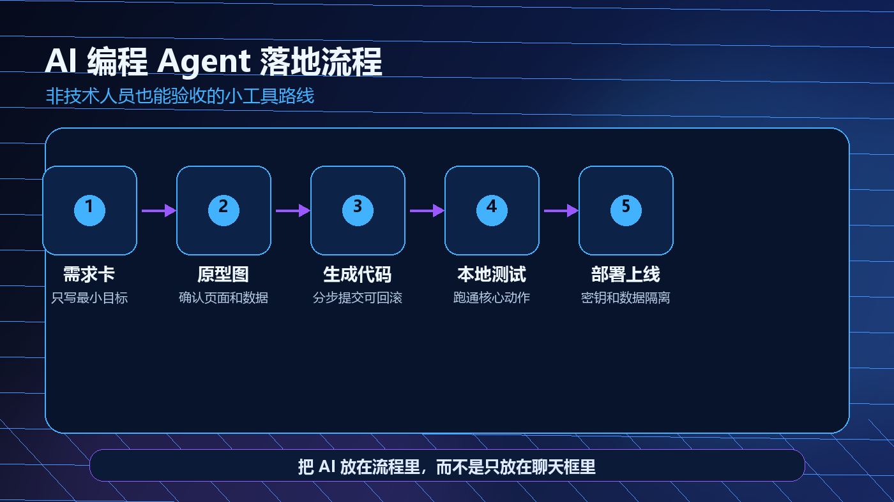
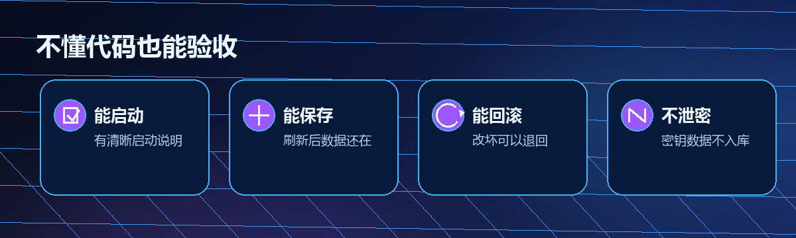

> 一句话结论：非技术人员用 AI 编程 Agent，关键不是学会写代码，而是学会把想法拆成可验收的小版本。

很多人看到 AI 编程 Agent 的演示，会产生一种冲动：我是不是也能直接做一个 App。这个方向没错，但起手方式经常错。你给 Agent 一句帮我做个客户管理工具，它很可能马上生成页面、按钮、数据库和一堆文件。看起来动静很大，真正打开时却不知道该验收什么。

更稳的做法，是把自己当成产品负责人，把 Agent 当成实现协作者。你负责说清楚场景、边界、成功标准和风险；Agent 负责把这些内容翻译成原型、代码、测试和可运行版本。

本文用一个轻量客户跟进工具做例子。它不追求复杂，也不假装非技术人员能完全替代工程师，而是展示一条更现实的路径：先跑通一个小工具，再决定是否继续投入。



*图：从需求卡到部署的 5 个验收关口，自制示意图。*

## 不要从做个 App 开始，要从一页需求开始

AI 编程最怕需求太空。做个 App、做个 CRM、做个自动化系统，这些词对人来说像方向，对 Agent 来说会变成过度发挥。

先写一页需求就够了。

```text
工具名称：客户跟进看板
使用者：我自己，每周录入 20 条左右线索
最小目标：新增客户、查看客户、搜索客户、标记待跟进
不做内容：登录、多角色、支付、复杂报表、消息推送
数据字段：姓名、公司、需求、来源、跟进状态、下次跟进日期、备注
成功标准：
1. 本地能启动。
2. 新增一条测试数据后，刷新页面仍然存在。
3. 能按公司或姓名搜索。
4. 手机浏览不明显挤压。
5. 不使用真实客户隐私数据测试。
```

这张需求卡的作用，是把范围压到足够小。第一个版本越小，越容易看出 Agent 到底有没有做对。

## 让 Agent 先复述，不要马上改代码

第一条指令建议这样写。

```text
你是我的实现协作者。先不要创建或修改代码。
请阅读下面的一页需求，输出：
1. 你理解的最小可行版本范围。
2. 页面结构和用户操作路径。
3. 需要保存的数据字段。
4. 你认为仍需我确认的假设。
5. 实现步骤和每一步验收方式。
6. 可能的数据、密钥和权限风险。

等我确认后，再分步骤实现。每完成一步，请说明改了哪些文件、如何启动、如何验证。
```

这一步会挡掉很多问题。优秀的 Agent 不应该只会往前冲，还应该能在动手前把假设摆出来。

比如它可能会问：数据存在本地浏览器，还是存在本地文件；是否需要导出 CSV；是否需要移动端优先；是否需要删除确认。你确认得越清楚，后面返工越少。

## 把开发过程拆成 5 个验收关口

### 关口一：需求复述

你要看 Agent 有没有理解错对象。比如你要的是自己用的小工具，它却做了团队协作后台，这就是范围失控。

验收重点：

- 功能是否只覆盖最小目标。
- 不做内容是否被保留下来。
- 数据字段是否和真实使用动作对应。
- 仍需确认的问题是否具体。

### 关口二：原型草图

非技术人员不一定懂代码，但一定能看懂流程。先让 Agent 输出页面结构和操作路径。

一个简单原型可以是这样。

```text
首页：客户列表 + 搜索框 + 新增按钮
新增页：录入客户字段 + 保存按钮
详情页：查看客户信息 + 修改状态 + 添加备注
筛选：全部、待跟进、已联系、暂缓
```

如果这个流程你都不愿意每天用，代码写得再好也没有意义。

### 关口三：最小实现

确认原型后，再让 Agent 生成代码。这个阶段要强调分步提交。不要一次性让它做完全部功能。

建议顺序是：

1. 创建基础页面和假数据。
2. 加新增表单。
3. 加本地保存。
4. 加搜索和状态筛选。
5. 加移动端适配。

每一步都要能单独启动、单独验证。这样哪一步坏了，你知道问题在哪里。

### 关口四：测试清单

非技术人员也可以做功能测试。你不需要读懂每一行代码，但要用真实动作检查。



*图：小工具验收的 4 个基本信号，自制贴图。*

最低测试清单如下。

- 新增 3 条测试客户，刷新后仍然存在。
- 搜索一个存在的公司名，结果正确。
- 搜索一个不存在的关键词，页面有空状态提示。
- 修改跟进状态，列表同步变化。
- 删除一条测试数据前，有明确确认。
- 手机宽度下，按钮和输入框不遮挡。
- 清除测试数据后，工具还能正常启动。

只要这些检查没过，就不要进入部署。

### 关口五：部署和风险

部署不是最后点一下按钮。对非技术人员来说，部署前至少要确认 4 件事。

第一，环境变量和密钥不能写进公开仓库。任何 API Key、数据库密码、访问令牌都应该放在单独配置里。

第二，测试数据不能包含真实隐私。客户姓名、电话、邮箱、合同信息都要脱敏。

第三，项目要能回滚。Agent 每完成一个阶段，最好留下清晰版本记录。改坏了可以回到上一步。

第四，公开访问范围要明确。只是自己用，就不要默认发布到任何人都能访问的公网地址。

## 一个可复用的协作节奏

我更推荐这样的节奏。

```text
第 1 轮：我写需求卡，Agent 只复述和提问。
第 2 轮：Agent 给页面和数据结构，我确认取舍。
第 3 轮：Agent 做最小版本，我按清单验收。
第 4 轮：Agent 修复问题，我只接受可验证改动。
第 5 轮：确认部署方式、密钥、数据和回滚方案。
```

这个节奏看起来慢，其实更快。因为它减少了最昂贵的返工：一堆代码都写完了，才发现方向错了。

## 不懂代码时，重点看这 6 个信号

第一，看它是否能说明如何启动。一个可交付小工具，必须能告诉你怎么打开。

第二，看它是否能说明数据在哪里。存在浏览器、本地文件、数据库，风险完全不同。

第三，看它是否能解释修改范围。它改了哪些文件、为什么改、下一步怎么验证，都应该说清楚。

第四，看它是否能列出失败项。只报喜不报错的 Agent，不适合直接交付。

第五，看它是否能控制范围。你要求最小版本，它却主动加登录、权限和复杂报表，要立刻叫停。

第六，看它是否能用普通话解释风险。密钥、权限、数据删除、公开访问，这些都不能用技术术语糊弄过去。

## 哪些想法适合先交给 Agent

适合的：

- 表格录入和查询工具。
- 小型内部看板。
- 重复文本处理工具。
- 简单数据清洗脚本。
- 静态网页原型。
- 个人知识库整理辅助。

暂时不适合直接交给 Agent 单独完成的：

- 涉及支付和资金流的系统。
- 涉及真实用户隐私的大规模产品。
- 强合规、强审计的业务系统。
- 出错会造成业务中断的自动化流程。
- 需要长期维护的复杂多人协作平台。

这不是说 Agent 做不了，而是说非技术人员不应该在没有工程和安全把关的情况下直接上线。

## 结尾

AI 编程 Agent 的真正价值，不是让每个人都变成工程师，而是让更多人能用更低成本验证想法。

你不需要一开始就懂框架、数据库和部署平台，但你需要懂验收：范围有没有控制住，数据有没有保存，风险有没有隔离，结果能不能运行。

当你能把一个想法拆成需求卡、原型、最小实现、测试清单和部署边界，Agent 才会从炫技工具变成可靠协作者。
