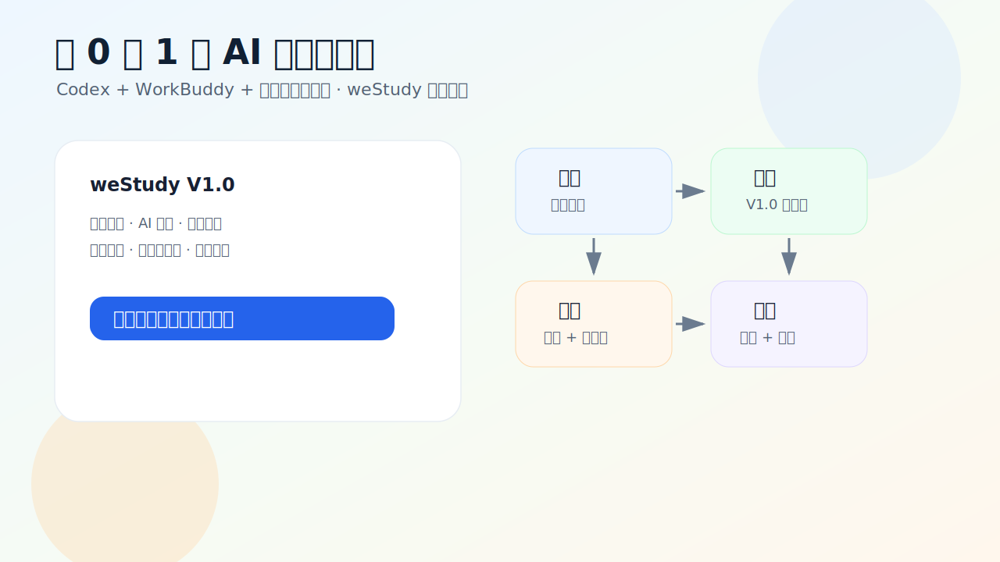
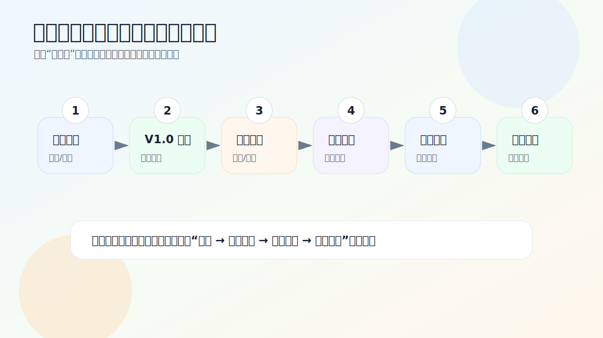
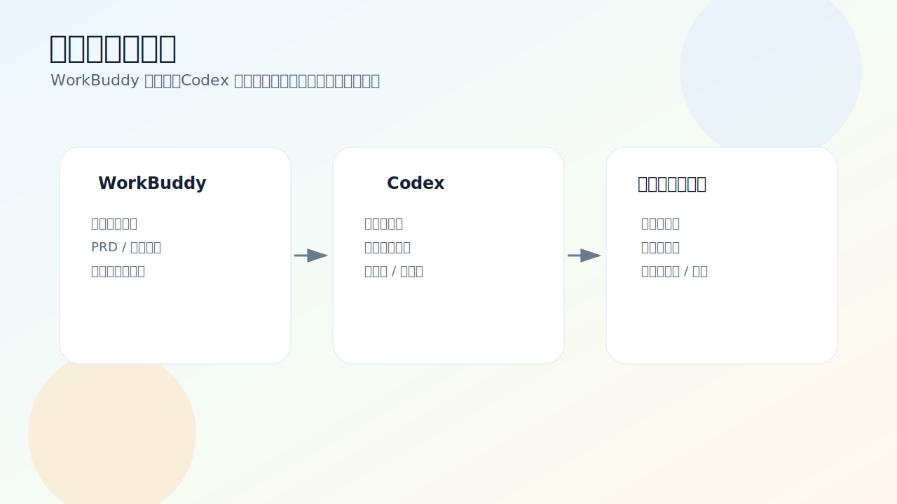
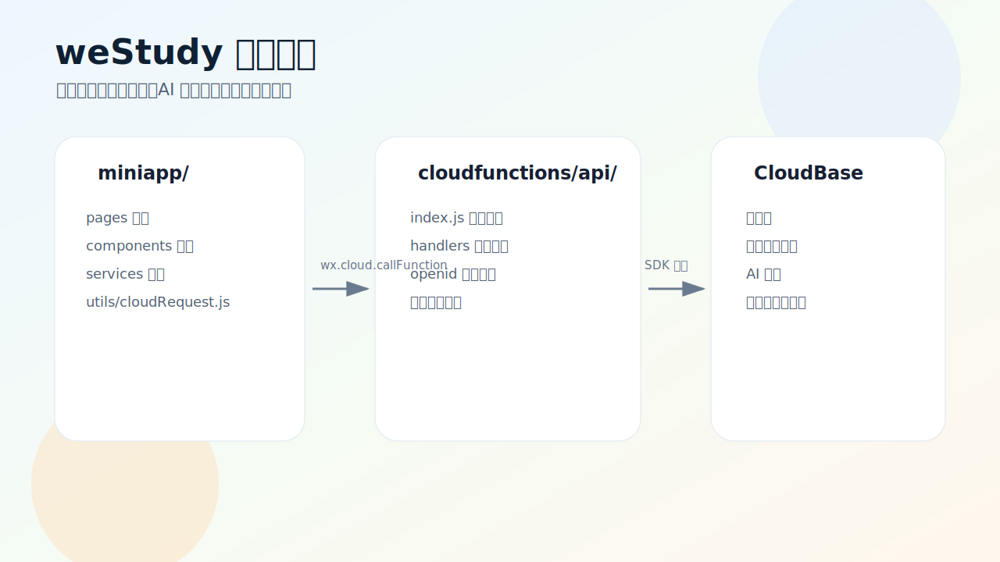
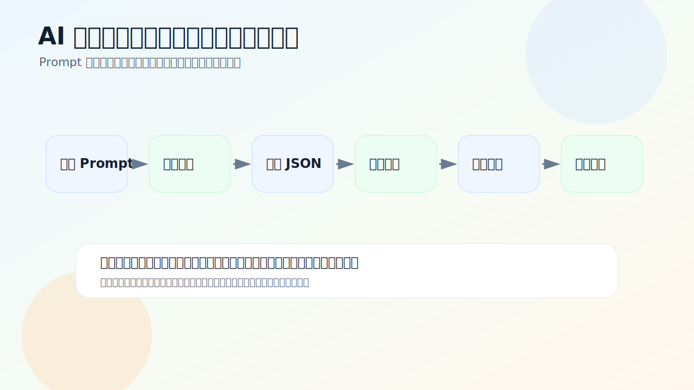
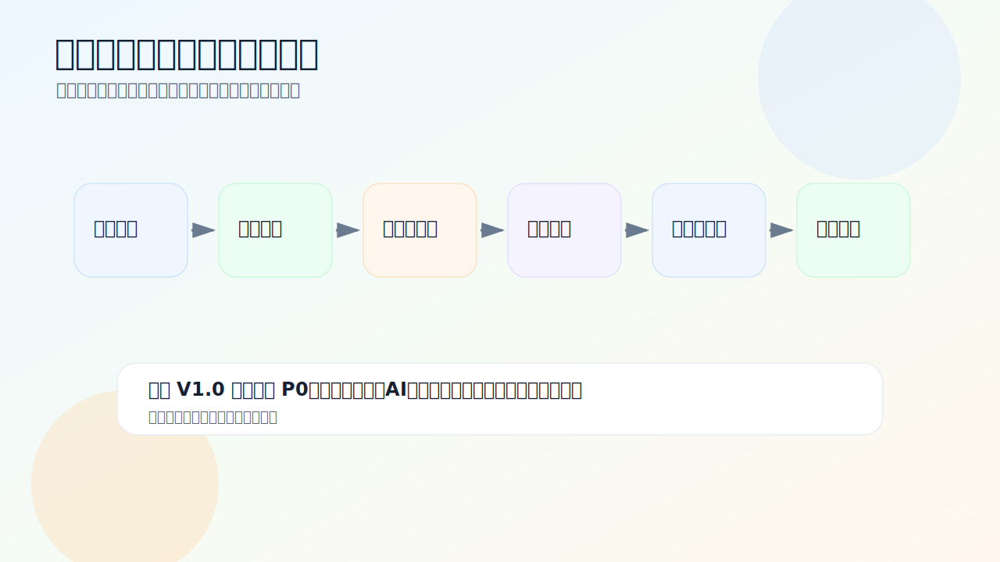

# 跟着 weStudy 做一个 AI 学习小程序：Codex + WorkBuddy + 微信开发者工具完整开发路线

> 这不是一篇“功能介绍”，而是一条可以照着走的开发路线。  
> 我会用本地项目 `D:\projects_git\weStudy` 做例子，带你从需求调研、范围取舍、编码实现、测试联调一直走到上线准备。

先说结论：做 AI 小程序，最容易卡住的地方不是“不会写页面”，而是**一开始就想做完整教育平台**。weStudy 这次的经验是：先把孩子每天会不会打开、能不能完成任务、做完有没有反馈跑通，再谈更复杂的功能。

这篇文章会用到三类工具：

- **WorkBuddy**：用来整理需求、PRD、流程和上线材料；
- **Codex**：用来读项目、改代码、补接口、检查问题；
- **微信开发者工具**：用来编译、预览、真机调试、云函数部署和提审。

如果你正准备做一个 AI 小程序，可以把这篇文章当作一份学习路径，而不是照抄代码的说明书。

---

## 1. 先看成果：weStudy 到底跑通了什么？

weStudy 是一个面向小学 1-6 年级学生家庭的微信小程序。V1.0 没有追求“大而全”，只围绕一个很朴素的闭环：

> 今天做什么 → 开始练习 → 提交结果 → 错题沉淀 → 获得鼓励 → 明天再来。

项目里已经搭好的主线包括：

| 你要学的能力 | weStudy 里的对应模块 | 代码位置 |
| --- | --- | --- |
| 首页任务怎么设计 | 今日任务、宠物状态、任务卡动作 | `miniapp/pages/index/` |
| AI 出题怎么接入 | 年级、知识点、题型配置，生成练习题 | `miniapp/pages/ai-questions/`、`cloudfunctions/api/handlers/ai-questions.js` |
| 答题链路怎么做 | 组卷、答题、提交、结果反馈 | `miniapp/pages/exam/`、`cloudfunctions/api/handlers/exam.js` |
| 错题怎么沉淀 | 错题列表、错题详情、同类题 | `miniapp/pages/wrongbook/`、`cloudfunctions/api/handlers/wrongbook.js` |
| 激励怎么轻量化 | 星星奖励、宠物成长、游戏计奖限制 | `cloudfunctions/api/handlers/pet.js`、`cloudfunctions/api/handlers/game.js` |
| 小程序怎么上线 | 真机预览、云函数、协议、提审清单 | `docs/V1.0/15_测试_第9步联调测试记录.md`、`docs/V1.0/18_上线_V1.0上线检查与遗留代办.md` |

你会发现，它更像一个“学习习惯训练器”，而不是题库 App。

---

## 2. 工具先分工，不要把所有事都交给一个聊天窗口

我在开发过程中没有让某个工具“一把梭”。更稳的方式是让三件工具各做擅长的事。

### WorkBuddy：先把想法变成可开发的材料

一开始我不会让工具直接写代码，而是先整理这些内容：

- 目标用户是谁；
- 孩子和家长分别在什么场景下使用；
- V1.0 必须做什么；
- 哪些功能先不做；
- 首页到底引导什么动作；
- 上线前怎样才算“可交付”。

我常用的提示词是这样写的：

~~~text
你是教育小程序产品经理。我要做一个面向小学 1-6 年级的微信小程序，核心能力是 AI 出题、错题复习、每日任务、益智游戏。

请帮我整理：
1. 目标用户分层
2. 每类用户的高频场景和真实痛点
3. V1.0 必做范围
4. V1.0 明确不做的功能
5. 首页信息架构建议
6. 上线前验收标准

要求：不要设计大而全平台，优先做一个能验证留存的小闭环。
~~~

这一步的结果不是“漂亮文案”，而是后面编码时的边界。

### Codex：把边界落到代码里

有了 PRD 和任务拆分，再让 Codex 进入项目：读目录、定位文件、按模块修改、补测试、总结风险。

更推荐这样的提问方式：

~~~text
请阅读 miniapp/pages/ai-questions 和 cloudfunctions/api/handlers/ai-questions.js。
本次只实现“按年级、知识点、题型生成练习题”的主链路。
要求：
1. 前端不直接调用 AI
2. 统一走 cloudfunctions/api
3. AI 输出必须做 JSON 解析和字段校验
4. 失败时给小学生和家长能看懂的提示
5. 不要改无关页面
~~~

这样写，Codex 才知道边界在哪里。

### 微信开发者工具：让项目回到真实环境里

小程序在编辑器里看起来没问题，不代表能上线。微信开发者工具至少要做这些事：

- 导入项目；
- 编译并查看控制台；
- 真机扫码预览；
- 上传部署云函数；
- 检查页面路由、TabBar、协议入口；
- 上传体验版，准备提审。

这一步不能省。

---

## 3. 从需求调研开始：别急着写页面

weStudy 的需求调研很简单，但很管用：先把用户分成三类。

| 用户 | 他们真正想要什么 | 设计时要避开什么 |
| --- | --- | --- |
| 小学低年级学生 | 一眼知道今天做什么，完成后得到鼓励 | 长文字、复杂入口、一次太多任务 |
| 小学中高年级学生 | 有挑战、有进步、有成就感 | 枯燥刷题、没有反馈、错题无人处理 |
| 家长 | 少催促，能看到孩子完成情况 | 复杂后台、过度配置、制造焦虑 |

然后把场景放回一天里看：

1. 放学后，孩子打开小程序，需要马上知道“今天先做哪件事”；
2. 做数学练习时，家长不想手动找题，希望系统按年级生成；
3. 做错题后，孩子需要讲解和同类题，而不是只看到一个分数；
4. 学习间隙可以玩，但必须是益智挑战，不能变成无止境刷分；
5. 家长晚上只需要轻量查看，不需要一个复杂管理后台。

这一步做完，首页方向就定了：

> 首页不是功能广场，而是行动页。

所以 weStudy 没有在首页堆“AI、错题、游戏、商城、排行、分享”一堆按钮，而是把动作放进任务卡里：该练习时去练习，该复习时去错题，该挑战时去游戏。

---

## 4. 规划 V1.0：会砍功能，比会加功能更重要

一个个人开发者项目，最怕第一版就做成教育平台。weStudy 的 V1.0 只保留能支撑闭环的功能。

### 先做这些

| 模块 | 为什么要做 |
| --- | --- |
| 学生档案 | 年级会影响题目难度和首页文案 |
| 今日任务 | 给孩子一个明确的开始动作 |
| AI 数学练习 | 形成差异化能力，也是主链路核心 |
| 答题结果 | 让孩子知道自己做得怎么样 |
| 错题本 | 把一次练习变成后续复习资产 |
| 益智挑战 | 给学习间隙一个轻量激励出口 |
| 我的页 / 协议页 | 小程序上线必须要有基本合规入口 |

### 第一版先不碰这些

| 暂不做 | 原因 |
| --- | --- |
| 真实商城和支付 | 未成年人消费、资质、售后和审核风险都很高 |
| 排行榜 / PK | 容易制造攀比和焦虑 |
| 强制分享解锁 | 小程序审核和体验都不友好 |
| 完整宠物养成 | 好玩但工程量大，V1.0 先做轻反馈 |
| 拍照批改作业 | OCR、批改准确性、内容安全都会拉高复杂度 |

这张“不做清单”很值得保留。每当开发过程中想加功能，就回来看它。

---

## 5. 搭架构：前端做体验，云函数做边界

weStudy 使用微信小程序原生开发，后端用 CloudBase 云函数。整体结构很清楚：

项目根目录大致是这样：

~~~text
weStudy/
├─ miniapp/                  # 微信小程序前端源码
│  ├─ pages/                 # 页面
│  ├─ components/            # 通用组件
│  ├─ services/              # 前端接口封装
│  ├─ utils/                 # 工具函数
│  └─ assets/                # 图片、TabBar 图标等
├─ cloudfunctions/
│  └─ api/
│     ├─ index.js            # 统一 API 入口
│     ├─ handlers/           # 登录、学生、练习、AI、错题等模块
│     └─ utils/aiService.js  # AI 调用封装
├─ docs/V1.0/                # PRD、技术方案、测试、上线材料
├─ scripts/audit-v1.js       # 自动审计脚本
└─ project.config.json       # 微信开发者工具配置
~~~

我比较喜欢这个调用链：

~~~text
页面 JS → services/业务模块 → utils/cloudRequest.js → cloudfunctions/api/index.js → handlers/业务模块
~~~

它带来的好处很实际：

- 页面里不散落大量 `wx.cloud.callFunction`；
- 前端不直接读写数据库；
- AI 调用不会暴露在小程序端；
- 云函数路由集中，后面好测；
- 用户数据可以在云函数里按 openid 做隔离。

`cloudfunctions/api/index.js` 里做统一路由分发，形式类似：

~~~js
const routes = {
  '/auth': authHandler,
  '/student-profile': studentHandler,
  '/home': homeHandler,
  '/exam': examHandler,
  '/wrong-questions': wrongbookHandler,
  '/ai-questions': aiQuestionsHandler,
  '/habit': habitHandler,
  '/task': taskHandler,
  '/pet': petHandler,
  '/parent': parentHandler,
  '/game': gameHandler,
};
~~~

后续你新增模块时，也建议沿着这条链路加，不要在页面里直接绕过去。

---

## 6. 接入 AI 出题：重点不是“能生成”，而是“能被小程序安全使用”

weStudy 的 AI 出题封装在：

~~~text
cloudfunctions/api/utils/aiService.js
~~~

项目里使用 CloudBase AI 模块，并通过腾讯混元模型生成数学题。配置项如下：

~~~js
const ENV_ID = 'nova-d9gfwvsq1470f849d';
const AI_GROUP = 'hunyuan-exp';
const AI_MODEL = 'hunyuan-2.0-instruct-20251111';
const MAX_RETRIES = 2;
const AI_TIMEOUT_MS = 30000;
~~~

这里有一个开发习惯很重要：**不要把模型返回内容直接展示给用户。**

weStudy 的 AI 出题做了这几层处理：

1. 构建小学数学老师角色 Prompt；
2. 明确题型，只允许单选、填空、计算；
3. 要求模型输出固定 JSON；
4. 从返回文本中提取 JSON；
5. 校验题型、选项、答案、题干；
6. 失败就重试；
7. 多次失败后返回可理解的错误提示。

Prompt 的核心约束可以这样写：

~~~text
你是一位资深的小学数学教师。
请为指定年级、学期、主题生成数学题。
要求：
1. 题型只包含单选题、填空题、计算题
2. 单选题必须有 A/B/C/D 四个选项
3. 难度分布：基础 40%、中档 40%、拓展 20%
4. 输出必须是固定 JSON，不要输出额外解释
~~~

校验逻辑也要写在代码里，不要只相信提示词。例如：

- `questions` 必须是数组；
- 题型只能是 `single_choice`、`fill_blank`、`calculation`；
- 单选题必须有 4 个选项；
- 单选答案必须是 A/B/C/D；
- 题干不能为空；
- 简单检查重复题；
- 错误信息不能把内部堆栈抛给前端。

这里的学习重点是：**模型负责生成，程序负责把关。**

---

## 7. 免费云服务和模型资源：开发期可以省，上线前要算账

weStudy 使用的是 CloudBase 云开发能力。它适合个人开发者快速做 MVP，因为小程序、云函数、数据库、存储和 AI 能力可以放在同一个体系里。

项目里涉及三类资源：

| 资源 | 在 weStudy 里的用途 | 开发建议 |
| --- | --- | --- |
| CloudBase 云函数 | 统一 API、业务校验、openid 隔离 | 先用一个 `api` 云函数集中路由，后面再拆 |
| CloudBase 数据库 | 学生档案、任务、错题、奖励、宠物状态 | 前端不要直连集合，统一走云函数 |
| CloudBase AI / 混元模型 | AI 出题、同类题、错题讲解 | 使用资源包时也要做调用限制和失败兜底 |

官方文档里提到，CloudBase 免费体验环境适合开发验证，但正式使用会涉及套餐和资源消耗；资源点 FAQ 中也列出了免费体验版的资源点信息。小程序成长计划在 2026 年二期继续提供个人版环境、AI 资源包或代金券等权益。

所以这里不要只记“免费”，而要记这个顺序：

~~~text
先用免费体验 / 成长计划资源包跑 MVP
↓
上线前查看云函数、数据库、存储、AI Token 消耗
↓
设置调用限制和失败兜底
↓
再决定是否升级套餐
~~~

在 weStudy 里，`AI_GROUP = 'hunyuan-exp'` 的注释说明它绑定了小程序成长计划下的免费 Token Credits 资源包；模型使用 `hunyuan-2.0-instruct-20251111`。这类信息最好写进技术文档，后面排查成本时会用得上。

---

## 8. 跟着做开发：一次只改一个闭环

我不建议打开项目后就让 Codex 连续改几十个文件。更稳的做法是按闭环推进。

### 第一步：跑通首页任务

目标：孩子打开后知道今天做什么。

可以让 Codex 只关注：

- `miniapp/pages/index/`；
- `miniapp/components/ws-task-card/`；
- `cloudfunctions/api/handlers/home.js`；
- `cloudfunctions/api/handlers/task.js`。

检查点：

- 没有档案时，引导创建档案；
- 有档案时，展示昵称、年级和今日任务；
- 任务卡按钮能跳到正确页面；
- 空任务时有下一步提示。

### 第二步：跑通 AI 练习

目标：从任务卡进入 AI 出题，生成题目后进入练习。

检查点：

- 年级、知识点、题型参数能传到云函数；
- 云函数不信任前端参数，做范围校验；
- AI 生成失败时可重试；
- 前端展示 loading、空状态和错误提示；
- 不把模型错误堆栈展示给孩子。

### 第三步：跑通答题和错题

目标：完成一次练习后，错题能留下来。

检查点：

- 提交答案后计算得分和正确率；
- 错题写入错题集合；
- 错题详情能查看；
- 同类题生成和讲解都走云函数；
- 答案和解析适合小学生理解。

### 第四步：接入轻激励

目标：完成任务后有反馈，但不做沉迷机制。

检查点：

- 同一任务不重复发星星；
- 同一游戏当天不重复计奖；
- 宠物成长值能变化；
- 文案是鼓励式表达，不做排名刺激。

---

## 9. 微信开发者工具：从导入到提审的真实步骤

weStudy 的微信开发者工具配置在 `project.config.json`：

~~~json
{
  "miniprogramRoot": "miniapp/",
  "cloudfunctionRoot": "cloudfunctions/",
  "compileType": "miniprogram",
  "appid": "wx837065b88c7cdca0",
  "projectname": "westudy",
  "libVersion": "3.16.2"
}
~~~

实际操作时按这个顺序走：

1. 打开微信开发者工具；
2. 选择“导入项目”；
3. 项目目录选择 `D:\projects_git\weStudy`；
4. 确认 `miniprogramRoot` 是 `miniapp/`；
5. 确认 `cloudfunctionRoot` 是 `cloudfunctions/`；
6. 点击编译，先看模拟器有没有白屏；
7. 右键 `cloudfunctions/api`，上传并部署云函数；
8. 用真机扫码预览；
9. 完成主链路测试后上传体验版；
10. 准备类目、截图、版本说明、测试账号和功能说明，再提交审核。

这里有一个经验：**不要等全部写完才打开微信开发者工具。**

每完成一个主链路，就编译一次；每完成一个阶段，就真机预览一次。越早发现页面错位、云函数环境、权限问题，修起来越便宜。

---

## 10. 测试别只点页面：AI 小程序要测异常

weStudy 项目里有一个自动审计脚本：

~~~bash
node scripts/audit-v1.js
~~~

它会检查页面文件、组件引用、路由、云函数路径、禁用文案等。联调记录里还做过这些检查：

- 60 个 JS 文件 `node --check` 通过；
- 41 个 JSON 文件解析正常；
- 审计脚本 0 failures、0 warnings；
- 12 个云函数路由能正确分发；
- openid 数据隔离通过；
- 重复完成任务不重复计奖；
- 日志不打印完整 openid、AI Key、请求体；
- 未知路由、缺少参数、未授权都返回可读错误。

你可以照着这张表测自己的项目：

| 测试类型 | 必测内容 |
| --- | --- |
| 页面测试 | 首页、AI 配置页、练习页、结果页、错题页、我的页都能打开 |
| 数据测试 | 用户 A 的数据不能出现在用户 B 里 |
| AI 测试 | 超时、空结果、JSON 解析失败、题目不合规都能兜底 |
| 奖励测试 | 重复点击、重复完成、重复游戏不重复发奖 |
| 合规测试 | 协议、隐私政策、授权入口、儿童友好文案齐全 |
| 真机测试 | 常见手机上无白屏、错位、明显卡顿 |

做教育类小程序，尤其要多抽检 AI 内容：

- 题目是否适合年级；
- 答案是否正确；
- 讲解是否鼓励孩子；
- 有没有恐吓、羞辱、广告化表达；
- 是否暗示排名焦虑或攀比。

---

## 11. 上线前最后一关：冻结范围，只修 P0

weStudy 的上线文档里有一个判断很真实：代码基座基本完整，但不能直接提审。原因不是功能不够，而是上线前还要做真机验证、CloudBase 权限联调、真实 AI 云端可用性确认、异常态验证、合规自查和提审材料。

这个阶段不要再想着“顺手加个功能”。上线前只看 P0：

| P0 项 | 验收标准 |
| --- | --- |
| 真机预览 | 4 个 Tab 可打开，首屏无白屏、错位、报错 |
| 任务主链路 | 建档、任务完成、星星奖励、宠物成长能闭环 |
| AI 云端联调 | `/ai-questions/generate` 可生成题目，失败提示可理解 |
| CloudBase 权限 | 前端不直连集合，不同 openid 数据隔离 |
| 重复计奖 | 同一任务、同一游戏重复完成不重复发奖励 |
| 协议入口 | 隐私政策、用户协议、监护说明可访问 |
| 提审材料 | 类目、截图、版本说明、测试账号、功能说明齐全 |

我自己的习惯是：提审前新建一份“冻结清单”，只允许修这张表里的问题。这样不会越改越大。

---

## 12. 这条路线可以怎么复用？

如果你要做另一个 AI 小程序，可以直接套这条开发节奏：

~~~text
第 1 步：用 WorkBuddy 做用户、场景、V1.0 范围
第 2 步：把“做什么 / 不做什么”写进 PRD
第 3 步：让 Codex 读项目结构，先搭页面和接口骨架
第 4 步：接入云函数，不让前端直接碰数据库和模型
第 5 步：接 AI 模型，做 JSON 校验、重试和兜底
第 6 步：补答题、结果、错题、奖励等闭环功能
第 7 步：跑脚本检查、云函数联调、异常态测试
第 8 步：微信开发者工具真机预览
第 9 步：冻结范围，准备提审材料
~~~

建议你的项目里也保留这些文件：

~~~text
docs/PRD.md                 # 需求和不做清单
docs/TECH.md                # 架构、接口、数据结构
docs/TEST_PLAN.md           # 测试用例和异常态
docs/LAUNCH_CHECKLIST.md    # 上线前清单
scripts/audit-v1.js          # 自动检查脚本
AGENTS.md                   # 给 Codex 的长期项目规则
~~~

其中 `AGENTS.md` 很适合记录这些长期约定：

- 新增页面必须同步 `app.json`；
- 新增接口必须在云函数做参数校验；
- AI 输出必须结构化校验；
- 前端不能写密钥；
- 修改 V1.0 范围要同步 PRD、流程清单和上线清单。

这比每次都重新提醒工具要省心。

---

## 13. 结尾：别把 AI 编程当魔法，把它当开发搭子

weStudy 这次给我的最大收获，不是某段代码，而是一套节奏：

- 先用 WorkBuddy 把模糊想法变成能开发的材料；
- 再让 Codex 按模块小步改代码；
- 每一步都回到微信开发者工具里验证；
- AI 模型只负责生成，程序负责校验和兜底；
- 免费资源适合 MVP，上线前一定要看真实消耗；
- 提审前冻结范围，只修影响上线的问题。

做个人项目时，最难的不是写得多，而是知道第一版该停在哪里。weStudy 的 V1.0 没有做成完整教育平台，但它跑通了每日任务、AI 练习、错题沉淀、轻激励和上线检查。对一个从 0 到 1 的小程序来说，这已经是一个值得继续迭代的起点。

---

## 参考资料

### 项目内文档

- `D:\projects_git\weStudy\README.md`
- `D:\projects_git\weStudy\AGENTS.md`
- `D:\projects_git\weStudy\docs\V1.0\02_需求_V1.0_PRD需求文档.md`
- `D:\projects_git\weStudy\docs\V1.0\10_技术_V1.0技术方案.md`
- `D:\projects_git\weStudy\docs\V1.0\15_测试_第9步联调测试记录.md`
- `D:\projects_git\weStudy\docs\V1.0\18_上线_V1.0上线检查与遗留代办.md`
- `D:\projects_git\weStudy\cloudfunctions\api\utils\aiService.js`

### 官方资料

- [OpenAI Codex：AI coding agent](https://openai.com/codex/)
- [OpenAI Help：Using Codex with your ChatGPT plan](https://help.openai.com/en/articles/11369540-using-codex-with-chatgpt)
- [腾讯云代码助手 CodeBuddy 产品文档](https://cloud.tencent.cn/document/product/1749)
- [WorkBuddy 产品介绍](https://www.codebuddy.cn/docs/workbuddy/From-Beginner-to-Expert-Guide/Product-Guide)
- [CloudBase 创建云开发环境](https://docs.cloudbase.net/quick-start/create-env)
- [CloudBase 资源点计费 FAQ](https://docs.cloudbase.net/quick-start/resource-point)
- [CloudBase 小程序成长计划](https://docs.cloudbase.net/ai/ai-inspire-plan)
- [CloudBase 云开发环境介绍](https://docs.cloudbase.net/quick-start/env-overview)

