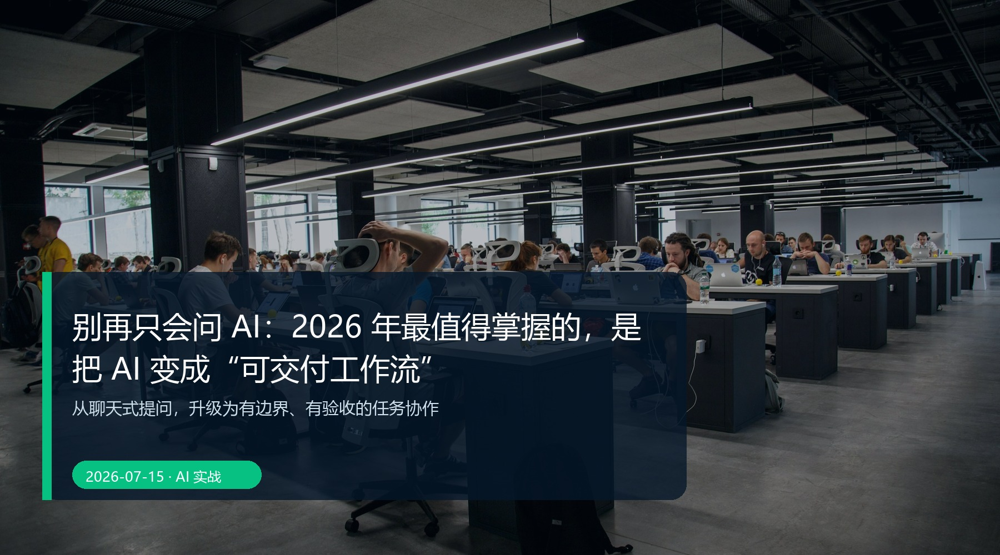

# 别再只会问 AI：把 AI 变成“可交付工作流”，比追问更重要

> **核心观点：**从聊天式提问，升级为有边界、有验收的任务协作。


*真实摄影：Unsplash。封面文字为本文后期添加；发布前请按文末来源复核许可和署名要求。*

## 你缺的不是一个更会聊天的 AI

很多人打开 AI 的第一句话是：“帮我写一篇文章”“给我做个方案”。这当然能得到一段文字，但很少能直接交付。真正耗时的部分随后才开始：补背景、找来源、改结构、核事实、对格式、整理版本。

更准确的说法是：**聊天是获得答案；工作流是推进结果。** 前者追求一句回复，后者追求一件能被验收的成品。

## 一条最小可交付工作流

不用先研究复杂智能体。任何需要交付的工作，都可以按这 5 步跑一遍：

| 阶段 | 你先说清什么 | AI 可以做什么 | 这一站留下什么 |
| --- | --- | --- | --- |
| 需求拆解 | 读者、目标、边界、截止时间 | 复述需求、找信息缺口 | 任务卡 |
| 调研 | 时间范围、来源优先级 | 搜集、归类、列出分歧 | 资料卡 |
| 产出 | 已确认材料、格式、语气 | 结构、初稿、表格 | 可编辑草稿 |
| 校验 | 事实、风险、验收清单 | 找矛盾、提示遗漏 | 问题清单 |
| 归档 | 哪些内容下次还会用 | 摘要、命名、模板化 | 案例库与规则 |

这里最关键的一步是第一步。你不必写很长的提示词，但必须写出**完成定义**：交付给谁、什么算合格、哪些地方不能错、谁最终签字。

## 一张任务卡，胜过十轮追问

```text
交付物：面向职场人的 1,800 字公众号文章
读者：已经在用 AI、但常常返工的人
完成标准：观点清楚；事实可追溯；3 个可执行动作；适配手机阅读
不能做：不编造效率数据；不把观点写成事实
最终验收：我逐条检查后发布
```

把这张卡先给 AI，要求它不要急着写，而是先输出“理解、缺口、风险、步骤”。你会发现返工被挪到了最便宜的阶段。

## 让 AI 分段协作，而不是一次包打天下

一次要求“查资料、想观点、写完、配图、检查”，结果往往很完整，也很难用。更稳的切法是：

1. **研究员**只交资料卡，且区分来源与判断；
2. **结构师**只给 2—3 套文章路线；
3. **生产者**只基于已确认材料起草；
4. **审稿员**只列问题，不替你批准发布。

这不是故意变慢，而是避免一段流畅的文字掩盖了证据、立场和责任的混杂。

## 归档，才是工作流开始变值钱的地方

每次完成后，只保留 4 类东西：有效任务卡、可信来源、通过验收的成品、这次踩过的坑。下次再做同类任务时，AI 不必从零理解你，你也不必从零想一遍。

当前一些产品把聊天、文件与项目指令放进项目空间，正适合承载这类持续上下文；但产品可以换，**“任务—资料—标准—复盘”这条链不能丢。**[^1] [^2]

## 今天就做的一步

别再搜索“最强提示词”。从你本周最常重复的一项工作开始，写一张任务卡，再让 AI 先复述任务。你会从“它能不能回答”转向一个更有用的问题：**它把事情推进到哪一步了？**

---

## 发布前自检

- [x] 只有一个 H1；标题、核心观点和行动步骤一致。
- [x] 体验型表述已在正文写明测试/情境边界；未捏造客户案例、效率数据或第一人称经历。
- [x] 涉及工具能力和风险的说明均附官方/权威资料；具体可用性以官方页面、账号状态和地区为准。
- [x] 封面为本地真实摄影，具有替代文本、图注、来源与授权复核提醒。
- [x] 段落、表格和代码块适合移动端阅读；重要信息不只存在于图片中。

## 参考资料

[^1]: OpenAI Help Center，[Projects in ChatGPT](https://help.openai.com/en/articles/10169521-projects-in-chatgpt)。访问日期：2026-07-15。
[^2]: Anthropic Support，[What are projects?](https://support.anthropic.com/en/articles/9517075-what-are-projects)。访问日期：2026-07-15。

## 图片来源

- 封面：Unsplash / Unsplash，原图文件 [09-cover source](https://images.unsplash.com/photo-1504384308090-c894fdcc538d?auto=format&fit=crop&w=2200&q=88)；封面文字为本文后期添加。
- 使用依据：[Unsplash License](https://unsplash.com/license)。发布到公众号或商业渠道前，请再次核验作品页、许可文本、署名要求和平台规则。

## 审核记录

- **2026-07-15 — 事实与边界：** 区分了方法论、可复现实验情境和具体产品资料；删除了不可核验的效果承诺。
- **2026-07-15 — 图片与版权：** 确认封面为真实摄影、本地引用；保留来源与发布前授权复核提醒。
- **2026-07-15 — 格式与行动性：** 核对 H1、标题一致性、移动端段落、表格、代码块和可执行下一步。
