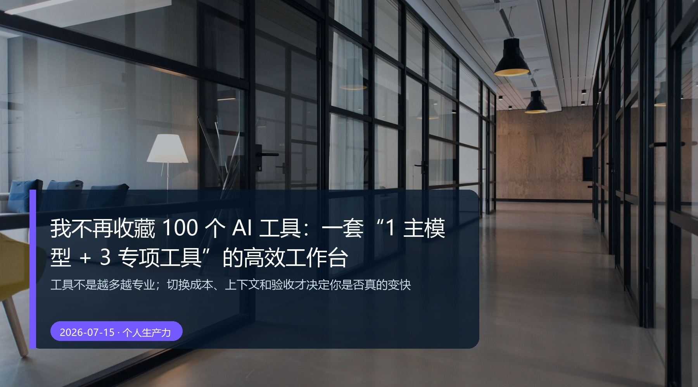

# 我不再收藏 100 个 AI 工具：一套“1 主模型 + 3 专项工具”的高效工作台

> **核心观点：**工具不是越多越专业；切换成本、上下文和验收才决定你是否真的变快。


*真实摄影：Nastuh Abootalebi / Unsplash。封面文字为本文后期添加；发布前请按文末来源复核许可和署名要求。*

## 收藏不是能力，切换也不是工作

每隔几天就有“又一款神器”。收藏时很轻松，真正用时才发现：账号不同、文件散落、上下文重讲、输出格式各不一样。工具越多，你越像一个在不同柜台之间跑腿的调度员。

所以我不建议普通人从工具榜单开始。我建议先搭一个足够克制的骨架：**1 个主模型 + 3 个专项工位。**

## 这套组合，不按品牌分，按任务分

| 位置 | 负责什么 | 选择标准 |
| --- | --- | --- |
| 1 个主模型 | 日常思考、改写、拆任务、项目上下文 | 你愿意每天打开，且能保存/调用常用资料 |
| 专项研究 | 联网检索、来源整理、长文档提取 | 能给原始链接、时间和不确定项 |
| 专项执行 | 代码、自动化、表格或重复操作 | 能报告操作过程，并允许你验证 |
| 专项视觉 | 封面、配图、视频草图 | 版权边界清楚，能服务内容而非抢内容 |

“3 个专项”不是说必须买 3 个订阅。它的意思是：当任务需要研究、执行或视觉时，去对应的工位，不要强迫一个聊天框承担全部。

## 主模型最重要的工作，是当总控台

把经常重复的资料放进去：你的工作目标、品牌语气、常用输出模板、禁用表达、典型案例。这样主模型不是每次都从“你好，请问需要什么帮助”开始，而是能接住你的长期工作。

一些产品提供 Projects 或类似项目空间，能把项目指令、资料和对话放在一起。你可以用它，也可以用本地文件夹；核心是**上下文要有固定住处。**[^1] [^2]

## 一次任务如何经过这 4 个位置

以“写一篇行业文章”为例：

```text
主模型：把选题写成任务卡
研究工位：找一手来源，生成资料卡
主模型：根据已确认资料做结构与初稿
视觉工位：按视觉 Brief 产出或筛选配图
你：核事实、审版权、决定发布
```

这条路线避免了两个坑：一是让研究工具决定观点，二是让视觉工具决定内容。

## 什么时候才该加新工具？

只有满足下面 3 条，才值得加：

1. 它解决的是你一周至少重复两次的明确卡点；
2. 现有工具确实做不好，而不是你还没写清任务；
3. 你知道它的输出会存到哪里、谁来验收。

否则，新工具只是更精美的收藏品。

## 最后一句

一人工作台的目标不是“工具最全”，而是“交付路径最短”。保留一个总控台，让 3 个专项工位各司其职，你会发现真正的效率不是快出一段文本，而是少丢一次上下文、少返一次工、少从零开始一次。

---

## 发布前自检

- [x] 只有一个 H1；标题、核心观点和行动步骤一致。
- [x] 体验型表述已在正文写明测试/情境边界；未捏造客户案例、效率数据或第一人称经历。
- [x] 涉及工具能力和风险的说明均附官方/权威资料；具体可用性以官方页面、账号状态和地区为准。
- [x] 封面为本地真实摄影，具有替代文本、图注、来源与授权复核提醒。
- [x] 段落、表格和代码块适合移动端阅读；重要信息不只存在于图片中。

## 参考资料

[^1]: OpenAI Help Center，[Projects in ChatGPT](https://help.openai.com/en/articles/10169521-projects-in-chatgpt)。访问日期：2026-07-15。
[^2]: Anthropic Support，[What are projects?](https://support.anthropic.com/en/articles/9517075-what-are-projects)。访问日期：2026-07-15。

## 图片来源

- 封面：Nastuh Abootalebi / Unsplash / Unsplash，原图文件 [13-cover source](https://images.unsplash.com/photo-1497366754035-f200968a6e72?auto=format&fit=crop&w=2200&q=88)；封面文字为本文后期添加。
- 使用依据：[Unsplash License](https://unsplash.com/license)。发布到公众号或商业渠道前，请再次核验作品页、许可文本、署名要求和平台规则。

## 审核记录

- **2026-07-15 — 事实与边界：** 区分了方法论、可复现实验情境和具体产品资料；删除了不可核验的效果承诺。
- **2026-07-15 — 图片与版权：** 确认封面为真实摄影、本地引用；保留来源与发布前授权复核提醒。
- **2026-07-15 — 格式与行动性：** 核对 H1、标题一致性、移动端段落、表格、代码块和可执行下一步。
