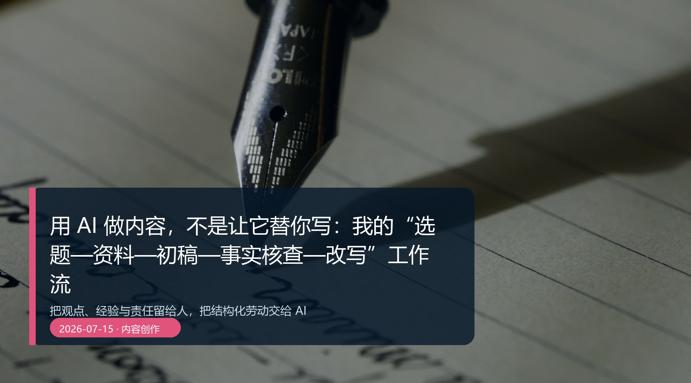

# 用 AI 做内容，不是让它替你写：我的“选题—资料—初稿—事实核查—改写”工作流

> **核心观点：**把观点、经验与责任留给人，把结构化劳动交给 AI。


*真实摄影：Unsplash。封面文字为本文后期添加；发布前请按文末来源复核许可和署名要求。*

## 内容最怕的，不是写得慢，而是写得像谁都能写

AI 最擅长的部分，恰好也是内容最容易同质化的部分：搭框架、补句子、做总结、换语气。如果你把“观点”也一起外包，文章很快就会顺滑、正确、没有人味。

我的原则很简单：**人决定写什么、为什么写、愿意为什么负责；AI 处理可以被结构化的劳动。**

## 这 5 步，不要颠倒

### 1. 选题：先找到真实摩擦

不要从“最近什么热”开始，而从“读者已经在为什么卡住”开始。一个好选题最好能补全这句话：

> 我的读者正在 ______，因为 ______；这篇文章能让他下一步 ______。

### 2. 资料：把事实和观点分开放

让 AI 建资料卡，而不是直接写文章。资料卡至少有 3 列：已证实的事实、你的判断、仍待核验的空白。只要这一步没混，后面就不容易用文笔掩盖证据不足。

### 3. 初稿：用你的材料，不用“通用正确答案”

把你自己的观察、对话、失败经验、具体场景放进去。AI 可以帮助组织，但不要让它补出你没有经历过的客户故事、数据结果或人物感受。

### 4. 事实核查：让 AI 当问题雷达，不当批准章

给 AI 一张清单：时间、数字、产品功能、引用、图片、绝对化表达。让它只列出“哪里可能有问题”。最后点开来源、确认原意、决定是否修改，仍由人完成。

### 5. 改写：最后才处理语气和节奏

初稿没解决观点，先改文风只会把空话打磨得更漂亮。等内容站稳，再让 AI 做短句化、删重复、换开头、提炼标题。

## 一段真正有用的写作提示词

```text
你是编辑协作者，不是替写者。
请基于我提供的资料卡和观点，先指出：
- 哪些地方缺少具体场景；
- 哪些句子把观点写成了事实；
- 哪些信息对读者没有行动价值。
再提出修改建议。不要编造经历、数据或采访。
```

## 你应该留下什么

每写完一篇，只归档：选题卡、资料卡、最终结构、事实来源、改写前后对照、读者反馈。下一篇文章的速度，不来自模型更快，而来自你已经知道什么类型的开头有效、什么证据读者会追问。

## 结语

AI 可以让创作过程轻一点，但不应该把作者从作品里拿走。把“选题—资料—初稿—核查—改写”固定下来，你得到的不是一个代笔工具，而是一个会帮你保持节奏、暴露漏洞、保存经验的编辑台。

---

## 发布前自检

- [x] 只有一个 H1；标题、核心观点和行动步骤一致。
- [x] 体验型表述已在正文写明测试/情境边界；未捏造客户案例、效率数据或第一人称经历。
- [x] 涉及工具能力和风险的说明均附官方/权威资料；具体可用性以官方页面、账号状态和地区为准。
- [x] 封面为本地真实摄影，具有替代文本、图注、来源与授权复核提醒。
- [x] 段落、表格和代码块适合移动端阅读；重要信息不只存在于图片中。

## 参考资料

[^1]: OpenAI，[Introducing deep research](https://openai.com/index/introducing-deep-research/)。访问日期：2026-07-15。

## 图片来源

- 封面：Unsplash / Unsplash，原图文件 [14-cover source](https://images.unsplash.com/photo-1455390582262-044cdead277a?auto=format&fit=crop&w=2200&q=88)；封面文字为本文后期添加。
- 使用依据：[Unsplash License](https://unsplash.com/license)。发布到公众号或商业渠道前，请再次核验作品页、许可文本、署名要求和平台规则。

## 审核记录

- **2026-07-15 — 事实与边界：** 区分了方法论、可复现实验情境和具体产品资料；删除了不可核验的效果承诺。
- **2026-07-15 — 图片与版权：** 确认封面为真实摄影、本地引用；保留来源与发布前授权复核提醒。
- **2026-07-15 — 格式与行动性：** 核对 H1、标题一致性、移动端段落、表格、代码块和可执行下一步。
